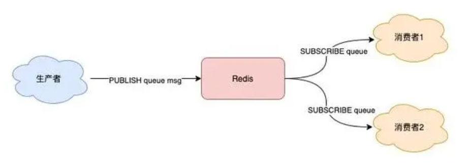
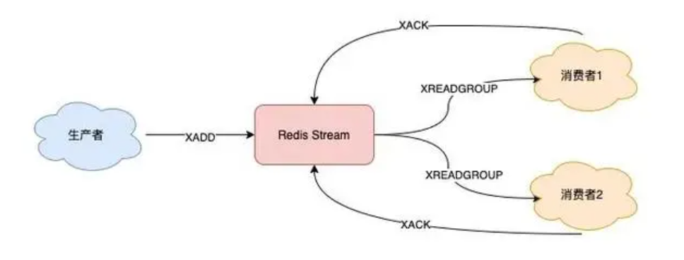

## 消息队列需要满足的要求

- 可靠性：消息队列必须能够确保消息在发送和接收时不会丢失。这通常需要实现持久化存储机制，以确保即使在故障发生时也不会丢失消息。
- 可扩展性：消息队列必须能够处理大量的消息，并具有可扩展性以适应未来的负载增长。
- 顺序性：某些应用程序要求消息在处理过程中按照特定的顺序进行处理，因此消息队列必须支持有序消息传递。

## Redis实现消息队列

### Redis-List队列

采用Redis中List数据接口来实现消息队列。

```
生产者 --- LPUSH --->  Redis-List ([msg1,msg2,msg3,.....]) --- BRPOP(阻塞) ---> 消费者
```

Redis-List提供了**LPUSH**和**BRPOP**命令，生产者通过LPUSH命令将消息存储到Redis-List中，消费者通过**阻塞式拉取消息的命令BRPOP**，当没消息时可以指定阻塞时间防止CPU空转

```shell
// 伪代码
// 生产者
LPUSH queue msg1
LPUSH queue msg2
// 消费者
while true:
    // 没消息阻塞等待，0表示不设置超时时间
    msg = redis.brpop("queue", 0)
    if msg == null:
        continue
    // 处理消息
    handle(msg)
```

**是否满足消息队列要求？**

- 可扩展性 : Redis本身支持集群，但是没有像专业的消息队列例如RocketMq有分区分片的概念，若要扩展需要自己研发。
- 顺序性 : List数据库结构天然支持顺序性，且Redis是单线程处理命令，所以能保证消息的顺序。
- 可靠性 : 消费者拉取到消息后，如果发生异常宕机，那这条消息就丢失了。
- 不支持重复消费 : 消费者拉取消息后，这条消息就从 List 中删除了，无法被其它消费者再次消费，即不支持多个消费者消费同一批数据。
- 不支持多消费者的场景，一次只能一个消费者从List消费消息。
- 消息堆积，若消息过多会导致消息大量堆积在内存上无法释放。

### 发布订阅模型(Pub/Sub)

Redis 提供了 PUBLISH / SUBSCRIBE 命令，来完成发布、订阅的操作。



支持了消息广播的方式，消费者可以同时订阅一个主题，当主题内有消息时会第一时间通知给消费者。

```
// 消费者订阅主题，订阅后阻塞
// 消费者1
127.0.0.1:6379> SUBSCRIBE queue
Reading messages... (press Ctrl-C to quit)
// 消费者2
127.0.0.1:6379> SUBSCRIBE queue
Reading messages... (press Ctrl-C to quit)

// 生产者
127.0.0.1:6379> PUBLISH queue msg1
(integer) 1
```

除此之外，Pub/Sub 还提供了「匹配订阅」模式，允许消费者根据一定规则，订阅「多个」自己感兴趣的队列。

```
// 订阅符合规则的队列
127.0.0.1:6379> PSUBSCRIBE queue.*
Reading messages... (press Ctrl-C to quit)
1) "psubscribe"
2) "queue.*"
3) (integer) 1

127.0.0.1:6379> PUBLISH queue.p1 msg1
(integer) 1
127.0.0.1:6379> PUBLISH queue.p2 msg2
(integer) 1
```

**是否满足消息队列要求？**

- 可扩展性 : 同上
- 顺序性 : 支持
- 可靠性 : 不可靠，基于发布订阅模式是实时性的，整个过程中，没有任何的数据存储，一切都是实时转发的。所以当消费者下线或宕机。不具备**数据持久化**的能力。
- 支持多个消费者同时消费一份数据
- 消息堆积问题，当消费者速度赶不上生产者时会因为消息堆积导致消费失败。因为在Redis内部是为每个消费者提供一个缓冲区，这个缓冲区其实是有「上限」的（可配置），如果消费者拉取消息很慢，就会造成生产者发布到缓冲区的消息开始积压，缓冲区内存持续增长。如果超过了缓冲区配置的上限，此时，Redis 就会「强制」把这个消费者踢下线。

### Stream

Redis-Stream : 可以定义为**基于内存的分布式消息队列中间件**。

Stream通过**XADD**和**XREAD**完成最简单的生产消费过程 ：

生产者发布2条消息

```shell
127.0.0.1:6379> XADD queue * name zhangsan
"1618469123380-0"
127.0.0.1:6379> XADD queue * name lisi
"1618469127777-0"
// [*]表示让Redis自动生成唯一的消息ID， ID的格式 [时间戳-自增序号]
```

消费者拉取消息

```shell
// 从开头读取5条消息，0-0表示从开头读取
127.0.0.1:6379> XREAD COUNT 5 STREAMS queue 0-0  // [0-0]表示ID,时间戳-自增序号
1) 1) "queue"
   2) 1) 1) "1618469123380-0"
         2) 1) "name"
            2) "zhangsan"
      2) 1) "1618469127777-0"
         2) 1) "name"
            2) "lisi"
```

如果想继续拉取消息，需要传入上一条消息的 ID

```
127.0.0.1:6379> XREAD COUNT 5 STREAMS queue 1618469127777-0
(nil)
```

**Stream 是否支持「阻塞式」拉取消息？**

可以的，在读取消息时，只需要增加 BLOCK 参数即可

```shell
/ BLOCK 0 表示阻塞等待，不设置超时时间
127.0.0.1:6379> XREAD COUNT 5 BLOCK 0 STREAMS queue 1618469127777-0
```

**Stream 是否支持发布 / 订阅模式？**

也没问题，Stream 通过以下命令完成发布订阅：

- XGROUP : 创建消费者组
- XREADGROUP : 在指定消费组下，开启消费者拉取消息

首先生产者依旧发布2条消息

```shell
127.0.0.1:6379> XADD queue * name zhangsan
"1618470740565-0"
127.0.0.1:6379> XADD queue * name lisi
"1618470743793-0"
```

之后，我们想要开启 2 组消费者处理同一批数据，就需要创建 2 个消费者组：

```shell
// 创建消费者组1，0-0表示从头拉取消息
127.0.0.1:6379> XGROUP CREATE queue group1 0-0
OK
// 创建消费者组2，0-0表示从头拉取消息
127.0.0.1:6379> XGROUP CREATE queue group2 0-0
OK
```

消费者组创建好之后，我们可以给每个「消费者组」下面挂一个「消费者」，让它们分别处理同一批数据

```shell
// group1的consumer开始消费，">"表示拉取最新数据
127.0.0.1:6379> XREADGROUP GROUP group1 consumer COUNT 5 STREAMS queue >
1) 1) "queue"
   2) 1) 1) "1618470740565-0"
         2) 1) "name"
            2) "zhangsan"
      2) 1) "1618470743793-0"
         2) 1) "name"
            2) "lisi"
```

同样地，第二个消费组开始消费：

```shell
// group2的consumer开始消费，">"表示拉取最新数据
127.0.0.1:6379> XREADGROUP GROUP group2 consumer COUNT 5 STREAMS queue >
1) 1) "queue"
   2) 1) 1) "1618470740565-0"
         2) 1) "name"
            2) "zhangsan"
      2) 1) "1618470743793-0"
         2) 1) "name"
            2) "lisi"
```

**消息处理时异常，Stream 能否保证消息不丢失，重新消费？**

除了上面拉取消息时用到了消息 ID，这里为了保证重新消费，也要用到这个消息 ID。当一组消费者处理完消息后，需要执行 **XACK** 命令告知 Redis，这时 Redis 就会把这条消息标记为「处理完成」。如果消费者异常宕机，肯定不会发送 **XACK**，那么 Redis 就会依旧保留这条消息。

```shell
// group1下的 1618472043089-0 消息已处理完成
127.0.0.1:6379> XACK queue group1 1618472043089-0
```



待这组消费者重新上线后，Redis 就会把之前没有处理成功的数据，重新发给这个消费者。这样一来，即使消费者异常，也不会丢失数据了。

```shell
// 消费者重新上线，"0-0"表示重新拉取未ACK的消息 ">"表示拉取最新数据
127.0.0.1:6379> XREADGROUP GROUP group1 consumer1 COUNT 5 STREAMS queue 0-0
// 之前没消费成功的数据，依旧可以重新消费
1) 1) "queue"
   2) 1) 1) "1618472043089-0"
         2) 1) "name"
            2) "zhangsan"
      2) 1) "1618472045158-0"
         2) 1) "name"
            2) "lisi"
```

**Stream 数据会写入到 RDB 和 AOF 做持久化吗？**

Stream 是新增加的数据类型，它与其它数据类型一样，每个写操作，也都会写入到 RDB 和 AOF 中。我们只需要配置好持久化策略，这样的话，就算 Redis 宕机重启，Stream 中的数据也可以从 RDB 或 AOF 中恢复回来。

**消息堆积时，Stream 是怎么处理的？**

消息中间件发生消息堆积一般有2个解决方案:

- 生产者限流：避免消费者处理不及时，导致持续积压
- 丢弃消息：中间件丢弃旧消息，只保留固定长度的新消息

对于Stream来说采用了第二种方法，也就是丢弃消息。在发布消息时，你可以指定队列的最大长度，防止队列积压导致内存爆炸。**当队列长度超过上限后，旧消息会被删除，只保留固定长度的新消息**。

```shell
// 队列长度最大10000
127.0.0.1:6379> XADD queue MAXLEN 10000 * name zhangsan
"1618473015018-0"
```

**Redis-Stream是否可以作为专业的消息中间件使用？**

我们先从可靠性分析，消息是否可以保证可靠性，重点在于3个环节：

**生产者是否会丢失消息?**

- 由于网络故障或其他问题导致发布失败的情况Redis会直接返回失败消息给生产者。
- 生产者不清楚Redis是否已经存储消息，Redis没有提供类似ACK机制告诉生产者消息已经存储，所以这种情况下生产者只能进行重试。所以消息可能重复。

所以，无论是 Redis 还是专业的队列中间件，生产者在这一点上都是可以保证消息不丢的。

**消费者会不会丢消息？**

当消费者消费后需要通过ACK机制告诉Redis，所以消费者是能保证消息不丢的。

**队列中间件会不会丢消息？**

Redis 在以下 2 个场景下，都会导致数据丢失：

- AOF 持久化配置为每秒写盘，但这个写盘过程是异步的，Redis 宕机时会存在数据丢失的可能
- 主从复制也是异步的，主从切换时，也存在丢失数据的可能（从库还未同步完成主库发来的数据，就被提成主库）

所以，如果把 Redis 当做消息队列，在这方面是有可能导致数据丢失的。

**总结**

如果你的业务场景足够简单，对于数据丢失不敏感，而且消息积压概率比较小的情况下，把 Redis 当作队列是完全可以的。如果你的业务场景对于数据丢失非常敏感，而且写入量非常大，消息积压时会占用很多的机器资源，那么我建议你使用专业的消息队列中间件。

| #            | List                                  | Pub/Sub                    | Stream                       |
| ------------ | ------------------------------------- | -------------------------- | ---------------------------- |
| 阻塞时消费   | 支持                                  | 支持                       | 支持                         |
| 发布/订阅    | 不支持                                | 支持                       | 支持                         |
| 重复消费     | 不支持                                | 不支持                     | 支持                         |
| 持久化       | 支持                                  | 不支持                     | 支持                         |
| 消息堆积     | 内存持续增长                          | 缓冲区溢出，消费者强制下线 | 可控制队列长度超过丢掉旧消息 |
| 消息是否丢失 | Redis本身不保证数据完整性             | 同←                        | 同←                          |
| 消息堆积能力 | Redis数据存内存，消息堆积对内存压力大 | 同←                        | 同←                          |


