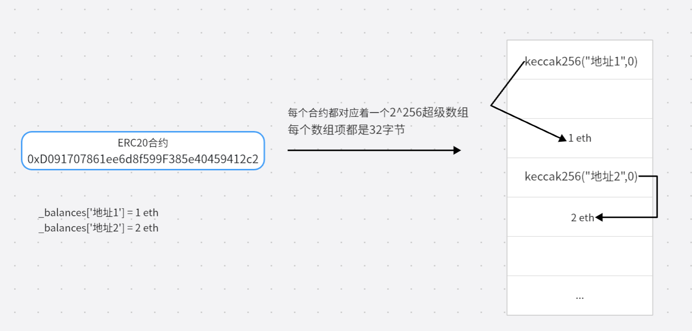

​	我们知道以太坊的合约在部署到网络上后就不允许修改。如果需要修改必须是重新部署一个新合约，但是新合约里面存储的数据将不复存在。

​	假设公司老板让小咕在主网部署了一个ERC20合约，合约部署有一阵子了，参与的用户也在合约上有了代币，忽然有天要增加需求，老板要求小咕在原有的ERC20合约上加一个claim方法，此时小咕犯难了。

- ERC20合约已经部署后就不允许修改，如果需要修改唯一的方法是重新部署一个新ERC20合约里面加claim方法。
- 新部署的ERC20合约由于是全新的，里面并没有存储用户的代币。唯一的方法是遍历旧ERC20合约的用户资产情况并由管理员来给原来的用户添加资产。
- 通知所有用户不应再旧合约上交易，改成用新合约。

想想就觉得不可行，确实在实际情况下一般也没人会这样干。

**合约在以太坊的存储方式**

在以太坊中存在两种账户 : `合约账户`和`外部账户`。我们部署的合约都是一个合约账户。每个合约账户都有一个默克尔树来存储合约上的数据。

具体两个账户的介绍可以看 : https://learnblockchain.cn/books/geth/part1/account.html



如图所示，每个合约都存在着一个`2^256`的超级数组来存储合约上的数据。

### 代理合约原理

- 委托调用delegatecall
- fallback函数

​	总结起来代理合约的原理是通过上面两个来实现的。我们来做一个猜想，假设我能够将**代码和存储分离**分离，是不是能对合约进行升级了。例如我部署两个合约`ERC20_STORAGE.SOL` 和`ERC20.SOL`。存储合约调用ERC20合约的代码，但是将用户的资产存储到存储合约中，假如有新的需求我只需要重新部署ERC20合约，存储合约只是简单的更改新ERC20的地址，这样就能做到升级后数据依然保留。

​	所以Solidity就提供了委托调用delegatecall的方式，合约A使用合约B的代码来执行，但是最终的数据存储在合约A上，其实可以理解成A用B的代码来进行计算，但是存储是存在A自己的超级数组上。


那为什么还要一个`fallback`函数了？我们来学习下`fallback`回退函数的作用 : **如果在一个对合约调用中，没有其他函数与给定的函数标识符匹配，则fallback会被调用**。在合约调用中，用户发起一笔交易调用合约时是需要指定方法名的，确切的来说是ABI编码，总之合约调用时需要**指定调用哪个合约的哪个方法**。但是`ERC20_STORAGE.SOL`上并没有对应的方法，所以我们需要在`ERC20_STORAGE.SOL`上添加`fallback`回退函数，当合约调用时没有匹配时执行回退函数，回退函数中再通过`delegatecall`调用`ERC20.SOL`的方法，最终实现代理。

```java
// 伪代码
contract ERC20 {
	uint public num;
    address public sender;
    uint public value;
    function setVars(uint _num) external payable {
        num = _num;
        sender = msg.sender;
        value = msg.value;
    }
}

contract ERC20_STORAGE {
	fallback() external payable virtual {
		_delegate("ERC20合约地址", "参数1", "参数2")
	}
	
	function _delegate(address implementation, address _test, uint _num) internal virtual     {
		(bool success , bytes memory data ) 	=_test.delegatecall(abi.encodeWithSignature("setVars(uint256)", _num));
        require(success, "delegateCall failed");
	}
}
```


### Openzeppelin的三种代理模式

#### Transparent模式

代码地址 : https://github.com/OpenZeppelin/openzeppelin-contracts/tree/master/contracts/proxy/transparent


具体代码分析

```java
pragma solidity ^0.8.0;
import "../ERC1967/ERC1967Proxy.sol";
contract TransparentUpgradeableProxy is ERC1967Proxy {
    
    // _logic -> 具体逻辑合约的地址
    // admin_ -> 管理合约地址，升级合约需要使用管理合约调用代理合约进行升级
    // _data -> 初始化逻辑合约的函数，这里我们要清楚一点若使用代理那么逻辑合约是无法在constructor中进行初始化的，试想一下若在逻辑合约的constructor上初始化那不就把值存储在逻辑合约上了嘛，这肯定是不对的
    constructor(
        address _logic,
        address admin_,
        bytes memory _data
    ) payable ERC1967Proxy(_logic, _data) {
        _changeAdmin(admin_);
    }
	
    modifier ifAdmin() {
        if (msg.sender == _getAdmin()) {
            _;
        } else {
            _fallback();
        }
    }

    
    function admin() external ifAdmin returns (address admin_) {
        admin_ = _getAdmin();
    }

    
    function implementation() external ifAdmin returns (address implementation_) {
        implementation_ = _implementation();
    }

    
    function changeAdmin(address newAdmin) external virtual ifAdmin {
        _changeAdmin(newAdmin);
    }

   
    function upgradeTo(address newImplementation) external ifAdmin {
        _upgradeToAndCall(newImplementation, bytes(""), false);
    }

    
    function upgradeToAndCall(address newImplementation, bytes calldata data) external payable ifAdmin {
        _upgradeToAndCall(newImplementation, data, true);
    }

    
    function _admin() internal view virtual returns (address) {
        return _getAdmin();
    }

    
    function _beforeFallback() internal virtual override {
        require(msg.sender != _getAdmin(), "TransparentUpgradeableProxy: admin cannot fallback to proxy target");
        super._beforeFallback();
    }
}

============================= ERC1967Proxy ====================
contract ERC1967Proxy is Proxy, ERC1967Upgrade {
    constructor(address _logic, bytes memory _data) payable {
        _upgradeToAndCall(_logic, _data, false);
    }

    function _implementation() internal view virtual override returns (address impl) {
        return ERC1967Upgrade._getImplementation();
    }
}

=====================  ERC1967Upgrade ======================

pragma solidity ^0.8.2;

import "../beacon/IBeacon.sol";
import "../../interfaces/draft-IERC1822.sol";
import "../../utils/Address.sol";
import "../../utils/StorageSlot.sol";

abstract contract ERC1967Upgrade {
    bytes32 private constant _ROLLBACK_SLOT = 0x4910fdfa16fed3260ed0e7147f7cc6da11a60208b5b9406d12a635614ffd9143;

    
    bytes32 internal constant _IMPLEMENTATION_SLOT = 0x360894a13ba1a3210667c828492db98dca3e2076cc3735a920a3ca505d382bbc;

    
    event Upgraded(address indexed implementation);

    // 获取逻辑合约地址
    function _getImplementation() internal view returns (address) {
        return StorageSlot.getAddressSlot(_IMPLEMENTATION_SLOT).value;
    }

    // 将逻辑合约地址的值存储在_IMPLEMENTATION_SLOT所对应的插槽上
    function _setImplementation(address newImplementation) private {
        require(Address.isContract(newImplementation), "ERC1967: new implementation is not a contract");
        StorageSlot.getAddressSlot(_IMPLEMENTATION_SLOT).value = newImplementation;
    }

    // newImplementation -> 逻辑合约地址
    function _upgradeTo(address newImplementation) internal {
        _setImplementation(newImplementation);
        emit Upgraded(newImplementation);
    }

    
    function _upgradeToAndCall(
        address newImplementation,
        bytes memory data,
        bool forceCall
    ) internal {
        _upgradeTo(newImplementation);
        if (data.length > 0 || forceCall) {
            Address.functionDelegateCall(newImplementation, data);
        }
    }

    
    function _upgradeToAndCallUUPS(
        address newImplementation,
        bytes memory data,
        bool forceCall
    ) internal {
        if (StorageSlot.getBooleanSlot(_ROLLBACK_SLOT).value) {
            _setImplementation(newImplementation);
        } else {
            try IERC1822Proxiable(newImplementation).proxiableUUID() returns (bytes32 slot) {
                require(slot == _IMPLEMENTATION_SLOT, "ERC1967Upgrade: unsupported proxiableUUID");
            } catch {
                revert("ERC1967Upgrade: new implementation is not UUPS");
            }
            _upgradeToAndCall(newImplementation, data, forceCall);
        }
    }

    
    bytes32 internal constant _ADMIN_SLOT = 0xb53127684a568b3173ae13b9f8a6016e243e63b6e8ee1178d6a717850b5d6103;

    
    event AdminChanged(address previousAdmin, address newAdmin);

    
    function _getAdmin() internal view returns (address) {
        return StorageSlot.getAddressSlot(_ADMIN_SLOT).value;
    }

    
    function _setAdmin(address newAdmin) private {
        require(newAdmin != address(0), "ERC1967: new admin is the zero address");
        StorageSlot.getAddressSlot(_ADMIN_SLOT).value = newAdmin;
    }

    
    function _changeAdmin(address newAdmin) internal {
        emit AdminChanged(_getAdmin(), newAdmin);
        _setAdmin(newAdmin);
    }

    
    bytes32 internal constant _BEACON_SLOT = 0xa3f0ad74e5423aebfd80d3ef4346578335a9a72aeaee59ff6cb3582b35133d50;

    
    event BeaconUpgraded(address indexed beacon);

    
    function _getBeacon() internal view returns (address) {
        return StorageSlot.getAddressSlot(_BEACON_SLOT).value;
    }

    
    function _setBeacon(address newBeacon) private {
        require(Address.isContract(newBeacon), "ERC1967: new beacon is not a contract");
        require(
            Address.isContract(IBeacon(newBeacon).implementation()),
            "ERC1967: beacon implementation is not a contract"
        );
        StorageSlot.getAddressSlot(_BEACON_SLOT).value = newBeacon;
    }

    
    function _upgradeBeaconToAndCall(
        address newBeacon,
        bytes memory data,
        bool forceCall
    ) internal {
        _setBeacon(newBeacon);
        emit BeaconUpgraded(newBeacon);
        if (data.length > 0 || forceCall) {
            Address.functionDelegateCall(IBeacon(newBeacon).implementation(), data);
        }
    }
}

================== Proxy ==============

pragma solidity ^0.8.0;

abstract contract Proxy {
    // implementation -> 逻辑合约地址
    // 进行委托调用
    function _delegate(address implementation) internal virtual {
        assembly {
            calldatacopy(0, 0, calldatasize())
            let result := delegatecall(gas(), implementation, 0, calldatasize(), 0, 0)
            returndatacopy(0, 0, returndatasize())
            switch result
            case 0 {
                revert(0, returndatasize())
            }
            default {
                return(0, returndatasize())
            }
        }
    }

    function _implementation() internal view virtual returns (address);
    
    function _fallback() internal virtual {
        _beforeFallback();
        _delegate(_implementation());
    }

    
    fallback() external payable virtual {
        _fallback();
    }

    
    receive() external payable virtual {
        _fallback();
    }
    
    function _beforeFallback() internal virtual {}
}

============== ProxyAdmin ====================
pragma solidity ^0.8.0;
import "./TransparentUpgradeableProxy.sol";
import "../../access/Ownable.sol";


contract ProxyAdmin is Ownable {
    
    function getProxyImplementation(TransparentUpgradeableProxy proxy) public view virtual returns (address) {
        // We need to manually run the static call since the getter cannot be flagged as view
        // bytes4(keccak256("implementation()")) == 0x5c60da1b
        (bool success, bytes memory returndata) = address(proxy).staticcall(hex"5c60da1b");
        require(success);
        return abi.decode(returndata, (address));
    }

    
    function getProxyAdmin(TransparentUpgradeableProxy proxy) public view virtual returns (address) {
        (bool success, bytes memory returndata) = address(proxy).staticcall(hex"f851a440");
        require(success);
        return abi.decode(returndata, (address));
    }

    
    function changeProxyAdmin(TransparentUpgradeableProxy proxy, address newAdmin) public virtual onlyOwner {
        proxy.changeAdmin(newAdmin);
    }

    
    function upgrade(TransparentUpgradeableProxy proxy, address implementation) public virtual onlyOwner {
        proxy.upgradeTo(implementation);
    }

    function upgradeAndCall(
        TransparentUpgradeableProxy proxy,
        address implementation,
        bytes memory data
    ) public payable virtual onlyOwner {
        proxy.upgradeToAndCall{value: msg.value}(implementation, data);
    }
}


```

**下面分析几个比较重要的方法**

**初始化方法**

- TransparentUpgradeableProxy.constructor
  - ERC1967Proxy.constructor
    - ERC1967Upgrade._upgradeToAndCall
      - ERC1967Upgrade._upgradeTo
      - Address.functionDelegateCall(newImplementation, data)

初始化方法主要做了两件比较重要的事情

- 将逻辑合约的地址存储在_IMPLEMENTATION_SLOT变量所对应的插槽位置上
- 通过Address.functionDelegateCall方法进行委托调用，newImplementation指代逻辑合约地址，data指代要执行的逻辑合约的初始化`方法+参数`。

**为什么逻辑合约的地址要存储成一个那么奇怪的方式？**

这个问题需要去了解合约的存储方式，合约对于变量的存储是采用按照定义的顺序排序的。在合约定义全局变量时就已经确定好了他的位置。

```
contract A {
	uint256 a;  // -> 存储在插槽0上
	uint256 b;	// -> 存储在插槽1上
	function setAll(uint256 a, uint256 b) {
		a = 10;
		b = 20;
	}
	function init(){
		a = 10;
		b = 20;
	}
}

contract A_PROXY {
	uint256 c; // -> 存储在插槽0上
}
```

假设有上面两个合约A，和A_PROXY。后者是前者的代理合约，当我们通过代理合约调用setAll方法时，最终代理合约上的c =10 . 因为对于代理合约调用setAll方法时更改的是插槽0和1位置的值，然而a和c都是属于在插槽0上。

**所以将逻辑合约存储在一个奇怪的方式就是为了避免被覆盖。** 一般来说代理合约上是不允许定义变量的，所有的变量都应该定义在逻辑合约上，防止出现例如上面的覆盖。

**具体方法执行**

- 用户调用代理合于的X方法
  - TransparentUpgradeableProxy代理合约上没找到X方法
    - 执行Proxy.fallback
      - 执行Proxy._delegate

最终调用具体的方法是走到了_delegate方法中，这个方法内就是进行了委托调用。

**升级合约方法**

那么说了那么多如果要升级合约要怎么办？通过上面分析我们知道，假设要升级合约，不就只要将TransparentUpgradeableProxy代理合约中的`Implementation`的值替换成新合约的值不就好了吗。但是你会发现他不允许直接调用。Openzeppelin为我们提供了一个合约`ProxyAdmin.sol`专门用来更改Implementation，这样做的目的主要是为了安全，毕竟升级合约那么重要的事肯定是要超超超级管理员去做，所以他将合约升级分离出来管理。