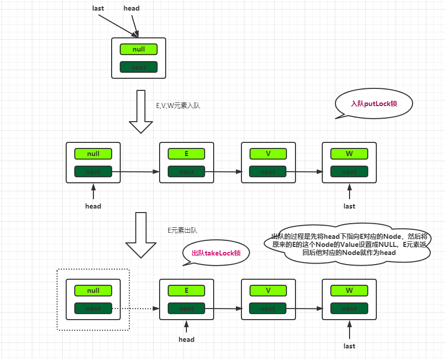
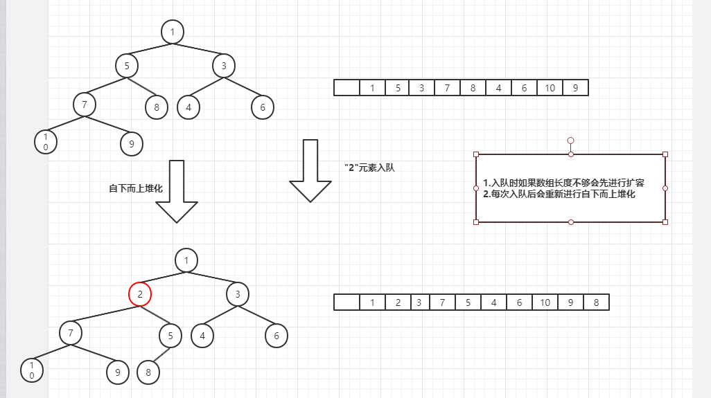
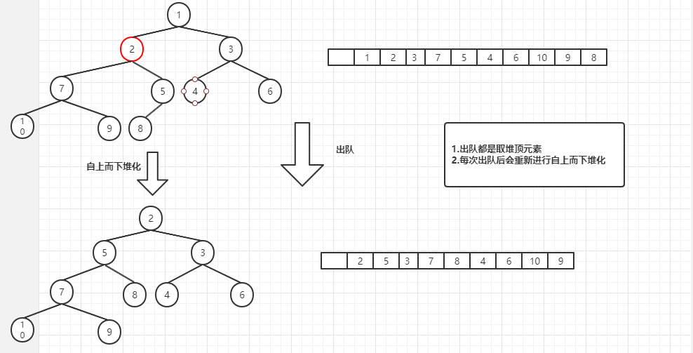

## BlockingQueue接口

Java中的`BlockingQueue`接口是一个线程安全的存取队列。继承Queue（队列）接口，再此基础上新定义了<font color=red>阻塞方法</font>。


|          | 抛出异常  | 返回特殊值 | 一直阻塞 | 阻塞超时后退出              |
| :------- | :-------- | :--------- | :------- | --------------------------- |
| 插入方法 | add(o)    | offer(o)   | put(o)   | offer(o, timeout, timeunit) |
| 移除方法 | remove(o) | poll()     | take(o)  | poll(o, timeout, timeunit)  |
| 检查方法 | element() | peek()     | —        | —                           |

<!--more-->

- 抛出异常。当阻塞队列满时候，再往队列里插入元素，会抛出IllegalStateException("Queue full")异常。当队列为空时，从队列里获取元素时会抛出NoSuchElementException异常。
- 返回特殊值。
  - 元素入队 ： 插入成功返回true，当阻塞队列满时候插入失败返回false。
  - 元素出队 ：从队列里拿出一个元素，如果没有则返回null。
- 一直阻塞。当阻塞队列满时候，再往队列里插入元素时阻塞生产者线程；当队列空时，再往队列中获取数据时阻塞消费者线程。

JDK中阻塞队列（BlockingQueue）的实现类如下 ：ArrayBlockingQueue，LinkedBlockingQueue，PriorityBlockingQueue，DelayQueue，SynchronousQueue，LinkedTransferQueue，LinkedBlockingDeque。


## ArrayBlockingQueue

特点 ：一个由 <font color=red>数组</font> 实现的<font color=red>有界</font>，<font color=red>阻塞</font>，<font color=red>线程安全</font>，<font color=red>FIFO（先进先出）</font>队列。

```java
  public class ArrayBlockingQueue<E> extends AbstractQueue<E> implements BlockingQueue<E>, Serializable {
        private static final long serialVersionUID = -817911632652898426L;
        //数组实现的队列
        final Object[] items;
        //记录队列中消费者消费的索引
        int takeIndex;
        //记录队列中生产者生产的索引
        int putIndex;
        //队列中元素个数
        int count;
        // 重入锁,对入队操作和出队操作加锁，保证线程安全
        final ReentrantLock lock;
        // 出列条件，如果队列为空，会执行notEmpty.await()阻塞消费者队列
        private final Condition notEmpty;
        // 入列条件，如果队列满，会执行notFull.await()阻塞生产者队列
        private final Condition notFull;
        transient ArrayBlockingQueue.Itrs itrs;
    }

public ArrayBlockingQueue(int capacity) {
      this(capacity, false);
}

public ArrayBlockingQueue(int capacity, boolean fair) {
    if (capacity <= 0)
        throw new IllegalArgumentException();
    this.items = new Object[capacity];
    lock = new ReentrantLock(fair);
    notEmpty = lock.newCondition();
    notFull =  lock.newCondition();
}
```

我们首先先看下出队和入队的代码实现。

```java
//==============================入队=================================
public void put(E e) throws InterruptedException {
    checkNotNull(e);
    final ReentrantLock lock = this.lock;
    lock.lockInterruptibly();
    try {
        while (count == items.length)
            notFull.await();
        enqueue(e);
    } finally {
        lock.unlock();
    }
}

private void enqueue(E x) {
    final Object[] items = this.items;
    items[putIndex] = x;
    if (++putIndex == items.length)
        putIndex = 0;
    count++;
    notEmpty.signal();
}

//==============================出队=================================
public E take() throws InterruptedException {
    final ReentrantLock lock = this.lock;
    lock.lockInterruptibly();
    try {
        while (count == 0)
            notEmpty.await();
        return dequeue();
    } finally {
        lock.unlock();
    }
}

private E dequeue() {
    final Object[] items = this.items;
    E x = (E) items[takeIndex];
    items[takeIndex] = null;
    if (++takeIndex == items.length)
        takeIndex = 0;
    count--;
    if (itrs != null)
        itrs.elementDequeued();
    notFull.signal();
    return x;
}
```

从代码层面，我们大概知道如下几点：

- 每次入队出队都`ReentrantLock`加锁来保证线程安全，且入队和出队用的同一个锁。
- 当`count`（实际元素个数）等于数组长度时，队列满，阻塞生产者队列，禁止往队列中添加元素。
- 当`count`（实际元素个数）等于0时，队列空，阻塞消费者队列，禁止往队列中移除元素。
- `putIndex`和`takeIndex`用来定义生产者和消费者的位置，当到达items.length时则从0重新开始。所以可以看出数组在逻辑上是一个<font color=red>环形数组</font>。


总结：ArrayBlockingQueue使用有界数组作为队列容器，采用ReentrantLock重入锁对入队和出队操作加锁保证线程安全，由于入队和出队操作采用的是同一把锁，所以再效率上相对较差。采用Condition实现队列满和空时的消息通知。


## LinkedBlockingQueue
特点 ：一个由 <font color=red>单链表</font> 实现的<font color=red>似无界</font>，<font color=red>阻塞</font>，<font color=red>线程安全</font>，<font color=red>FIFO（先进先出）</font>队列。这里解释下似无界的意思，LinkedBlockingQueue阻塞队列允许传入一个容量，如果不传容量则默认容量是`Integer.MAX_VALUE`。所以他其实也算是一个无界队列了。

**属性字段**，往往了解属性字段可以大概猜测出他的实现逻辑

```java
// 容量
private final int capacity;
// 实际元素数量,这里为啥要用原子类，后面说
private final AtomicInteger count = new AtomicInteger();
// 链表头
transient Node<E> head;
// 链表尾
private transient Node<E> last;
// 出队的锁
private final ReentrantLock takeLock = new ReentrantLock();
// notEmpty条件
// 出列条件，如果队列为空，会执行notEmpty.await()阻塞消费者队列
private final Condition notEmpty = takeLock.newCondition();
// 入队的锁
private final ReentrantLock putLock = new ReentrantLock();
// notFull条件
// 入列条件，如果队列满，会执行notFull.await()阻塞生产者队列
private final Condition notFull = putLock.newCondition();

static class Node<E> {
    E item;
    Node<E> next;
    Node(E x) { item = x; }
}
```

先看下入队出队的代码。

```java
//=============================入队代码=====================================
public void put(E e) throws InterruptedException {
    if (e == null) throw new NullPointerException();
    int c = -1;
    Node<E> node = new Node<E>(e);
    final ReentrantLock putLock = this.putLock;
    final AtomicInteger count = this.count;
    putLock.lockInterruptibly();
    try {
        while (count.get() == capacity) {
            notFull.await();
        }
        enqueue(node);
        //入队时通过CAS操作来++count
        c = count.getAndIncrement();
        //这里其实是做了一个优化，当实际的元素个数小于容量时，这时候是允许入队的，所以这里唤醒一下看看
        if (c + 1 < capacity)
            notFull.signal();
    } finally {
        putLock.unlock();
    }
    if (c == 0)
        signalNotEmpty(); //唤醒消费者 notEmpty.signal()
}

private void enqueue(Node<E> node) {
    last = last.next = node;
}

//==========================出队代码============================
public E take() throws InterruptedException {
    E x;
    int c = -1;
    final AtomicInteger count = this.count;
    final ReentrantLock takeLock = this.takeLock;
    takeLock.lockInterruptibly();
    try {
        while (count.get() == 0) {
            notEmpty.await();
        }
        x = dequeue();
        c = count.getAndDecrement();
        if (c > 1)
            notEmpty.signal();
    } finally {
        takeLock.unlock();
    }
    if (c == capacity)
        signalNotFull();
    return x;
}

private E dequeue() {
    Node<E> h = head;
    Node<E> first = h.next;
    h.next = h; // help GC
    head = first;
    E x = first.item;
    first.item = null;
    return x;
}
```

从代码层面，我们大概知道如下几点：

- 入队和出队使用的不同的锁，分别是putLock,takeLock。也就是说入队和出队操作互不阻塞，多个线程的入队或者多个线程的出队相互阻塞。
- 记录队列元素个数的值用原子类(AtomicInteger)记录，由于入队和出队操作互不阻塞，所以count++会有线程安全问题，所以采用CAS方式，保证线程安全的同时又性能高。



**ArrayBlockingQueue和LinkedBlockingQueue区别**

- 结构上
  - 一个是有界数组结构。一个是单链表结构，至于有不有界看开发者怎么用。
- 性能上
  - ArrayBlockingQueue使用的是一个锁控制入队和出队，同一时刻入队出队阻塞。LinkedBlockingQueue使用两个锁分别控制入队和出队，同一时刻入队出队不阻塞，性能更高。
  - ArrayBlockingQueue使用的是数组结构，LinkedBlockingQueue使用的单链表结构，在入队和出队需要创建/回收节点，从而需要GC的操作。

## PriorityBlockingQueue

特点 ：一个由 <font color=red>数组</font> 实现的<font color=red>无界</font>，<font color=red>可扩容</font>，<font color=red>优先级</font>，<font color=red>阻塞</font>，<font color=red>线程安全</font>，<font color=red>FIFO（先进先出）</font>队列。

PriorityBlockingQueue优先级队列属性字段

```java
// 默认容量为11
private static final int DEFAULT_INITIAL_CAPACITY = 11;
// 最大数组大小
private static final int MAX_ARRAY_SIZE = Integer.MAX_VALUE - 8;
// 存储元素的地方
private transient Object[] queue;
// 元素个数
private transient int size;
// 比较器
private transient Comparator<? super E> comparator;
// 重入锁 跟ArrayBlockingQueue一样也是只用一把锁
private final ReentrantLock lock;
// 非空条件
private final Condition notEmpty;
// 扩容的时候使用的控制变量，CAS更新这个值，谁更新成功了谁扩容，其它线程让出CPU
private transient volatile int allocationSpinLock;
// 不阻塞的优先级队列，非存储元素的地方，仅用于序列化/反序列化时
private PriorityQueue<E> q;

public PriorityBlockingQueue(int initialCapacity,
                             Comparator<? super E> comparator) {
    if (initialCapacity < 1)
        throw new IllegalArgumentException();
    this.lock = new ReentrantLock();
    this.notEmpty = lock.newCondition();
    this.comparator = comparator;
    this.queue = new Object[initialCapacity];
}
```

**入库出库代码**

```java
//======================插入元素============================
public void put(E e) {
    offer(e);
}

public boolean offer(E e) {
    if (e == null)
        throw new NullPointerException();
    final ReentrantLock lock = this.lock;
    lock.lock();
    int n, cap;
    Object[] array;
    while ((n = size) >= (cap = (array = queue).length))
    	//扩容
        tryGrow(array, cap);
    try {
        Comparator<? super E> cmp = comparator;
        //自下而上的堆化
        if (cmp == null)
            siftUpComparable(n, e, array); //按照默认的排序方式堆化
        else
            siftUpUsingComparator(n, e, array, cmp); //按照自定义的排序方式堆化
        size = n + 1;
        notEmpty.signal();
    } finally {
        lock.unlock();
    }
    return true;
}

//======================删除元素============================
public E take() throws InterruptedException {
    final ReentrantLock lock = this.lock;
    lock.lockInterruptibly();
    E result;
    try {
        while ( (result = dequeue()) == null)
            notEmpty.await();
    } finally {
        lock.unlock();
    }
    return result;
}

private E dequeue() {
    int n = size - 1;
    if (n < 0)
        return null;
    else {
        Object[] array = queue;
        E result = (E) array[0]; //出队取堆顶元素
        E x = (E) array[n]; // 把堆尾元素拿到堆顶
        array[n] = null;
        Comparator<? super E> cmp = comparator;
        // 并做自上而下的堆化
        if (cmp == null)
            siftDownComparable(0, x, array, n);
        else
            siftDownUsingComparator(0, x, array, n, cmp);
        size = n;
        return result;
    }
}
```

- PriorityBlockingQueue底层使用的是数组结构存储元素。
- 使用一个锁加一个notEmpty条件来保证并发安全。为啥只有一个notEmtry，是因为它是可扩容的，不存在队列满的情况。
- 使用一个变量allocationSpinLock的CAS操作来控制扩容。
- PriorityBlockingQueue的构造函数需要Comparator，所以它支持对元素进行排序（堆排序）。
- 堆的知识点：[堆（排序）](https://mp.weixin.qq.com/s?__biz=MzkxNDEyOTI0OQ==&mid=2247484450&amp;idx=1&amp;sn=2be695dbf92e1e209a405422e8da5616&source=41#wechat_redirect)。
- 每次入队操作和出队操作都需要做堆化，入队采用自下而上堆化，出队采用自上而下堆化。
- 每次出队都是取堆顶元素，因为每次堆化后堆顶元素都是最大(最小)的值。





## ConcurrentLinkedQueue

特点 ：一个由 <font color=red>单链表</font> 实现的<font color=red>无界</font>，<font color=red>非阻塞（采用CAS）</font>，<font color=red>线程安全</font>，<font color=red>FIFO（先进先出）</font>队列，适合高并发场景。

ArrayBlockingQueue或者LinkedBlockingQueue在多个线程入队或出队时都需要阻塞线程，就涉及到了多了线程挂起和上下文切换的开销，所以相对于CAS性能差，而ConcurrentLinkedQueue采用CAS的方式，提高了吞吐量。但是我们知道CAS有缺点，其中一个就是CAS自旋CAS如果长时间不成功，会给CPU带来非常大的执行开销。所以我们在选择队列时应考虑到实际场景做出选择。

(ConcurrentLinkedQueue源码比较难懂，具体源码分析可以看其他大神的分析：[J.U.C之Java并发容器：ConcurrentLinkedQueue](http://cmsblogs.com/?p=2353))

| queue                 | 阻塞与否 | 是否有界 | 线程安全保障  | 适用场景                       | 注意事项                      |
| --------------------- | -------- | -------- | ------------- | ------------------------------ | ----------------------------- |
| ArrayBlockingQueue    | 阻塞     | 有界     | 一把全局锁    | 生产消费模型，平衡两边处理速度 | --                            |
| LinkedBlockingQueue   | 阻塞     | 可配置   | 存取采用2把锁 | 生产消费模型，平衡两边处理速度 | 无界的时候注意内存溢出问题    |
| ConcurrentLinkedQueue | 非阻塞   | 无界     | CAS           | 需要高并发队列的场景           | size() 是要遍历一遍集合，慎用 |