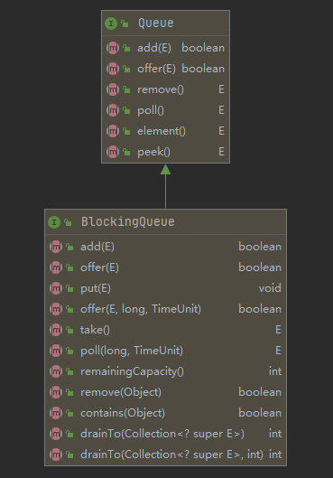
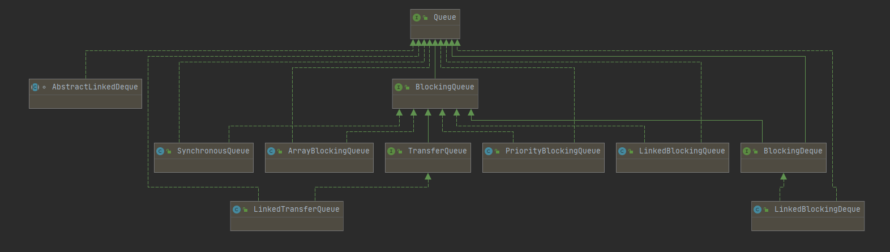
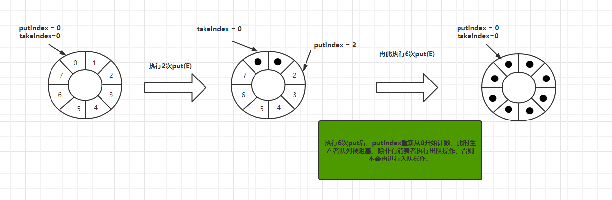
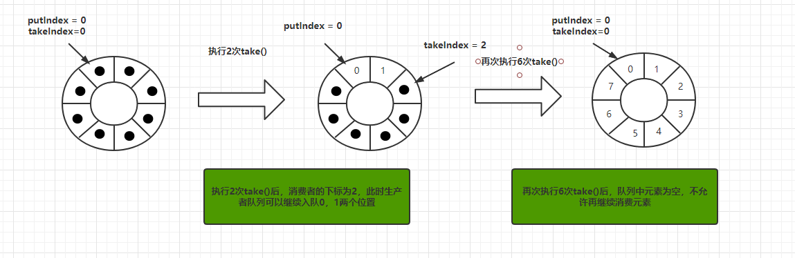

## BlockingQueue接口

Java中的`BlockingQueue`接口是一个线程安全的存取队列。继承Queue（队列）接口，再此基础上新定义了<font color=red>阻塞方法</font>。




|          | 抛出异常  | 返回特殊值 | 一直阻塞 | 阻塞超时后退出              |
| :------- | :-------- | :--------- | :------- | --------------------------- |
| 插入方法 | add(o)    | offer(o)   | put(o)   | offer(o, timeout, timeunit) |
| 移除方法 | remove(o) | poll()     | take(o)  | poll(o, timeout, timeunit)  |
| 检查方法 | element() | peek()     | —        | —                           |


- 抛出异常。当阻塞队列满时候，再往队列里插入元素，会抛出IllegalStateException("Queue full")异常。当队列为空时，从队列里获取元素时会抛出NoSuchElementException异常。
- 返回特殊值。
  - 元素入队 ： 插入成功返回true，当阻塞队列满时候插入失败返回false。
  - 元素出队 ：从队列里拿出一个元素，如果没有则返回null。
- 一直阻塞。当阻塞队列满时候，再往队列里插入元素时阻塞生产者线程；当队列空时，再往队列中获取数据时阻塞消费者线程。

JDK中阻塞队列（BlockingQueue）的实现类如下 ：ArrayBlockingQueue，LinkedBlockingQueue，PriorityBlockingQueue，DelayQueue，SynchronousQueue，LinkedTransferQueue，LinkedBlockingDeque。



## ArrayBlockingQueue

#### 定义

特点 ：一个由 <font color=red>数组</font> 实现的<font color=red>有界</font>，<font color=red>阻塞</font>，<font color=red>线程安全</font>，<font color=red>FIFO（先进先出）</font>队列。

```java
  public class ArrayBlockingQueue<E> extends AbstractQueue<E> implements BlockingQueue<E>, Serializable {
        private static final long serialVersionUID = -817911632652898426L;
        //数组实现的队列
        final Object[] items;
        //记录队列中消费者消费的索引
        int takeIndex;
        //记录队列中生产者生产的索引
        int putIndex;
        //队列中元素个数
        int count;
        // 重入锁,对入队操作和出队操作加锁，保证线程安全
        final ReentrantLock lock;
        // 出列条件，如果队列为空，会执行notEmpty.await()阻塞消费者队列
        private final Condition notEmpty;
        // 入列条件，如果队列满，会执行notFull.await()阻塞生产者队列
        private final Condition notFull;
        transient ArrayBlockingQueue.Itrs itrs;
    }

public ArrayBlockingQueue(int capacity) {
      this(capacity, false);
}

public ArrayBlockingQueue(int capacity, boolean fair) {
    if (capacity <= 0)
        throw new IllegalArgumentException();
    this.items = new Object[capacity];
    lock = new ReentrantLock(fair);
    notEmpty = lock.newCondition();
    notFull =  lock.newCondition();
}
```

#### 图解入队出队过程

我们首先先看下出队和入队的代码实现。

```java
//==============================入队=================================
public void put(E e) throws InterruptedException {
    checkNotNull(e);
    final ReentrantLock lock = this.lock;
    lock.lockInterruptibly();
    try {
        while (count == items.length)
            notFull.await();
        enqueue(e);
    } finally {
        lock.unlock();
    }
}

private void enqueue(E x) {
    final Object[] items = this.items;
    items[putIndex] = x;
    if (++putIndex == items.length)
        putIndex = 0;
    count++;
    notEmpty.signal();
}

//==============================出队=================================
public E take() throws InterruptedException {
    final ReentrantLock lock = this.lock;
    lock.lockInterruptibly();
    try {
        while (count == 0)
            notEmpty.await();
        return dequeue();
    } finally {
        lock.unlock();
    }
}

private E dequeue() {
    final Object[] items = this.items;
    E x = (E) items[takeIndex];
    items[takeIndex] = null;
    if (++takeIndex == items.length)
        takeIndex = 0;
    count--;
    if (itrs != null)
        itrs.elementDequeued();
    notFull.signal();
    return x;
}
```

从代码层面，我们大概知道如下几点：

- 每次入队出队都`ReentrantLock`加锁来保证线程安全，且入队和出队用的同一个锁。
- 当`count`（实际元素个数）等于数组长度时，队列满，阻塞生产者队列，禁止往队列中添加元素。
- 当`count`（实际元素个数）等于0时，队列空，阻塞消费者队列，禁止往队列中移除元素。
- `putIndex`和`takeIndex`用来定义生产者和消费者的位置，当到达items.length时则从0重新开始。所以可以看出数组在逻辑上是一个<font color=red>环形数组</font>。





总结：ArrayBlockingQueue使用有界数组作为队列容器，采用ReentrantLock重入锁对入队和出队操作加锁保证线程安全，由于入队和出队操作采用的是同一把锁，所以再效率上相对较差。采用Condition实现队列满和空时的消息通知。

