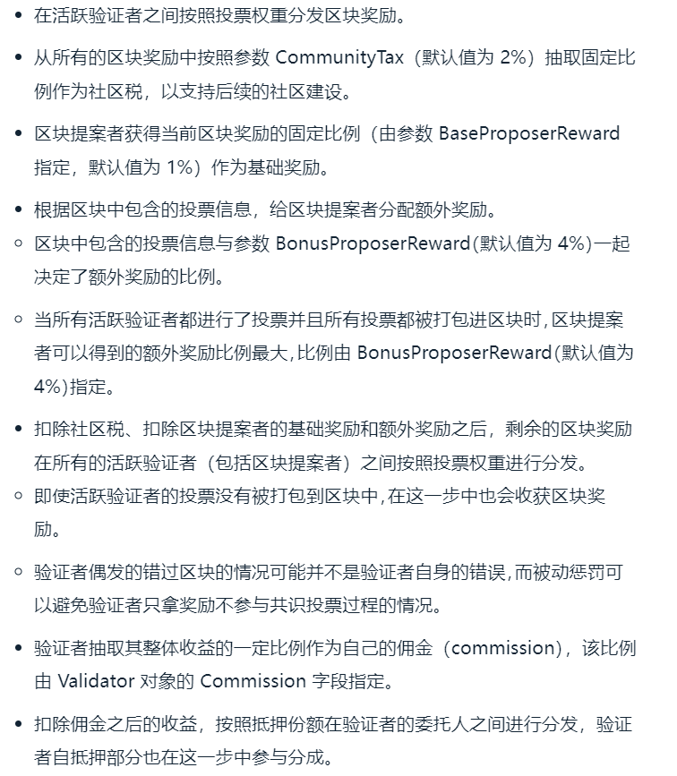

## Cosmos-sdk模块化设计

​	为了辅助应用的构建，Cosmos-SDK实现了BaseApp应用模板。BaseApp可以看作是基于Cosmos-SDK构建区块链的**脚手架**。BaseApp通过`AppModule`接口统一管理所有的模块，**这就要求所有模块都要实现AppModule接口**。

### AppModule

AppModule接口被细分成三个 : `AppModuleGenesis`，`AppModuleBasic`，`AppModule`。

```go
type AppModule interface {
	AppModuleGenesis
    // 注册不变量
	RegisterInvariants(sdk.InvariantRegistry)
    // 路由信息
	Route() sdk.Route
    // 查询的路由信息
	QuerierRoute() string
	LegacyQuerierHandler(*codec.LegacyAmino) sdk.Querier
	RegisterServices(Configurator)
	ConsensusVersion() uint64
    // ABIC请求相应
	BeginBlock(sdk.Context, abci.RequestBeginBlock)
    // ABIC请求相应
	EndBlock(sdk.Context, abci.RequestEndBlock) []abci.ValidatorUpdate
}
type AppModuleGenesis interface {
	AppModuleBasic
    //根据创世配置的信息初始化模块的初始信息
	InitGenesis(sdk.Context, codec.JSONCodec, json.RawMessage) []abci.ValidatorUpdate
    // 导出模块创世信息
	ExportGenesis(sdk.Context, codec.JSONCodec) json.RawMessage
}
type AppModuleBasic interface {
	Name() string	//定义模块名称
    // 注册编码方式
	RegisterLegacyAminoCodec(*codec.LegacyAmino)
	RegisterInterfaces(codectypes.InterfaceRegistry)
	DefaultGenesis(codec.JSONCodec) json.RawMessage	//定义模块的创世状态
    // 校验模块创世状态
	ValidateGenesis(codec.JSONCodec, client.TxEncodingConfig, json.RawMessage) error
	// rest方式的客户端方法注册
    RegisterRESTRoutes(client.Context, *mux.Router)
	// grpc方式的客户端注册方法
    RegisterGRPCGatewayRoutes(client.Context, *runtime.ServeMux)
    // 发送交易的cmd方法定义
	GetTxCmd() *cobra.Command
    // 查询状态的cmd方法
	GetQueryCmd() *cobra.Command
}
```

- `BeginBlock`和`EndBlock`方法用于在区块执行前后触发应用的状态更新。举个例子，例如staking模块就是通过在EndBlock判断最新的验证者列表，从而更新后发给tendermint共识。值得注意的是，由于模块之间会存在依赖关系，要求应用按照模块的注册顺序以此调用这两个方法。
- `RegisterInterfaces`注册不变量，后续看下不变量应用场景

### BasicManager和Manager模块管理器

- BasicManager , 用来管理模块实现的AppModuleBasic接口功能。
- Manager, 用来管理模块AppModule接口功能。

为什么要模块管理器？

统一管理模块，并且根据注册顺序进行调用，例如上面说`BeginBlock`和`EndBlock`如果模块之间有依赖顺序，我们是需要按顺序注册的。

```go
type BasicManager map[string]AppModuleBasic
func NewBasicManager(modules ...AppModuleBasic) BasicManager {
	moduleMap := make(map[string]AppModuleBasic)
	for _, module := range modules {
		moduleMap[module.Name()] = module
	}
	return moduleMap
}

func (bm BasicManager) RegisterLegacyAminoCodec(cdc *codec.LegacyAmino) {
	for _, b := range bm {
		b.RegisterLegacyAminoCodec(cdc)
	}
}

func (bm BasicManager) RegisterInterfaces(registry codectypes.InterfaceRegistry) {
	for _, m := range bm {
		m.RegisterInterfaces(registry)
	}
}

func (bm BasicManager) DefaultGenesis(cdc codec.JSONCodec) map[string]json.RawMessage {
	genesis := make(map[string]json.RawMessage)
	for _, b := range bm {
		genesis[b.Name()] = b.DefaultGenesis(cdc)
	}

	return genesis
}

func (bm BasicManager) ValidateGenesis(cdc codec.JSONCodec, txEncCfg client.TxEncodingConfig, genesis map[string]json.RawMessage) error {
	for _, b := range bm {
		if err := b.ValidateGenesis(cdc, txEncCfg, genesis[b.Name()]); err != nil {
			return err
		}
	}

	return nil
}

func (bm BasicManager) RegisterRESTRoutes(clientCtx client.Context, rtr *mux.Router) {
	for _, b := range bm {
		b.RegisterRESTRoutes(clientCtx, rtr)
	}
}

func (bm BasicManager) RegisterGRPCGatewayRoutes(clientCtx client.Context, rtr *runtime.ServeMux) {
	for _, b := range bm {
		b.RegisterGRPCGatewayRoutes(clientCtx, rtr)
	}
}

func (bm BasicManager) AddTxCommands(rootTxCmd *cobra.Command) {
	for _, b := range bm {
		if cmd := b.GetTxCmd(); cmd != nil {
			rootTxCmd.AddCommand(cmd)
		}
	}
}

func (bm BasicManager) AddQueryCommands(rootQueryCmd *cobra.Command) {
	for _, b := range bm {
		if cmd := b.GetQueryCmd(); cmd != nil {
			rootQueryCmd.AddCommand(cmd)
		}
	}
}
```

```go
type Manager struct {
	Modules            map[string]AppModule
	OrderInitGenesis   []string
	OrderExportGenesis []string
	OrderBeginBlockers []string
	OrderEndBlockers   []string
}

func NewManager(modules ...AppModule) *Manager {

	moduleMap := make(map[string]AppModule)
	modulesStr := make([]string, 0, len(modules))
	for _, module := range modules {
		moduleMap[module.Name()] = module
		modulesStr = append(modulesStr, module.Name())
	}

	return &Manager{
		Modules:            moduleMap,
		OrderInitGenesis:   modulesStr,
		OrderExportGenesis: modulesStr,
		OrderBeginBlockers: modulesStr,
		OrderEndBlockers:   modulesStr,
	}
}
// Manager的方法具体可以去看代码 cosmos-sdk\types\module\module.go
```

### BaseApp

Cosmos-SDK通过BaseApp提供了区块链应用的雏形，开发者可以基于BaseApp定制化开发区块链应用。

```go
type BaseApp struct { // nolint: maligned
	// initialized on creation
	logger            log.Logger
	name              string               // application name
	db                dbm.DB               // 后端数据库接口
	cms               sdk.CommitMultiStore // 存储所有链上状态
	storeLoader       StoreLoader          // 存储加载器
	router            sdk.Router           // 消息路由分发器
	queryRouter       sdk.QueryRouter      // 查询路由分发器
	grpcQueryRouter   *GRPCQueryRouter     // router for redirecting gRPC query calls
	msgServiceRouter  *MsgServiceRouter    // router for redirecting Msg service messages
	interfaceRegistry types.InterfaceRegistry
	txDecoder         sdk.TxDecoder // 交易的解码方法

	anteHandler    sdk.AnteHandler  // 交易预处理方法，一般用来做交易的有效性检查，例如签名验证，Gas检查，检查通过了才能进交易池
	initChainer    sdk.InitChainer  // 初始化链方法
	beginBlocker   sdk.BeginBlocker // logic to run before any txs
	endBlocker     sdk.EndBlocker   // logic to run after all txs, and to determine valset changes
	addrPeerFilter sdk.PeerFilter   // filter peers by address and port
	idPeerFilter   sdk.PeerFilter   // filter peers by node ID
	fauxMerkleMode bool             // if true, IAVL MountStores uses MountStoresDB for simulation speed.

	snapshotManager    *snapshots.Manager
	snapshotInterval   uint64 // block interval between state sync snapshots
	snapshotKeepRecent uint32 // recent state sync snapshots to keep

	checkState   *state  // 用于交易检查的状态
	deliverState *state  // 用于交易执行的状态

	interBlockCache sdk.MultiStorePersistentCache

	voteInfos []abci.VoteInfo	//存储活跃验证者集合

	paramStore ParamStore

	minGasPrices sdk.DecCoins

	initialHeight int64

	sealed bool

	haltHeight uint64

	haltTime uint64

	minRetainBlocks uint64

	// application's version string
	version string

	appVersion uint64

	// recovery handler for app.runTx method
	runTxRecoveryMiddleware recoveryMiddleware

	trace bool

	indexEvents map[string]struct{}
}
```

BaseApp同时实现了Tendermint的abic方法


```go
// Tendermint abic接口
// tendermint/abci/types/application.go
type Application interface {
	// Info/Query Connection
	Info(RequestInfo) ResponseInfo                // Return application info
	SetOption(RequestSetOption) ResponseSetOption // Set application option
    // 查询都会这个入口进去
	Query(RequestQuery) ResponseQuery             // Query for state

	// 在交易放入交易池之前做检查
    // 调用逻辑 CheckTx-> baseApp.runTx -> 应用msg的ValidateBasic方法
	CheckTx(RequestCheckTx) ResponseCheckTx // Validate a tx for the mempool

	// 只在链初始化时调用一次，用于初始化链状态，cosmos-sdk的baseapp实现了这个方法，并在里面调用他自己的方法initChainer
    //InitChain -> app.initChainer -> 应用的InitGenesis
	InitChain(RequestInitChain) ResponseInitChain
    // 当全网就新区块内容达成共识，需要将区块提交给上层应用执行，过程分成BeginBlock -> DeliverTx -> EndBlock -> Commit
    // BeginBlock方法用于通知上层应用一个新区块的到来。例如CosMosHub中为了激励参与共识的验证者而设计的通过膨胀铸造资产就发生在这一步
    // 调用逻辑 BeginBlock -> baseApp.beginBlocker()
	BeginBlock(RequestBeginBlock) ResponseBeginBlock 
	// RequestDeliverTx记录区块中的交易，所以DeliverTx是将区块的交易一笔一笔给上层应用
    // 调用逻辑 DeliverTx -> baseApp.runTx() -> baseApp.anteHandler() -> baseApp.runMsgs() -> 应用模块上handler
    DeliverTx(RequestDeliverTx) ResponseDeliverTx    // Deliver a tx for full processing
    // 通知上层应用当前区块的交易已经发送完毕。一般在EndBlock做链上惩罚
    // 调用逻辑 EndBlock -> baseApp.endBlocker() -> 应用各个模块的EndBlock方法
	EndBlock(RequestEndBlock) ResponseEndBlock
    // 调用逻辑 Commit() -> baseApp.cms.Commit()
	Commit() ResponseCommit                          
	// State Sync Connection
	ListSnapshots(RequestListSnapshots) ResponseListSnapshots                // List available snapshots
	OfferSnapshot(RequestOfferSnapshot) ResponseOfferSnapshot                // Offer a snapshot to the application
	LoadSnapshotChunk(RequestLoadSnapshotChunk) ResponseLoadSnapshotChunk    // Load a snapshot chunk
	ApplySnapshotChunk(RequestApplySnapshotChunk) ResponseApplySnapshotChunk // Apply a shapshot chunk
}
```


## Cosmos-sdk Pos模块

### distribution奖励分发模块

​	奖励分发一般分成`主动奖励分发`和`被动奖励分发`。对于`主动奖励分发`，在POS机制下会导致每个区块需要大量修改账户余额，从而会影响网络。举个例子假如一个网络有100个Validator和1000个delegator，那么每次出块的奖励都要操作1100个账户，导致性能下降，所以一般POS采用`被动奖励分发`。`被动奖励分发`方式中，委托者在一个验证者处抵押的链上资产不断累计，当委托者主动发送取回收益时，该委托者的所有收益一次性的转入其账号。

distribution模块中的奖励分发主要分成两步：

- 按照投票权重在活跃验证者之间分发区块奖励。
- 每个验证者再根据委托人的份额比例分发自己收到的区块奖励。



#### 例子说明分发奖励

假设采用默认值（`1%的基础奖励比例，4%的最高额外奖励比例，2%的社区税`）。

- A权重中，40%来自自身质押，20%来自委托者A1，20来自委托者A2。
- B权重中，50%来自自身质押，50%来自委托者B1。
- ABCDE这5个权重相同的活跃验证者，权重比例都是20%,并且他们的佣金抽取比例均为10%
- 区块奖励是100。
- 当前块提案者是A。

则可以算出下面的逻辑

- 抽取2%作为社区税： 100 * 0.02 = 2 
- 抽取总量的1%作为提案者奖励 :  100 * 0.01 = 1，所以A获得1个奖励。
- 由于包含所有的投票信息且额外奖励是4%，所以A额外获得4个奖励。
- 经过上面计算，奖励剩下`100-2-1-4 = 93`。每个验证者的投票相同，所以他们每个获得`93/5=18.6`个奖励。
- A在本区块的总奖励是`18.6 + 1 + 4 = 23.6`。
  - A的佣金比例是10%，所以A奖励中有`23.6 * 0.1 = 2.36`的链上资产归属A0(A验证者的运营方)。
  -  算到这里，最终A的拿出来分的奖励是`23.6-2.36=21.24`。由于A本身占40%，A1占20%，A2占20%。所以
    - A ： 21.24 * 0.4 = 8.496
    - A1: 21.24 * 0.2 = 4.248
    - A2 : 21.24 * 0.4 = 8.496

#### F1奖励分发机制

从上面看来，我们整理下验证者和委托者可以获得的奖励情况包括

- 验证者奖励 ： 自身抵押收益 + 委托佣金收益
- 委托者奖励 ： 抵押收益

为了用最小的运行代价实现奖励的被动分发，提出了F1奖励分发机制。F1奖励分发机制在每个区块中仅仅需要遍历一遍活跃验证者来进行投票统计，所以F1奖励分发机制没有引入额外的`读写操作`。

委托者奖励公式如下

- t : 委托者的质押的资产。
- 求和符号中 `m`表示委托者抵押时的区块高度，`n`表示委托者提取奖励时的区块高度。
- Si ：在区块高度`i`时，验证者的链上资产总量。
- Fi ：在区块高度`i`时，验证者获得的区块奖励。


从上面公式来看，Fi的值在每个区块的值都是不一样的，因为验证者有可能是提案者也有可能不是。Si的值只有在涉及到`验证者追加质押，委托者委托，撤回委托，撤回资产，链上惩罚`时候才会发生变化。

基于这种观察，引入`period`时期的概念 : 验证者在一个时期中代理的链上资产总量不变，每次发生上面说的`验证者追加质押，委托者委托，撤回委托，撤回资产，链上惩罚`时，结束上一个时期，开始新的时期。