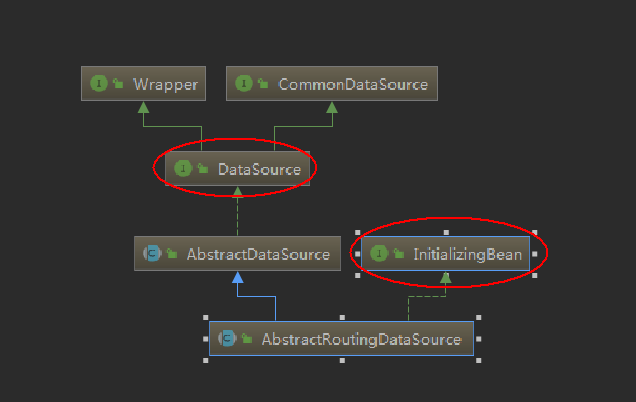

## 读写分离基本原理

高性能数据库集群的第一种方式是“***读写分离***”，其本质是将访问压力分散到集群中的多个节点，但是没有分散存储压力；第二种方式是“分库分表”，既可以分散访问压力，又可以分散存储压力。

读写分离的基本实现是：

- 数据库服务器搭建主从集群，一主一从、一主多从都可以
- 数据库主机负责读写操作，从机只负责读操作
- 数据库主机通过复制将数据同步到从机，每台数据库服务器都存储了所有的业务数据
- 业务服务器将写操作发给数据库主机，将读操作发给数据库从机


<!--more-->

## 读写分离常见问题与解决

### 主从延迟
以MYSQL为例，当主库插入数据后从库需要一段时间才能同步，时间可能达到1秒多，如果有大量数同步延迟1分钟也有可能。如果业务服务器将数据写入到数据库主服务器后立刻(1秒内)进行读取，此时读操作访问的是从机，主机还没有将数据复制过来，到从机读取数据是读不到最新数据的，业务上就可能出现问题。
### 常见解决方法
1. 关键业务读写操作指向主机，非关键业务采用读写分离。从业务上来区别理论上是比较好的。
2. 读从机失败后再读一次主机。这种方式与业务无偶尔，只需要在公共类上处理。不足之处在于如果有很多二次读取，将大大增加主机的读操作压力。

## Spring实现读写分离
### 原理
Srping提供了一个AbstractRoutingDataSource类来支持多数据库。我们先来看一下他的继承结构。实现了InitializingBean接口,所以在bean初始化之前会调用afterPropertiesSet方法初始化数据库信息

```
    Override
    public void afterPropertiesSet() {
        if (this.targetDataSources == null) {
            throw new IllegalArgumentException("Property 'targetDataSources' is required");
        }
        //获取xml文件配置的数据库并存到resolvedDataSources对象中
        this.resolvedDataSources = new HashMap<>(this.targetDataSources.size());
        this.targetDataSources.forEach((key, value) -> {
            Object lookupKey = resolveSpecifiedLookupKey(key);
            DataSource dataSource = resolveSpecifiedDataSource(value);
            this.resolvedDataSources.put(lookupKey, dataSource);
        });
        if (this.defaultTargetDataSource != null) {
            this.resolvedDefaultDataSource = resolveSpecifiedDataSource(this.defaultTargetDataSource);
        }
    }
```
因为DynamicDataSource重写了determineCurrentLookupKey方法，所以在每次获取数据库时都会从ThreadLocal中获取当前线程对应的数据库类型
```
	//每次获取数据库连接时从这里进入
	@Override
	public Connection getConnection() throws SQLException {
		return determineTargetDataSource().getConnection();
	}
	
	protected DataSource determineTargetDataSource() {
		Assert.notNull(this.resolvedDataSources, "DataSource router not initialized");
		Object lookupKey = determineCurrentLookupKey();
		DataSource dataSource = this.resolvedDataSources.get(lookupKey);
		if (dataSource == null && (this.lenientFallback || lookupKey == null)) {
			dataSource = this.resolvedDefaultDataSource;
		}
		if (dataSource == null) {
			throw new IllegalStateException("Cannot determine target DataSource for lookup key [" + lookupKey + "]");
		}
		return dataSource;
	}

	//子类重写determineCurrentLookupKey方法
    protected Object determineCurrentLookupKey() {
        return DBContextHolder.get();
    }

```

### 实现代码
#### 导出MAVEN包
```
<dependency>
      <groupId>com.alibaba</groupId>
      <artifactId>druid</artifactId>
      <version>1.0.9</version>
</dependency>
```
#### 配置文件
```
<?xml version="1.0" encoding="UTF-8"?>
<beans xmlns="http://www.springframework.org/schema/beans"
       xmlns:xsi="http://www.w3.org/2001/XMLSchema-instance"
       xmlns:context="http://www.springframework.org/schema/context"
       xmlns:tx="http://www.springframework.org/schema/tx" xmlns:aop="http://www.springframework.org/schema/aop"
       xsi:schemaLocation="http://www.springframework.org/schema/beans
        http://www.springframework.org/schema/beans/spring-beans.xsd
        http://www.springframework.org/schema/context
        http://www.springframework.org/schema/context/spring-context.xsd
        http://www.springframework.org/schema/tx
        http://www.springframework.org/schema/tx/spring-tx.xsd http://www.springframework.org/schema/aop https://www.springframework.org/schema/aop/spring-aop.xsd">
    <context:component-scan base-package="com.xzy.tx"/>
    <tx:annotation-driven/>
    <!--读写分离动态数据库-->
    <bean id="dynamicDataSource" class="com.xzy.rwDynamic.DynamicDataSource">
        <property name="targetDataSources">
            <map>
                <entry value-ref="dataSourceMaster" key="dataSourceMaster"></entry>
                <entry value-ref="dataSourceSlave" key="dataSourceSlave"></entry>
            </map>
        </property>
    </bean>

    <bean id="transactionManager"
          class="org.springframework.jdbc.datasource.DataSourceTransactionManager">
        <property name="dataSource" ref="dynamicDataSource"/>
    </bean>

    <bean id="jdbcTemplate" class="org.springframework.jdbc.core.JdbcTemplate">
        <property name="dataSource" ref="dynamicDataSource"></property>
    </bean>
	<!--主库-->
    <bean id="dataSourceMaster" class="com.alibaba.druid.pool.DruidDataSource" init-method="init"
          destroy-method="close">
        <!--省略很多-->
    </bean>
    <!--从库-->
    <bean id="dataSourceSlave" class="com.alibaba.druid.pool.DruidDataSource" init-method="init" destroy-method="close">
        <!--省略很多-->
    </bean>
</beans>
```

#### 逻辑代码
```
import org.springframework.jdbc.datasource.lookup.AbstractRoutingDataSource;

/***
 * 动态数据库
 */
public class DynamicDataSource extends AbstractRoutingDataSource {
    protected Object determineCurrentLookupKey() {
        return DBContextHolder.get();
    }
}
```
```
package com.xzy.rwDynamic;
/**
 * 枚举类
*/
public enum DbType {
    MASTER("dataSourceMaster"),
    SLAVE("dataSourceSlave");
    private String type;
    DbType(String type){
        this.type = type;
    }
    public String getType() {
        return type;
    }
    public void setType(String type) {
        this.type = type;
    }
}
```

```
package com.xzy.rwDynamic;
import org.apache.commons.lang3.StringUtils;

public class DBContextHolder {
    private static final ThreadLocal<String> dbHolder = new ThreadLocal<String>();

    public static String get(){
        String db = dbHolder.get();
        return StringUtils.isNoneBlank(db) ? db : DbType.MASTER.getType();
    }
    public static void set(String type){
        if(StringUtils.isBlank(type)){
            dbHolder.set(DbType.MASTER.getType());
        }else{
            dbHolder.set(type);
        }
    }
    public static void remove(){
        dbHolder.remove();
    }
}
```
#### 测试代码
```
@Test
    public void testwrDynamic(){
        //设置当前线程使用主线程
        DBContextHolder.set(DbType.MASTER.getType());
        ApplicationContext context = new ClassPathXmlApplicationContext("classpath:applicationContext-w-r-dynamic.xml");
        JdbcTemplate jdbcTemplate = context.getBean(JdbcTemplate.class);
        jdbcTemplate.queryForList("select * from user");
        DBContextHolder.remove()
    }
```
#### 扩展
每次需要读写分离时，都需要在开头DBContextHolder.set()，然后在结尾DBContextHolder.remove()。这样代码臃肿，耦合性强。可以使用AOP+自定义注解的方式，使用环绕增强对代码进行处理


