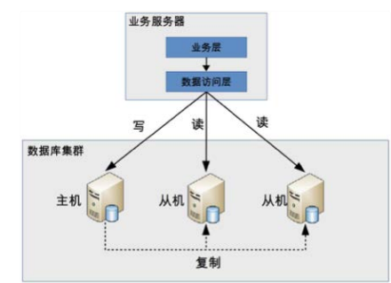

# 读写分离基本原理

高性能数据库集群的第一种方式是“***读写分离***”，其本质是将访问压力分散到集群中的多个节点，但是没有分散存储压力；第二种方式是“分库分表”，既可以分散访问压力，又可以分散存储压力。

读写分离的基本实现是：

- 数据库服务器搭建主从集群，一主一从、一主多从都可以
- 数据库主机负责读写操作，从机只负责读操作
- 数据库主机通过复制将数据同步到从机，每台数据库服务器都存储了所有的业务数据
- 业务服务器将写操作发给数据库主机，将读操作发给数据库从机


<!--more-->
# 读写分离常见问题与解决

## 主从延迟
以MYSQL为例，当主库插入数据后从库需要一段时间才能同步，时间可能达到1秒多，如果有大量数同步延迟1分钟也有可能。如果业务服务器将数据写入到数据库主服务器后立刻(1秒内)进行读取，此时读操作访问的是从机，主机还没有将数据复制过来，到从机读取数据是读不到最新数据的，业务上就可能出现问题。
### 常见解决方法
1. 关键业务读写操作指向主机，非关键业务采用读写分离。从业务上来区别理论上是比较好的。
2. 读从机失败后再读一次主机。这种方式与业务无偶尔，只需要在公共类上处理。不足之处在于如果有很多二次读取，将大大增加主机的读操作压力。

# Spring实现读写分离

## 实现代码
### 导出MAVEN包
```
import org.springframework.jdbc.datasource.lookup.AbstractRoutingDataSource;

/***
 * 动态数据库
 */
public class DynamicDataSource extends AbstractRoutingDataSource {
    protected Object determineCurrentLookupKey() {
        return DBContextHolder.get();
    }
}
```


