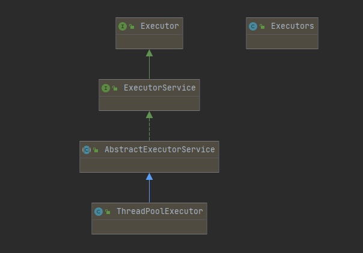
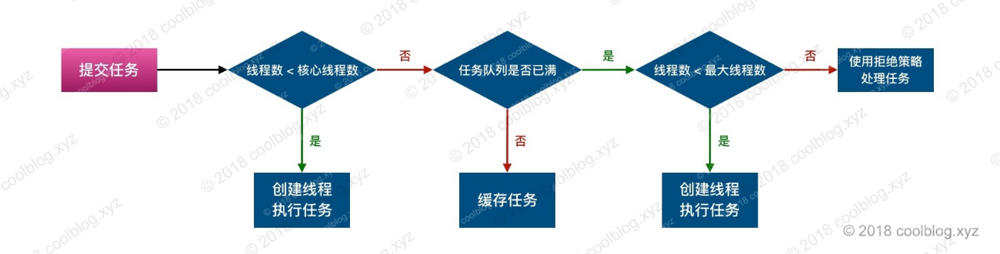
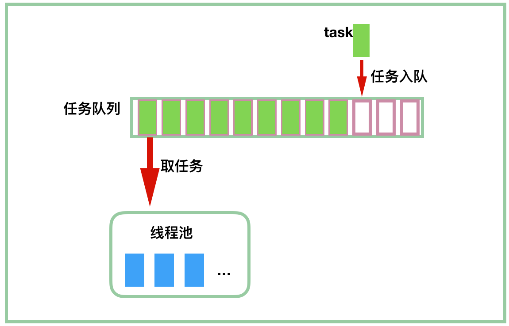
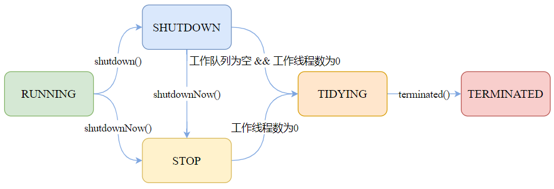
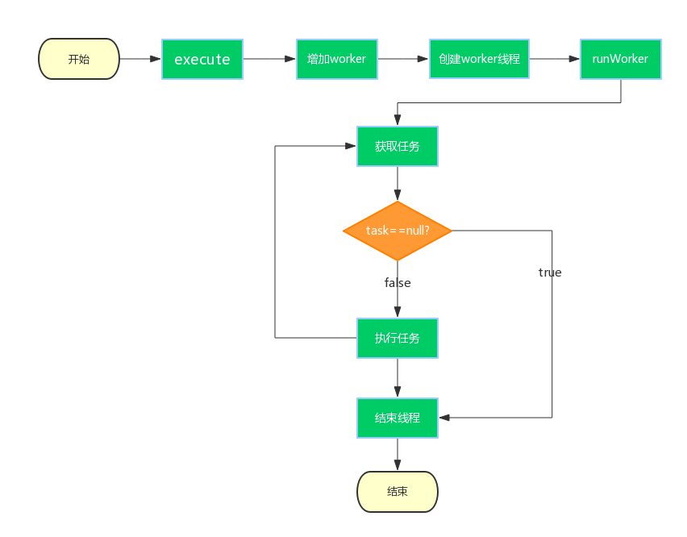

<!--more-->

## 为什么要使用线程池?

多线程技术主要解决处理器单元内多个线程执行的问题，它可以显著减少处理器单元的闲置时间，增加处理器单元的吞吐能力。使用多线程技术完成一个任务所需的时间包括。
- T1 创建线程时间
- T2 执行线程任务的时间
- T3 销毁线程的时间

如果：T1 + T3 远大于 T2，则可以采用线程池，以提高服务器性能。不单单如此，合理的线程池帮我们管理系统线程资源防止由于线程太多导致的系统崩溃问题等。
所以,**线程池有如下作用**:
- 减少了创建和销毁线程的次数，每个工作线程都可以被重复利用，可执行多个任务
- 可根据系统的承受能力调整线程池中工作线线程的数目防止因为消耗过多的内存而把服务器累趴下

此外，参考美团上的一段关于线程多的弊端：

- 线程的创建和销毁成本很高，在Linux这样的操作系统中，线程本质上就是一个进程。创建和销毁都是重量级的系统函数，需要调用系统内核的API，然后操作系统为其分配一系列资源，整个正本很高。
-  线程本身占用较大内存，像Java的线程栈，一般至少分配512K～1M的空间，如果系统中的线程数过千，恐怕整个JVM的内存都会被吃掉一半。
- 线程的切换成本是很高的。操作系统发生线程切换的时候，需要保留线程的上下文，然后执行系统调用。**如果线程数过高，可能执行线程切换的时间甚至会大于线程执行的时间，这时候带来的表现往往是系统load偏高、CPU sy使用率特别高（超过20%以上)，导致系统几乎陷入不可用的状态。**
- 容易造成锯齿状的系统负载。因为系统负载是用活动线程数或CPU核心数，一旦线程数量高但外部网络环境不是很稳定，就很容易造成大量请求的结果同时返回，激活大量阻塞线程从而使系统负载压力过大。
<!--more-->
## 线程池详解

### 继承体系

Executor为线程池的顶级接口，声明了<font color=#FF0000 >execute</font>方法。
Executors为创建线程池的工具类，提供了多种方式的线程池创建方法。

### 核心参数
```java
public ThreadPoolExecutor(int corePoolSize,
                          int maximumPoolSize,
                          long keepAliveTime,
                          TimeUnit unit,
                          BlockingQueue<Runnable> workQueue,
                          ThreadFactory threadFactory,
                          RejectedExecutionHandler handler)
```

| 参数            | 说明                                                         |
| --------------- | ------------------------------------------------------------ |
| corePoolSize    | 核心线程数。当线程数小于该值时，线程池会优先创建新线程来执行新任务 |
| maximumPoolSize | 线程池所能维护的最大线程数                                   |
| keepAliveTime   | 空闲线程的存活时间                                           |
| workQueue       | 任务队列，用于缓存未执行的任务                               |
| threadFactory   | 线程工厂。可通过工厂为新建的线程设置更有意义的名字           |
| handler         | 拒绝策略。当线程池和任务队列均处于饱和状态时，使用拒绝策略处理新任务。默认是 AbortPolicy，即直接抛出异常 |


### 线程池执行逻辑


假设目前定义了一个线程池
corePoolSize = 2 
keepAliveTime = 10ms
maximumPoolSize = 3
workQueue = ArrayBlockingQueue(长度为3)

执行步骤如下:
1. 首先进来一个任务A,在线程池没有任务在执行,正在运行线程 <  核心线程数,建一个线程执行任务
2. 又来一个任务B,此时正在运行的线程数为1.正在运行线程 <  核心线程数,则继续创建一个线程执行任务
3. 又来一个任务C,此时正在运行线程 > 核心线程数,将任务放到workQueue等待执行。
4. 此时又来了任务DEF.....,由于队列只允许存3个,DE进入到队列等待
5. 此时F没有进入队列, 正在运行线程 < 最大线程数,则任务F允许创建一个线程执行。
6. 此时任务G到来，由于AB任务还没结束，workQueue存放了CDE任务等待执行,此时正在运行线程 =最大线程数,则G被拒绝，执行对应的拒绝策略。
7. 此时任务A执行完毕,任务C则从workQueue取出,沿用刚开始创建的线程执行任务。

**keepAliveTime** : 由于任务F是额外创建的一个线程去执行，线程池在空闲时只能保持 核心线程数个线程，所以当任务F执行完后，在keepAliveTime时间内如果没有新的任务进来导致正在运行线程 > 核心线程数 & workQueue已满 这两个条件，则对应的线程会被销毁。

线程创建规则如下:

| 序号 | 条件                                                        | 动作             |
| ---- | ----------------------------------------------------------- | ---------------- |
| 1    | 线程数 < corePoolSize                                       | 创建新线程       |
| 2    | 线程数 ≥ corePoolSize，且 workQueue 未满                    | 缓存新任务       |
| 3    | corePoolSize ≤ 线程数 ＜ maximumPoolSize，且 workQueue 已满 | 创建新线程       |
| 4    | 线程数 ≥ maximumPoolSize，且 workQueue 已满                 | 使用拒绝策略处理 |

从线程池执行逻辑总结 :

- 任务进来时首先先在核心线程中执行，如果核心线程满则放到队列中，如果队列满且还没到最大线程数则可以额外创建线程执行(这个额外的线程是会被回收的)
- 核心线程不会被回收，额外的线程会被回收，如果设置了allowCoreThreadTimeOut为true，则核心线程数也可以被回收，但一般不这样做
- 如果workQueue是无界队列，则keepAliveTime将不起作用

### 排队策略
当线程数 ≥ corePoolSize时，任务会存到队列中排队，有3中类型的容器可供使用，分别是同步队列，有界队列和无界队列。对于有优先级的任务，这里还可以增加优先级队列。

| 实现类                | 类型       | 说明                                                         |
| --------------------- | ---------- | ------------------------------------------------------------ |
| SynchronousQueue      | 同步队列   | 该队列不存储元素，每个插入操作必须等待另一个线程调用移除操作，否则插入操作会一直阻塞 |
| ArrayBlockingQueue    | 有界队列   | 基于数组的阻塞队列，按照 FIFO 原则对元素进行排序             |
| LinkedBlockingQueue   | 无界队列   | 基于链表的阻塞队列，按照 FIFO 原则对元素进行排序             |
| PriorityBlockingQueue | 优先级队列 | 具有优先级的阻塞队列                                         |

### 拒绝策略
线程数量大于等于 maximumPoolSize，且 workQueue 已满，则使用拒绝策略处理新任务。Java 线程池提供了4中拒绝策略实现类

| 实现类              | 说明                                          |
| ------------------- | --------------------------------------------- |
| AbortPolicy         | 丢弃新任务，并抛出 RejectedExecutionException |
| DiscardPolicy       | 不做任何操作，直接丢弃新任务                  |
| DiscardOldestPolicy | 丢弃队列队首的元素，并执行新任务              |
| CallerRunsPolicy    | 由调用线程执行新任务                          |

```java
//使用拒绝策略
ThreadPoolExecutor executor = new ThreadPoolExecutor(1 , 1 , 1L , TimeUnit.MINUTES,new ArrayBlockingQueue<>(1),
new ThreadPoolExecutor.AbortPolicy());
//自定义拒绝策略
ThreadPoolExecutor executor2 = new ThreadPoolExecutor(1 , 1 , 1L , TimeUnit.MINUTES , new ArrayBlockingQueue<>(1),
        new RejectedExecutionHandler(){
            @Override
            public void rejectedExecution(Runnable r, ThreadPoolExecutor executor) {
 				//doSomeing   
            }
 });
```


## 几种线程池

Executors为创建线程池的工具类，提供了多种方式的线程池创建方法。
### newFixedThreadPool
构建包含固定线程数的线程池，默认情况下，空闲线程不会被回收。
从参数可以看出核心线程数 = 最大线程数 / 采用无界队列。
```
    public static ExecutorService newFixedThreadPool(int nThreads) {
        return new ThreadPoolExecutor(nThreads, nThreads,
                                      0L, TimeUnit.MILLISECONDS,
                                      new LinkedBlockingQueue<Runnable>());
    }
```
**特点与隐患**
这种方式采用的是无界队列，如果任务执行时间长且任务量多将会出现任务堆积在队列中导致系统内存飙升，内存溢出等问题
### newCachedThreadPool
构建线程数不定的线程池，线程数量随任务量变动，空闲线程存活时间超过60秒后会被回收。
**SynchronousQueue**特点是队列不存储元素，每个插入操作必须等待另一个线程调用移除操作，否则插入操作会一直阻塞。

```
    public static ExecutorService newCachedThreadPool() {
        return new ThreadPoolExecutor(0, Integer.MAX_VALUE,
                                      60L, TimeUnit.SECONDS,
                                      new SynchronousQueue<Runnable>());
    }
```
**特点与隐患**
队列相当于不排队，每次来一个任务就创建一个线程执行。当对应的任务执行完以后对应的线程如果在60秒内没有没有其他任务继续复用则会销毁。
**推荐使用这种线程池**。能够自动在并发量不多的时候自动销毁执行完的线程。但是最大线程数为无穷大,没有控制线程数也容易造成当并发量特别高时不加以控制导致线程数飙升
### newSingleThreadExecutor
构建线程数为1的线程池，等价于 newFixedThreadPool(1) 所构造出的线程池
```
    public static ExecutorService newSingleThreadExecutor() {
        return new FinalizableDelegatedExecutorService
            (new ThreadPoolExecutor(1, 1,
                                    0L, TimeUnit.MILLISECONDS,
                                    new LinkedBlockingQueue<Runnable>()));
    }

```
**特点与隐患**
一次只能一个线程在运行，只会创建一个线程进行复用，采用无界队列容易造成内存飙升
### newScheduledThreadPool
创建一个大小无限的线程池。此线程池支持定时以及周期性执行任务的需求。
```
    public static ScheduledExecutorService newScheduledThreadPool(int corePoolSize) {
        return new ScheduledThreadPoolExecutor(corePoolSize);
    }
   public ScheduledThreadPoolExecutor(int corePoolSize) {
        super(corePoolSize, Integer.MAX_VALUE, 0, NANOSECONDS,
              new DelayedWorkQueue());
    }


```

## ThreadPoolExecutor源码分析

### executre和submit方法

首先先来看下两个方法如何使用。线程池支持无返回值的execute方法，和有返回值的submit方法。有返回值的其实是将task封装成一个FutureTask。关于FutureTask可以看另外篇博客《[Fork/join框架你会用吗？](http://xuzyblog.top/2020/07/30/fork-join/)》。

```java
@Test
public void testError() throws InterruptedException, ExecutionException {
    ThreadPoolExecutor threadPoolExecutor = new ThreadPoolExecutor(10, 20, 60L, TimeUnit.MINUTES, new LinkedBlockingQueue<>());
    threadPoolExecutor.execute(() -> {
        System.out.println("线程池源码解析-execute");
    });
    Future future = threadPoolExecutor.submit(() -> {
        System.out.println("线程池源码解析-submit");
    });
    future.get();
}
```

```java
java.util.concurrent.AbstractExecutorService

protected <T> RunnableFuture<T> newTaskFor(Callable<T> callable) {
    return new FutureTask<T>(callable);
}

protected <T> RunnableFuture<T> newTaskFor(Runnable runnable, T value) {
        return new FutureTask<T>(runnable, value);
}

//传入Runable 返回Future
public Future<?> submit(Runnable task) {
    if (task == null) throw new NullPointerException();
    RunnableFuture<Void> ftask = newTaskFor(task, null);
    //最终都是调用到了execute方法执行逻辑
    execute(ftask);
    return ftask;
}

//传入Callable 返回Future
public <T> Future<T> submit(Callable<T> task) {
    if (task == null) throw new NullPointerException();
    RunnableFuture<T> ftask = newTaskFor(task);
    execute(ftask);
    return ftask;
}
```

这里需要先明白一个易错点，execute(Runnable task) 和 submit(Runnable task) 中的task应该理解成任务，而不是线程。整个线程池的逻辑大概可以这样概括 ： <font color=red>当execture提交一个task后，会新建一个Worker对象，并将任务放到里面，这个Worker里面有一个Thred变量就是真正线程池用来执行任务的线程。当一个task执行完以后，这个Worker会继续从队列中获取任务继续执行。</font>



### 重要属性分析

采用一个 32 位的整数来存放线程池的状态和当前池中的线程数。

- 高 3 位用于存放线程池状态
- 低 29 位表示线程数（即使只有 29 位，也已经不小了，大概 5 亿多，现在还没有哪个机器能起这么多线程的吧）

```java
//ThreadPoolExecutor中的控制状态
private final AtomicInteger ctl = new AtomicInteger(ctlOf(RUNNING, 0));

private static final int COUNT_BITS = Integer.SIZE - 3;
//线程池中当前活动的线程数量允许的最大值
//运算方法就是1左移29位再减1 00000000 00000000 00000000 00000001 --> 001 0000 00000000 00000000 00000000 - 1 = 536870911
private static final int CAPACITY   = (1 << COUNT_BITS) - 1;

//===我们说过高三位代表的是线程池的状态，所以下面就是线程池的几种状态
//RUNNING - 正常的状态：接受新的任务，处理等待队列中的任务
//SHUTDOWN - 不接受新的任务提交，但是会继续处理等待队列中的任务
//STOP - 不接受新的任务提交，不再处理等待队列中的任务，中断正在执行任务的线程
//TIDYING - 所有的任务都销毁了，workCount为0，线程过渡到TIDYING状态，将会执行terminated()钩子方法
//TERMINATED - terminated()方法已经完成
private static final int RUNNING    = -1 << COUNT_BITS;
private static final int SHUTDOWN   =  0 << COUNT_BITS;
private static final int STOP       =  1 << COUNT_BITS;
private static final int TIDYING    =  2 << COUNT_BITS;
private static final int TERMINATED =  3 << COUNT_BITS;
//用来存放task的阻塞队列
private final BlockingQueue<Runnable> workQueue;
//线程池中所有工作线程worker的集合
private final HashSet<Worker> workers = new HashSet<Worker>();
//创建线程的工厂，值得是Worker中变量Thread t的创建工厂
private volatile ThreadFactory threadFactory;
//拒绝策略
private volatile RejectedExecutionHandler handler;
//空闲线程存活时间
private volatile long keepAliveTime;
//核心线程数
private volatile int corePoolSize;
//最大线程数
private volatile int maximumPoolSize;
```



### Worker内部类

Worker是线程池中真正用来执行任务的类。继承了AQS，实现了Runable接口。这里继承AQS，主要是为了独占锁，如果是加锁状态证明Worker正在执行，如果解锁状态证明空闲。

**Worker为什么不直接使用ReentrantLock而是继承AQS ?**  tryAcquire方法它是不允许重入的，而ReentrantLock是允许重入的。对于线程来说，如果线程正在执行是不允许其它锁重入进来的。

我们可以理解Worker表示线程池中的<font color=red>工人</font>，Runnable command表示工人要做的任务。一个工人对应的是一个线程，一个工人一次做一个任务。工人做完任务后再从队列中获取任务继续做。

```java
private final class Worker extends AbstractQueuedSynchronizer implements Runnable{
    
    private static final long serialVersionUID = 6138294804551838833L;
    //真正用来执行任务的线程
    final Thread thread;
    //在new Worker时候传入的任务，这里交first值得是他是new Worker时候传入的那就是第一个。
    //但是有时候这个是null,那代表没有传入，这时候就是从队列中取
    Runnable firstTask;
    //用于存放此线程完成的任务数，注意了，这里用了 volatile，保证可见性
    volatile long completedTasks;

    
    Worker(Runnable firstTask) {
        setState(-1);
        this.firstTask = firstTask;
        this.thread = getThreadFactory().newThread(this);
    }

    public void run() {
        runWorker(this);
    }

    protected boolean isHeldExclusively() {
        return getState() != 0;
    }

    protected boolean tryAcquire(int unused) {
        if (compareAndSetState(0, 1)) {
            setExclusiveOwnerThread(Thread.currentThread());
            return true;
        }
        return false;
    }

    protected boolean tryRelease(int unused) {
        setExclusiveOwnerThread(null);
        setState(0);
        return true;
    }

    public void lock()        { acquire(1); }
    public boolean tryLock()  { return tryAcquire(1); }
    public void unlock()      { release(1); }
    public boolean isLocked() { return isHeldExclusively(); }

    void interruptIfStarted() {
        Thread t;
        if (getState() >= 0 && (t = thread) != null && !t.isInterrupted()) {
            try {
                t.interrupt();
            } catch (SecurityException ignore) {
            }
        }
    }
}
```


### 核心源码分析



#### execute方法


```java
public void execute(Runnable command) {
    if (command == null)
        throw new NullPointerException();
    int c = ctl.get();
    //如果线程池中工作的Worker数量小于核心线程数
    if (workerCountOf(c) < corePoolSize) {
        //直接new一个worker来执行任务，并把当前任务 command 作为这个线程的第一个任务(firstTask)
        if (addWorker(command, true))
            return;
        c = ctl.get();
    }
    
    //到这里说明，要么当前线程数大于等于核心线程数，要么刚刚 addWorker 失败了
    
    //判断当前线程池的状态是不是RUNNING状态，如果是则将任务放到队列中等待
    //offer - 将给定的元素设置到队列中，如果设置成功返回true, 否则返回false
    if (isRunning(c) && workQueue.offer(command)) {
        int recheck = ctl.get();
        //刚将任务放到队列后发现线程池不是运行的，那就删除把刚放到队列的任务删除并执行拒绝策略
        if (! isRunning(recheck) && remove(command)){
         	reject(command);   
        }
        //如果线程池还是 RUNNING 的，但是工作线程数为 0，那么开启新的线程，这种情况比较少见
        else if (workerCountOf(recheck) == 0)
            addWorker(null, false);
    }
    //这个分支，表示前面入队失败了，那么以 maximumPoolSize 为界创建新的 worker
    else if (!addWorker(command, false)){
        reject(command); //失败就执行拒绝策略   
    }
}
```

#### addWorker方法

```java
//core = true 时代表使用核心线程数 corePoolSize 作为创建线程的界限
//core = flase 时代表使用最大线程数 maximumPoolSize 作为创建线程的界限
private boolean addWorker(Runnable firstTask, boolean core) {
    retry:
    for (;;) {
        int c = ctl.get();
        int rs = runStateOf(c);

        // 判断是否可以addWorker
        if (rs >= SHUTDOWN &&
            ! (rs == SHUTDOWN &&
               firstTask == null &&
               ! workQueue.isEmpty()))
            return false;

        for (;;) {
            //获取当前工作的worker数量
            int wc = workerCountOf(c);
            //如果大于允许的最大数或者大于核心线程数则返回false
            if (wc >= CAPACITY ||
                wc >= (core ? corePoolSize : maximumPoolSize))
                return false;
            //如果运行线程数可以+1表示能成功new Worker,跳出循环
            if (compareAndIncrementWorkerCount(c))
                break retry;
            c = ctl.get(); 
            if (runStateOf(c) != rs)
                continue retry;
        }
    }

    //用来判断worker 是否已经启动
    boolean workerStarted = false;
    //是否已将这个 worker 添加到 workers 这个 HashSet 中
    boolean workerAdded = false;
    Worker w = null;
    try {
        //先建一个"工人"
        w = new Worker(firstTask);
        final Thread t = w.thread;
        if (t != null) {
            //这里使用mainLock保证workers.add(w)
            final ReentrantLock mainLock = this.mainLock;
            mainLock.lock();
            try {

                int rs = runStateOf(ctl.get());
			   //小于SHUTTDOWN 那就是 RUNNING状态
                //如果等于SHUTDOWN，不接受新的任务，但是会继续执行等待队列中的任务
                if (rs < SHUTDOWN || (rs == SHUTDOWN && firstTask == null)) {
                    if (t.isAlive()) throw new IllegalThreadStateException();
                    //将这个"工人"存到workers中
                    workers.add(w);
                    int s = workers.size();
                    if (s > largestPoolSize)
                        largestPoolSize = s;
                    workerAdded = true;
                }
            } finally {
                mainLock.unlock();
            }
            if (workerAdded) {
                //这个"工人"开始工作，对应Worker->run方法->runWorker(this)方法
                t.start();
                workerStarted = true;
            }
        }
    } finally {
        //如果线程没有启动，需要做一些清理工作，如前面 workCount 加了 1，将其减掉
        if (! workerStarted)
            addWorkerFailed(w);
    }
    return workerStarted;
}

//启动"工人"失败就炒了这个"工人"
private void addWorkerFailed(Worker w) {
    final ReentrantLock mainLock = this.mainLock;
    mainLock.lock();
    try {
        if (w != null)
            workers.remove(w);
        decrementWorkerCount();
        tryTerminate();
    } finally {
        mainLock.unlock();
    }
}

```

#### runWorker方法

```java
//此方法由worker线程启动后调用，这里用一个 while 循环来不断地从等待队列中获取任务并执行
final void runWorker(Worker w) {
    Thread wt = Thread.currentThread();
    //第一个任务就直接运行，不用从队列中取
    Runnable task = w.firstTask;
    w.firstTask = null;
    w.unlock(); // allow interrupts
    boolean completedAbruptly = true;
    try {
        while (task != null || (task = getTask()) != null) {
            w.lock();
            //判断各种不合适的状态然后中断
            //(线程状态>=STOP 或者 (线程中断且线程状态>=STOP)) 且 当时线程没有中断
            //其实主要保证2点 : 1.线程池没有停止 2.保证线程没有中断
            if (
                ( runStateAtLeast(ctl.get(), STOP) ||
                  (Thread.interrupted() && runStateAtLeast(ctl.get(), STOP))
                ) &&
                !wt.isInterrupted()
               )
                wt.interrupt();
            try {
                //钩子
                beforeExecute(wt, task);
                Throwable thrown = null;
                try {
                    //真正的执行任务，这里task要嘛是Runnable要嘛是FutureTask。
                    task.run();
                } catch (RuntimeException x) {
                    thrown = x; throw x;
                } catch (Error x) {
                    thrown = x; throw x;
                } catch (Throwable x) {
                    thrown = x; throw new Error(x);
                } finally {
                    //钩子
                    afterExecute(task, thrown);
                }
            } finally {
                //置空 task，准备 getTask 获取下一个任务
                task = null;
                //完成数+1
                w.completedTasks++;
                //释放独占锁
                w.unlock();
            }
        }
        completedAbruptly = false;
    } finally {
        //如果执行到这一步说明线程池状态不对了。
        //getTask()是会阻塞的，所以即使队列中为空，除非是超过核心线程数
        //的worker才会执行到这一步，不然会阻塞住
        processWorkerExit(w, completedAbruptly);
    }
}
```

总结runWorker方法执行过程：

1. while循环中，不断地通过getTask()方法从workerQueue中获取任务
2. 如果线程池正在停止，则中断线程。否则调用3.
3. 调用task.run()执行任务
4. 如果task为null则跳出循环，执行processWorkerExit()方法，销毁线程`workers.remove(w)`

**keepAliveTime作用详解**

我们知道当任务大于核心线程数+队列大小后，会额外new Worker来执行任务。随着队列中任务的消化，创建出来额外的Worker是需要被回收的。这个实现的过程是通过如下代码。

```java
final void runWorker(Worker w) {
   Thread wt = Thread.currentThread();
   Runnable task = w.firstTask;
   w.firstTask = null;
   w.unlock(); // allow interrupts
   boolean completedAbruptly = true;
   try {
       while (task != null || (task = getTask()) != null) {
           //省略很多代码
       }
       completedAbruptly = false;
   } finally {
       //getTask()从队列中获取任务超时了，就关闭额外的Worker
       processWorkerExit(w, completedAbruptly);
   }


private Runnable getTask() {
    boolean timedOut = false; 
    for (;;) {
        
        //省略很多代码...
        boolean timed = allowCoreThreadTimeOut || wc > corePoolSize;

        //省略很多代码...

        try {
        	//如果从队列中获取任务超时，也就是说队列中任务已经被消化完了，
        	//那么就会抛出InterruptedException异常
        	//所以runWorker会处理异常，执行processWorkerExit将额外的Worker关闭
            Runnable r = timed ?
                workQueue.poll(keepAliveTime, TimeUnit.NANOSECONDS) :
                workQueue.take();
            if (r != null)
                return r;
            timedOut = true;
        } catch (InterruptedException retry) {
            timedOut = false;
        }
    }
}
```


#### getTask()方法

getTask方法表示从队列中获取任务。正常情况下如果是核心线程数内的Worker获取时，如果有则返回，如果队列中没有任务会阻塞。

如果这个方法不阻塞而是返回null，有如下几种可能

- 线程池处于 SHUTDOWN，而且 workQueue 是空的，前面说了，这种不再接受新的任务
- 线程池处于 STOP，不仅不接受新的线程，连 workQueue 中的线程也不再执行
- 大于核心线程数时额外创建出来的Worker，如果这个Worker空闲超过了keepAliveTime则会返回null

```java
private Runnable getTask() {
    boolean timedOut = false;

    for (;;) {
        int c = ctl.get();
        int rs = runStateOf(c);
	    //1. rs == SHUTDOWN && workQueue.isEmpty()
        //2. rs >= STOP
        if (rs >= SHUTDOWN && (rs >= STOP || workQueue.isEmpty())) {
             // CAS 操作，减少工作线程数
            decrementWorkerCount();
            return null;
        }
	    //获取当天工作的worker数
        int wc = workerCountOf(c);
	    //允许核心线程数内的线程回收，或当前线程数超过了核心线程数，那么有可能发生超时关闭
        boolean timed = allowCoreThreadTimeOut || wc > corePoolSize;

        if ((wc > maximumPoolSize || (timed && timedOut)) && (wc > 1 || workQueue.isEmpty())) {
            if (compareAndDecrementWorkerCount(c))
                return null;
            continue;
        }
        try {
            Runnable r = timed ?
                workQueue.poll(keepAliveTime, TimeUnit.NANOSECONDS) :
                workQueue.take();
            if (r != null)
                return r;
            timedOut = true;
        } catch (InterruptedException retry) {
            timedOut = false;
        }
    }
}
```

## 优雅关闭线程池

### shutdown

会等正在执行的任务和队列中的任务完成后再关闭。

1. shutDown会首先将线程设置成`SHUTDOWN`状态。
2. 执行的线程和已经在队列中的线程并不会被中断，继续执行。
3. 中断没有执行的Worker。
4. shutdown()方法后如果还有新的任务被提交，线程池则会根据拒绝策略直接拒绝后续新提交的任务。

### shutdownNow

马上关闭，强制关闭正在执行的任务和队列中的任务。

## 常见疑问

**为什么execute方法会抛异常，submit不会**

```java
executors.execute(new Runnable() {
    @Override
    public void run() {
        throw new RuntimeException("xxx");
    }
});
//抛出异常
Exception in thread "pool-1-thread-1" java.lang.RuntimeException: xxx
	at xzy.OtherTest$1.run(OtherTest.java:33)
	at java.util.concurrent.ThreadPoolExecutor.runWorker(ThreadPoolExecutor.java:1149)
	at java.util.concurrent.ThreadPoolExecutor$Worker.run(ThreadPoolExecutor.java:624)
	at java.lang.Thread.run(Thread.java:748)

executors.submit(new Runnable() {
    @Override
    public void run() {
        throw new RuntimeException("xxx");
    }
});
//不抛出异常
```

我们定位到**runWorker**源码中，可以看到**task.run()**做了异常处理。

- 如果是execute方法，task=Runnable接口，调用run方法出现错误抛出异常可以被捕获
- 如果是submit方法，Runnable会被封装成FutureTask，所以task=FutureTask。FutureTask重写了run方法，如果遇到异常会记录起来在get()方法调用时候才抛出。

```java
try {
       task.run();
   } catch (RuntimeException x) {
       thrown = x; throw x;
   } catch (Error x) {
       thrown = x; throw x;
   } catch (Throwable x) {
       // 这里不允许抛出 Throwable，所以转换为 Error
       thrown = x; throw new Error(x);
   } finally {
       // 也是一个钩子方法，将 task 和异常作为参数，留给需要的子类实现
       afterExecute(task, thrown);
}
```


## 参考

- https://zhuanlan.zhihu.com/p/60524908