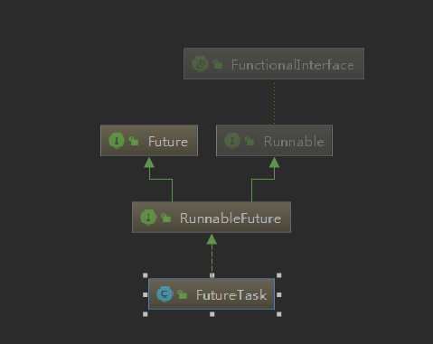
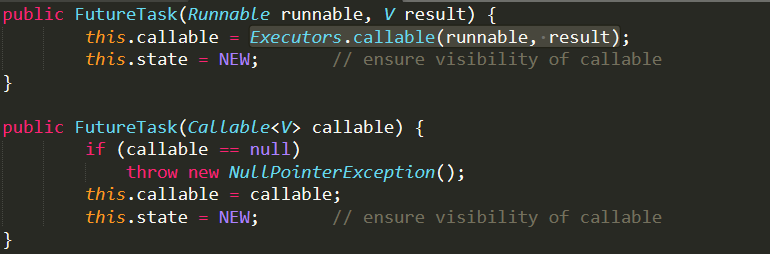

## 什么是Future、FutureTask
future在字面上表示未来的意思，在Java中一般通过继承Thread类或者实现Runnable接口这两种方式来创建多线程，但是这两种方式都有个缺陷，就是不能在执行完成后获取执行的结果。然而JDK提供了一种类似ajax的方式，允许提交任务后去做自己的事，在任务执行完成后可以获得执行的结果。总的来说就是实现"任务的提交"和"任务的执行"相分离。

```
@Test
    public void test2() throws ExecutionException, InterruptedException {
        FutureTask<String> futureTask = new FutureTask<>(() -> {
            TimeUnit.SECONDS.sleep(5);
            return "success";
        });
        futureTask.run();
        System.out.println("=====做自己想做的其他事情====");
        System.out.println(futureTask.get());
    }
```

### 线程池使用FutureTask获取结果

```java
@Test
public void test2(){
    ExecutorService es = Executors.newCachedThreadPool();
    List<Future<String>> futureList = Lists.newArrayList();
    for(int i = 0 ; i < 10 ; i++){
        Future<String> future = es.submit(new Callable<String>() {
            @Override
            public String call() throws Exception {
                return UUID.randomUUID().toString();
            }
        });
        futureList.add(future);
    }
    futureList.forEach(stringFuture -> {
        try {
            System.out.println(stringFuture.get());
        } catch (InterruptedException e) {
            e.printStackTrace();
        } catch (ExecutionException e) {
            e.printStackTrace();
        }
    });
}
```


### FutureTask的继承关系和常用方法

FutureTask继承关系,从继承关系上看，futureTask实现了Future接口和Runnable接口。所以FutureTask实现了表格上方法。



| 方法        | 说明                                                         |
| ----------- | ------------------------------------------------------------ |
| cancel      | 取消任务                                                     |
| isCancelled | 判断任务是否已取消                                           |
| isDone      | 判断任务是否已结束                                           |
| get         | 以阻塞方式获取任务执行结果，如果任务还没有执行完，调用get（），会被阻塞，直到任务执行完才会被唤醒 |
| run         | 线程执行的方法                                               |

## FutureTask源码解析

### FutureTask构造函数

FutureTask支持传入Runnable和Callable，但是Runable并不支持返回值。所以在FutureTask(Runnable runnable, V result)构造函数中使用了Executors.callable(runnable, result)方法采用适配器模式将Runnable转成Callable。



```java
public static <T> Callable<T> callable(Runnable task, T result) {
        if (task == null)
            throw new NullPointerException();
        return new RunnableAdapter<T>(task, result);
}
static final class RunnableAdapter<T> implements Callable<T> {
        final Runnable task;
        final T result;
        RunnableAdapter(Runnable task, T result) {
            this.task = task;
            this.result = result;
        }
        public T call() {
            task.run();
            return result;
        }
}
```

通过适配器模式将Runnable转成Callable。

### FutureTask的状态变量

```java
//表示当前task状态
private volatile int state;
//当前任务尚未执行
private static final int NEW          = 0;
//当前任务正在结束，稍微完全结束，一种临界状态
private static final int COMPLETING   = 1;
//当前任务正常结束
private static final int NORMAL       = 2;
//当前任务执行过程中发生了异常
private static final int EXCEPTIONAL  = 3;
//当前任务被取消
private static final int CANCELLED    = 4;
//当前任务中断中
private static final int INTERRUPTING = 5;
//当前任务已中断
private static final int INTERRUPTED  = 6;
//用来存储 "用户提供的有实在业务逻辑的" 任务
private Callable<V> callable;
//用来保存异步计算的结果。正常情况保存返回值，非正常情况保存异常
private Object outcome;
//当前任务被线程执行期间，保存当前执行任务的线程对象引用
private volatile Thread runner;
/**
futureTask.get是支持多个线程去调用的，这个变量主要是用来存储调用get方法线程的一个队列。当futureTask.run执行完成后会通过这个变量for循环去通知调用的线程结束阻塞
**/
private volatile WaitNode waiters;

```

### FutureTask主流程

```java
public void run() {
       //如果任务不是NEW状态（如果不是NEW就表示Task已经被执行过或者被取消了）
       //UNSAFE.compareAndSwapObject表示将当前执行run方法的线程通过CAS方式设置到runnerOffset变量
       //CAS的特性，如果runnerOffset = null 则将当前线程设置到runnerOffset,成功返回ture失败返回false
        if (state != NEW ||
            !UNSAFE.compareAndSwapObject(this, runnerOffset,
                                         null, Thread.currentThread()))
            return;
        try {
            //callable就是程序员自己写的逻辑
            Callable<V> c = callable;
            //c!=null 防止程序员没写自己的逻辑
            //为什么又判断了一次? 防止期间有外部任务执行了cancel掉了当前任务
            if (c != null && state == NEW) {
                V result;
                boolean ran;
                try {
                    //执行任务
                    result = c.call();
                    ran = true;
                } catch (Throwable ex) {
                    result = null;
                    ran = false;
                    //设置失败
                    setException(ex);
                }
                if (ran)
                    //任务执行正常，设置结果
                    set(result);
            }
        } finally {
            // runner must be non-null until state is settled to
            // prevent concurrent calls to run()
            runner = null;
            // state must be re-read after nulling runner to prevent
            // leaked interrupts
            int s = state;
            //判断当前线程是不是中断中
            if (s >= INTERRUPTING)
                //如果是中断中就执行中断
                handlePossibleCancellationInterrupt(s);
        }
    }
```

FutureTask#set()设置执行结果函数

```java
    protected void set(V v) {
        //使用CAS，判断当前状态是不是NEW，如果是就设置成COMPLETING。通过CAS保证了只有一个线程
        //去设置结果
        if (UNSAFE.compareAndSwapInt(this, stateOffset, NEW, COMPLETING)) {
            //将结果设置给outcome
            outcome = v;
            //将结果设置给outcome后，马上将状态设置成NORMAL
            //putOrderedInt表示设置值 并且马上写入主存
            UNSAFE.putOrderedInt(this, stateOffset, NORMAL); // final state
            //TODO
            finishCompletion();
        }
    }
```

### FutureTask#get方法

一定不要以为get方法就只有一个线程在获取，可能会有多个。所以有了WaitNodes这个变量。

```java
static final class WaitNode {
    volatile Thread thread;
    volatile WaitNode next;
    WaitNode() { thread = Thread.currentThread(); }
}
```

```java


public V get() throws InterruptedException, ExecutionException {
    //获取当前任务状态
    int s = state;
    //如果小于COMPLETING代表是未执行，正在执行，正完成等情况，则会调用awaitDone进行阻塞
    if (s <= COMPLETING)
        s = awaitDone(false, 0L);
    return report(s);
}
//最核心方法，get是如何阻塞的 -- 解析不带超时的情况
private int awaitDone(boolean timed, long nanos)
    throws InterruptedException {
    final long deadline = timed ? System.nanoTime() + nanos : 0L;
    //引用当前线程封装成WaitNode对象
    WaitNode q = null;
    //表示当前线程WaitNode对象有没有入队
    boolean queued = false;
    //自旋
    for (;;) {
        //假设被唤醒了，就再次自旋
        //这里如果为ture，说明当前线程唤醒 是被其他线程使用中断这种方式唤醒的
        if (Thread.interrupted()) {
            //当前线程node出队
            removeWaiter(q);
            //抛出中断异常
            throw new InterruptedException();
        }
        int s = state;
        //被正常unpark唤醒的情况下，判断当前任务状态，如果大于COMPLETING
        //说明当前任务已经有结果了
        if (s > COMPLETING) {
            if (q != null)
                q.thread = null;
            //返回状态
            return s;
        }
        else if (s == COMPLETING) // cannot time out yet
            Thread.yield();
        else if (q == null) //第一次自旋应该是先到这里来初始化创建WaitNode对象
            q = new WaitNode();
        else if (!queued){ //第二次自旋，当前WaitNode已经创建，但node对象还没有入队
            //下面代码可以拆成两行
            //q.next = waiters #将当前线程的next指向头节点
            //queued = UNSAFE.compareAndSwapObject(this, waitersOffset, waiters, q);
            //# CAS方式设置waiters指向当前线程node,如果失败表示其他线程先行入队了，如果失败就再次自旋	
            queued = UNSAFE.compareAndSwapObject(this, waitersOffset,
                                                 q.next = waiters, q);
        }else if (timed) {
            nanos = deadline - System.nanoTime();
            if (nanos <= 0L) {
                removeWaiter(q);
                return state;
            }
            LockSupport.parkNanos(this, nanos);
        }
        else
            //第三次自旋就是阻塞了
            LockSupport.park(this);
           //这里需要注意的是，被唤醒后会继续自旋
    }
}

//这个方法就是返回结果或者抛出异常了
private V report(int s) throws ExecutionException {
    Object x = outcome;
    //如果是正常完成，则返回结果
    if (s == NORMAL)
        return (V)x;
    //如果是异常就抛出异常
    if (s >= CANCELLED)
        throw new CancellationException();
    throw new ExecutionException((Throwable)x);
}
```

总结一下，get方法就是做了两步操作，第一步就是将当前get线程封装成WaitNode入队，然后并调用LockSupport.park(this)进行阻塞。(这里为啥要用WaitNode呢？因为后面唤醒时需要run线程遍历队列进行唤醒)。

### FutureTask#finishCompletion方法

从上面代码分析，我们知道调用get方法的线程被LockSupport.park阻塞了，并将线程存到了WaitNode。所以当run执行成功后需要唤醒。

```java
private void finishCompletion() {
    // assert state > COMPLETING;
    for (WaitNode q; (q = waiters) != null;) {
        if (UNSAFE.compareAndSwapObject(this, waitersOffset, q, null)) {
            for (;;) {
                Thread t = q.thread;
                if (t != null) {
                    q.thread = null;
                    //唤醒线程
                    LockSupport.unpark(t);
                }
                WaitNode next = q.next;
                if (next == null)
                    break;
                q.next = null; // unlink to help gc
                q = next;
            }
            break;
        }
    }
    done();
    callable = null;        // to reduce footprint
}
```

