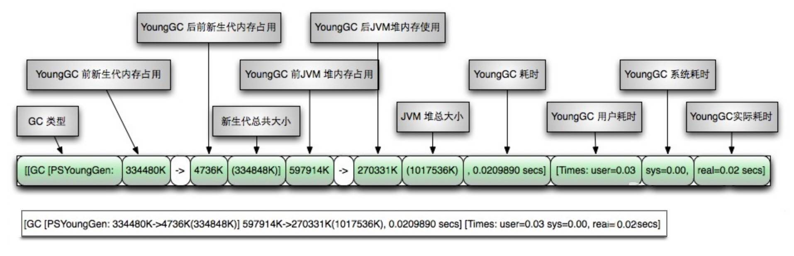
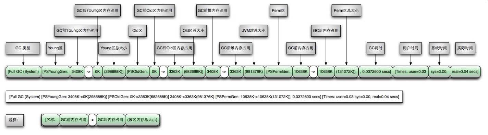
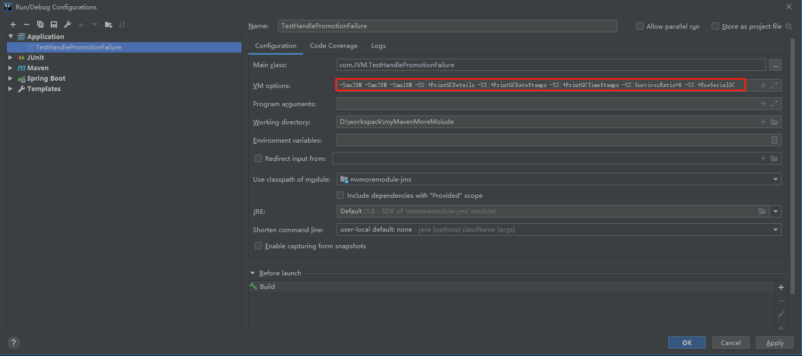
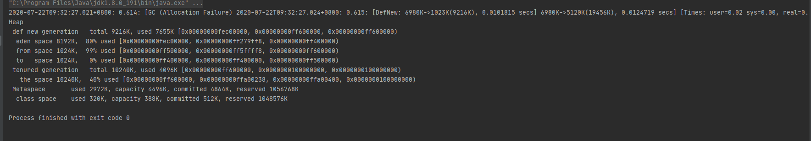

## GC日志相关参数

| 参数                   | 详细介绍                                                     |
| ---------------------- | ------------------------------------------------------------ |
| -XX:+PrintGCDetails    | 输出GC的详细日志                                             |
| -XX:+PrintGCTimeStamps | 输出GC的时间戳（以基准时间的形式）                           |
| -XX:+PrintGCDateStamps | 输出GC的时间戳（以日期的形式，如 2013-05-04T21:53:59.234+0800） |
| -XX:+PrintHeapAtGC     | 在进行GC的前后打印出堆的信息                                 |
| -Xloggc:D:/gc.log      | 日志文件的输出路径                                           |
| -XX:+PrintGC           | 输出GC日志                                                   |

## YGC日志详解

### 参数配置

```properties
-XX:+PrintGCDetails -XX:+PrintGCDateStamps
```

发生GC后输出参数如下

```
2019-04-18T14:52:06.790+0800: 2.653: [GC (Allocation Failure) [PSYoungGen: 33280K->5113K(38400K)] 33280K->5848K(125952K), 0.0095764 secs] [Times: user=0.00 sys=0.00, real=0.01 secs]
```



### 日志详解

```
2019-04-18T14:52:06.790+0800（当前时间戳）: 2.653（应用启动基准时间）: [GC (Allocation Failure) [PSYoungGen（表示Young GC）: 33280K（年轻代回收前大小）->5113K（年轻代回收后大小）(38400K（年轻代总大小）)] 33280K（整个堆回收前大小）->5848K（整个堆回收后大小）(125952K（堆总大小）), 0.0095764（耗时） secs] [Times: user=0.00（用户耗时） sys=0.00（系统耗时）, real=0.01（实际耗时） secs]

```

## FGC日志详解
### 参数配置
```properties
-XX:+PrintGCDetails -XX:+PrintGCDateStamps
```
发生GC后输出参数如下
```
2019-04-18T14:52:15.359+0800: 11.222: [Full GC (Metadata GC Threshold) [PSYoungGen: 6129K->0K(143360K)] [ParOldGen: 13088K->13236K(55808K)] 19218K->13236K(199168K), [Metaspace: 20856K->20856K(1069056K)], 0.1216713 secs] [Times: user=0.44 sys=0.02, real=0.12 secs]
```


### 日志详解
```
2019-04-18T14:52:15.359+0800（当前时间戳）: 11.222（应用启动基准时间）: [Full GC (Metadata GC Threshold) [PSYoungGen: 6129K（年轻代回收前大小）->0K（年轻代回收后大小）(143360K（年轻代总大小）)] [ParOldGen: 13088K（老年代回收前大小）->13236K（老年代回收后大小）(55808K（老年代总大小）)] 19218K（整个堆回收前大小）->13236K（整个堆回收后大小）(199168K（堆总大小）), [Metaspace: 20856K（持久代回收前大小）->20856K（持久代回收后大小）(1069056K（持久代总大小）)], 0.1216713（耗时） secs] [Times: user=0.44（用户耗时） sys=0.02（系统耗时）, real=0.12（实际耗时） secs]
```
## 代码如何查看GC日志
### 代码
```java
public class TestHandlePromotionFailure {
    private static final int _1M = 1024 * 1024;
    /***
     * -Xms20M -Xmx20M -Xmn10M -XX:+PrintGCDetails -XX:+PrintGCDateStamps -XX:+PrintGCTimeStamps -XX:SurvivorRatio=8 -XX:+UseSerialGC
     * -Xms20M -Xmx20M -Xmn10M -XX:+PrintGCDetails -XX:SurvivorRatio=8 -XX:+UseParallelGC
     * -Xms20M -Xmx20M -Xmn10M -XX:+PrintGCDetails -XX:SurvivorRatio=8 -XX:+UseParNewGC -XX:+UseConcMarkSweepGC
     * @param args
     */
    public static void main(String[] args){
        byte[] a1,a2,a3,a4;
        a1 = new byte[2 * _1M];
        a2 = new byte[2 * _1M];
        a3 = new byte[2 * _1M];
        a4 = new byte[4 * _1M];
    }
}
```

### 在IDEA配置GC日志参数

### 输出结果

