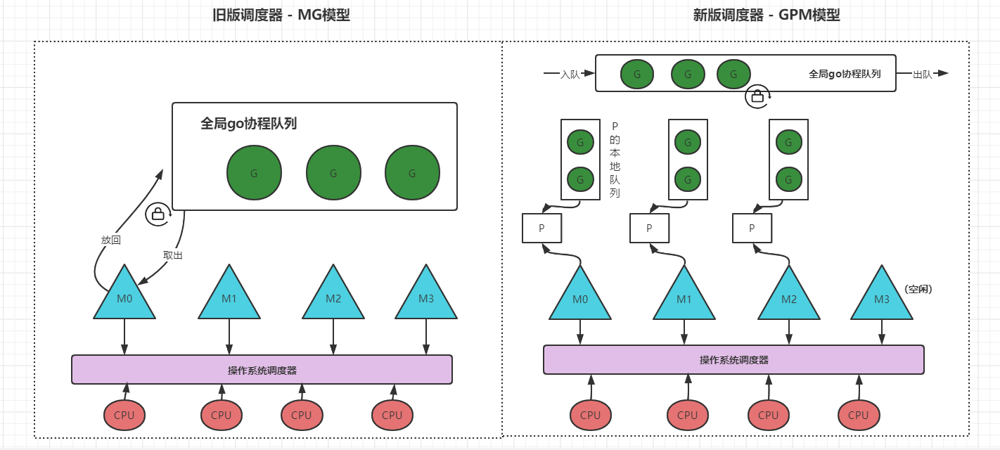

### goroutine调度机制之GMP模型

<!--more-->

goroutine的GMP调度模型主要有如下三个对象 ：

- G代表一个goroutine对象，由关键字go创建。
- M代表一个内核线程，所有的G任务，最终还是在M上执行。
- P代表一个处理器，每一个运行的M都必须绑定一个P，就像线程必须在么一个CPU核上执行一样。每个P都有一个P的本地队列用来存储G。

#### 

#### 旧版调度器

旧版调度器执行过程 ： M想要执行、放回G都必须访问全局G队列，并且M有多个，即多线程访问同一资源需要加锁进行保证互斥/同步，所以全局G队列是有互斥锁进行保护的。旧版调度器有缺点由于是全局队列，所以每个M获取goroutine时都需要加锁，造成激烈的锁竞争。

#### 新版GPM调度器

新版调度器中加入了P执行器，每个P都有自己的本地队列，同时也保留了全局goroutine队列。

- M绑定P获取**P的本地队列**的G来执行，若P本地队列为空，M则尝试从全局goroutine队列中获取，若全局队列为空，则获取其他P的本地队列的G放到自己队列中来执行。
- Goroutine调度器和OS调度器是通过M结合起来的，每个M都代表了1个内核线程，OS调度器负责把内核线程分配到CPU的核上执行。
- P的数量由runtime.GOMAXPROCS()决定。M的数量不确定，当一个M执行G时阻塞时，P就会去创建另外一个M或者获取空闲的M执行。

新版GMP调度器有如下的优势和特点 :

- work stealing机制，当M没有可运行的G时，不会销毁线程，而是会去全局队列或者其他P的本地队列上获取。
- 调度器实现了抢占式调度。也就是说如果一个G执行太久，是会被切换出去的。

### 参考

- https://studygolang.com/articles/18489?fr=sidebar
