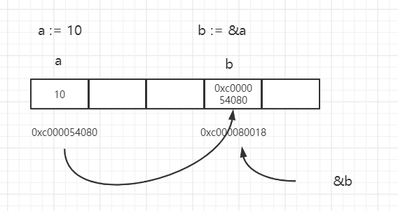
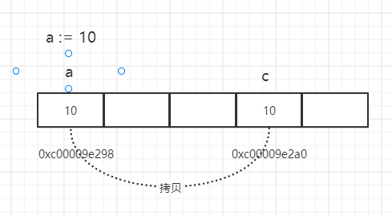
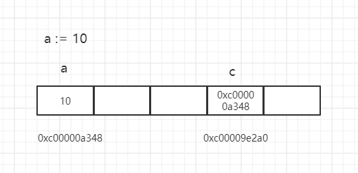

<!--more-->

### 什么是指针，指针变量，指针类型？

任何程序数据载入内存后，在内存中都有他们的地址，这个就是**指针**。

为了保存一个数据在内存中的地址，需要**指针变量**。

Go语言中的值类型(int、float、bool、string、array、struct)都有对应的指针类型，如：`*int`、`*int64`、`*string`等。所以指针类型里面存放的值就是指针，也就是地址。

下面看个列子，图文结合的理解一下。

```go
func main(){
    a := 10
    b := &a
    fmt.Printf("a:%d ptr:%p\n", a , &a)
    fmt.Printf("b:%p type:%T\n", b, b)
    fmt.Println(&b)
    // 结果
    // a:10 ptr:0xc000054080
    // b:0xc000054080 type:*int
    // 0xc000080018
}
```



如上图，把内存区域理解成上面的一个一个连续的小方格。方格里面是用来存储数据的。每个方格都是一个物理地址。

- 当执行 `a := 10` 时，数值10被存放到了物理地址为`0xc00054080`的方格上。变量a引用了这个方格，所以我们程序访问a时就能定位到这个方格，由于变量a里面存的是10这个数值，所以他是一个数值类型的变量。
- 当执行`b := &a`时，因为在go语言中，`&a`表示的意思是取变量a指向的物理地址（也就是存储10对应的物理地址）。所以执行这条代码时会在内存的其他方格，假设在`0xc00080018`这个方格上，就会存储&a,也就是`0xc00054080`这个数据。我之所以称它为`这个数据`，是因为他不是我们平常经常存的数值类型，布尔类型等，他就是一个物理地址，所以我们称他是一个`指针类型`。而b就表示是一个`指针变量`。
- 因为上面我们说过go语言中&表示取变量指向的物理地址。所以&b的值就是`0cx00080018`这个物理地址了。

### golang中的值传递和引用传递

先来看看两者的概念 :

- 值传递 ： 方法调用时，传递的参数是按值的拷贝传递，传递的是值的拷贝，也就是说传递后就互不相关了。
- 引用传递： 方法调用时传递的引用的地址，也就是变量所对应的内存空间的地址。

#### 例子1

```go
func TestOther1(t *testing.T) {
	var a int64 = 10
	fmt.Printf("变量a对应的地址 %p\n", &a)
	modifiedNumber(a)
	fmt.Printf("最终a的值 %d", a)
}
func modifiedNumber(c int64) {
	fmt.Printf("变量c对应的地址 %p\n", &c)
	c = 100
}
//变量a对应的地址 0xc00009e298
//变量c对应的地址 0xc00009e2a0
//最终a的值 10
```



看图分析 ，基本类型例如int64等类型采用的是`值传递`，也就是说变量c复制了变量a存储在方格`0xc0009e298`里面的值10，然后存到了另外一个方格`0xc0009e2a0`。那变量c值的变化不影响变量a。

#### 例子2

```go
func TestOther2(t *testing.T) {
	var a int64 = 10
	fmt.Printf("变量a对应的地址 %p", &a)
	fmt.Println()
	modifiedNumber2(&a) // args就是实际参数
	fmt.Printf("最终a的值 %d", a)
	fmt.Println()
}
func modifiedNumber2(c *int64) { //这里定义的args就是形式参数
	fmt.Printf("变量c存储的值 %v" , c)
	fmt.Println()
	*c = 100
}
//变量a对应的地址 0xc00000a348
//变量c存储的值 0xc00000a348
//最终a的值 100
```



如图所示，c是一个指针类型，c存放的是a的物理地址`0xc00000a348`。当执行`*c = 100`时候，*c在go中代表c变量中存储的物理地址`0xc00000a348`对应的方格它存的值。所以当 *c =100时，就会更改`0xc000003a68`这个物理地址里面存的数，所以变量a的值最终变成了100。所以对于指针类型来说，它也是值传递，它拷贝了一份变量a对应的物理地址。本身变量c是一个指针类型，它存物理地址没毛病。所以总的来说，指针类型也是通过值传递的。

总结 ： golang中形参实参传递都是用的值传递。