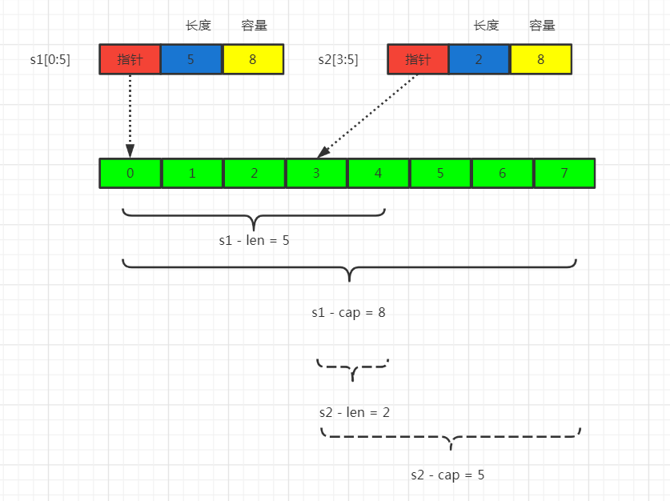
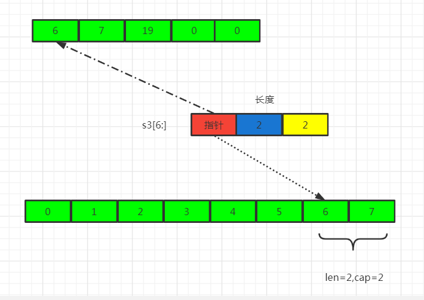
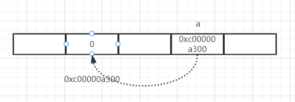
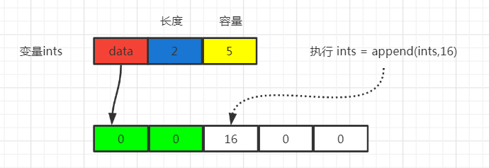
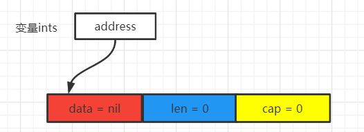

### 什么时候用指针？

- 不要对 map、slice、channel 这类引用类型使用指针；
- 如果需要修改方法接收者内部的数据或者状态时，需要使用指针；
- 如果需要修改参数的值或者内部数据时，也需要使用指针类型的参数；
- 如果是比较大的结构体，每次参数传递或者调用方法都要内存拷贝，内存占用多，这时候可以考虑使用指针；
- 像 int、bool 这样的小数据类型没必要使用指针；
- 如果需要并发安全，则尽可能地不要使用指针，使用指针一定要保证并发安全；
- 指针最好不要嵌套，也就是不要使用一个指向指针的指针，虽然 Go 语言允许这么做，但是这会使你的代码变得异常复杂。

### slice切片类型结构

```go
type Slice struct {
	Data unsafe.Pointer	 // 指向底层数组的指针
	Len  int			 // 切片的已存储的长度
	Cap  int			 // 切片的容量
}
```



```go
func TestSlice(t *testing.T) {
	a := [8]int{0, 1, 2, 3, 4, 5, 6, 7}
	s1 := a[0:5]
	fmt.Printf("切片的len = %d, cap = %d \n", len(s1) , cap(s1))
    s2 := a[3:5]
	fmt.Printf("切片的len = %d, cap = %d \n", len(s2) , cap(s2))
    s1 = append(s1,16)
	fmt.Println(a)
}
//打印结果
//切片的len = 5, cap = 8 
//切片的len = 2, cap = 5 
//[0 1 2 3 4 16 6 7]
```

切片的本质就是对底层数组的封装，它包含了三个信息：底层数组的指针、切片的长度（len）和切片的容量（cap）。如图

- s1字段中`Data unsafe.Pointer`记录了数组a的下标为0的地址。s1字段中`Data unsafe.Pointer`记录了数组a的下标为3的地址。
- 切片的长度是`左闭右开`的，容量是从指向的起始位置开始算，例如s1指向是下标0，按照容量是数组剩余大小的话，cap = 8， 同理s2的cap = 5。
- s1 = append(s1,16)执行时，因为切片会操作原来的数组，所以这时候打印数组a时，数组a下标为6的值会变成16。

上面我们说s1 = append(s1,16)时，s1会操作底层的数组。下面还有一种情况并不会修改到底层数组，我们具体来看个图。



```go
func TestSlice(t *testing.T) {
    a := [8]int{0, 1, 2, 3, 4, 5, 6, 7}
	s3 := a[6:]
    s3 = append(s3,19)
    fmt.println(a)
}
// 打印结果 ： [0 1 2 3 4 5 6 7]
```

上面执行s3 = append(s3,19)后，数组并没有我们想象中的发生改变，原因是此时s3的容量=长度，如果append增加元素时需要扩容，而扩容就会导致s3指向新的数组。

### make和new的区别

new 是 Golang 的内建函数，用于分配内存和初始化默认值。

```go
func new(Type) *Type
```

几个重要的点 : 

- 传入的是一个类型。
- 返回的是一个指针类型。
- 其值会被分配成初始值。

```go
func TestNew(t *testing.T) {
	a := new(int64)
	fmt.Printf("指针变量a的类型: %T  指针变量a指向的值: %v 指针变量a的值: %v \n", a, *a, a)
    // 指针变量a的类型: *int64  指针变量a指向的值: 0 指针变量a的值: 0xc00000a300 
}
```



如图所示，new出来的是一个指针类型，指向了初始化的值对应的物理地址。

make是Golang的内建函数，**只用于slice,map,channel**的内存分配和初始化。

```go
func make(t Type, size ...IntegerType) Type
```

可以看到，返回的是一个类型，而不是指针类型。

### new和make初始化切片例子详解

下面通过一个例子具体来看下make和new初始化切片的情况。

假设有如下代码，此时我只是证明了一个int类型的切片，那么此时这个切片结构的data = nil , len = 0 , cap = 0.

```go
var ints []int		#声明一个切片类型
```

当我们使用make函数为其分配内存时

```go
ints := make([]int , 2 ,5)
ints = append(ints, 16)
```

此时make会帮我们**开辟这个切片的底层数组**，且存储两个元素，如下图，绿色表示已经存储了两个元素。当继续执行append时，就会在第三个方格中继续存入。



如果是使用new分配的话，我们再来看一下，还是上面的代码

```go
ints := new([]int)
(*ints)[0] = 1		// 此时这一句会报错
*ints = append(*ints , 1)
fmt.Println(*ints)
```

由于new只是分配内存和初始化0值，并不会像make那样为其分配内存。所以此时ints是一个指针类型，指向了切片这个结构，且这个切片的data = nil , len = 0 , cap = 0 。



当用new初始化后执行`(*ints)[0] = 1`是会报错的，因为此时data还没有指向数组。如果要分配数组，我们可以用append方法，这个方法是可以帮我们自动创建底层数组的。所以执行`*ints = append(*ints , 1)`是可以行得通的。

### slice切片的扩容

append是如果容量不够，slice会自动扩容。扩容的原理其实是新建一个底层数组，先将之前数组的元素复制过来，再将新元素追加到后面，然后返回新的 slice，底层数组改变。

```go
func TestSlice(t *testing.T) {
	ints := []int{1,2}
	fmt.Printf("切片ints len = %d , cap = %d \n" , len(ints) , cap(ints))
	ints = append(ints,3,4,5)
	fmt.Printf("切片ints len = %d , cap = %d \n" , len(ints) , cap(ints))
}
//切片ints len = 2 , cap = 2 
//切片ints len = 5 , cap = 6
```

slice的扩容预估规则是怎么样的呢，我们假设原来的容量为oldCap，最小容量为cap。例如上面的代码，刚开始oldCap=2，append()后要求最小容量是5，即cap = 5。

- 如果 oldCap * 2 < cap ，即假设我把原来的容量扩容2倍后小于所需最小容量，则将newCap = cap。
- 否则在细分
  - oldLen < 1024   则  newCap = cap
  - oldLen >= 1024 则 扩容1/4 ， 即 newCap = oldCap * 1.25