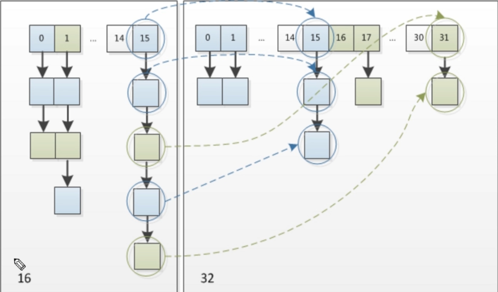

## 基础
### 数组的优点缺点
- 数组在内存空间上连续。能实现快速访问某个下标的值。
- 数组空间的大小一旦确定后就不能更改，如果需要增大减小需要新建数组重新设值。

### 链表的优点缺点

- 链表在内存空间上是不连续的。插入删除某个值速度快
- 链表不能随机查找，必须从第一个开始遍历，查找效率低

### HashMap散列表结构

HashMap采用了散列表结构，结合了数组和链表的优点。


<!--more-->
### 什么是哈希？

Hash也称之为散列。基本原理是把<font color=red>任意长度</font>的输入，通过Hash算法变成<font color=red>固定长度</font>的输出。这个映射的规则就是对应的<font color=red>Hash算法</font>，而原始数据映射后的<font color=red>二进制串</font>就是哈希值。

Hash的特点

- 从hash值不可以反向推导出原始的数据
- 输入数据的微小变化会得到完全不同的hash值，相同的数据会得到相同的值
- 哈希算法的执行效率要高效，长本文也能快速的计算出哈希值
- hash算法的冲突概率要小

由于hash的原理是将输入空间的值映射到hash空间中，而hash值的控件远小于输入的空间。根据抽屉原理，一定会存在不同的输入被映射成相同输出的情况。

## HashMap原理讲解
### HahMap的继承体系

HashMap实现了Map接口，Cloneable接口，Serializable接口


### Node数据结构分析

HashMap的Node结构是一个单链表结构。Hash发生碰撞时，此时元素没法放在同一个数组下标，就会将相同hash的Node组成一个单链表。

```java
static class Node<K,V> implements Map.Entry<K,V> {
    final int hash; //这个hash是通过获取key的hashCode然后经过"扰动"后的结果
    final K key;
    V value;
    Node<K,V> next;

    Node(int hash, K key, V value, Node<K,V> next) {
        this.hash = hash;
        this.key = key;
        this.value = value;
        this.next = next;
    }

    public final int hashCode() {
        return Objects.hashCode(key) ^ Objects.hashCode(value);
    }
}
```

### 底层存储结构介绍

底层存储结构是<font color=red>数组+单链表+红黑树</font>的结构。

什么情况下链表会转化成红黑树?<font color=red>当单链表长度达到8，且数组的长度大于64时</font>


### put方法原理分析


### JDK8为什么引入红黑树

由于hash碰撞的原因，可能导致同一个数组下标下的单链表长度很长时，查询效率变低。这时候将链表转成红黑树来保证查询的效率。

## Hash重要源码分析

### HashMap核心属性分析

```java
//缺省数组大小,默认16
static final int DEFAULT_INITIAL_CAPACITY = 1 << 4; // aka 16
//数组最大大小
static final int MAXIMUM_CAPACITY = 1 << 30;
//缺省负载因子
static final float DEFAULT_LOAD_FACTOR = 0.75f;
//树化阈值
static final int TREEIFY_THRESHOLD = 8;
//树降级为链表的阈值
static final int UNTREEIFY_THRESHOLD = 6;
//待定
static final int MIN_TREEIFY_CAPACITY = 64;
//hash表
transient Node<K,V>[] table;
//当前hash表中元素个数
transient int size;
//当前hash表结构的修改次数
transient int modCount;
//扩容阈值，当你的哈希表中的元素超过阈值时，触发扩容
int threshold;
//负载因子, threshold = capacity(数组长度) * loadFactor
final float loadFactor;
```

### 构造方法分析

```java

public HashMap() {
    this.loadFactor = DEFAULT_LOAD_FACTOR; // all other fields defaulted
}

public HashMap(int initialCapacity) {
    this(initialCapacity, DEFAULT_LOAD_FACTOR);
}

public HashMap(int initialCapacity, float loadFactor) {
    //数组长度不能小于0
    if (initialCapacity < 0)
        throw new IllegalArgumentException("Illegal initial capacity: " +
                                           initialCapacity);
    //数组长度不能大于最大值
    if (initialCapacity > MAXIMUM_CAPACITY)
        initialCapacity = MAXIMUM_CAPACITY;
    //负载因子不能小于0
    if (loadFactor <= 0 || Float.isNaN(loadFactor))
        throw new IllegalArgumentException("Illegal load factor: " +
                                           loadFactor);
    //初始化负载因子
    this.loadFactor = loadFactor;
    //传入数组大小 计算扩容阈值 
    //这里初始化的threshold也是第一次初始化HashMap的初始长度
    this.threshold = tableSizeFor(initialCapacity);
}

//由于我们传入的initialCapacity是随机的，但是Hashmap要求数组的长度必须是2的次方，所以通过此函数进行转换
//作用 : 返回一个大于等于当前cap的数字，且这个数字是2的次方数
static final int tableSizeFor(int cap) {
        int n = cap - 1; 
        n |= n >>> 1; 
        n |= n >>> 2; 
        n |= n >>> 4; 
        n |= n >>> 8; 
        n |= n >>> 16;
        return (n < 0) ? 1 : (n >= MAXIMUM_CAPACITY) ? MAXIMUM_CAPACITY : n + 1;
}
```

### put方法分析

```java
public V put(K key, V value) {
        return putVal(hash(key), key, value, false, true);
}
```

```java
//hash扰动函数，使hash更加散列
//作用:让key的hash值的高16位也参与运算
static final int hash(Object key) {
        int h;
        return (key == null) ? 0 : (h = key.hashCode()) ^ (h >>> 16);
}
```

```java

final V putVal(int hash, K key, V value, boolean onlyIfAbsent,
                   boolean evict) {
    	//tab -- 当前hashMap的散列表
    	//p -- 当前散列表的元素
    	//n -- 表示散列表数组的长度， i -- 表示路由寻址结果
        Node<K,V>[] tab; Node<K,V> p; int n, i;
    	//当散列表==null时调用resize方法进行初始化
    	//这里hashMap是延迟初始化
        if ((tab = table) == null || (n = tab.length) == 0)
            n = (tab = resize()).length;
    
    	// (n - 1) & hash 是路由算法
    	// 最简单的一种情况，寻址找到的桶位刚好是null,这个时候直接newNode
        if ((p = tab[i = (n - 1) & hash]) == null)
            tab[i] = newNode(hash, key, value, null);
        else {
            //e -- node临时元素，k -- 表示临时的一个key
            Node<K,V> e; K k;
            //p表示桶上第一个元素
            //表示桶位中的该元素与你当前插入的元素的key完全一致，就用e = p,后续做替换操作
            //这里需要注意的是判断你是否一致使用equal方法,所以hashMap判断会用到equal方法，那么我们重写时要注意
            if (p.hash == hash && ((k = p.key) == key || (key != null && key.equals(k))))
                e = p;
            
            //如果这个p已经是红黑树了，那用红黑树的方法
            else if (p instanceof TreeNode)
                e = ((TreeNode<K,V>)p).putTreeVal(this, tab, hash, key, value);
            
            else {
                //到这一步，表示现在桶上是一个链表，那么接下去要for链表看看上面有没有跟你一致的key，如果有做替换。
                //当前链表的情况是链表的头元素与我们插入的key不一致，要接下去判断链表上其他元素的key是否一致
                for (int binCount = 0; ; ++binCount) {
                    //到这一步表示到了链表的末尾了还是没有一致的
                    if ((e = p.next) == null) {
                        //把key-value加到最后一个元素上
                        p.next = newNode(hash, key, value, null);
                        //这里判断是否进行树化，链表的长度>=8就转成红黑树
                        if (binCount >= TREEIFY_THRESHOLD - 1) // -1 for 1st
                            treeifyBin(tab, hash);
                        break;
                    }
                    //找到了链表上一个元素与要出入的元素的key一致
                    if (e.hash == hash && ((k = e.key) == key || (key != null && key.equals(k))))
                        break;
                    p = e;
                }
            }
            
            //进行value的替换
            if (e != null) { // existing mapping for key
                V oldValue = e.value;
                if (!onlyIfAbsent || oldValue == null)
                    e.value = value;
                afterNodeAccess(e);
                return oldValue;
            }
        }
        ++modCount; //记录操作次次数
    	//如果全部元素 > 扩容阈值 的话 就进行扩容
        if (++size > threshold)
            resize();
        afterNodeInsertion(evict);
        return null;
}
```

### 扩容方法分析



从图可以看出，<font color=red>同一个桶上的元素扩容后要嘛在原来15的位置，要嘛在31的位置</font>。

这里根据路由寻址函数【hash & (table.length - 1)】，可以分析出<font color=red>扩容后元素的去向有两种，一种还是原来的下标，另外一种是原来下标+扩容之前数组的长度</font>

例如上面这个例子，原来数组长度是16， 对于下标为15的元素，他扩容后的去向要嘛是15，要嘛是31（15 + 16）。

```java
//扩容方法，为了解决哈希冲突导致链化影响查询效率，扩容解决该方法
final Node<K,V>[] resize() {
    //oldTab -- 扩容之前的哈希表
    Node<K,V>[] oldTab = table;
    //oldCap -- 扩容之前哈希表的长度
    int oldCap = (oldTab == null) ? 0 : oldTab.length;
    //oldThr -- 表示扩容之前的阈值，触发本次扩容的阈值
    int oldThr = threshold;
    //newCap -- 扩容之后哈希表的长度
    //newThr -- 扩容之后下次触发扩容的条件
    int newCap, newThr = 0;
    
    //===================这一段就是用来算newCap，newThr=============================
    //条件如果成立，表示散列表已经初始化过了，这次是一次正常扩容
    if (oldCap > 0) {
        //如果当前的哈希表数组长度已经到最大长度了，那就不能在扩容了,且设置扩容条件为int最大值
        if (oldCap >= MAXIMUM_CAPACITY) {
            threshold = Integer.MAX_VALUE;
            return oldTab;
        }
        //newCap = oldCap << 1 表示我要把数组扩大一倍
        //新的数组的长度小于最大值限制 且 扩容之前哈希表的长度 >= 16 就设置新的扩容阈值，否则不设置
        else if ((newCap = oldCap << 1) < MAXIMUM_CAPACITY && oldCap >= DEFAULT_INITIAL_CAPACITY)
            newThr = oldThr << 1;
    }
    //oldCap = 0 , 说明hashmap的散列表还没初始化，走到下面这一步一般是通过new HashMap(15)这样初始化的。这种初始化只有设置了扩容阈值
    //这里oldThr是旧的扩容阈值，这里别以为扩容阈值我们在new hashmap的时候就设置值了，其实如果是不带参数的new HashMap时候，这个扩容阈值是等于0，如果扩容值已经有了，那就设定要初始化的数组的大小为旧的扩容阈值
    else if (oldThr > 0)
        newCap = oldThr;
    else {
        //oldThr = 0 的时候，默认要初始化的数组的大小为16，然后下一次的扩容阈值是 16 * 0.75
        //进来这里，一般是通过new HashMap()，没带任何参数创建的时候
        newCap = DEFAULT_INITIAL_CAPACITY;
        newThr = (int)(DEFAULT_LOAD_FACTOR * DEFAULT_INITIAL_CAPACITY);
    }
    //newThr == 0,通过newCap 和 loadFactor计算出一个newThr
    if (newThr == 0) {
        float ft = (float)newCap * loadFactor;
        newThr = (newCap < MAXIMUM_CAPACITY && ft < (float)MAXIMUM_CAPACITY ?
                  (int)ft : Integer.MAX_VALUE);
    }
    //==========================================================================
   
    threshold = newThr; //赋值新的扩容阈值
    // 初始化哈希表
    Node<K,V>[] newTab = (Node<K,V>[])new Node[newCap]; 
    table = newTab;
    //oldTab =! null 说明hashmap本次扩容之前，table不是null,说明是扩容而不是初始化
    if (oldTab != null) {
        //遍历扩容前的哈希数组
        for (int j = 0; j < oldCap; ++j) {
            //e -- 当前Node节点
            Node<K,V> e;
            // 这个条件满足，说明当前桶位上有数据，但是不清楚是单个数据、链表还是红黑树
            if ((e = oldTab[j]) != null) {
                oldTab[j] = null;
                //这个条件满足的话，表示桶位上只有一个元素
                if (e.next == null){
                    //根据路由寻址算法计算出新桶位并迁移元素
                    newTab[e.hash & (newCap - 1)] = e;
                }
                else if (e instanceof TreeNode){
                    //如果是红黑树，则按照红黑树的方式
                    ((TreeNode<K,V>)e).split(this, newTab, j, oldCap);
                }else {
                    //这个条件就是 桶位上是链表的情况
                    //低位链表:存放在扩容之后的数组的下标位置，与当前数组的下标位置一致
                    Node<K,V> loHead = null, loTail = null;
                    //高位链表:存放在扩容之后的数组的下标位置，为当前数组的下标位置 + 扩容之前数组的长度
                    Node<K,V> hiHead = null, hiTail = null;
                    Node<K,V> next;
                    
                    do {
                        next = e.next;
                        //下面这个(e.hash & oldCap) == 0 用来判断该元素扩容后是在高位链表还是低位链表
                        if ((e.hash & oldCap) == 0) {
                            if (loTail == null)
                                loHead = e;
                            else
                                loTail.next = e;
                            loTail = e;
                        }
                        else {
                            if (hiTail == null)
                                hiHead = e;
                            else
                                hiTail.next = e;
                            hiTail = e;
                        }
                    } while ((e = next) != null);
                    
                    //通过上面的赋值，如果低位有量就进行转移
                    if (loTail != null) {
                        loTail.next = null;
                        newTab[j] = loHead;
                    }
                     //通过上面的赋值，如果高位有量就进行转移
                    if (hiTail != null) {
                        hiTail.next = null;
                        newTab[j + oldCap] = hiHead;
                    }
                }
            }
        }
    }
    return newTab;
}
```

### get方法分析

```java
public V get(Object key) {
    Node<K,V> e;
    return (e = getNode(hash(key), key)) == null ? null : e.value;
}

final Node<K,V> getNode(int hash, Object key) {
    // tab : 引用当前hashMap的散列表
    //first : 桶位中的头元素
    //n : 数组的长度
    //e : 临时node元素
    Node<K,V>[] tab; Node<K,V> first, e; int n; K k;
    
    if ((tab = table) != null && (n = tab.length) > 0 && (first = tab[(n - 1) & hash]) != null) {
        //第一种情况:定位出来的第一个桶位元素是我们要的元素，就直接返回
        if (first.hash == hash && ((k = first.key) == key || (key != null && key.equals(k))))
            return first;
        //第二种情况:如果是链表或者红黑树的情况
        if ((e = first.next) != null) {
            if (first instanceof TreeNode)
                return ((TreeNode<K,V>)first).getTreeNode(hash, key);
            //下面for循环就是遍历链表获取要取的数据
            do {
                if (e.hash == hash && ((k = e.key) == key || (key != null && key.equals(k))) )
                    return e;
            } while ((e = e.next) != null);
        }
    }
    return null;
}
```

### remove方法分析

```java
public V remove(Object key) {
    Node<K,V> e;
    return (e = removeNode(hash(key), key, null, false, true)) == null ?
        null : e.value;
}

final Node<K,V> removeNode(int hash, Object key, Object value,
                           boolean matchValue, boolean movable) {
    //tab : 引用当前hashmap的散列表
    //p : 当前node元素
    //n : 散列表长度
    //index ：寻址的数组下标
    Node<K,V>[] tab; Node<K,V> p; int n, index;
    //下面就是判断并赋值各种情况，例如散列表已经初始化，桶位有值等
    if ((tab = table) != null && (n = tab.length) > 0 && (p = tab[index = (n - 1) & hash]) != null ) {
        //node : 用来记录查找到的的元素
        //e : 当前Node的下一个元素
        Node<K,V> node = null, e; K k; V v;
        //这种情况就是第一个元素就是要找的元素
        if (p.hash == hash && ((k = p.key) == key || (key != null && key.equals(k)))){
            node = p;
        }else if ((e = p.next) != null) {
            if (p instanceof TreeNode){
                //红黑的情况
                node = ((TreeNode<K,V>)p).getTreeNode(hash, key);
            }else {
                //链表的情况，就是遍历查找了
                do {
                    if (e.hash == hash && ((k = e.key) == key || (key != null && key.equals(k)))) {
                        node = e;
                        break;
                    }
                    p = e;
                } while ((e = e.next) != null);
            }
        }
        //下面就是对应的删除逻辑了
        if (node != null && (!matchValue || (v = node.value) == value ||
                             (value != null && value.equals(v)))) {
            if (node instanceof TreeNode)
                ((TreeNode<K,V>)node).removeTreeNode(this, tab, movable);
            else if (node == p)
                tab[index] = node.next;
            else
                p.next = node.next;
            ++modCount;
            --size;
            afterNodeRemoval(node);
            return node;
        }
    }
    return null;
}
```


## 总结

- 当单链表长度达到8，且数组的长度大于64时链表会转成红黑树
- HashMap的初始化是在第一次插入数据时初始化的，所以Hash是<font color=red>懒加载初始化</font>
- 如果是HashMap没带参数的初始化，那默认刚开始初始化的数组大小位16，且下次的扩容阈值是 16  * 0.75 = 12
- 每次扩容都是将数组的大小增加一倍，扩容的阈值也是增加一倍
- HashMap决定元素在哪个数组下标的路由寻址算法 : hash[<font color=red>扰动函数处理过的hash值</font>] & (table.length[<font color=red>一定是2的次方</font>] - 1) 
- 扩容后元素的去向有两种，一种还是原来的下标，另外一种是原来下标+扩容之前数组的长度

## HashMap灵魂拷问

### 如果两个对象hashCode相等，或者equals()方法相等会怎么样？

首先先来了解下hashCode和equals方法的关系，前提是没有重写的情况下。

- 如果两个对象equals相等，那么他们的hashCode一定相等。
- 如果两个对象equals不相等，那么hashCode有可能相等也有可能不相等。
- 如果两个对象hashCode不相等，那么equals一定不相等。

在HashMap中，如果两个对象的hashCode相等的话，那么他们在同一个槽内(发生碰撞)，这时候需要继续判断equals方法是否相等，如果相等做替换操作，如果不相等就插入链表尾部操作。

**扩展点 ：hashCode和 equals()的理解**

每个对象都有hashcode，对象的hashcode是怎么得到的呢？

首先一个对象肯定有物理地址，在别的博文中会hashcode说成是代表对象的地址，这里肯定会让读者形成误区，对象的物理地址跟这个hashcode地址不一样，**hashcode代表对象的地址说的是对象在hash表中的位置，物理地址说的对象存放在内存中的地址**，那么对象如何得到hashcode呢？

通过对象的内部地址(也就是物理地址)转换成一个整数，然后该整数通过hash函数的算法就得到了hashcode。**所以，hashcode是什么呢？就是在hash表中对应的位置。这里如果还不是很清楚的话，举个例子，hash表中有 hashcode为1、hashcode为2、(…)3、4、5、6、7、8这样八个位置，有一个对象A，A的物理地址转换为一个整数17(这是假如)，就通过直接取余算法，17%8=1，那么A的hashcode就为1，且A就在hash表中1的位置。**

**为什么要有hashcode呢？** 主要是为了查找更快，例如我们需要比较对象是否相等，假设我们有1000个对象，那我要比较是否相等的话需要通过物理地址跟999个对象的物理地址进行比较。那如果有hashCode，假设对象A的物理地址转成整数再通过hash函数落到了hashcode1这个槽上，对象B，E，G也是，那我只要将A跟B，E，G比较就行了。

所以我们就不难理解上面hashCode和equals的关系了。先通过hashCode比较，在通过equals（物理地址）比较。

### HashMap中定位元素在哪个槽下(路由寻址)的操作是什么，为什么？

```java
(h = key.hashCode()) ^ (h >>> 16)
```

在JDK1.8中是通过hashCode()的高16位异或低16位实现的。目的是让高16位参与运算，从而使hash更散列，减少碰撞。

**为什么要用异或操作？**保证了对象的 hashCode 的 32 位值只要有一位发生改变，整个 hash() 返回值就会改变。尽可能的减少碰撞。

### HashMap什么时候扩容，每次扩容多少？

当元素个数大于扩容阈值的时候发生扩容。每次扩容是原始数组的两倍，扩容阈值每次增加两倍。

举个例子，假如我们是通过new HashMap()创建的，不带参数。这时候数组长度是16，扩容阈值是16 * 0.75 = 12，那么扩容以后数组变成32，扩容阈值变成24。

### 为什么要用红黑树，而不是不用或者用二叉查找树？

- 用红黑树是为了防止链化过深导致查询效率低。
- 不用二叉树查找树是因为在特殊情况下二叉查找树会变成一条线性，那就是跟链化一样了。但是红黑树会通过左旋右旋来平衡树。

## 参考

- 小刘思源码
- HashMap源码