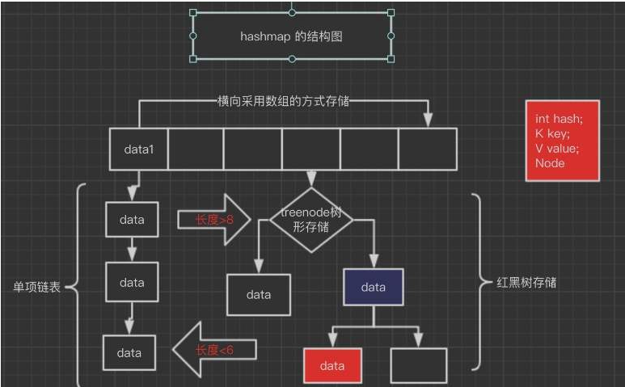
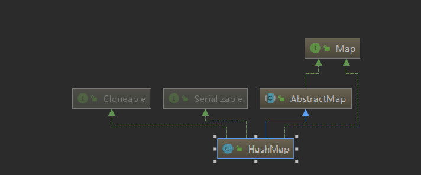
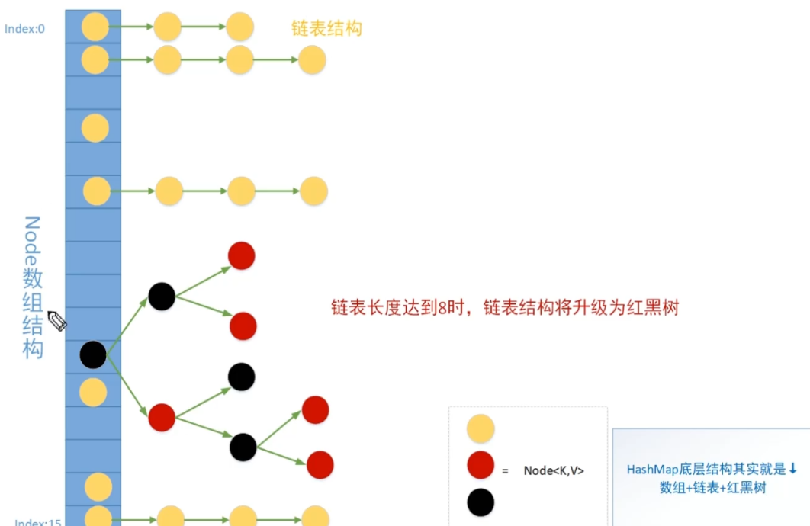
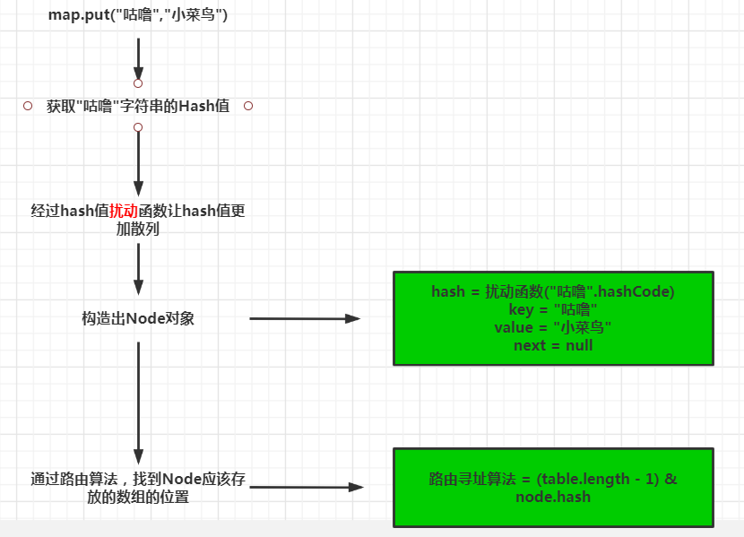

## 基础
### 数组的优点缺点
- 数组在内存空间上连续。能实现快速访问某个下标的值。
- 数组空间的大小一旦确定后就不能更改，如果需要增大减小需要新建数组重新设值。

### 链表的优点缺点

- 链表在内存空间上是不连续的。插入删除某个值速度快
- 链表不能随机查找，必须从第一个开始遍历，查找效率低

### HashMap散列表结构

HashMap采用了散列表结构，结合了数组和链表的优点。



### Hash哈希

Hash也称之为散列。基本原理是把<font color=red>任意长度</font>的输入，通过Hash算法变成<font color=red>固定长度</font>的输出。这个映射的规则就是对应的<font color=red>Hash算法</font>，而原始数据映射后的<font color=red>二进制串</font>就是哈希值。

Hash的特点

- 从hash值不可以反向推导出原始的数据
- 输入数据的微小变化会得到完全不同的hash值，相同的数据会得到相同的值
- 哈希算法的执行效率要高效，长本文也能快速的计算出哈希值
- hash算法的冲突概率要小

由于hash的原理是将输入空间的值映射到hash空间中，而hash值的控件远小于输入的空间。根据抽屉原理，一定会存在不同的输入被映射成相同输出的情况。

## HashMap原理讲解
### HahMap的继承体系

HashMap实现了Map接口，Cloneable接口，Serializable接口



### Node数据结构分析

HashMap的Node结构是一个单链表结构。Hash发生碰撞时，此时元素没法放在同一个数组下标，就会将相同hash的Node组成一个单链表。

```java
static class Node<K,V> implements Map.Entry<K,V> {
    final int hash; //这个hash是通过获取key的hashCode然后经过"扰动"后的结果
    final K key;
    V value;
    Node<K,V> next;

    Node(int hash, K key, V value, Node<K,V> next) {
        this.hash = hash;
        this.key = key;
        this.value = value;
        this.next = next;
    }

    public final int hashCode() {
        return Objects.hashCode(key) ^ Objects.hashCode(value);
    }
}
```

### 底层存储结构介绍

底层存储结构是<font color=red>数组+单链表+红黑树</font>的结构。

什么情况下链表会转化成红黑树?<font color=red>当单链表长度达到8，且数组的长度大于64时</font>



### put方法原理分析



### JDK8为什么引入红黑树

由于hash碰撞的原因，可能导致同一个数组下标下的单链表长度很长时，查询效率变低。这时候将链表转成红黑树来保证查询的效率。

## Hash源码分析

### HashMap核心属性分析

```java
//缺省数组大小,默认16
static final int DEFAULT_INITIAL_CAPACITY = 1 << 4; // aka 16
//数组最大大小
static final int MAXIMUM_CAPACITY = 1 << 30;
//缺省负载因子
static final float DEFAULT_LOAD_FACTOR = 0.75f;
//树化阈值
static final int TREEIFY_THRESHOLD = 8;
//树降级为链表的阈值
static final int UNTREEIFY_THRESHOLD = 6;
//待定
static final int MIN_TREEIFY_CAPACITY = 64;
//hash表
transient Node<K,V>[] table;
//当前hash表中元素个数
transient int size;
//当前hash表结构的修改次数
transient int modCount;
//扩容阈值，当你的哈希表中的元素超过阈值时，触发扩容
int threshold;
//负载因子, threshold = capacity(数组长度) * loadFactor
final float loadFactor;
```

### 构造方法分析

```java

public HashMap() {
    this.loadFactor = DEFAULT_LOAD_FACTOR; // all other fields defaulted
}

public HashMap(int initialCapacity) {
    this(initialCapacity, DEFAULT_LOAD_FACTOR);
}

public HashMap(int initialCapacity, float loadFactor) {
    //数组长度不能小于0
    if (initialCapacity < 0)
        throw new IllegalArgumentException("Illegal initial capacity: " +
                                           initialCapacity);
    //数组长度不能大于最大值
    if (initialCapacity > MAXIMUM_CAPACITY)
        initialCapacity = MAXIMUM_CAPACITY;
    //负载因子不能小于0
    if (loadFactor <= 0 || Float.isNaN(loadFactor))
        throw new IllegalArgumentException("Illegal load factor: " +
                                           loadFactor);
    //初始化负载因子
    this.loadFactor = loadFactor;
    //传入数组大小 计算扩容阈值 
    //这里初始化的threshold也是第一次初始化HashMap的初始长度
    this.threshold = tableSizeFor(initialCapacity);
}

//由于我们传入的initialCapacity是随机的，但是Hashmap要求数组的长度必须是2的次方，所以通过此函数进行转换
//作用 : 返回一个大于等于当前cap的数字，且这个数字是2的次方数
static final int tableSizeFor(int cap) {
        int n = cap - 1; 
        n |= n >>> 1; 
        n |= n >>> 2; 
        n |= n >>> 4; 
        n |= n >>> 8; 
        n |= n >>> 16;
        return (n < 0) ? 1 : (n >= MAXIMUM_CAPACITY) ? MAXIMUM_CAPACITY : n + 1;
}
```

### put方法分析

```java
public V put(K key, V value) {
        return putVal(hash(key), key, value, false, true);
}
```

```java
//hash扰动函数，使hash更加散列
//作用:让key的hash值的高16位也参与运算
static final int hash(Object key) {
        int h;
        return (key == null) ? 0 : (h = key.hashCode()) ^ (h >>> 16);
}
```

```java
final V putVal(int hash, K key, V value, boolean onlyIfAbsent,
                   boolean evict) {
        Node<K,V>[] tab; Node<K,V> p; int n, i;
        if ((tab = table) == null || (n = tab.length) == 0)
            n = (tab = resize()).length;
        if ((p = tab[i = (n - 1) & hash]) == null)
            tab[i] = newNode(hash, key, value, null);
        else {
            Node<K,V> e; K k;
            if (p.hash == hash &&
                ((k = p.key) == key || (key != null && key.equals(k))))
                e = p;
            else if (p instanceof TreeNode)
                e = ((TreeNode<K,V>)p).putTreeVal(this, tab, hash, key, value);
            else {
                for (int binCount = 0; ; ++binCount) {
                    if ((e = p.next) == null) {
                        p.next = newNode(hash, key, value, null);
                        if (binCount >= TREEIFY_THRESHOLD - 1) // -1 for 1st
                            treeifyBin(tab, hash);
                        break;
                    }
                    if (e.hash == hash &&
                        ((k = e.key) == key || (key != null && key.equals(k))))
                        break;
                    p = e;
                }
            }
            if (e != null) { // existing mapping for key
                V oldValue = e.value;
                if (!onlyIfAbsent || oldValue == null)
                    e.value = value;
                afterNodeAccess(e);
                return oldValue;
            }
        }
        ++modCount;
        if (++size > threshold)
            resize();
        afterNodeInsertion(evict);
        return null;
}
```


## 总结

- 当单链表长度达到8，且数组的长度大于64时链表会转成红黑树
- HashMap的初始化是在第一次插入数据时初始化的，所以Hash是<font color=red>懒加载初始化</font>