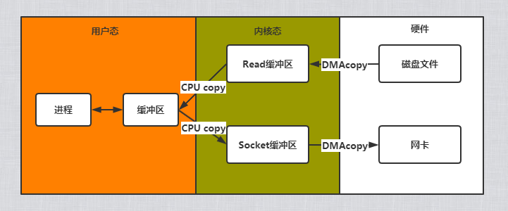
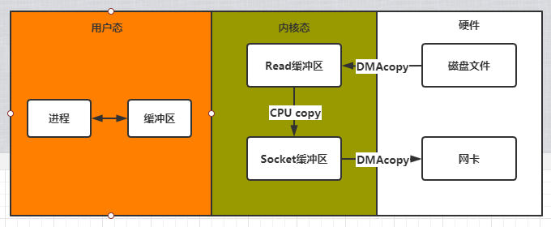

### 用户空间和内核空间
由于CPU某些指令比较危险，如果错用会导致系统崩溃，为了保护系统，操作系统将内存空间划分为了两部分：`内核空间`，`用户空间`。

### IO操作流程

假设现在一个网络请求想访问服务器上的一个文件，那么他涉及的过程是怎么样的？

#### **传统IO**
1. 处理进程发起一个系统调用sys_read读取磁盘文件。
2. CPU向DMA发送IO请求
3. DMA将磁盘文件数据<font color=red>拷贝</font>到内核空间的read缓冲区。
4. CPU把内核空间read缓冲区数据<font color=red>拷贝</font>到用户空间的缓冲区。
5. 进程发起一个系统调用socket_write，向网卡写数据。
6. CPU把用户空间缓冲区的数据<font color=red>拷贝</font>到内核空间的socket缓冲区。
7. DMA把内核空间的socket缓冲区数据<font color=red>拷贝</font>到网卡。
传统的IO模型整个过程总共发生了四次拷贝和四次的用户态和内核态的切换。



#### **零拷贝IO**
1. 处理进程发起一个系统调用sys_read读取磁盘文件。
2. CPU向DMA发送IO请求
3. DMA将磁盘文件数据<font color=red>拷贝</font>到内核空间的read缓冲区。
4. CPU把内核空间read缓冲区数据<font color=red>拷贝</font>到内核空间的socket缓冲区。
5. DMA把内核空间的socket缓冲区数据<font color=red>拷贝</font>到网卡。
零拷贝IO模型整个过程总共发生了三次拷贝和两次的用户态和内核态的切换。



注 : DMA即直接存储器访问，可以看作CPU的一个辅助硬件访问的芯片，在进行内存与IO设备数据传输时，不需要CPU来控制，直接通过DMA进行。

### IO模型介绍

#### **传统阻塞IO**
当用户进程调用了recv()/recvfrom()这个系统调用，kernel就开始了IO的第一个阶段：准备数据（对于网络IO来说，很多时候数据在一开始还没有到达。比如，还没有收到一个完整的UDP包。这个时候kernel就要等待足够的数据到来）。这个过程需要等待，也就是说数据被拷贝到操作系统内核的缓冲区中是需要一个过程的。而在用户进程这边，整个进程会被阻塞（当然，是进程自己选择的阻塞）。第二个阶段：当kernel一直等到数据准备好了，它就会将数据从kernel中拷贝到用户内存，然后kernel返回结果，用户进程才解除block的状态，重新运行起来。


```java
import java.io.IOException;
import java.net.ServerSocket;
import java.net.Socket;
public class OtherTest {
    static byte[] bs = new byte[1024];
    public static void main(String[] args) throws IOException {
        ServerSocket serverSocket = new ServerSocket(6379);
        while (true){
            Socket socket = serverSocket.accept(); // 阻塞
            socket.getInputStream().read(bs); // 阻塞
            System.out.println(bs);
        }
    }
}
```
如上代码可见，程序一次只能执行一个IO，当一个TCP连接上但是没有发送数据那么将会阻塞在read方法上，其他的TCP连接将得不到执行。所以有了`阻塞IO` + `多线程`的方式。

但这种方式也有缺点，当连接多时，会导致新建大量的线程，性能下降。

```java
import java.io.IOException;
import java.net.ServerSocket;
import java.net.Socket;
public class OtherTest {
    static byte[] bs = new byte[1024];
    public static void main(String[] args) throws IOException {
        ServerSocket serverSocket = new ServerSocket(6379);
        while (true){
            Socket socket = serverSocket.accept(); // 阻塞
            //得到一个TCP连接后就较给一个线程处理
            Thread t = new Thread(() -> {
                try {
                    socket.getInputStream().read(bs);
                } catch (IOException e) {
                    e.printStackTrace();
                }
            });
            t.start();
        }
    }
}
```

#### **非阻塞IO**
当用户进程发出read操作时，如果kernel中的数据还没有准备好，那么它并不会block用户进程，而是立刻返回一个error。从用户进程角度讲，它发起一个read操作后，并不需要等待，而是马上就得到了一个结果。用户进程判断结果是一个error时，它就知道数据还没有准备好，于是它可以再次发送read操作。一旦kernel中的数据准备好了，并且又再次收到了用户进程的system call，那么它马上就将数据拷贝到了用户内存，然后返回。


根据非阻塞的特性，accept()，read()不在阻塞，如果没有TCP连接或者没有数据可读取则直接返回。上面就是非阻塞的模型，而在实际使用上，由于accept()，read()不在阻塞，我们代码上就需要通过记录下已建立连接的TCP，然后每次for循环去判断是否可读取。
这种的方式我们也能知道缺点，如果有1W个TCP建立连接，且之后10个有发送数据，由于**for循环没法判断哪些连接有发送数据，所以需要不断的空轮询，轮询消耗大量的CPU时间**。
```java
import java.io.IOException;
import java.net.InetSocketAddress;
import java.net.SocketAddress;
import java.nio.ByteBuffer;
import java.nio.channels.ServerSocketChannel;
import java.nio.channels.SocketChannel;
import java.util.ArrayList;
import java.util.List;

public class OtherTest {
    static List<SocketChannel> socketChannelList = new ArrayList<>();
    static ByteBuffer byteBuffer = ByteBuffer.allocate(1024);
    public static void main(String[] args) throws IOException {
        ServerSocketChannel serverSocket = ServerSocketChannel.open();
        SocketAddress socketAddress = new InetSocketAddress("loaclhost",6379);
        serverSocket.bind(socketAddress);
        serverSocket.configureBlocking(false); //设置成非阻塞
        while (true){
            for(SocketChannel socketChannel: socketChannelList){
                int read = socketChannel.read(byteBuffer);
                if(read > 0){
                    byte[] bs = new byte[read];
                    byteBuffer.get(bs);
                    byteBuffer.flip();
                }
            }
            SocketChannel socket = serverSocket.accept();
            if(socket != null){
                socket.configureBlocking(false); //设置成非阻塞
                socketChannelList.add(socket);
            }
        }
    }
}
```
#### **IO多路复用**
多路复用？不懂意思。但是我们可以对比上面的非阻塞模型，由于非阻塞模型的方式需要用户进程那边不断的消耗CPU做轮询检查用户态的缓冲区是否收到了内核缓冲区的的数据。<font color=red>试想一下，如果内核那边能直接帮我们去检查并通知我们就好了。</font>UNIX/Linux 下的 select、poll、epoll 就是干这个的，监视的事情交给了内核，内核负责数据到达的处理。

- select函数，同时对多个IO端口进行监听，当有I/O事件（文件描述符fd）发生了才轮询。他与非阻塞的区别在于，他是在有IO事件的时候才去轮询。
- poll函数，和select函数没区别，只是**它没有最大连接数的限制，因是它是基于链表来存储的**。
- epoll函数，不同于忙轮询和无差别轮询，epoll会把哪个流发生了怎样的I/O事件通知我们。所以他是采用了**事件驱动模式**。

```java
import java.io.IOException;
import java.net.InetSocketAddress;
import java.nio.ByteBuffer;
import java.nio.channels.SelectionKey;
import java.nio.channels.Selector;
import java.nio.channels.ServerSocketChannel;
import java.nio.channels.SocketChannel;
import java.util.Iterator;
import java.util.Set;

public class OtherTest {
    public static void main(String[] args) throws IOException {
        ServerSocketChannel serverSocketChannel = ServerSocketChannel.open();
        Selector selector = Selector.open();
        serverSocketChannel.socket().bind(new InetSocketAddress(6379));
        //设置为非阻塞
        serverSocketChannel.configureBlocking(false);
        //把ServerSocketChannel注册到selector上，关心的事件是OP_ACCEPT(连接事件)
        serverSocketChannel.register(selector, SelectionKey.OP_ACCEPT);
        //循环等待客户端连接
        while (true) {
            if (selector.select(1000) == 0) { //select函数，就是帮我们做监听的函数 select,poll,epoll的实现
                System.out.println("========服务器等待1s,无连接=======");
                continue;
            }
            Set<SelectionKey> selectionKeys = selector.selectedKeys();
            Iterator<SelectionKey> iterator = selectionKeys.iterator();
            while (iterator.hasNext()) {
                SelectionKey key = iterator.next();
                //根据key对应的通道对应的事件
                if (key.isAcceptable()) { //如果是OP_ACCEPT事件，其实就是有客户端连接的话
                    //该客户端生成一个SoecktChannel
                    try {
                        SocketChannel socketChannel = serverSocketChannel.accept();
                        socketChannel.configureBlocking(false);
                        //将socketChannel注册到selector上,关注的事件是读，同时给socketChannel关联一个buffer
                        socketChannel.register(selector, SelectionKey.OP_READ, ByteBuffer.allocate(1024));
                    } catch (IOException e) {
                        e.printStackTrace();
                    }
                }
                //如果事件是一个读事件
                if (key.isReadable()) {
                    //通过key反向获取到对应的channel
                    SocketChannel channel = (SocketChannel) key.channel();
                    //获取到通过关联的buffer
                    ByteBuffer buffer = (ByteBuffer) key.attachment();
                    try {
                        channel.read(buffer);
                    } catch (IOException e) {
                        e.printStackTrace();
                    }
                    System.out.println("客户端发过来的消息是:" + new String(buffer.array()));
                }
                //删除selectionKey,防止重复操作
                iterator.remove();

            }
        }
    }
}
```


### 参考

- https://www.jianshu.com/p/486b0965c296