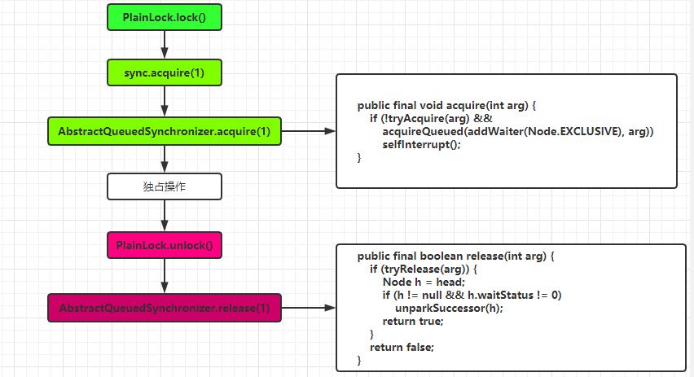
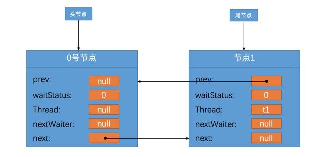
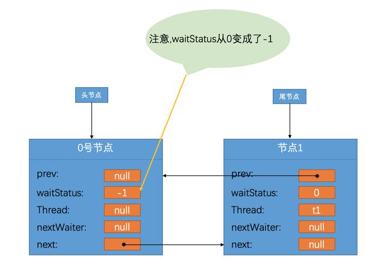
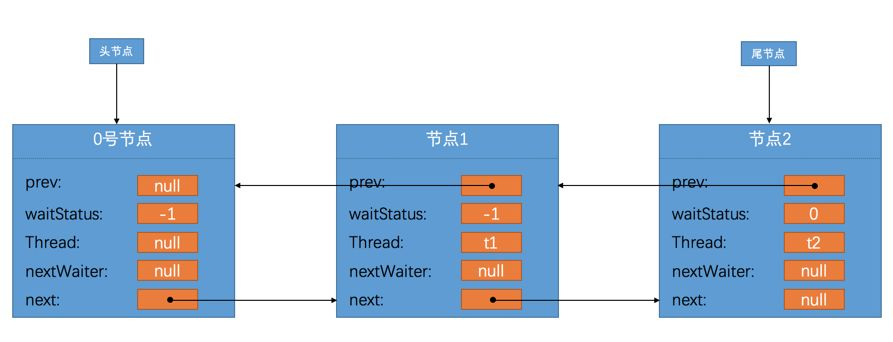

## 概述

Java中提供了AbstractQueuedSynchronizer类，简称抽象队列同步器。这个类封装了各种底层的同步细节程序员想自定义自己的同步工具的时候，只需要定义这个类的子类并覆盖它提供的一些方法就好了。**ReentrantLock**类就是借助AQS实现的。

### AQS工作原理大概流程

AQS中维护了一个**<font color=red>state</font>**字段，我们可以通过修改`state`字段代表的`同步状态`来实现多线程的`独占模式`或者`共享模式`。

**独占模式**

在独占模式下，我们可以把state的初始值设置为0，每当一个线程要进行某项独占操作时，判断state==0？，如果是0则通过**CAS**操作将state改成1并进入独占操作。当另一个线程也需要独占操作时，由于state!=0，意味着已经有线程在进行独占模式，则该线程会被封装成一个Node存到一个同步队列中去并阻塞。当第一个线程完成独占操作后，会将state设置成0并通知同步队列里的线程。这样同步队列里的线程就可以挨个进行独占操作。

**共享模式**

共享模式和独占模式差不多，也是判断state，需要阻塞的线程也是封装到同步队列中。比如说某项操作我们允许`10`个线程同时，那么就将state的初始值设置成10，线程需要独占操作时就将state减少1，当state小于0时，后续的线程才需要阻塞。
<!--more-->
## 原理和源码解析

### 通过AQS实现一个锁

```java
import com.google.common.collect.Maps;

import java.util.Map;
import java.util.UUID;
import java.util.concurrent.TimeUnit;
import java.util.concurrent.locks.AbstractQueuedSynchronizer;

/***
 * 根据AQS实现一个先进先出可重入锁
 */
public class PlainLock {
    private Sync sync = new Sync();

    public void lock() {
        sync.acquire(1);
    }

    public void unlock() {
        sync.release(1);
    }
   /****
     * 继承AQS
     */
    private static class Sync extends AbstractQueuedSynchronizer {
        @Override
        protected boolean tryAcquire(int arg) {
            return compareAndSetState(0, 1);
        }

        @Override
        protected boolean tryRelease(int arg) {
            setState(0);
            return true;
        }

        @Override
        protected boolean isHeldExclusively() {
            return getState() == 1;
        }
    }


    public static void main(String[] args) throws InterruptedException {
        int NUMBER = 100;
        PlainLock lock = new PlainLock();
        Map<String,String> myMap = Maps.newHashMap();
        for (int i = 0; i < NUMBER; i++) {
            new Thread(new Runner(lock,myMap),"线程" + i).start();
        }
        TimeUnit.SECONDS.sleep(20);
        System.out.println(myMap.entrySet().size());

    }

    private static class Runner implements Runnable {
        PlainLock lock;
        Map<String, String> myMap;

        public Runner(PlainLock plainLock, Map<String, String> myMap) {
            this.lock = plainLock;
            this.myMap = myMap;
        }

        @Override
        public void run() {
            try {
                lock.lock();
                System.out.println(Thread.currentThread().getName() + "..开始执行");
                for (int i = 0; i < 1000; i++) {
                    myMap.put(UUID.randomUUID().toString(), "1");
                }
            } catch (Exception e) {

            } finally {
                lock.unlock();
            }
        }
    }

}
```

**加锁逻辑示意图**




### 同步状态

在AbstractQueuedSynchronizer类中维护这一个state同步状态，使用voatite修饰。

```java
private volatile int state;
```

并提供了几个访问该同步状态的方法，<font color=red>这些方法使用final修饰，不能被重写</font>。开发者只需要根据AQS提供给我们的方法操作state。

| 方法名                                                       | 描述                     |
| ------------------------------------------------------------ | ------------------------ |
| protected final int getState()                               | 获取state的值            |
| protected final void setState(int newState)                  | 设置state的值            |
| protected final boolean compareAndSetState(int expect,int update) | 使用CAS方式更新state的值 |

### 同步状态获取与释放

在AbstractQueuedSynchronizer提供了获取同步状态与释放同步状态的方式，开发者根据需求决定是采用独占模式还是共享模式，<font color=red>在子类中重写对应的方法</font>。例如上面的Sync类。

| 方法名                                      | 描述                                     |
| ------------------------------------------- | ---------------------------------------- |
| protected boolean tryAcquire(int arg)       | 独占式的获取同步状态，成功true,失败false |
| protected boolean tryRelease(int arg)       | 独占式的释放同步状态，成功true,失败false |
| protected boolean tryAcquireShared(int arg) | 共享式的获取同步状态，成功true,失败false |
| protected boolean tryReleaseShared(int arg) | 共享式的释放同步状态，成功true,失败false |

### 同步队列

上面说过，当一个线程获取同步状态失败后会将该线程封装成一个Node放到同步队列中去。在AbstractQueuedSynchronizer定义了一个Node类用来表示。

当一个线程获取同步状态失败之后，就把这个线程阻塞并包装成`Node`节点插入到这个`同步队列`中，当获取同步状态成功的线程释放同步状态的时候，同时通知在队列中下一个未获取到同步状态的节点，让该节点的线程再次去获取同步状态。


```java
private transient volatile Node head; //同步队列头节点
private transient volatile Node tail; //同步队列尾节点
static final class Node {
    static final Node SHARED = new Node();
    static final Node EXCLUSIVE = null;
    static final int CANCELLED =  1;
    static final int SIGNAL    = -1;
    static final int CONDITION = -2;
    static final int PROPAGATE = -3;
    volatile int waitStatus; //Node的状态
    volatile Node prev; //指向上一个Node
    volatile Node next; //指向下一个Node
    volatile Thread thread;  //存储线程 每一个节点都代表一个线程
    Node nextWaiter;
    Node() {
    }
    Node(Thread thread, Node mode) {
        this.thread = thread;
    }

    Node(Thread thread, int waitStatus) {
        this.waitStatus = waitStatus;
        this.thread = thread;
    }
}
```

### 独占式同步状态获取与释放

#### **入同步队列并阻塞**

我们知道，整个获取同步状态或加入同步队列最终是调用了AQS中的acquire方法。AQS共提供了几种方法。

| 方法名                                         | 描述                                                         |
| ---------------------------------------------- | ------------------------------------------------------------ |
| public void acquire(int arg)                   | 独占式获取同步状态，如果获取成功则返回，失败则将线程包装成Node放入同步队列 |
| public void acquireInterruptibly(int arg)      | 跟上面功能类似，只不过这个方法在执行过程中被别的过程中断，会抛错误 |
| public void tryAcqureNanos(int arg.long nanos) | 跟上面功能类似，加了超时机制                                 |
| boolean release(int arg)                       | 这个方法属于释放同步状态                                     |

**分析acquire方法**

```java
public final void acquire(int arg) {
    //tryAcquire(arg) 获取同步状态，这个需要子类重写
    //addWaiter(Node.EXCLUSIVE) 如果tryAcquire获取失败，则将当前节点加入到同步队列中
    //acquireQueued 线程阻塞，唤醒都在这方法里面
    //Node.EXCLUSIVE 标识节点当前在独占模式下
    if (!tryAcquire(arg) &&
       acquireQueued(addWaiter(Node.EXCLUSIVE), arg))
       selfInterrupt();
}
```

tryAcquire方法是子类重写的方法，主要是尝试获取同步状态，例如上面的例子

```java
protected boolean tryAcquire(int arg) {
    //使用CAS更新state,如果更新成功返回true,否则返回false
    return compareAndSetState(0, 1);
}
 protected final boolean compareAndSetState(int expect, int update) {
    // See below for intrinsics setup to support this
    return unsafe.compareAndSwapInt(this, stateOffset, expect, update);
}
```

**addWaiter**，当执行tryAcquire没有获取到同步状态时，将线程加入到同步队列中。

```java
private Node addWaiter(Node mode) {
	//构造一个新节点,线程为当前线程
    Node node = new Node(Thread.currentThread(), mode);  
    //以下几行代码想把当前node加到链表的最后面去，也就是进到阻塞队列的最后
    Node pred = tail;
    if (pred != null) { //尾节点不为空，插入到队列最后
        node.prev = pred;
        if (compareAndSetTail(pred, node)) {  //更新tail，并且把新节点插入到列表最后
            pred.next = node;
            return node;
        }
    }
    enq(node); //同步队列为空，或者有线程竞争入队时才会走到这里
    return node;
}

//采用自旋的方式入队
//到这个方法只有两种可能：等待队列为空，或者有线程竞争入队
private Node enq(final Node node) {
    for (;;) {
        Node t = tail;
        if (t == null) {    //tail节点为空，初始化队列，这里延迟初始化
            if (compareAndSetHead(new Node()))  //设置head节点
                tail = head;
        } else {    //tail节点不为空，开始真正插入节点
            node.prev = t;
            if (compareAndSetTail(t, node)) {
                t.next = node;
                return t;
            }
        }
    }
}
```

所以这一步做的事情主要是两个：

1. 如果同步队列还没初始化就进行初始化
2. 将线程封装成Node插入到队列的最后，并调整head和tail指针

所以经过这一步后，同步队列如下，第一个节点是空节点。




**acquireQueued方法**

```java
final boolean acquireQueued(final Node node, int arg) {
    boolean failed = true;
    try {
        boolean interrupted = false;
        for (;;) {
            final Node p = node.predecessor();  //获取前一个节点
            //前一个节点是头节点再次尝试获取同步状态
            //如果前一个节点是头节点就尝试获取一下同步队列
            //这个主要是怕获取同步状态的线程很快就把同步状态给释放了,
            //所以在当前线程阻塞之前抱着侥幸的心理再试试能不能成功获取到同步状态，
            //如果侥幸可以获取，那就调用setHead方法把头节点换成自己
            if (p == head && tryAcquire(arg)) {
                setHead(node);
                p.next = null; // help GC
                failed = false;
                return interrupted;
            }
            //到这里，说明上面的if分支没有成功，要么当前node本来就不是队头
            //要么就是tryAcquire(arg)没有抢赢别人
            if (shouldParkAfterFailedAcquire(p, node) &&
                parkAndCheckInterrupt())
                interrupted = true;
        }
    } finally {
        if (failed)
            cancelAcquire(node);
    }
}
//对Node节点中的waitStatus的各种操作
//prod -- 前驱节点 node -- 新插入同步队列的节点
private static boolean shouldParkAfterFailedAcquire(Node pred, Node node) {
    int ws = pred.waitStatus;   //前一个节点的状态
    //Node.SIGNAL的值是-1,说明前驱节点状态正常，当前线程需要挂起
    if (ws == Node.SIGNAL)  
        return true;
    //当前线程已被取消操作，把处于取消状态的节点都移除掉
    if (ws > 0) {  
        do {
            node.prev = pred = pred.prev;
        } while (pred.waitStatus > 0);
        pred.next = node;
    } else {    
        //设置前一个节点的状态为-1
        compareAndSetWaitStatus(pred, ws, Node.SIGNAL);
    }
    return false;
}

//这个方法主要是用来进行阻塞
private final boolean parkAndCheckInterrupt() {
    LockSupport.park(this);
    return Thread.interrupted();
}
```

**waitStatus状态**

| 静态变量       | 值   | 描述                                           |
| -------------- | ---- | ---------------------------------------------- |
| Node.CANCELLED | 1    | 节点对应的线程已被取消                         |
| Node.SIGNAL    | -1   | 表示后边的节点对应的线程处于等待状态           |
| Node.CONDITION | -2   | 表示节点在等待队列中                           |
| Node.PROPAGATE | -3   | 表示下一次共享式同步状态获取将被无条件传播下去 |
| 无             | 0    | 初始状态                                       |

这里解释一下整个acquireQueued过程，假设当前节点是节点1，在一开始，所有的`Node`节点的`waitStatus`都是`0`，所以在第一次调用`shouldParkAfterFailedAcquire`方法时，当前节点的前一个节点，也就是`0号节点`的`waitStatus`会被设置成`Node.SIGNAL`立即返回`false`，这个状态的意思就是说`0号节点`后边的节点都处于等待状态，现在的队列已经变成了这个样子。



由于acquireQueued是一个循环，第二次进来后，由于0号节点已经是-1了，所以返回true，接着执行parkAndCheckInterrupt，节点1被阻塞。如果此时再来一个节点2，那么节点1就是节点2的前驱节点。那么在处理中也会将节点1的状态设置成-1。所以图示如下



#### **同步状态释放**

在获得同步锁的线程执行完操作后就会释放同步状态并唤醒同步队列。

```java
public final boolean release(int arg) {
    //释放同步状态，如果成功返回true
    if (tryRelease(arg)) {
        Node h = head;
        //
        if (h != null && h.waitStatus != 0)
            unparkSuccessor(h);
        return true;
    }
    return false;
}
//唤醒后继节点
//node - head头节点
private void unparkSuccessor(Node node) {
        int ws = node.waitStatus;   //节点的等待状态
        if (ws < 0)
            compareAndSetWaitStatus(node, ws, 0);
    	//获取head节点的下一个节点
        Node s = node.next; 
        if (s == null || s.waitStatus > 0) {    //如果node为最后一个节点或者node的后继节点被取消了
            s = null;
            for (Node t = tail; t != null && t != node; t = t.prev)   
                if (t.waitStatus <= 0)  //找到离头节点最近的waitStatus为负数的节点
                    s = t;
        }
        if (s != null)
            LockSupport.unpark(s.thread);   //唤醒该节点对应的线程
}
```

## ReentrantLock实现

ReentrantLock内部使用了AQS实现加锁。看下非公平可重入方式是如何实现的。

```java
 
 static final class NonfairSync extends Sync {
     private static final long serialVersionUID = 7316153563782823691L;
     final void lock() {
         //先CAS更新同步状态，如果获取成功就设置当前线程加锁
         if (compareAndSetState(0, 1))
             setExclusiveOwnerThread(Thread.currentThread());
         else
             //使用AQS
             acquire(1);
     }

     protected final boolean tryAcquire(int acquires) {
         return nonfairTryAcquire(acquires);
     }
 }


final boolean nonfairTryAcquire(int acquires) {
    final Thread current = Thread.currentThread();
    int c = getState();
    if (c == 0) {
        //调用tryAcquire时判断下同步状态是不是为0，如果为0就CAS操作同步状态
        //这里就是为什么是不公平锁的体现。当一个新的线程过来获取锁时，他会尝试着先抢夺一下state
        //如果这时候恰好执行独占操作的线程释放了state，他刚好抢夺到后就直接进入独占操作。
        if (compareAndSetState(0, acquires)) {
            setExclusiveOwnerThread(current);
            return true;
        }
    }
    //可重入的关键，如果是当前线程的话就操作同步状态+1
    else if (current == getExclusiveOwnerThread()) {
        int nextc = c + acquires;
        if (nextc < 0) // overflow
            throw new Error("Maximum lock count exceeded");
        setState(nextc);
        return true;
    }
    return false;
}
```

