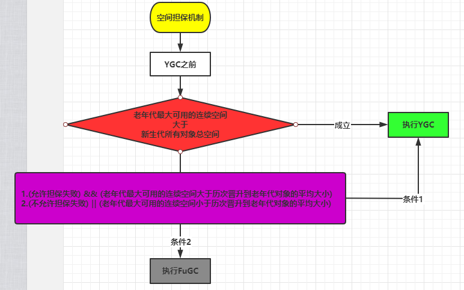

## JVM常用参数
### 推和栈大小设置

```shell
-Xms1024M: 初始堆大小
-Xmx1024M: 最大堆大小
-Xmn512M:新生代的大小
-XX:newSize:新生代初始化内存的大小(注意：该值需要小于-Xms的值)
-XX:MaxnewSize:新生代可被分配的内存的最大上限(注意：该值需要小于-Xmx的值)
-Xmn:年轻代的大小(eden + 2 survivor,设置了这就不用设置-XX:NewSize，-XX:MaxNewSize)
-XX:NewRatio=n: 设置年轻代和年老代的比值。如:为3，表示年轻代与年老代比值为1：3，年轻代占整个年轻代年老代和的1/4
-XX:SurvivorRatio=n: 年轻代中Eden区与两个Survivor区的比值。注意Survivor区有两个。如：3，表示Eden：Survivor=3：2，一个Survivor区占整个年轻代的1/5
-Xss256K: 栈大小设置
-XX:MetaspaceSize=n 元空间初始大小
-XX:MaxMetaspaceSize=n 元空间最大大小
```
<!--more-->
典型设置

```shell
java -Xmx3550m -Xms3550m -Xss128k -XX:NewRatio=4 -XX:SurvivorRatio=4 -XX:MaxTenuringThreshold=0
#-XX:NewRatio=4:设置年轻代（包括Eden和两个Survivor区）与年老代的比值（除去持久代）。设置为4，则年轻代与年老代所占比值为1：4，年轻代占整个堆栈的1/5
#-XX:SurvivorRatio=4：设置年轻代中Eden区与Survivor区的大小比值。设置为4，则两个Survivor区与一个Eden区的比值为2:4，一个Survivor区占整个年轻代的1/6
#-XX:MaxTenuringThreshold=0： 设置垃圾最大年龄。如果设置为0的话，则年轻代对象不经过Survivor区，直接进入年老代。对于年老代比较多的应用，可以提高效率。(正常可以不设置)
```

### 回收器

JVM垃圾回收器按照分类可以分成：串行收集器，并行收集器，并发收集器。

- 串行收集器：一个GC线程进行回收，会暂停所有用户线程，不符合服务器环境。
- 并行收集器：多个GC线程进行回收，会暂停所有用户线程，适用于大数据，科学计算处理场景。
- 并发收集器(CMS)：用户线程和GC线程同事执行，不会暂停用户线程，适用于对响应时间要求高的场景。

如何选择垃圾收集器，可以通过如下几点。

1、单CPU小内存 : -XX:+UseSerialGC

2、多CPU，需要大量运算：-XX:+UseParallelGC  -XX:+UseParallelOldGC

3、多CPU，要求快速响应：-XX:+UseParNewGC  -XX:+UseConcMarkSweepGC

在C/S架构中往往我们关注的是**响应时间**。并发收集器主要是保证系统的响应时间，减少垃圾收集时的停顿时间。所以我们一般使用的是并发收集器，也就是CMS。配置参考如下

```shell
-Xmx3550m -Xms3550m -Xmn2g -Xss128k -XX:ParallelGCThreads=20 -XX:+UseConcMarkSweepGC -XX:+UseParNewGC -XX:+UseCMSCompactAtFullCollection
#-XX:+UseConcMarkSweepGC： 设置年老代为并发收集
#-XX:+UseParNewGC: 设置年轻代为并行收集。
#-XX:+UseCMSCompactAtFullCollection 打开对年老代的压缩。可能会影响性能，但是可以消除碎片
```

### 日志和辅助设置

日志相关参考另外一篇博客：[GC日志详解](https://xuzyblog.top/2019/02/18/gc-log/)

另外一些辅助类的配置，笔者项目中配置的一些优化。

这里顺便说下 : **-XX:+ 这种表示开启什么配置，-XX:- 表示关闭什么配置**

```shell
-XX:+DisableExplicitGC #加了这个配置后，再代码上使用System.gc()将不会生效，System.gc()会出发FullGC
-XX:+UseCompressedOops #开启压缩指针，例如压缩指针对象头。开启后可以节省一定的内存空间
-XX:+CMSParallelRemarkEnabled #降低标记停顿
-XX:CMSInitiatingOccupancyFraction=70 #使用cms作为垃圾回收,使用70％后开始CMS收集
```

## JVM调优

### 什么时候才需要调优？

**如果各项参数设置合理，系统没有超时日志出现，GC频率不高，GC耗时不高，那么没有必要进行GC优化；如果GC时间超过1-3秒，或者频繁GC，则必须优化。**

如果满足下列指标，则一般不需要GC优化（具体情况具体分析）

- Minor GC执行时间不到100ms
- Minor GC执行不频繁，约5秒一次
- Full GC执行时间不到1s
- Full GC执行频率不算频繁，不低于1分钟1次

### 调优目标

- GC的时间足够的小
- GC的次数足够的少
- 发生Full GC的周期足够的长

调优准则

- 根据机器情况和服务需求，具体问题具体分析
- 多数的Java应用不需要在服务器上进行GC优化
- 减少使用全局变量和大对象 (代码层面)
- 调整新生代的大小
- 设置老年代的大小（老年代：新生代=2：1）
- 选择合适的GC收集器
- 设置合适线程堆栈大小

例如线上排查Full GC次数频繁。这就要知道什么时候对象会放到老年代。

- YGC时，To Survivor区不足以存放存活的对象，对象会直接进入到老年代。这种情况可以适当加大Survivor区的大小。
- 经过多次YGC后，如果存活对象的年龄达到了设定阈值，则会晋升到老年代中。这种情况属于对象存活太久，如果大对象在业务上不需要使用那么久最好能够用完即删。
- 动态年龄判定规则，To Survivor区中相同年龄的对象，如果其大小之和占到了 To Survivor区一半以上的空间，那么大于此年龄的对象会直接进入老年代，而不需要达到默认的分代年龄。这种情况也是可以适当更改Survivor大小。

### 如何确定新生代和老年代的比例？

- IO交互性系统，互联网上目前大部分的服务都属于该类型，例如分布式 RPC、MQ、HTTP 网关服务等，对内存要求并不大，大部分对象在 TP9999 的时间内都会死亡， Young 区越大越好。
- 内存计算性系统，主要是分布式数据计算 Hadoop，分布式存储 HBase、Cassandra，自建的分布式缓存等，对内存要求高，对象存活时间长，Old 区越大越好。

## 常见知识点

### 空间分配担保

空间担保指的是老年代进行空间分配担保。在发生Minor GC前，JVM会先检查**老年代最大可用的连续空间是否大于新生代所有对象的总空间**。

- 如果大于，则此次**Minor GC是安全的**。
- 如果小于，则虚拟机会查看**HandlePromotionFailure**设置值是否允许担保失败。如果HandlePromotionFailure=true，那么会继续检查老年代最大可用连续空间是否大于**历次晋升到老年代的对象的平均大小**，如果大于，则尝试进行一次Minor GC，但这次Minor GC依然是有风险的；如果小于或者HandlePromotionFailure=false，则改为进行一次Full GC。

**为什么要进行空间担保？**

是因为新生代采用**复制收集算法**，假如大量对象在Minor GC后仍然存活（最极端情况为内存回收后新生代中所有对象均存活），而Survivor空间是比较小的，这时就需要老年代进行分配担保，把Survivor无法容纳的对象放到老年代。**老年代要进行空间分配担保，前提是老年代得有足够空间来容纳这些对象**，但一共有多少对象在内存回收后存活下来是不可预知的，**因此只好取之前每次垃圾回收后晋升到老年代的对象大小的平均值作为参考**。使用这个平均值与老年代剩余空间进行比较，来决定是否进行Full GC来让老年代腾出更多空间。



**什么情况下对象直接进入老年代？**

- 在执行YGC时，To Survivor区不足以存放存活的对象，对象会直接进入到老年代。
- 长期存活的对象将进入老年代。经过多次YGC后，如果存活对象的年龄达到了设定阈值，则会晋升到老年代中，通过-XX：MaxTenuringThreshold = 15设置。
- 大对象直接进入老年代，通过-XX：PretenureSizeThreshold参数设置，如果大于这个设定值则直接存入老年代，
- 动态年龄判定规则，To Survivor区中相同年龄的对象，如果其大小之和占到了 To Survivor区一半以上的空间，那么大于此年龄的对象会直接进入老年代，而不需要达到默认的分代年龄。

**什么情况下会触发FGC？**

- 当晋升到老年代的对象大于了老年代的剩余空间时，就会触发FGC（Major GC），***\*FGC处理的区域同时包括新生代和老年代\****。
- 老年代的内存使用率达到了一定阈值（可通过参数调整），直接触发FGC （ -XX:CMSInitiatingOccupancyFraction=70 是指设定CMS在对内存占用率达到70%的时候开始GC）。
- 空间分配担保：在YGC之前，会先检查老年代最大可用的连续空间是否大于新生代所有对象的总空间。如果小于，说明YGC是不安全的，则会查看参数 HandlePromotionFailure 是否被设置成了允许担保失败，如果不允许则直接触发Full GC；如果允许，那么会进一步检查老年代最大可用的连续空间是否大于历次晋升到老年代对象的平均大小，如果小于也会触发 Full GC。
- Metaspace（元空间）在空间不足时会进行扩容，当扩容到了-XX:MetaspaceSize 参数的指定值时，也会触发FGC。
- System.gc() 或者Runtime.gc() 被显式调用时，触发FGC。（有些第三方插件会有用这个函数）