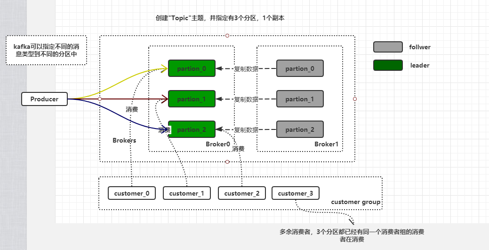
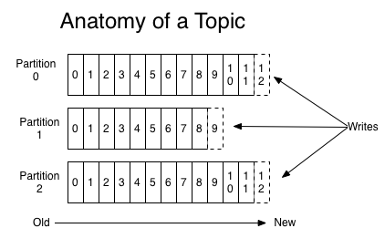
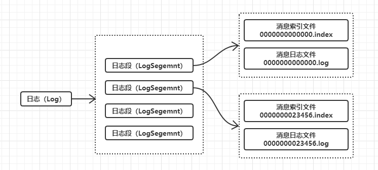
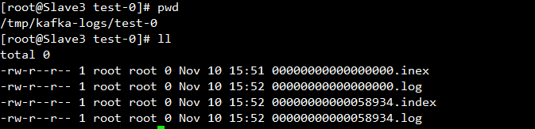

## 概述
### 介绍

Kafka是一个**分布式**，**分区**，**多副本**，**发布-订阅模式**，**基于zookeeper协调**的分布式日志系统，消息队列（MQ）。主要应用场景是：日志收集系统和消息系统。

### 术语

- Broker（服务器），Kafka的服务器被称为Broker，一个集群中包含一个或多个Broker。
- Topic（主题），每条发布到Kafka集群的消息都有一个类别，这个类别被称为Topic。
- Partition（分区），一个Topic被分成多个分区，这也是Kafka吞吐量高的原因之一，负载均衡。
- Producer（生产者），数据的发布者，将消息发布到topic中。
- Consumer（消费者），从topic中消费消息，一个消费者可以消费多个不同的Topic或者多个不同的Partition
- Consumer Group（消费者组），每个Consumer属于一个特定的Consumer Group。
- Replica（副本），一个分区有多个Replica，这也是Kafka高可用的原因。
- Leader（领导者副本），当前负责数据的读写的partition。
- Follower（追随者副本），负责从Leader获取数据并存储，不负责读写，作为一个冷备份，当Leader挂的时候就会从Follower中选举一个出来当Leader。
- LogSegemnt（数据段），消息的持久化方式。
- AR（Assigned Repllicas），分区中的所有副本统称为AR。
- ISR（in-sync Replica），所有与leader副本保持一定程度同步的副本（包括Leader）称之为ISR。
- Controller（控制者），负责管理整个集群中分区和副本的状态。
<!--more-->
### 关系解析

**Topic（主题）和 Partition（分区）**

主题是我们逻辑上的说法，分区是物理上的说法。例如我们在Kafka创建了一个主题`Test`并指定3个分区。那么在实际存储上这个主题会被分成3个分区。这样的好处是为了负载均衡，且Kafka支持根据key路由到特定分区。例如现在这个Test主题存储VIP消息和普通消息，就可以根据将VIP消息存到分区0上，普通消息存在分区1上。

**Partition（分区）和 Replica（副本） 和 Leader（领导者副本） 和 Follower（追随者副本）**

一个分区可以有一个或多个副本，多个副本中又分成leader和follower。leader负责数据的读写，follower负责从leader同步数据。kafka副本的概念是实现高可用的方式。

**Consumer（消费者）和 Consumer Group（消费者组）**

一个消费者组里有一个或多个消费者。一个分区只能被同一个消费者组的其中一个消费者消费，不能被同一个消费者组的多个消费者同时消费。假设一个主题有3个分区，一个消费者组有4个消费者，那么将有一个消费者无法消费。

**Controller（控制者）和 Broker（服务器）**

Kafka集群中多个broker，有一个会被选举为Controller leader，Controller负责管理整个集群中分区和副本的状态，比如partition的leader 副本故障，由controller 负责为该partition重新选举新的leader 副本；当检测到ISR列表发生变化，有controller通知集群中所有broker更新其MetadataCache信息；或者增加某个topic分区的时候也会由controller管理分区的重新分配工作。

## 架构

### 消息分区机制原理

Kafka的消息组织方式实际上是三级结构：主题-分区-消息。主题下的每条消息只会保存在某一个分区中，而不会在多个分区中被保存多份。

如图所示，其实分区的作用就是提供**负载均衡**的能力，不同的分区能够被放置到不同节点的机器上，而数据的读写操作也都是针对分区这个粒度而进行的，这样每个节点的机器都能独立地执行各自分区的读写请求处理。并且，我们还可以通过添加新的节点机器来增加整体系统的吞吐量。写消息时，采用**追加的方式**写入保证同一个分区下的消息的顺序性。至于消息具体是写到哪个分区，kafka提供了多种分区策略包括：轮询，随机，自定义。

总结一下，Kafka采用分区的方式的好处是提供了负载均衡的能力，达到了高性能的目的，且分区可以增加减少，可扩展能力强。

### 持久化数据

生产者向分区写入消息，每条消息在分区中的位置信息由一个叫位移（Offset）的数据来表征。总的来说，Kafka使用消息日志（Log）来保存数据，一个日志就是磁盘上一个只能追加写（Append-only）消息的物理文件。因为只能追加写入，故避免了缓慢的随机I/O操作，改为性能较好的顺序I/O写操作，这也是实现Kafka高吞吐量特性的一个重要手段。

每一个分区中的消息以Log的形式存在，但Log并不是日志存储和操作的最底层单元,kafka消息最底层的单元的是日志段，即LogSegemnt， Log和LogSegement的关系如上图所示。这里需要注意的是，kafka的日志段并不是一个物理概念，而是一个逻辑概念，一个日志段包括一个消息日志文件和若干索引文件组成，即一个.log和多个.xxxindex文件。

### 副本机制

Kafka中一个分区上有多个副本。提供数据冗余实现高可用性和高持久性。在Kafka中，副本分成两类：领导者副本（Leader Replica）和追随者副本（Follower Replica）。每个分区在创建时都要选举一个副本，称为领导者副本，其余的副本自动称为追随者副本（追随者副本是不对外提供服务）。

**如何将所有Replica均匀分布到整个集群？**

为了更好的做负载均衡，Kafka尽量将所有的Partition均匀分配到整个集群上。假设一个集群由3台Broker，3个分区，6个副本，那么一个分区对应2个副本。如果一个分区的副本同时在一台Broker将达不到高可用。所以需要按照一定的算法将不同的副本分配到不同的Broker上，Kafka分配Replica的算法如下 ：

1. 将所有Broker（假设共n个Broker）和待分配的Partition排序。
2. 将第i个Partition分配到第（i mod n）个Broker上。
3. 将第i个Partition的第j个Replica分配到第（(i + j) mode n）个Broker上。

### 消息传递策略

Producer在发布消息到某个Partition时，先通过ZooKeeper找到该Partition的Leader，然后无论该Topic的Replication Factor为多少，Producer只将该消息发送到该Partition的Leader。Leader会将该消息写入其本地Log。每个Follower都从Leader pull数据。这种方式上，Follower存储的数据顺序与Leader保持一致。Follower在收到该消息并写入其Log后，向Leader发送ACK。一旦Leader收到了ISR中的所有Replica的ACK，该消息就被认为已经commit了，Leader将增加HW并且向Producer发送ACK。

为了提高性能，每个Follower在接收到数据后就立马向Leader发送ACK，而非等到数据写入Log中。因此，对于已经commit的消息，Kafka只能保证它被存于多个Replica的内存中，而不能保证它们被持久化到磁盘中，也就不能完全保证异常发生后该条消息一定能被Consumer消费。

## 附录

- Kafka的缓存不是在内存中保存尽可能多的数据并在需要时将这些数刷新到文件系统，而是做完全相反的事情，将所有的数据立即写入文件系统中的持久化的日志中，但不进行刷新数据的调用，实际这么做意味着数据被传输到os内核的页面缓存中去了，随后在根据配置刷新到硬盘。