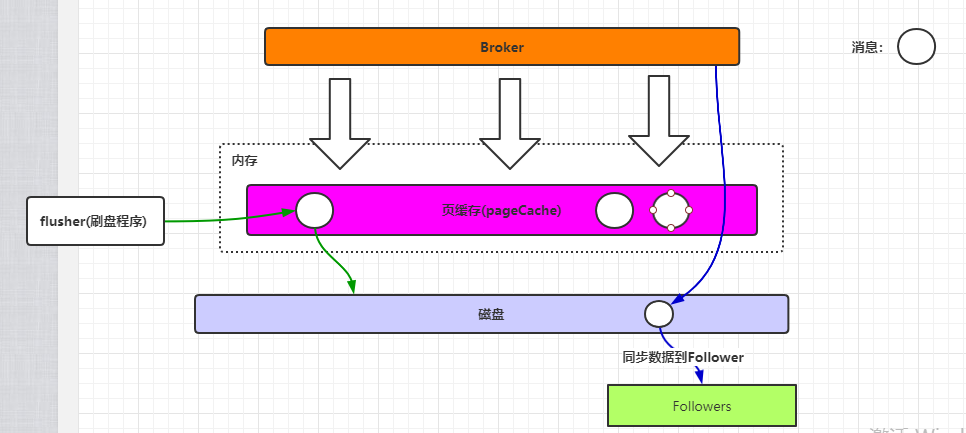
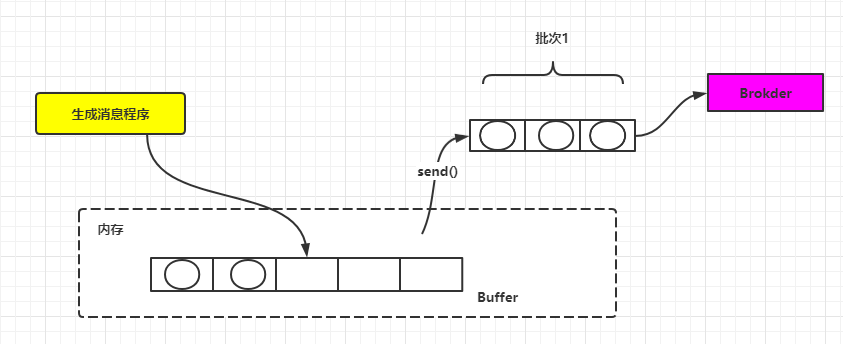
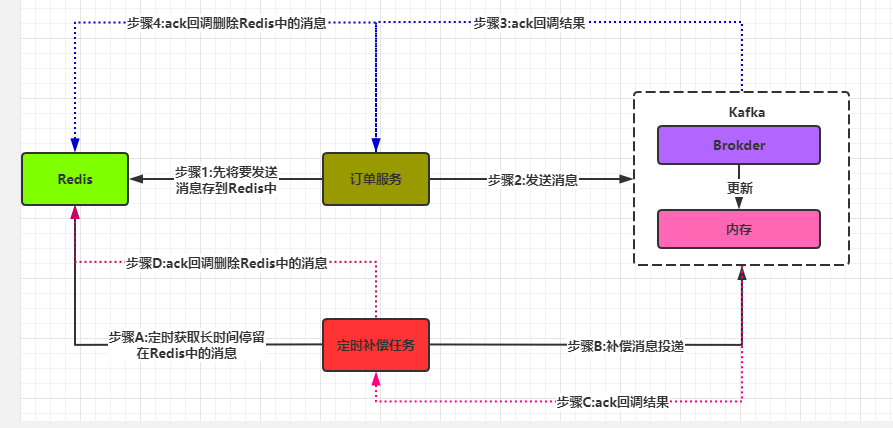

## Kafka数据丢失原因

Kafka存在数据丢失问题，主要存在在Broker，Producer。

### Broker刷盘机制

Broker丢失消息是由于Kafka本身的原因造成的，kafka为了得到更高的性能和吞吐量，将数据异步批量的存储在磁盘中。消息的刷盘过程，为了提高性能，减少刷盘次数，kafka采用了批量刷盘的做法。即，按照一定的消息量，和时间间隔进行刷盘。这种机制也是由于linux操作系统决定的。将数据存储到linux操作系统种，会先存储到页缓存（Page cache）中，按照时间或者其他条件进行刷盘（从page cache到file），或者通过fsync命令强制刷盘。数据在page cache中时，如果系统挂掉，数据会丢失。

如图所示，Broker在保存数据时，首先先将数据存到内存中的页缓存中，然后Linux的flusher程序会在特定情况下将页缓存中的数据刷到磁盘中落地。触发刷盘的条件有：主动调用sync或fsync函数。可用内存低于阀值。dirty data时间达到阀值。 所以说从理论上来，要解决Broker不丢失数据是无法实现的，只能通过调整刷盘机制的参数缓解该情况。

为了解决该问题，kafka通过producer和broker协同处理单个broker丢失参数的情况，一旦producer发现broker消息丢失，即可自动进行retry。那么producer是如何检测Broker丢失的呢？ 答案就是`ack`参数。

- acks=0，producer不等待broker的响应，效率最高，但是消息很可能会丢。
- acks=1，leader收到消息后，不等待其他follower的响应，即返回ack。这种情况只能保证数据被写到PageCache后producer就认为陈工了，没法保证是否数据刷到磁盘和followers收到数据。
- ackas=all，leader收到消息后，挂起，等待所有ISR列表中的follower返回结果后。这种配置下，只有leader写入数据到pagecache是不会返回ack的，还需要所有的ISR返回“成功”才会触发ack，这个时候数据已经刷到磁盘了。

### Producer批量发送

为了提升效率减少IO，producer在发送数据时可以将多个请求进行合并后发送。被合并的请求咋发送一线缓存在本地buffer中。这也会产生断电后或者程序停止导致在buffer中的数据没法发送成功。

## 保证方案

从上面分析可知，Broker的刷盘机制和Producer批量发送导致了消息无法保证100%投递。如果要保证我们可以有如下方案：

- 对于Brokder，设置ack=all。可以保证消息不会丢失，但是吞吐率不高。
- 对于Producer，不直接将消息发送到buffer（内存），而是将消息写到本地的磁盘中（数据库或者文件），由另一个（或少量）生产线程进行消息发送。

上面的方案虽然能保证消息能100%投递，但是对于性能下降严重，一般生产不采纳。

下面介绍一种方案，**采用消息提前持久化 + 定时任务兜底的方式来保证**。

流程如上图所示：

1. 订单服务生产者再投递消息之前，先把消息持久化到Redis或DB中，建议redis，高性能。
2. 通过生产者回调机制判断是否发送成功，如果发送成功则将Redis中的数据删除。如果发送不成功的数据将还是存在Redis中。
3. 通过一个定时器定时拉取Redis中时间间隔较常的数据，时间间隔较常没被删除证明是没发送成功，此时获取出来重新发送。

不过这样的方案，就会有**可能发送多次相同的消息**，很有可能MQ已经收到了消息，就是ack消息回调时出现网络故障，没有让生产者收到。这要求我们必须能保证消费时支持幂等。