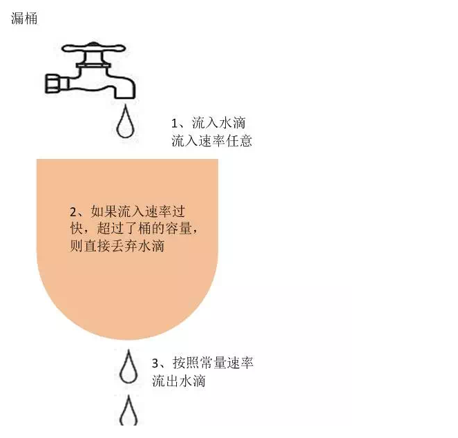
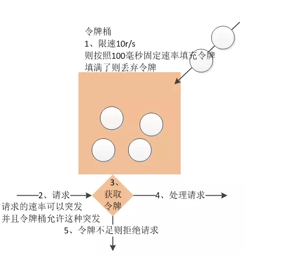

## 限流算法
常见限流算法常用的限流算法有：令牌桶，漏桶、滑动窗口算法。
### 漏桶算法
#### 算法介绍
漏桶算法的描述如下：

- 一个固定容量的漏桶，按照常量固定速率流出水滴
- 如果桶是空的，则不需流出水滴
- 可以以任意速率流入水滴到漏桶
- 如果流入水滴超出了桶的容量，则流入的水滴溢出了（被丢弃），而漏桶容量是不变的



漏桶算法思路很简单，水（请求）先进入到漏桶里，漏桶以一定的速度出水，当水流入速度过大会直接溢出，可以看出漏桶算法能强行限制数据的传输速率。
我们将请求比喻成图上的流入水滴，水桶的容量表示最大能容纳的请求数，因为桶下面的流出率是固定的，当流入水滴(请求)过大时会造成水溢出，溢出的水滴(请求)则直接丢弃。
可见这里有两个变量,一个是桶的大小,支持流量突发增多时可以存多少的水(burst),另一个是水桶漏洞的大小(rate)。

#### 特点和局限性
由于漏桶算法的流出速率是固定的，所以对于一些业务场景下要求能够突发传输，这时候漏桶算法就不适用了。
### 令牌桶算法
#### 算法介绍
令牌桶算法是一个存放固定容量令牌的桶，按照固定速率往桶里添加令牌。
- 假设限制2r/s，则按照500毫秒的固定速率往桶中添加令牌；
- 桶中最多存放b个令牌，当桶满时，新添加的令牌被丢弃或拒绝；
- 当一个n个字节大小的数据包到达，将从桶中删除n个令牌，接着数据包被发送到网络上；
- 如果桶中的令牌不足n个，则不会删除令牌，且该数据包将被限流（要么丢弃，要么缓冲区等待）。


#### 特点和局限性
令牌桶限制的是平均流入速率（允许突发请求，只要有令牌就可以处理，支持一次拿3个令牌，4个令牌），并允许一定程度突发流量

## Guava 限流
Guava RateLimiter提供了令牌桶算法实现：平滑突发限流(SmoothBursty)和平滑预热限流(SmoothWarmingUp)实现。
```
//表示消费permits个令牌,如果桶中令牌足够则返回0.0,如果令牌不足则需要阻塞等待到令牌足够后才执行。
limiter.acquire(int permits)
//表示一次性获取permits个令牌，判断如果在timeout秒内能获取得到令牌则阻塞直到获取到令牌，如果不行就直接返回false
limiter.tryAcquire(int permits,long timeout, TimeUnit unit)
```

### 平滑突发限流
这种实现将突发请求速率平均为了固定请求速率
```
//表示桶容量初始为5，且每秒5个的速率新增令牌，即每隔200毫秒新增一个令牌
RateLimiter limiter = RateLimiter.create(5);
```
```
RateLimiter limiter = RateLimiter.create(5);
System.out.println(limiter.acquire(200));
long start = System.currentTimeMillis();
System.out.println(limiter.acquire(1));
System.out.println((System.currentTimeMillis() - start) + " ms");
//输出结果
//0.0
//39.973065
//39980 ms
```
首先创建了一个容量初始为5，且每秒5个的速率新增令牌，即每隔200毫秒新增一个令牌。
第一次调用acquire(200)从桶中获取200个令牌，由于令牌桶是支持突发的，所以第一次允许获取200个，当第二次调用acquire(1)从桶中获取1个令牌时，由于前面透支了，按照每秒5个的速率则需要在40秒后才能获得令牌，所以需要**阻塞等待**桶中补充令牌。
## 参考
- https://blog.csdn.net/John8169/article/details/81125706
- https://my.oschina.net/hanchao/blog/1833612?appinstall=0