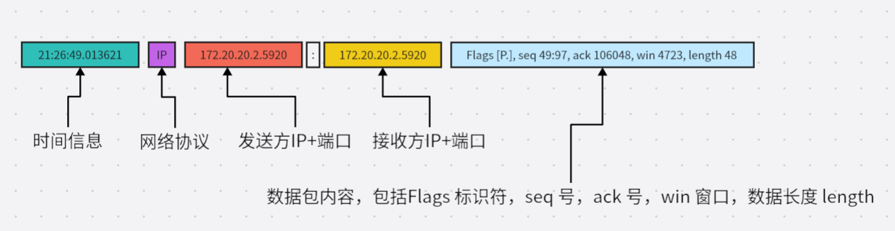

## TCP

传输控制协议（*TCP*，Transmission Control Protocol）是一种<font color=red>面向连接的</font>、<font color=red>可靠的</font>、<font color=red>基于字节流</font>的传输层通信协议。本人是这样理解面向连接和可靠性的。

面向连接指的客户端/服务器在使用TCP进行数据传输时必须先建立一个TCP连接。连接的手段就是进行三次握手，关闭时需要四次挥手。

可靠性指的是保证发送的数据<font color=red>无差错，无重复，按顺序，不丢失</font>。可靠性的保证主要通过如下手段实现：

- 序列号，ACK信号：发送方按照顺序给要发送的数据包的每个字节都标上编号。接收方接收到发送方的数据包之后，回传一个ACK信号，标识下一个需求的数据包初始字节编号。（可以保证顺序）
- 超时重发：在等待接收方回传的ACK信号超时后，发送方重发数据包。一旦开始重传，下一次等待的时间间隔指数增长，重发一定次数后还是收不到ACK信号，将强制终止连接。
-  TCP的连接管理：建立连接的三次握手和断开连接的四次挥手。（保证安全）
- 以段为单位发送数据包：在建立TCP连接的同时，两端协商发送数据包的单位，称为“最大消息长度”：MSS。
-  滑动窗口：以段为单位发送数据包，每发送一个数据包需要等待一个ACK信号，当数据包往返时间越长效率越低。滑动窗口中窗口前端为已发送但为收到ACK的数据，后端为待发送数据。发送端一次发送多个数据，接收端回传收到的连续数据的ACK信号，缓存缺失数据之后的数据包(保持顺序)。发送端当收到ACK信号时，窗口向前依次移动，直到遇到有数据未确认时停止。一段时间后启动超时重传，接收端若收到缺失数据，则和缓存数据一起发送ACK信号，否则，抛弃缓存数据。
- 流量控制：TCP首部有一个字段来通知窗口的大小，接收端通过设置来主动控制传输流量。
- 拥塞控制：发送端通过拥塞窗口主动控制传输流量。慢启动：防止双方通信刚开始就传送大量数据包，发送端拥塞窗口初始设置为1MSS，每接受一个ACK信号，窗口扩大为两倍。发送数据时，取拥塞窗口和滑动窗口的较小值。同时设定一个慢启动阈值，当拥塞窗口大小超过阈值时，改为线性增长，直到网络拥塞。拥塞时将慢启动阈值设置为当前窗口的的一半，并将拥塞窗口的值设置为1，然后再次重复操作。

## TCP三次握手和四次挥手

一个正常的TCP连接，都会有三个阶段:

- TCP三次握手。
- 数据传送。
- TCP四次挥手。


### 三次握手


**三次握手说明：**

1. 客户端发送TCP连接的请求报文，其中SYN=1表示建立TCP连接，seq表示序列号，x为随机序列号。客户端发送后将自己的状态设置成`SYN_SENT`状态。
2. 服务单回复客户都按发送的TCP请求报文，seq=y表示序列号，y由服务端生成的随机数,SYN=1表示建立TCP连接（服务端也回复这个，表示我同意建立连接了），而且会产生ack字段，ack字段数值是在客户端发送过来的序列号seq的基础上加1进行回复，以便客户端收到信息时，知晓自己的TCP建立请求已得到验证，这里的ack加1可以理解为是确认和谁建立连接。
3. 客户端收到服务端发送的TCP建立验证请求后，会使自己的序列号加1表示，并且再次回复ACK验证请求，在服务端发过来的seq上加1进行回复。（SYN=1，ACK=y+1，seq=x+1）。

上面的SYN，seq，ack我们可以缕一缕意思。

- 其中SYN表示是要建立TCP连接，所以值都是为1。
- seq表示发送的序列号，ack表示报文到达的确认。所以我们可以看到客户端假设发了seq=100，那么服务端确认后就发ack=100+1表示我确认了。然后服务端回复时也发了一个seq=200（这里200是图中的y），客户端确认后发送ack=200+1。
- seq和ack的作用是保证传输可靠性，顺序性。

### 四次挥手


1. 客户端发送TCP断开请求的报文，其中FIN=1表示要断开连接的请求，seq表示序列号，x是随机生成的。
2. 服务端收到请求后回复客户端，ack表示回复确认，seq=y随机序列号。
3. 第二步服务端回复完客户端后并不是一下子就断开，服务端需要保障所有传输到客户端的数据是否已经传输完毕，如果完毕了然后发送FIN=1表示我同意断开了，然后seq=y就是发送自己这边的随机序列号。
4.客户端收到服务端的TCP断开请求后，会回复服务端的断开请求，包含随机生成的seq字段和ACK字段，ACK字段会在服务端的TCP断开请求的seq基础上加1，从而完成服务端请求的验证回复。

### TCP的11种状态


1. 一开始，建立连接之前服务器和客户端的状态都为CLOSED。
2. 服务器创建socket后开始监听，变为LISTEN状态。
3. 客户端请求建立连接，向服务器发送SYN报文，客户端的状态变味SYN_SENT。
4. 服务器收到客户端的报文后向客户端发送ACK和SYN报文，此时服务器的状态变为SYN_RCVD。
5. 然后，客户端收到ACK、SYN，就向服务器发送ACK，客户端状态变为ESTABLISHED。
6. 服务器端收到客户端的ACK后变为ESTABLISHED。此时3次握手完成，连接建立。


由于TCP连接是全双工的，断开连接会比建立连接麻烦一点点。 
1. 客户端先向服务器发送FIN报文，请求断开连接，其状态变为FIN_WAIT1； 
2. 服务器收到FIN后向客户端发送ACK，服务器的状态变成CLOSE_WAIT； 
3. 客户端收到ACK后就进入FIN_WAIT2状态，此时连接已经断开了一半了。如果服务器还有数据要发送给客户端，就会继续发送； 
4. 直到发完数据，就会发送FIN报文，此时服务器进入LAST_ACK状态； 
5. 客户端收到服务器的FIN后，马上发送ACK给服务器，此时客户端进入TIME_WAIT状态； 
6. 再过了2MSL长的时间后进入CLOSED状态。服务器收到客户端的ACK就进入CLOSED状态。 
至此，还有一个状态没有出来：CLOSING状态。 

**状态解释**

| 状态         | 说明                                                         |
| ------------ | ------------------------------------------------------------ |
| LISTEN       | 等待从任何远端TCP 和端口的连接请求                           |
| SYN_SENT     | 发送完一个连接请求后等待一个匹配的连接请求                   |
| SYN_RECEIVED | 发送连接请求并且接收到匹配的连接请求以后等待连接请求确认     |
| ESTABLISHED  | 连接完成，连接的数据传输阶段的正常状态                       |
| FIN_WAIT_1   | 等待远端TCP的连接终止请求，或者等待之前发送的连接终止请求的确认 |
| FIN_WAIT_2   | 等待远端TCP的连接终止请求                                    |
| CLOSE_WAIT   | 等待本地用户的连接终止请求                                   |
| CLOSING      | 等待远端TCP的连接终止请求确认                                |
| LAST_ACK     | 等待先前发送给远端TCP的连接终止请求的确认                    |
| TIME_WAIT    | 等待足够的时间过去以确保远端TCP 接收到它的连接终止请求的确认 |

### 常见问题

参考：https://juejin.cn/post/6900439208641921038

**为什么TCP协议要三次握手来确立连接，而不是两次，也不是4次**

首先要理解TCP是面向连接的，所以他需要通过握手来建立连接。TCP也是可靠性的，他通过什么来保证可靠性呢？序列号，通过序列号来保证消息的有序性， 三次握手的过程即是通信双方相互告知序列号起始值， 并确认对方已经收到了序列号起始值的必经步骤，那为什么不是两次？

https://blog.csdn.net/lengxiao1993/article/details/82771768

**两次握手过程**

1. A发送同步信号SYN + sequence
2. B收到A的消息后，发送同步信号 SYN +  sequence + ACK（表示对A同步信号的确认）

到此，如果只有两次，A能确定收到B的同步信号，但是B没法确定A是否收到自己发送的同步信号。这样可能造成的问题是，假如A发送了第一个连接请求后由于网络问题滞留，到了某个时间才到达B，此时这个报文是无效的，但是由于只有两次握手，B同意连接后发送ACK给A，A对于这个失效的报文不会理睬，导致B端一直等待浪费资源。

**TCP报文结构**


其中，

- 源端口和目的端口。
- 位序号（seq）和确认号（ack）这个就是TCP通信时发送的，确认号而是和序列号配合使用的，应答某次请求时，则返回一个确认号，它的值等于对方请求序列号加1。
- 6个标志位分别是，URG：这是条紧急信息，ACK:应答消息，PSH:缓冲区尚未填满，RST:重置连接，SYN:建立连接消息标志，FIN：连接关闭通知信息。
- 滑动窗口大小，用来告知发送端接受端的缓存大小，以此控制发送端发送数据的速率，从而达到流量控制。窗口大小时一个16bit字段，因而窗口大小最大为65535。

**TCP为什么说是可靠连接的**

TCP的连接是基于三次握手，而断开则是四次挥手。为了保障数据不丢失及错误（可靠性），它有报文校验、ACK应答、超时重传(发送方)、失序数据重传（接收方）、丢弃重复数据、流量控制（滑动窗口）和拥塞控制等机制。

**挥手时主动断开方状态在TIME_WAIT后为什么要等2MSL后才断开**

1. TIME_WAIT的作用是为了保证最后一次挥手的ACK报文能送达给对方，如果ACK丢失，对方会超时重传FIN，主动关闭端会再次响应ACK过去；如果没有TIME_WAIT状态，直接关闭，对方重传的FIN报文则被响应一个RST报文，此RST会被动关闭端被解析成错误。
2. MSL指的是"报文最大生存时间"，等待这个时间使本次连接所产生的报文段都从网络上消失，保证下一次的连接不会出现这种旧的连接请求的报文段。

**TIME_WAIT和CLOSE_WAIT的区别**

CLOSE_WAIT是被动关闭形成的，当对方发送FIN后，自己回应ACK后进入CLOSE_WAIT状态，随后检查是否存在未传输数据，如果没有则发起第三次挥手，发送FIN报文给对方，进入LAST_ACK状态并等待对方ACK报文到来。

TIME_WAIT是主动关闭连接方式形成的；处于FIN_WAIT_2状态时，收到对方FIN报文后进入TIME_WAIT状态；之后再等待两个MSL(Maximum Segment Lifetime:报文最大生存时间)。

**TCP和UDP的区别**

1. udp是无连接的，tcp是面向连接的。
2. udp是不可靠传输，tcp是可靠传输。
3. udp是面向报文传输，tcp是面向字节流传输。
4. udp不会发生粘包拆包，tcp会发生。

**TCP的粘包拆包是怎么回事？如何解决？**

网络通信采用的套接字(socket)技术，其实现实际是由系统内核提供一片连续缓存(流缓冲)来实现应用层程序与网卡接口之间的中转功能。多个数据包被连续存储于连续的缓存中，每个数据包的大小是不规定的。在对数据包进行读取时采用某一估测值大小（滑动窗口）来进行数据读出。例如缓冲里面目前有pag1=100字节，pag2=200字节，而我们采用估测值大小300字节的去读取的时候会将pag1,pag2都读取出来就发生了粘包。拆包同理，且拆包的话还有可能是大于MSS（最大报文长度），TCP在传输前将进行拆包了。

解决方法:

1. 在数据尾部增加特殊字符进行分割
2. 将数据定为固定大小，少于固定大小的用填充数据填充
3. 将数据分为两部分，一部分是头部，一部分是内容体。其中头部结构大小固定，且有一个字段声明内容体的大小

https://zhuanlan.zhihu.com/p/90057929

**Linux系统支持的最大TCP连接是多少**

https://zhuanlan.zhihu.com/p/138263151

https://blog.csdn.net/sqlquan/article/details/111561959

**nagle算法有了解吗**

## netstat

netstat命令用于显示与IP、TCP、UDP和ICMP协议相关的统计数据，一般用于检验本机各端口的网络连接情况。netstat是在内核中访问网络及相关信息的程序，它能提供TCP连接，TCP和UDP监听，进程内存管理的相关报告。

这个命令的参数太多，一般来说我们都是用它来查TCP连接的，然后看连接的状态对比对。

```shell
[root@Master1 ~]# netstat -ant #t表示只有展示TCP协议
Active Internet connections (servers and established)
Proto Recv-Q Send-Q Local Address               Foreign Address             State      
tcp        0      0 0.0.0.0:63501               0.0.0.0:*                   LISTEN    
tcp        1      0 127.0.0.1:44176             127.0.0.1:60047             CLOSE_WAIT  
tcp        0      0 10.8.198.151:60884          10.8.2.30:61235             TIME_WAIT   
tcp        0      0 10.8.198.151:55672          10.8.2.27:61235             TIME_WAIT   
tcp        0      0 10.8.198.151:60882          10.8.2.30:61235             TIME_WAIT   
tcp        0      0 10.8.198.151:63501          10.8.133.245:59893          ESTABLISHED 
tcp        0      0 10.8.198.151:60976          10.8.2.30:61235             TIME_WAIT    
tcp        0      0 ::ffff:127.0.0.1:9600       :::*                        LISTEN      
tcp        0      0 :::63501                    :::*                        LISTEN          
tcp        0      0 ::ffff:10.8.198.151:60061   ::ffff:10.8.198.135:63751   ESTABLISHED 
tcp        0      0 ::ffff:10.8.198.151:60050   ::ffff:10.8.198.135:63751   ESTABLISHED 
tcp        1      0 ::1:60047                   ::1:43724                   CLOSE_WAIT  
tcp        0      0 ::ffff:10.8.198.151:45024   ::ffff:10.8.198.135:63751   ESTABLISHED 
tcp        0      0 ::ffff:10.8.198.151:43592   ::ffff:10.8.215.65:34710    TIME_WAIT  
#Local Address - 源IP/端口
#Foreign Address - 目标IP/端口
#State 状态 - 对应上面说的TCP11个状态
```

netstat命令有很多参数，这里就不一一说了。这个命令能帮助我们了解到具体的TCP的连接情况，例如我们可以通过如下命令知道当前服务器连接MySQL的状态。

```
netstat -ant | grep 3306
```

## tcpdump

用来抓包tcp协议的命令

```shell
tcpdump -n port 3306 #监控端口3306的TCP情况抓包 -n不把网络地址转换为名字
# 发生了 3次握手
11:38:15.679863 IP 172.18.0.5.38822 > 172.18.0.3.3306: Flags [S], seq 4065722321, win 29200, options [mss 1460,sackOK,TS val 2997352 ecr 0,nop,wscale 7], length 0
11:38:15.679923 IP 172.18.0.3.3306 > 172.18.0.5.38822: Flags [S.], seq 780487619, ack 4065722322, win 28960, options [mss 1460,sackOK,TS val 2997352 ecr 2997352,nop,wscale 7], length 0
11:38:15.679936 IP 172.18.0.5.38822 > 172.18.0.3.3306: Flags [.], ack 1, win 229, options [nop,nop,TS val 2997352 ecr 2997352], length 0
```

```shell
# 监控端口3306的TCP情况并且截获所有10.8.152.162 的主机收到的和发出的所有的数据包
tcpdump -i eth0 -n port 3306 and host 10.8.152.162 
# 截获主机210.27.48.1 和主机210.27.48.2 或210.27.48.3的通信
tcpdump host 210.27.48.1 and \ (210.27.48.2 or 210.27.48.3 \) 
# 果想要获取主机210.27.48.1接收或发出的telnet包,并输入到tcp.pacp文件
tcpdump -i eth0 tcp port 8080 and host 210.27.48.1 -w tcp.pacp
```

### tcp返回结果解析



```
21:26:49.013621 IP 172.20.20.1.15605 > 172.20.20.2.5920: Flags [P.], seq 49:97, ack 106048, win 4723, length 48
```

从上面的输出来看，可以总结出：

1. 第一列：时分秒毫秒 21:26:49.013621
2. 第二列：网络协议 IP
3. 第三列：发送方的ip地址+端口号，其中172.20.20.1是 ip，而15605 是端口号
4. 第四列：箭头 >， 表示数据流向
5. 第五列：接收方的ip地址+端口号，其中 172.20.20.2 是 ip，而5920 是端口号
6. 第六列：冒号
7. 第七列：数据包内容，包括Flags 标识符，seq 号，ack 号，win 窗口，数据长度 length，其中 [P.] 表示 PUSH 标志位为 1，更多标识符见下面

使用 tcpdump 抓包后，会遇到的 TCP 报文 Flags，有以下几种：

- `[S]` : SYN（开始连接）
- `[P]` : PSH（推送数据）
- `[F]` : FIN （结束连接）
- `[R]` : RST（重置连接）
- `[.]` : 没有 Flag （意思是除上面四种类型外的其他情况，有可能是 ACK 也有可能是 URG）

## 参考

- https://juejin.cn/post/6844903734300901390
- [Linux tcpdump命令详解](https://www.cnblogs.com/ggjucheng/archive/2012/01/14/2322659.html)
- [wireshark抓包新手使用教程](https://www.cnblogs.com/mq0036/p/11187138.html)
- https://www.cnblogs.com/wongbingming/archive/2020/06/30/13212306.html