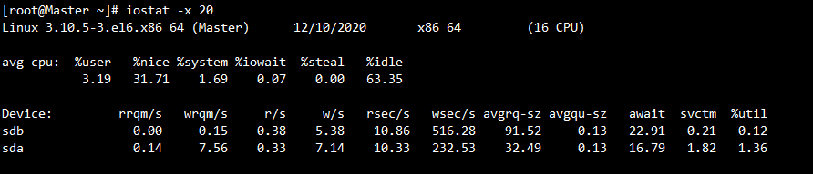

## top命令详解
### 各项指标详解


#### 第一行：系统运行时间和平均负载
```shell
top - 14:46:47 up 909 days,  3:15,  1 user,  load average: 1.80, 1.50, 1.37
```
- 14:46:47 表示当前系统时间
- up 909 days 表示已经运行了909天期间没重启
- 1 user 表示当前登录的用户数量
- load average: 1.80, 1.50, 1.37 表示当前系统5分钟;10分钟;15分钟的负载
<font color=red>load average数据是每隔5秒钟检查一次活跃的进程数，然后按特定算法计算出的数值。如果这个数除以逻辑CPU的数量，结果高于5的时候就表明系统在超负荷运转了。</font>

#### 第二行：任务信息
```shell
Tasks: 652 total,   1 running, 651 sleeping,   0 stopped,   0 zombie
```
- total : 当前系统的任务进程个数
- runnning : 正在运行的任务进程个数
- sleeping : 正在休眠的任务进程个数
- stopped : 已经终止的任务进程个数
- zombie : 僵尸进程个数

running 表示在运行，占用cpu，sleeping则多半是在等待（比如等IO完成），所以大部分进程在sleeping是很正常的，否则都在running，cpu都不够用了.

#### 第三行：CPU信息
```shell
Cpu(s):  3.8%us,  0.4%sy,  0.0%ni, 95.7%id,  0.1%wa,  0.0%hi,  0.0%si,  0.0%st
```
- us — 用户空间占用CPU的百分比。
- sy — 内核空间占用CPU的百分比。
- ni — 改变过优先级的进程占用CPU的百分比
- id — 空闲CPU百分比
- wa — IO等待占用CPU的百分比
- hi — 硬中断（Hardware IRQ）占用CPU的百分比
- si — 软中断（Software Interrupts）占用CPU的百分比

这里的内核态和用户态可以这样理解：
- 当一个任务（进程）执行系统调用而陷入内核代码中执行时，称进程处于内核运行态（内核态）。
- 当进程在执行用户自己的代码时，则称其处于用户运行态（用户态）。

#### 第四五行：内存信息
```shell
Mem:  231349636k total, 72512612k used, 158837024k free,   299360k buffers
Swap:  8388600k total,        0k used,  8388600k free,  3648000k cached
```
- Mem
 - total 物理内存重量
 - used 使用中的内存总量
 - free 空间内存总量
 - buffers 缓存的内存量
- swap交换分区 具体值与上面的Mem一样,只是是对应交换分区的

#### 各任务状态监控
```
   PID USER      PR  NI  VIRT  RES  SHR S %CPU %MEM    TIME+  COMMAND
   10840 tomcat  20   0 68.0g  21g  14m S  0.3  9.8  71:32.92 jsvc     
```
- PID：进程ID，进程的唯一标识符
- USER：进程所有者的实际用户名。
- PR：进程的调度优先级。这个字段的一些值是'rt'。这意味这这些进程运行在实时态。
- NI：进程的nice值（优先级）。越小的值意味着越高的优先级。负值表示高优先级，正值表示低优先级
- VIRT：进程使用的虚拟内存。进程使用的虚拟内存总量，单位kb。VIRT=SWAP+RES
- RES：驻留内存大小。驻留内存是任务使用的非交换物理内存大小。进程使用的、未被换出的物理内存大小，单位kb。RES=CODE+DATA
- SHR：SHR是进程使用的共享内存。共享内存大小，单位kb
- S：这个是进程的状态。它有以下不同的值:
 - D - 不可中断的睡眠态。
 - R – 运行态
 - S – 睡眠态
 - T – 被跟踪或已停止
 - Z – 僵尸态
- %CPU：自从上一次更新时到现在任务所使用的CPU时间百分比。
- %MEM：进程使用的可用物理内存百分比。
- TIME+：任务启动后到现在所使用的全部CPU时间，精确到百分之一秒。
- COMMAND：运行进程所使用的命令。进程名称（命令名/命令行）

### top 常用参数命令
- top -p PID 只监控某一个进程
- top -c c表示展示完整命令行
- top -Hp PID 查看指定进程的线程数的信息 <font>这个通常可以配合jstack来判断哪个线程占用CPU或者内存多</font>
- top -u tomcat 查看进程用户是tomcat的任务

### top 常用交互命令
在top视图下，我们可以键入一些命令在帮助我们获得不同的视图


#### 常用键盘
- P ：根据CPU使用百分比大小进行排序
- M ：根据驻留内存大小进行排序
- c ：切换显示命令名称和完整命令行
- T ：根据时间/累计时间进行排序
- q ：退出程序
- 1 ：可以展示每个CPU的使用情况
- u ：键入后会提示输出需要查看的用户名，然后就可以只查看对应用户名的任务

## vmstat - 监控整体CPU,内存,IO使用情况
### 所谓的IO

所谓的I/O（Input/Output）操作实际上就是输入输出的数据传输行为。程序员最关注的主要是磁盘IO和网络IO，因为这两个IO操作和应用程序的关系最直接最紧密。

- 磁盘IO：磁盘的输入输出，比如磁盘和内存之间的数据传输。

- 网络IO：不同系统间跨网络的数据传输，比如两个系统间的远程接口调用。

### 介绍

vmstat命令是最常见的Linux/Unix监控工具，可以展现给定时间间隔的服务器的状态值,包括服务器的CPU使用率，内存使用，虚拟内存交换情况,IO读写情况。
相比top命令，这个命令可以看到<font color=red>整个CPU,内存,IO的使用情况</font>而不是单单看到各个进程的CPU使用率和内存使用率

vmstat 3 2 表示 间隔3秒获取一次信息，一共获取2次

```shell
[ssh~]$ vmstat 3 2
procs -----------memory---------- ---swap-- -----io---- --system-- -----cpu-----
 r  b   swpd   free   buff  cache   si   so    bi    bo   in   cs us sy id wa st
 1  0      0 163756688 272168 3186404    0    0     0    11    0    0  4  0 96  0  0	
 1  0      0 163758912 272168 3186424    0    0     0    72 8156 4923 14  0 85  0  0	
```
### 输出参数介绍

| 名称             | 说明                                                         |
| ---------------- | ------------------------------------------------------------ |
| r                | 表示多少个进程分配到CPU,如果值超过CPU个数表示到CPU瓶颈了     |
| b                | 表示阻塞的进程                                               |
| swpd (内存相关)  | 虚拟内存已使用的大小，如果大于0，表示你的机器物理内存不足了  |
| free (内存相关)  | 空闲的物理内存的大小,目前我这个机器还有163758M空闲内存       |
| buff (内存相关)  | 已用的buff大小，对块设备的读写进行缓冲                       |
| cache (内存相关) | 已用的cache大小，文件系统的cache                             |
| si (swap相关)    | 每秒从交换区写入内存的大小（单位：kb/s）                     |
| so (swap相关)    | 每秒从内存写到交换区的大小                                   |
| bi (IO相关)      | 块设备每秒接收的块数量，这里的块设备是指系统上所有的磁盘和其他块设备 |
| bo (IO相关)      | 块设备每秒发送的块数量，例如我们读取文件，bo就要大于0。bi和bo一般都要接近0，不然就是IO过于频繁，需要调整。 |
| in               | 每秒CPU的中断次数，包括时间中断                              |
| cs               | 每秒上下文切换次数，例如我们调用系统函数，就要进行上下文切换，线程的切换，也要进程上下文切换. |
| us (CPU相关)     | 用户进程执行消耗cpu时间                                      |
| sy (CPU相关)     | 系统进程消耗cpu时间                                          |
| id (CPU相关)     | 空闲时间(包括IO等待时间)                                     |
| wa (CPU相关)     | 等待IO时间.                                                  |

### 注意点

- bi 和 bo 随机磁盘读写的时候，这两个值越大(如超出1024k)能看到CPU在IO等待的值也会越大。
- cs上下文切换次数的值越小越好，太大了需要考虑调低线程或进程的数目。<font color=red>上下文切换次数过多表示你的CPU大部分浪费在上下文切换，导致CPU没有充分被利用</font>
- us的值比较高时，说明用户进程消耗的cpu时间多，如果长期超过50%使用，需要考虑优化程序
- sy如果太高，表示系统调用时间长，例如是IO操作频繁

## iostat -  监控系统设备的IO负载情况

### 介绍

iostat工具对系统的磁盘操作活动进行监视。它的特点是汇报磁盘活动统计情况，同时也会汇报出CPU使用情况。

<font>可以认为iostat主要是通过监控磁盘来看IO负载</font>

```shell
-c 显示CPU使用情况
-d 显示磁盘使用情况
-k 以K为单位显示
-m 以M为单位显示
-N 显示磁盘阵列(LVM) 信息
-n 显示NFS使用情况
-p 可以报告出每块磁盘的每个分区的使用情况
-t 显示终端和CPU的信息
-x 显示详细信息
```

iostat -d -k -x 20 # 表示间隔20秒输出一次信息



### 参数说明

- Device ：设备名称
- rrqm/s ：每秒合并到设备的读取请求数
- wrqm/s ：每秒合并到设备的写请求数
- r/s ：每秒向磁盘发起的读操作数
- w/s ：每秒向磁盘发起的写操作数
- rkB/s ：每秒读K字节数
- wkB/s:每秒写K字节数
- avgrq-sz ：平均每次设备I/O操作的数据大小
- avgqu-sz ：平均I/O队列长度
- await ：平均每次设备I/O操作的等待时间 (毫秒)，<font color=red>一般地，系统I/O响应时间应该低于5ms，如果大于 10ms就比较大了</font>
- r_await ：每个读操作平均所需的时间；不仅包括硬盘设备读操作的时间，还包括了在kernel队列中等待的时间
- w_await ：每个写操作平均所需的时间；不仅包括硬盘设备写操作的时间，还包括了在kernel队列中等待的时间
- svctm ：平均每次设备I/O操作的服务时间 (毫秒)（这个数据不可信！）
- %util ：一秒中有百分之多少的时间用于I/O操作，即被IO消耗的CPU百分比，<font color=red>一般地，如果该参数是100%表示设备已经接近满负荷运行了</font>

## free命令 -- 查看内存使用

主要用来展示内存使用。其实也可以用top 和 vmstat 。 这里不过多介绍了

```shell
[watch@localhost ~]$ free -g  # -g 表示按照GB的方式展示
             total       used       free     shared    buffers     cached
Mem:           220         64        156          0          0          3
-/+ buffers/cache:         61        159
Swap:            7          0          7
```

## df命令 -- 文件系统的磁盘空间使用情况

```shell
[watch@localhost ~]$ df -h #-h以易读的GB、MB、KB等格式显示
Filesystem      Size  Used Avail Use% Mounted on
/dev/sda3       909G   57G  844G   7% /
tmpfs           111G   16K  111G   1% /dev/shm
/dev/sda1       485M  125M  335M  28% /boot
/dev/sdb1       1.5T   16G  1.5T   2% /cache1
```

## iotop -- 精确到进程的IO监控

Linux下的IO统计工具如iostat,top等大多数是只能统计到总体的读写情况, 如果你想知道每个进程是如何使用IO的就比较麻烦.

iotop 类似与top界面，可以查看各个进程使用IO的情况。
iotop -p PID 指定某个PID进行监控
```shell
[watch@localhost ~]$ iotop
Total DISK READ:       6.01 M/s | Total DISK WRITE:       3.85 K/s
  TID  PRIO  USER     DISK READ  DISK WRITE  SWAPIN     IO>    COMMAND                                                                                                          
20074 be/4 hadoop      6.01 M/s    0.00 B/s  0.00 %  4.54 % java -Dproc_datanode -Xmx8192m -server  org.apache.hadoop.hdfs.server.datanode.DataNode
 6371 be/4 hadoop      0.00 B/s    3.25 M/s  0.00 %  0.00 % java -Dproc_datanode -Xmx8192m -server  org.apache.hadoop.hdfs.server.datanode.DataNode
 8497 be/4 hadoop      0.00 B/s    3.67 M/s  0.00 %  0.00 % java -Dproc_datanode -Xmx8192m -server  org.apache.hadoop.hdfs.server.datanode.DataNode
    1 be/4 root        0.00 B/s    0.00 B/s  0.00 %  0.00 % init
    2 be/4 root        0.00 B/s    0.00 B/s  0.00 %  0.00 % [kthreadd]
```
## netstat - 网络命令

查看服务器的请求数可以用下面命令

```shell
netstat -na |wc -l
netstat -anp | grep 3306 | wc -l # 统计3306端口的连接数
```

## JVM调优命令 - jps

可以列出本机所有java进程的pid.
一般使用 jps -v 就行了。 -v 表示展示出详细的参数信息


## JVM调优命令 - jstat
监控堆内存的用量和GC情况。
使用格式如下 : jstat -gc PID 1000 20 # 表示使用-gc的方式打印PID的情况，间隔1000ms，打印20次


-gc 对应输出结果详解

- S0C:年轻代中第一个survivor（幸存区）的容量（字节）
- S1C:年轻代中第二个survivor（幸存区）的容量(字节)
- S0U:年轻代中第一个survivor（幸存区）目前已使用空间(字节)
- S1U:年轻代中第二个survivor（幸存区）目前已使用空间(字节)
- EC:年轻代中Eden（伊甸园）的容量(字节)
- EU:年轻代中Eden（伊甸园）目前已使用空间(字节)
- OC:Old代的容量(字节)
- OU:Old代目前已使用空间(字节)
- MC:metaspace(元空间)的容量(字节)
- MU:metaspace(元空间)目前已使用空间(字节)
- YGC:从应用程序启动到采样时年轻代中gc次数
- YGCT:从应用程序启动到采样时年轻代中gc所用时间(s)
- FGC:从应用程序启动到采样时old代(全gc)gc次数
- FGCT:从应用程序启动到采样时old代(全gc)gc所用时间(s)
- GCT:从应用程序启动到采样时gc用的总时间(s)

另外除了-gc外，jstat还可以输出其他信息，具体如下

- class:显示ClassLoad的相关信息；
- compiler:显示JIT编译的相关信息；
- gc:显示和gc相关的堆信息；
- gccapacity:显示各个代的容量以及使用情况；
- gcmetacapacity:显示metaspace的大小
- gcnew:显示新生代信息；
- gcnewcapacity:显示新生代大小和使用情况；
- gcold:显示老年代和永久代的信息；
- gcoldcapacity:显示老年代的大小；
- gcutil　　:显示垃圾收集信息；
- gccause:显示垃圾回收的相关信息（通-gcutil）,同时显示最后一次或当前正在发生的垃圾回收的诱因

那到底什么情况下，GC会对程序产生影响呢？ 一般来说需要判断<font color=red>FGC过于频繁、YGC耗时过长、FGC耗时过长、YGC过于频繁</font>


## JVM调优命令 - jmap
jmap主要用来帮助我们查看堆内存情况，并支持导出成dump文件以便后续分析。
<font color=red>导出dump文件会挂起JVM，所以一般再线上必须先切换机器后再执行</font>
```
jmap -heap PID # 打印堆的使用情况
jmap -histo:live PID | head -50 #打印每个class的实例数目,内存占用,类全名信息. 如果live子参数加上后,只统计活的对象数量. 一般可以通过这个命令查看哪个对象占用的内存不合理
jmap -dump:live,format=b,file=/tmp/xxxx.hprof PID #导出存活对象的dump文件以便后面分析。live可以不加，加了表示存活对象
```

## JVM调优命令-jstack

jstack主要用来分析线程执行情况。可以生成某个时刻java进程中线程的快照帮助分析，比如，发现服务器的CPU的负载突然增高了、出现了死锁、死循环等。

使用方法如下 :

```properties
jstack PID
jstack PID > /temp/PID.txt #将线程堆栈信息保存到文件
```

**在Java中线程的状态一共被分成6种**

- **初始状态**：New，线程对象创建出来后，没有调用start方法，线程处于初始状态
- **运行状态**：包含了就绪状态和运行状态
  - 就绪状态：Ready，调用了Start方法，等待CPU分配资源
  - 运行状态：RUNNING，CPU分配资源给该线程，该线程处于运行状态
- **阻塞状态** BLOCKED
- **等待状态** WAITING：线程手动调用了wait()方法，或者join()方法
- **超时等待状态** TIMED_WAITING：与等待状态相同，都是主动进入等待，也是需要其他线程唤醒，但是区别在与超时等待，如果超过了等待时间，则自动唤醒
- **终止状态** DIED：线程结束之后的状态

**案例1:排查线上tomcat占用CPU使用率高的原因**

CPU使用率高，CPU飙升一般都是程序运行有问题，我们可以通过查看占用CPU最高的线程看看到底执行了什么

1. 通过top命令查看当前使用CPU最高线程的是哪个进程，假设是tomcat，PID=10086
2. 通过top -Hp 10086 定位到是哪个线程占用的CPU最高，假设是线程4519
3. 算出4519的16进制，printf %x 4519 = 11a7
4. `jstack 1893 |grep -A 200 11a7` 通过jstack查看具体信息，分析出可能出现问题的代码块

**案例2:排查是否出现了死锁**

```shell
jstack PID | grep 'deadlock' #判断PID是否出现了死锁
```

## 总结

### 清楚从程序角度，有哪些原因导致FGC
- 大对象：系统一次性加载了过多数据到内存中（比如SQL查询未做分页），导致大对象进入了老年代。
- 内存泄漏：频繁创建了大量对象，但是无法被回收（比如IO对象使用完后未调用close方法释放资源），先引发FGC，最后导致OOM.
- 程序频繁生成一些长生命周期的对象，当这些对象的存活年龄超过分代年龄时便会进入老年代，最后引发FGC. （即本文中的案例）
- 程序BUG导致动态生成了很多新类，使得 Metaspace 不断被占用，先引发FGC，最后导致OOM.
- 代码中显式调用了gc方法，包括自己的代码甚至框架中的代码。
- JVM参数设置问题：包括总内存大小、新生代和老年代的大小、Eden区和S区的大小、元空间大小、垃圾回收算法等等。
### 如何避免IO问题带来的系统故障
- 对于磁盘文件访问的操作，可以采用线程池方式，并设置线程上线，从而避免整个JVM线程池污染，进而导致线程和CPU资源耗尽。
- 对于网络请求，为了避免服务间调用带来的全链路故障，可以设置合理的超时时间，并且高并发场景设置限流，熔断机制。

## 参考

- https://www.cnblogs.com/Diyo/p/11411157.html
- https://mp.weixin.qq.com/s/Vw63MUA0Zt80cU8_mvu7QQ