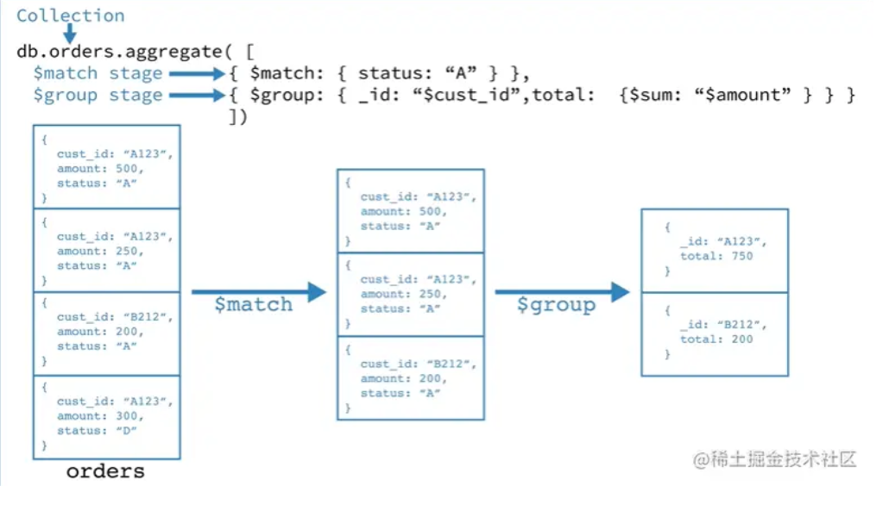
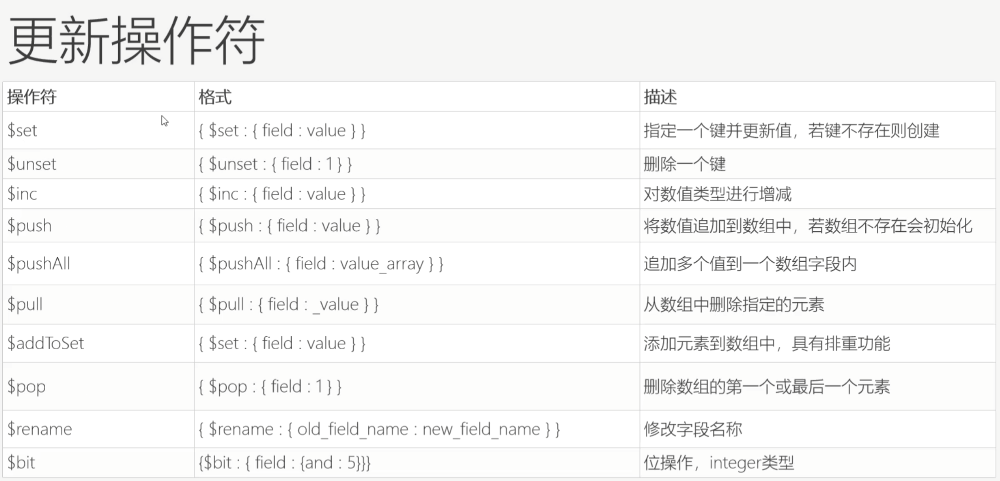

<!--more-->

## MongoDB与传统数据库的概念

| 传统     |        | MongoDB    |                         |
| -------- | ------ | ---------- | ----------------------- |
| 概念     | 说明   | 概念       | 说明                    |
| database | 数据库 | database   | 数据库                  |
| table    | 表     | collection | 集合                    |
| row      | 行     | document   | 文档                    |
| columm   | 列     | filed      | 字段: BJSON具体某个字段 |


## MongoDB入门命令

```sql
# 使用testdb数据库
use testdb


# 创建集合 集合规则可以省略
# capped :选填bool类型：设置改集合是否为一个固定集合true:代表固定集合，集合中的数据不可修改，与size配对使用，代表当集合达到指定大小后，会自动覆盖历史数据（最先添加的数据）
# size:选填数字类型：指定集合的最大存储数据（字节数），当集合达到指定大小后，会自动覆盖历史数据（最先添加的数据）
# max: 选填数字类型：指定集合的最大存储的文档总个数，当文档个数大于max值时，会自动替换历史文档
db.createCollection("集合名称", {集合规则});
db.createCollection("user001", {capped : true, size : 10000000, max});

# 集合删除
db.集合名称.drop();

# 插入数据
db.集合名称.insert(json对象|json对象数组);
db.user001.insert({name: "xzy", age : 10});
db.user001.insert([{name: "xzy01", age : 10},{name: "xzy01", age : 20}]);

# 更新数据
# query ：被更新文档条件json
# update：更新后的文档json
# option：更新方式json，参数格式为{ upsert: boolean, multi : boolean }
# upsert:非必填参数，如果不存在是否新增，当值为true时，如果没有符合条件的数据，就插入数据, ，默认为false
# multi: 非必填参数，是否更新符合要求的所有数据，当值为true时，符合条件的数据全部更新，默认为false
db.集合名称.update(query, update, option);
db.user001.update({name: "程序员修炼之旅"}, {$set: {age: 66, from: "CDU"}});

# 删除数据
# query :（可选）删除的文档的条件。
# justOne : （可选）如果设为 true 或 1，则只删除一个文档，如果不设置该参数，或使用默认值 false，则删除所有匹配条件的文档。
db.集合名称.remove(query, justOne);

# 查询数据
db.集合名称.find(json对象查询条件)

```

## MongoDB用户与权限

MongoDB的用户权限包括如下

| 权限名称             | 权限说明                                                     |
| -------------------- | ------------------------------------------------------------ |
| read                 | 允许用户读取指定数据库                                       |
| readWrite            | 允许用户读写指定数据库                                       |
| dbAdmin              | 允许用户在指定数据库中执行管理函数，如索引创建、删除，查看统计或访问system.profile |
| userAdmin            | 允许用户向system.users集合写入，可以找指定数据库里创建、删除和管理用户 |
| clusterAdmin         | **只在admin数据库中可用**，赋予用户所有分片和复制集相关函数的管理权限 |
| readAnyDatabase      | **只在admin数据库中可用**，赋予用户所有数据库的读权限        |
| readWriteAnyDatabase | **只在admin数据库中可用**，赋予用户所有数据库的读写权限      |
| userAdminAnyDatabase | **只在admin数据库中可用**，赋予用户所有数据库的userAdmin权限 |
| dbAdminAnyDatabase   | **只在admin数据库中可用**，赋予用户所有数据库的dbAdmin权限   |
| root                 | **只在admin数据库中可用**，超级账号，超级权限                |

```sql
// 新增用户
// 针对全部数据库权限初始化命令格式
db.createUser({user:"用户名",pwd:"密码",roles:["权限值"]})
// 针对指定数据库权限初始化命令格式
db.createUser({user:"用户名",pwd:"密码",roles:[ {role:"权限值",db:"对应的数据库"},{role:"权限值",db:"对应的数据库"}]})

// 查看所有创建的用户
use admin;
db.system.users.find();

// 修改用户密码
use admin;
db.changeUserPassword("用户名", "密码")

// 删除用户
use admin;
db.dropUser("用户名")
```

## MongoDB数据类型


## MongoDB查询详解

查询的语句格式 : `db.集合名称.find(query, projection)`

- query : 是一个查询条件BJSON对象，根据查询条件构建对应的BJSON对象
- projection : 设置查询需要返回的字段集合，不设置代表返回全部字段，其格式为:{字段名称:是否获取}，当设置为1代表需要获取，注意：_id默认值为1，所以需要查询结果不需要_id，那么需要设置其值为0

```
use testdb
# 初始化3条数据
db.user001.insert([
	{name:"java",age:2,from: "CTU"},
	{name: "mongdo",age:13,from: "USA"},
	{name: "C++",from: "USA" ,author:["xiaoxu","xiaozhang"]}
]);

# 查询所有数据
db.user001.find()
# 查询name=java的数据，并且只返回name和from字段
db.user001.find({name : "java"}, {_id : 0, name : 1, from : 1})
```

高级查询 :  `db.集合名称.find({字段1: { 查询符 : 值},字段2: { 查询符 : 值} })`

mongodb的单个查询符包括 : 

- **比较符：**（等于**[****严格来说等于不是一个查询符****]**、不等于(ne)、大于(gt)、小于(lt)、大于等于(gte)、小于等于(lte)）
- **包含符：**（包含(in)、不包含(nin)、全包含(all)）；**模糊匹配符**（左匹配(/^X/)、右匹配(/X$/)、模糊匹配(/X/ )、全部匹配(/^X$/)）
- **元素操作符：**（字段是否存在(exists)、字段值是否为空(null)、字段类型(type)）
- **集合查询符：**（长度、子查询）
- **取模符：**实际上就是取余数
- **正则表达式：**js正则表达式

```SQL
use testdb
db.user001.insert({name:".net",age:88,author: ["xiaoxu","xiaozhang","xiaoliu"]});

# 查询from != 'USA'的数据
db.user001.find({ from : {$ne: "USA"} })

# 查询 age > 13 的数据
db.user001.find({age: {$gt: 13}})

# 查询from在["CTU","USA"]的数据
db.user001.find(from : {$in: ["CTU","USA"]})

# 查询 from不在["CTU","USA"]的数据
db.user001.find(from : {$nin: ["CTU","USA"]})

# 全包含和包含的区别，全包含更精准，需要满足多个
# 查询author全部包含["xiaoxu","xiaozhang"] 的数据
db.user001.find({author:{$all:["xiaoxu","xiaozhang"] }})

# 查询包含author的集合数据, 只要这一列有这个字段就可以查出来
db.user001.find({author: {$exists: true}})

# 查询不包含author的集合数据
db.user001.find({author:{$exists :false}})
```

mongodb的终极查询

- 逻辑查询符 : 逻辑操作符其实简单的理解就是将不同的单元查询符组合，通过逻辑运算符来进行逻辑判断。逻辑查询符主要包括：$and、$or、$nor、$not。
- 排序 : Mongodb排序实现上很简单通过sort()方法，指定参数来排序，并可以根据一个或者多个节点来排序。语法 `.sort({file1: sortType,...,filen: sortType})`
- 分页查询 : 分页查询其效果就是要实现从某一个位置开始取指定条数的数据。这就引出了两个方法，查找开始(skip)，获取指定条数数据(limit)
  - skip语法为skip（num）:指跳过指定条数（num）的数据
  - limit语法为limit（num）:指限制只获取num条数据
  - 分页查询常用格式 : `db.collection.fin(查询条件).sort(排序方式).skip((页码-1)*每页数据条数).limit(每页数据条数)`


## MongoDB官方文档

地址 : https://www.mongodb.com/docs/v6.0/

### 插入

- 插入单个文档 : `db.collection.insertOne()`
- 插入多个文档 : `db.collection.insertMany()`

```sql
db.inventory.insertOne(
   { item: "canvas", qty: 100, tags: ["cotton"], size: { h: 28, w: 35.5, uom: "cm" } }
)
```

其他插入的方法 : (像下面的方法都是更新时或者查询时没有找到某个文档就执行操作，但是需要设置upsert=true)

- db.collection.updateOne() 当与upsert: true选项一起使用时。
- db.collection.updateMany() 当与upsert: true选项一起使用时
- db.collection.findAndModify() 当与upsert: true选项一起使用时
- db.collection.findOneAndUpdate() 当与upsert: true选项一起使用时
- db.collection.findOneAndReplace() 当与upsert: true选项一起使用时
- db.collection.bulkWrite()

### 查询

#### 普通查询

数据初始化

```sql
db.inventory.insertMany([
   { item: "journal", qty: 25, size: { h: 14, w: 21, uom: "cm" }, status: "A" },
   { item: "notebook", qty: 50, size: { h: 8.5, w: 11, uom: "in" }, status: "A" },
   { item: "paper", qty: 100, size: { h: 8.5, w: 11, uom: "in" }, status: "D" },
   { item: "planner", qty: 75, size: { h: 22.85, w: 30, uom: "cm" }, status: "D" },
   { item: "postcard", qty: 45, size: { h: 10, w: 15.25, uom: "cm" }, status: "A" }
]);
```

```sql
// SELECT * FROM inventory
db.inventory.find( {} )

// SELECT * FROM inventory WHERE status = "D"
db.inventory.find( { status: "D" } )

// SELECT * FROM inventory WHERE status in ("A", "D")
db.inventory.find( { status: { $in: [ "A", "D" ] } } )

// SELECT * FROM inventory WHERE status = "A" AND qty < 30
db.inventory.find( { status: "A", qty: { $lt: 30 } } )

//SELECT * FROM inventory WHERE status = "A" OR qty < 30
db.inventory.find( { $or: [ { status: "A" }, { qty: { $lt: 30 } } ] } )

// SELECT * FROM inventory WHERE status = "A" AND ( qty < 30 OR item LIKE "p%")
db.inventory.find( {
     status: "A",
     $or: [ { qty: { $lt: 30 } }, { item: /^p/ } ]
} )

// SELECT item FROM inventory WHERE status = "A" AND ( qty < 30 OR item LIKE "p%")
db.inventory.find( {
     status: "A",
     $or: [ { qty: { $lt: 30 } }, { item: /^p/ } ]
}, {_id : 0,  item : 1} ) // _id 表示不展示ID

// SELECT _id, item, status from inventory WHERE status = "A"
db.inventory.find( { status: "A" }, { item: 1, status: 1 } )
// SELECT item, status from inventory WHERE status = "A"
db.inventory.find( { status: "A" }, { item: 1, status: 1, _id: 0 } )

// 除了instock和satus不展示，其他的都展示
db.inventory.find( { status: "A" }, { status: 0, instock: 0 } )
```

#### 嵌套文档的查询

初始化数据

```sql
db.inventory.insertMany( [
   { item: "journal", qty: 25, size: { h: 14, w: 21, uom: "cm" }, status: "A" },
   { item: "notebook", qty: 50, size: { h: 8.5, w: 11, uom: "in" }, status: "A" },
   { item: "paper", qty: 100, size: { h: 8.5, w: 11, uom: "in" }, status: "D" },
   { item: "planner", qty: 75, size: { h: 22.85, w: 30, uom: "cm" }, status: "D" },
   { item: "postcard", qty: 45, size: { h: 10, w: 15.25, uom: "cm" }, status: "A" }
]);
```

```sql
// 查询选择所有字段大小等于文档{ h: 14, w: 21, uom: "cm" 的文档(精准匹配，必须h,w,uom都匹配，包括字段顺序)
db.inventory.find( { size: { h: 14, w: 21, uom: "cm" } } )

// 嵌套字段的查询
// 查询siz中num=in的数据
db.inventory.find( { "size.uom": "in" } )
db.inventory.find( { "size.h": { $lt: 15 } } )
// 查询 size.h < 15 and size.uom = in and status = D 的数据
db.inventory.find( { "size.h": { $lt: 15 }, "size.uom": "in", status: "D" } )
```

#### 数组查询

初始化

```sql
db.inventory.insertMany([
   { item: "journal", qty: 25, tags: ["blank", "red"], dim_cm: [ 14, 21 ] },
   { item: "notebook", qty: 50, tags: ["red", "blank"], dim_cm: [ 14, 21 ] },
   { item: "paper", qty: 100, tags: ["red", "blank", "plain"], dim_cm: [ 14, 21 ] },
   { item: "planner", qty: 75, tags: ["blank", "red"], dim_cm: [ 22.85, 30 ] },
   { item: "postcard", qty: 45, tags: ["blue"], dim_cm: [ 10, 15.25 ] }
]);
```

```sql
// 下面的例子是查询所有字段标签值为数组的文件
// 下面的例子只会查询一条，因为必须是tags刚好宝航red和blank并且字段顺序一致
db.inventory.find( { tags: ["red", "blank"] } )

// 查询 tags包含red和blank,且不考虑字段顺序
db.inventory.find( { tags: { $all: ["red", "blank"] } } )


// 查询tags包含red的数据，这里会查询出四条 与上面的{ tags: ["red", "blank"] }区分，或者直接使用
//db.inventory.find( { tags: { $all: "blank" } } )
db.inventory.find( { tags: ["red"] } )

// 对数组 dim _ cm 至少包含一个值大于25的元素的所有文档执行以下操作查询,这里只会查询出一条
db.inventory.find( { dim_cm: { $gt: 25 } } )

// 对dim_cm查询，找出以下几种情况
// 1. 一个元素可以满足大于15的条件
// 2. 一个元素可以满足小于20的条件
// 3. 一个元素可以同时满足上面条件
db.inventory.find( { dim_cm: { $gt: 15, $lt: 20 } } )
// 与上面的例子进行区分，存在一个元素的值大于15小于20
db.inventory.find( { dim_cm: { $elemMatch: { $gt: 15, $lt: 20 } } } )

// 第一个值必须大于25的文档
db.inventory.find( { "dim_cm.1": { $gt: 25 } } )

// tags数组包含3个item的文档
db.inventory.find( { "tags": { $size: 3 } } )
```

#### 嵌套数组对象查询

初始化

```sql
db.inventory.insertMany( [
   { item: "journal", instock: [ { warehouse: "A", qty: 5 }, { warehouse: "C", qty: 15 } ] },
   { item: "notebook", instock: [ { warehouse: "C", qty: 5 } ] },
   { item: "paper", instock: [ { warehouse: "A", qty: 60 }, { warehouse: "B", qty: 15 } ] },
   { item: "planner", instock: [ { warehouse: "A", qty: 40 }, { warehouse: "B", qty: 5 } ] },
   { item: "postcard", instock: [ { warehouse: "B", qty: 15 }, { warehouse: "C", qty: 35 } ] }
]);
```

```
// 查询instock数组中包含warehouse=A和qty=5的，指定文档完全匹配，包括字段顺序
db.inventory.find( { "instock": { warehouse: "A", qty: 5 } } )
// 顺序调换，查不到数据
db.inventory.find( { "instock": { qty: 5, warehouse: "A" } } )

// 查询instock对象数组至少有一个包含字段qty的嵌入式文件，其值小于或等于20
db.inventory.find( { 'instock.qty': { $lte: 20 } } )
// instock数组的第一个元素是包含字段qty的文件，其值小于或等于20
db.inventory.find( { 'instock.0.qty': { $lte: 20 } } )

// instock数组中至少有一个内嵌的文档，其中包含字段qty等于5和字段 warehouse等于A的文档，不要求顺序
db.inventory.find( { "instock": { $elemMatch: { qty: 5, warehouse: "A" } } } )

// instock数组中至少有一个包含字段qty大于10且小于或等于20的嵌入式文档
db.inventory.find( { "instock": { $elemMatch: { qty: { $gt: 10, $lte: 20 } } } } )
// 区别上一个 满足 
// 1. instock数组中至少有一个包含字段qty大于10
// 2. instock数组中至少有一个包含字段小于或等于20
// 3. 上面两个条件都满足
db.inventory.find( { "instock.qty": { $gt: 10,  $lte: 20 } } )
```

### 聚合

​	聚合管道是由aggregation framework将文档进入一个由多个阶段（stage）组成的管道，可以对每个阶段的管道进行分组、过滤等功能，然后经过一系列的处理，输出相应的聚合结果。如图所示：



- $match阶段 : 通过status字段过滤出符合条件的Document（即是Status等于“A”的Document)
- $group阶段 : 按cust_id字段对Document进行分组，以计算每个唯一cust_id的金额总和

| 常用管道 | 解析                                                         | SQL            |
| -------- | ------------------------------------------------------------ | -------------- |
| $group   | 将collection中的document分组，可用于统计结果                 | group by       |
| $match   | 过滤数据，只输出符合结果的文档                               | where / having |
| $project | 修改输入文档的结构(例如重命名，增加、删除字段，创建结算结果等) | select         |
| $sort    | 将结果进行排序后输出                                         | order by       |
| $limit   | 限制管道输出的结果个数                                       | limit          |
| $skip    | 跳过制定数量的结果，并且返回剩下的结果                       |                |
| $unwind  | 将数组类型的字段进行拆分                                     |                |

### 更新

更新常用的操作符



## 参考

- http://www.xyhkj.top/mongodb/mongodb.html