---

title: MySQL索引优化EXPLAIN详解
tags:
  - mysql
categories:  mysql
description : MySQL索引优化EXPLAIN
date: 2020-07-31 17:34:03
---
## 正文

### EXPLAIN字段说明

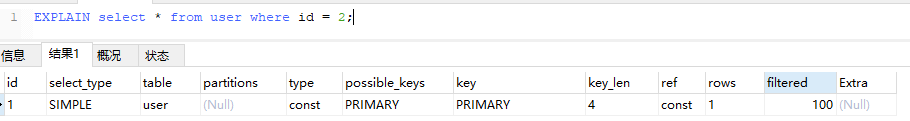

| **`列名`**    | **`用途`**                                             |
| ------------- | ------------------------------------------------------ |
| id            | 每一个SELECT关键字查询语句都对应一个唯一id             |
| select_type   | SELECT关键字对应的查询类型                             |
| table         | 表名                                                   |
| partitions    | 匹配的分区信息                                         |
| type          | 单表的访问方法                                         |
| possible_keys | 可能用到的索引                                         |
| key           | 实际使用到的索引                                       |
| key_len       | 实际使用到的索引长度                                   |
| ref           | 当使用索引列等值查询时，与索引列进行等值匹配的对象信息 |
| rows          | 预估需要读取的记录条数                                 |
| filtered      | 某个表经过条件过滤后剩余的记录条数百分比               |
| Extra         | 额外的一些信息                                         |

为了事情的发展，我们新建几张表方便后面讲解...

```sql
CREATE TABLE `s1` (
  `id` int(11) NOT NULL AUTO_INCREMENT,
  `key1` varchar(100) DEFAULT NULL,
  `key2` int(11) DEFAULT NULL,
  `key3` varchar(100) DEFAULT NULL,
  `key_part1` varchar(100) DEFAULT NULL,
  `key_part2` varchar(100) DEFAULT NULL,
  `key_part3` varchar(100) DEFAULT NULL,
  `common_field` varchar(100) DEFAULT NULL,
  PRIMARY KEY (`id`),
  UNIQUE KEY `idx_key2` (`key2`),
  KEY `idx_key1` (`key1`),
  KEY `idx_key3` (`key3`),
  KEY `idx_key_part` (`key_part1`,`key_part2`,`key_part3`)
) ENGINE=InnoDB AUTO_INCREMENT=10 DEFAULT CHARSET=utf8mb4;
-- s2结构相同
```
### id列

`id` 列编号是 `SELECT` 的序列号，并且 id 的顺序是按 `SELECT` 出现的顺序增长的。id列越大执行优先级越高，id 相同则从上往下执行，id 为 NULL 最后执行。

<font color=red>ID越大，执行的优先级越高；ID相等，从上往下优先顺序执行。</font>

例如下面，id = 2 的子查询先查询，然后再查 id = 1 的情况。

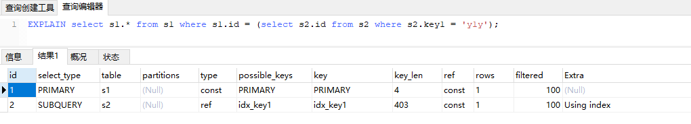

这个查询执行时有个临时表别名为 derived，外部 SELECT 查询引用了这个临时表。

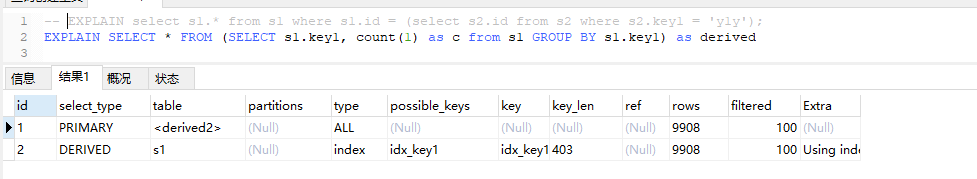

根据相同ID的话，从上往下顺序执行，我们可以知道此SQL选择s1作为驱动表。

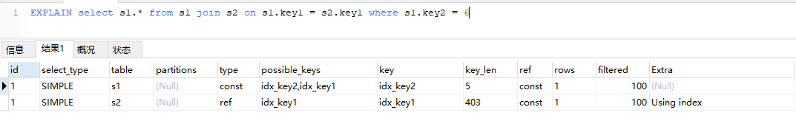

### select_type 列
查询的SQL对应的类型。一般有下面几种值。

| 名称               | 描述                                                         |
| ------------------ | ------------------------------------------------------------ |
| SIMPLE             | 简单查询。查询不包含子查询 和 `UNION`。                      |
| PRIMARY            | 对于包含UNION、UNION ALL或者⼦查询的⼤查询来说，它是由⼏个⼩查询组成的，其中最左边的那个查询的select_type值就是PRIMARY |
| UNION              | 对于包含UNION或者UNION ALL的⼤查询来说，它是由⼏个⼩查询组成的，其中除了最左边的那个⼩查询以外，其余的⼩查询的select_type值就是UNION |
| UNION RESULT       | MySQL选择使⽤临时表来完成UNION查询的去重⼯作，针对该临时表的查询的select_type就是UNION RESULT |
| SUBQUERY           | 如果包含⼦查询的查询语句不能够转为对应的semi-join的形式，并且该⼦查询是不相关⼦查询，并且查询优化器决定采⽤将该⼦查询物化的⽅案来执⾏该⼦查询时,该⼦查询的第⼀个SELECT关键字代表的那个查询的select_type就是SUBQUERY |
| DEPENDENT SUBQUERY | 如果包含⼦查询的查询语句不能够转为对应的semi-join的形式，并且该⼦查询是相关⼦查询，则该⼦查询的第⼀个SELECT关键字代表的那个查询的 select_type就是DEPENDENT SUBQUERY |
| DEPENDENT UNION    | 在包含UNION或者UNION ALL的⼤查询中，如果各个⼩查询都依赖于外层查询的话，那除了最左边的那个⼩查询之外，其余的⼩查询的select_type的值就是DEPENDENT UNION |
| DERIVED            | 对于采⽤物化的⽅式执⾏的包含派⽣表的查询，该派⽣表对应的⼦查询的select_type就是DERIVED |


### table列

table 列表示 EXPLAIN 的单独行的唯一标识符。这个值可能是表名、表的别名或者一个未查询产生临时表的标识符，如派生表、子查询或集合。

当 `FROM` 子句中有子查询时，如果优化器采用的物化方式，table 列是\<derivenN>格式，表示当前查询依赖 `id=N` 的查询，于是先执行 `id=N` 的查询。

### partitions 列

分区的意思，这一般没怎么用到。。

### type 列

这一列表示关联类型或访问类型，即MySQL决定如何查找表中的行，查找数据行记录的大概范围。
依次从最优到最差分别是 : <font color=red> system > const > eq_ref > ref > range > index > ALL</font>。

<font size=4 color=red>一般来说，必须保证查询在range级别及其以上是最好的</font>。

#### system
当表中只有⼀条记录并且该表使⽤的存储引擎的统计数据是精确的，⽐如MyISAM、Memory，那么对该表的访问⽅法就是system。

#### const
根据主键或者唯⼀⼆级索引列与常数进⾏等值匹配时，对单表的访问⽅法就是const。

```sql
EXPLAIN select * from s1 WHERE key2 = 256;
```

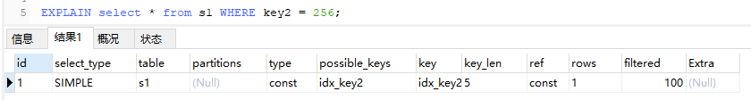

#### eq_ref
在连接查询时，如果被驱动表是通过主键或者唯一二级索引列等值匹配的方式进行访问的，则对该被驱动表的访问方法就是 eq_ref。

```sql
EXPLAIN SELECT * FROM s1 JOIN s2 on s1.id = s2.id;
```
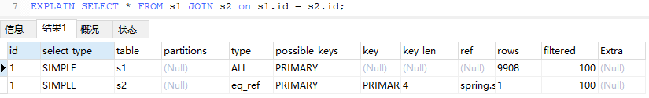

从执⾏计划的结果中可以看出，MySQL打算将s1作为驱动表，s2作为被驱动表，重点关注s2的访问⽅法是eq_ref，表明在访问s2表的时候可以通过主键的 等值匹配来进⾏访问。

#### ref
当通过普通的⼆级索引列与常量进⾏等值匹配时来查询某个表，那么对该表的访问⽅法就可能是ref。
```sql
EXPLAIN select * from s1 WHERE key1 = 'rkm';
```

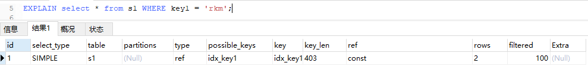

可以看出，key1是普通二级索引，通过等值查询的结果可能有多个。所以是req。
它与req_eq的区别在于 ： 相比 eq_ref，ref不使用唯一索引，而是使用普通索引或者唯一性索引的部分前缀，索引要和某个值相比较，可能会找到多个符合条件的行。

#### ref_or_null
对普通二级索引(<font color=red>包括普通索引和唯一索引,普通索引和唯一索引都允许有NULL值且不限制NULL的个数</font>)进行等值查询，该索引列也可以为NULL值时。

```sql
EXPLAIN select * from s1 WHERE key1 = 'rkm' or key1 is null;
```

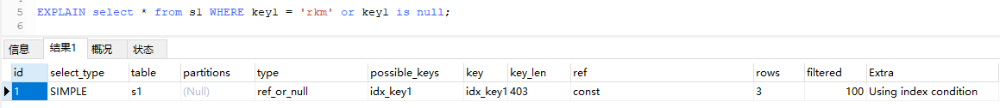

#### index_merge
MySQL使用索引合并的方式执行的。
所谓的索引合并值的是 ：我们的 where 中可能有多个条件(或者join)涉及到多个字段，它们之间进行 AND 或者 OR，那么此时就有可能会使用到 index merge 技术。index merge 技术如果简单的说，其实就是：对多个索引分别进行条件扫描，然后将它们各自的结果进行合并(intersect/union)。可以参考下另一篇文章《Mysql-InnoDB索引之单表使用索引详解(三)》

```sql
EXPLAIN select * from s1 WHERE key2 = 2354 or key1 = 'rkm'
```

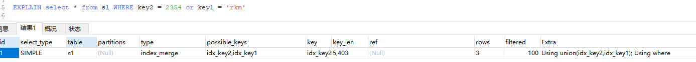

#### range
使用索引获取范围区间的记录，通常出现在 in, between ,> ,<, >= 等操作中。
```sql
EXPLAIN SELECT * FROM s1 where key2 BETWEEN 100 and 200;
```

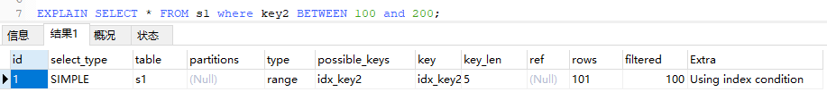

#### index
扫描全表索引，这通常比ALL快一些。（index是从索引中读取的，而 ALL 是从硬盘中读取）。
这种比ALL快一点，他指的是直接从B+索引树查询所有的数据。总结一句话就是扫描覆盖索引。
```sql
EXPLAIN	SELECT	key_part2	FROM	s1	WHERE	key_part3	=	'a';
```

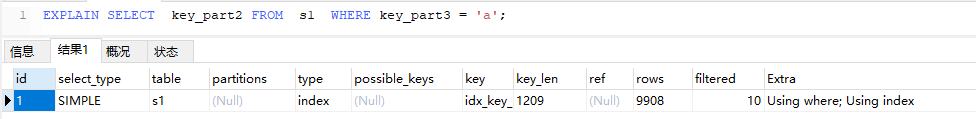

例如此SQL,由于key_part2和key_part3是在同一个索引树上，且获取key_part2时不需要回表。
但是为什么会是扫描全表索引呢？ 因为key_part3不是最左匹配。

#### ALL
不说了，性能最差。
### possible_keys 列
possible_keys 列表示查询<font color=red>可能</font>使用哪些索引来查找。

如果possible_keys 为NULL表示没有相关的索引，此时需要验证下语句情况。

另外需要注意的是 ： <font color=red>不是这一列的值越多越好，使用索引过多，查询优化器计算时查询成本高，所以如果可能的话，尽量删除那些不用的索引。</font>

### key 列
key 列表示实际采用哪个索引来优化对该表的访问。

### key_len 列
key_len 列表示当查询优化器决定使用某一个索引查询时，该索引记录的最大长度。

### ref 列
当使⽤索引列等值匹配的条件去执⾏查询时，也就是在访问⽅法是const、eq_ref、ref、ref_or_null、unique_subquery、index_subquery其中之⼀时， ref列展示的就是与索引列作等值匹配的东东是个啥，⽐如只是⼀个常数或者是某个列。
```sql
EXPLAIN	SELECT	*	FROM	s1	WHERE	key1	=	'a';
```

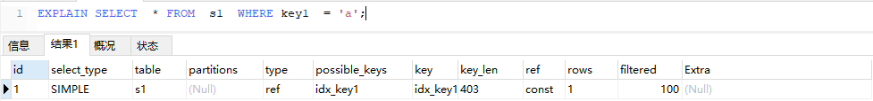

可以看到ref列的值是const，表明在使⽤idx_key1索引执⾏查询时，与key1列作等值匹配的对象是⼀个常数。
### rows 列
rows 列是查询优化器估计要读取并检测的行数，注意这个不是结果集里的行数。
通常也可以通过这个来看查询的量，如果量大则表示SQL性能差

### filtered 列
对于单表来说意义不大，主要用于连接查询中。
前文中也已提到 filtered 列，是一个百分比的值，对于连接查询来说，主要看驱动表的 filtered列的值 ，通过 rows * filtered/100 计算可以估算出被驱动表还需要执行的查询次数。

### Extra 列
Extra列是⽤来说明⼀些额外信息的，我们可以通过这些额外信息来更准确的理解MySQL到底将如何执⾏给定的查询语句。
下面说下几种比较重要的。
####  Using index
查询的列被索引覆盖，并且 WHERE 筛选条件是索引的前导列，使用了索引性能高。一般是使用了覆盖索引(查询列都是索引列字段)。
可以具体观察如下两条语句的区别
```sql
EXPLAIN	SELECT	key1	FROM	s1	WHERE	key1	=	'a';
EXPLAIN	SELECT	*	FROM	s1	WHERE	key1	=	'a';
```
#### Using index condition
指的是有些搜索条件中虽然出现了索引列，但却不能使⽤到索引。例如下面这个SQL
```sql
EXPLAIN	SELECT * FROM s1 WHERE key1 > 'z' AND key1 LIKE '%a';
```

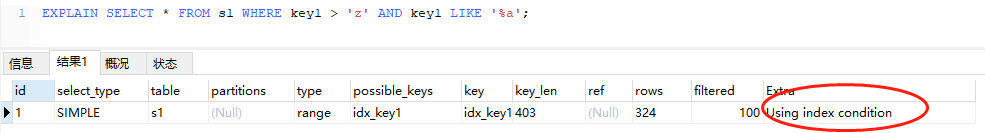

由于这个语句只能用到第一个条件，对于第二个条件在以前是需要在回表的时候去过滤的。但是现在做了优化，对于第一个条件查出来的二级索引记录先不着急回表，⽽是先检测⼀下该记录是否满⾜key1 LIKE '%a'这个条件，如果这个条件不满⾜，则该⼆级索引记录压根⼉ 就没必要回表。这种情况称之为<font color=red>索引条件下推</font>。
#### Using temporary
MySQL 中需要创建一张内部临时表来处理查询，一般出现这种情况就需要考虑进行优化了，首先是想到用索引来优化。
#### Using filesort
使用一个外部索引排序。一般来说我们根据索引的顺序排序是最优的，而这种情况指的是没办法根据索引的顺序直接排序，所以数据被放到了内存或磁盘中排序，这种在内存中或者磁盘上进⾏排序的⽅式统称为⽂件排序。
<font color=red>一般出现这个需要看下是否可以根据索引来排序优化。</font>
#### Using join buffer
在获取连接条件时没有使用索引，并且需要连接缓冲区来存储中间结果。出现该值，应该注意，根据查询的具体情况可能需要添加索引来改进性能。

## SQL优化常用规则
待续。。。

## 图示

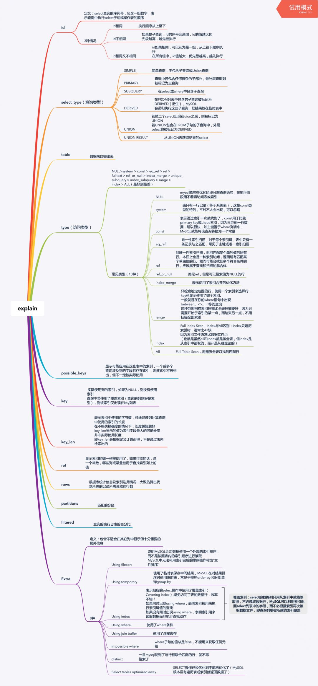

## 参考

- [一本彻底搞懂MySQL索引优化EXPLAIN百科全书](https://mp.weixin.qq.com/s/rem7Ds_QSnyhlrtNPByQcg)

