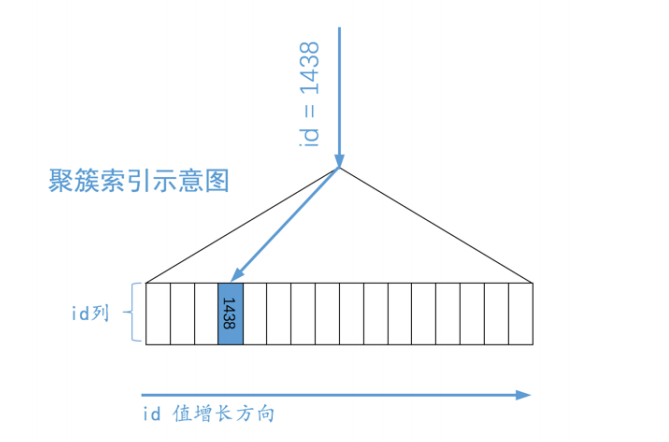
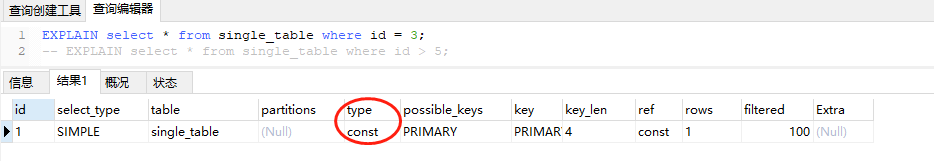
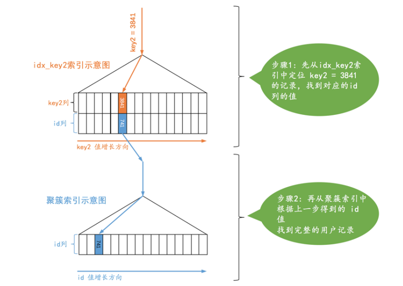
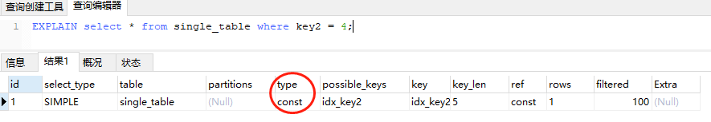
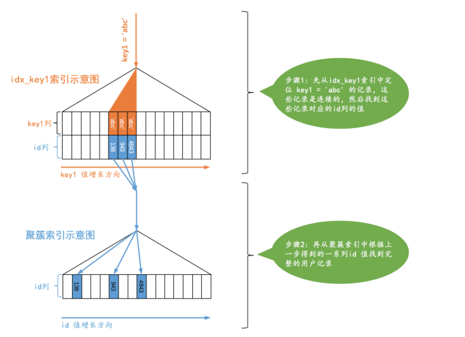
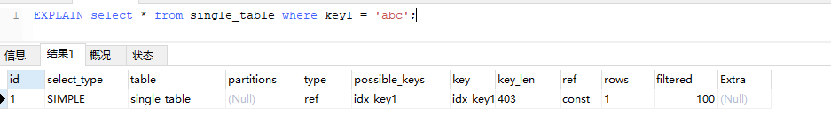
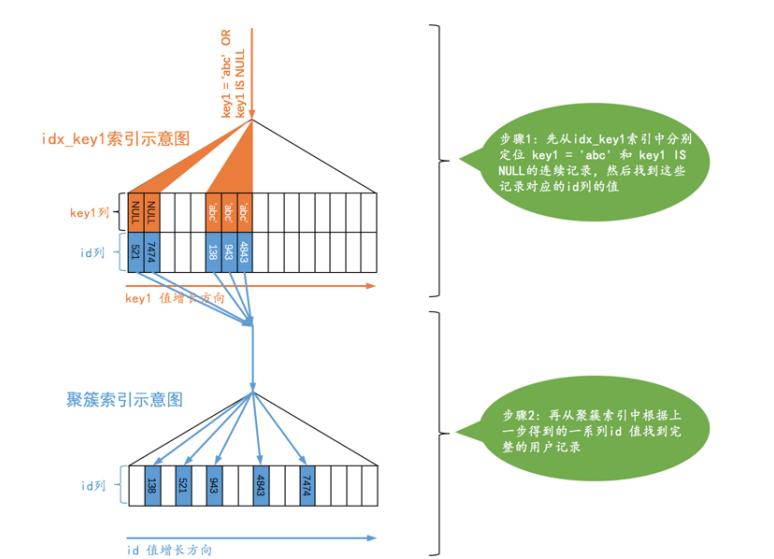
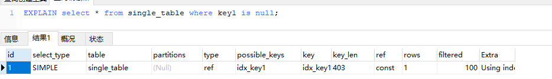
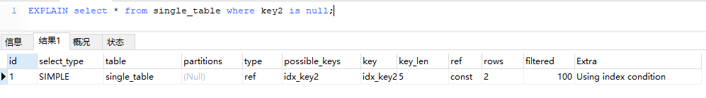
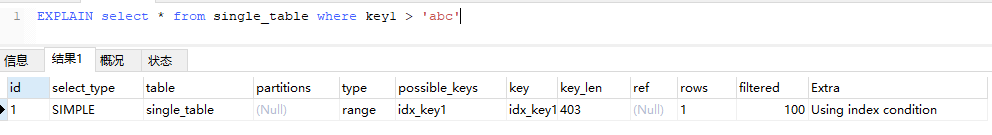

## 概述
本文主要讲解单表使用索引的几种情况，Mysql分别在使用主键索引，普通索引，唯一索引时是如何查询的，另外等值查询和范围查询是什么个情况。一般来说单表查询基本分成如下情况：
- 没使用索引的全表扫描查询
- 使用索引查询
  - 针对主键或唯⼀⼆级索引的等值查询
  - 针对普通⼆级索引的等值查询
  - 针对索引列的范围查询
  - 直接扫描整个索引
<!--more-->
## 正文

### 表结构

为了事情的发展，我们定义一个表结构

```sql
CREATE TABLE `single_table` (
  `id` int(11) NOT NULL AUTO_INCREMENT,
  `key1` varchar(100) DEFAULT NULL,
  `key2` int(11) DEFAULT NULL,
  `key3` varchar(100) DEFAULT NULL,
  `key_part1` varchar(100) DEFAULT NULL,
  `key_part2` varchar(100) DEFAULT NULL,
  `key_part3` varchar(100) DEFAULT NULL,
  `common_field` varchar(100) DEFAULT NULL,
  PRIMARY KEY (`id`),
  UNIQUE KEY `idx_key2` (`key2`),
  KEY `idx_key1` (`key1`),
  KEY `idx_key3` (`key3`),
  KEY `idx_key_part` (`key_part1`,`key_part2`,`key_part3`)
) ENGINE=InnoDB AUTO_INCREMENT=2 DEFAULT CHARSET=utf8mb4;
```

| 列                            | 索引类型     |
| ----------------------------- | ------------ |
| id                            | 主键索引     |
| key1                          | 普通索引     |
| key2                          | 唯一索引     |
| key3                          | 普通索引     |
| key_part1,key_part2,key_part3 | 联合普通索引 |

### 针对主键或唯⼀⼆级索引的等值查询

#### 使用主键索引的等值查询

例如我们现在有一条SQL，通过主键来查询一条数据。由于id是<font color=red>非空唯一</font>。所以Mysql会直接使用主键值在<font color=red>聚簇索引</font>中查找用户对应的记录。

```sql
SELECT	*	FROM	single_table	WHERE	id	=	3;
```

查询示意图如下



通过EXPLAIN执行计划，查询的type = const 。const类型用于主键或唯一二级索引列与常数比较时，所以表最多有一个匹配行。<font color=green>读取1次，速度比较快</font>。

不过这种const访问⽅法只能在主键列或者唯⼀⼆级索引列和⼀个常数进⾏等值⽐较时才有效，如果主键或者唯⼀⼆级索引是由多个列构成的话，索引中的每⼀个列都需要与常数进⾏等值⽐较，这个const访问⽅法才有效。




#### 使用唯一索引的等值查询

可以看到这个查询的执⾏分两步，第⼀步先从idx_key2对应的B+树索引中根据key2列与常数的等值⽐较条件定位到⼀条⼆级索引记录，然后再根据该记录的id值到聚簇索引中获取到完整的⽤户记录。所以这种情况下，执行计划下查询类型是属于<font color=red>const</font>

```sql
SELECT	*	FROM	single_table	WHERE	key2	=	4;
```





### 针对普通⼆级索引的等值查询
#### 普通二级索引等值查询
对于普通索引，不像主键索引和唯一索引，它允许有重复的值。

```sql
SELECT	*	FROM	single_table	WHERE	key1	=	'abc';
```





通过EXPLAIN执行计划，查询的type = ref。这种搜索条件为⼆级索引列与常数等值⽐较，采⽤⼆级索引来执⾏查询的访问⽅法称为：ref。

#### 普通索引查询等值和NULL
有时候我们不仅想找出某个⼆级索引列的值等于某个常数的记录，还想把该列的值为NULL的记录也找出来，就像下边这个查询：
```sql
SELECT	*	FROM	single_demo	WHERE	key1	=	'abc'	OR	key1	IS	NULL;
```



#### 包含NULL的唯一、普通索引
不论是普通的⼆级索引，还是唯⼀⼆级索引，它们的索引列对包含NULL值的数量并不限制，所以我们采⽤key IS NULL这种形式的搜索条件最多只能使⽤ref 的访问⽅法，⽽不是const的访问⽅法。




### 针对索引列的范围查询
这个跟上面说的差不多，只是他是范围查询，通过EXPLAIN执行计划，查询的type = range。



#### 明确range访问⽅法使⽤的范围区间
在我们实际写SQL时，经常是需要确定一个范围区间的，例如使用⽤=、<=>、IN、NOT IN、IS NULL、IS NOT NULL、>、<、>=、<=、BETWEEN、!=（不等于也可以写成<>）或者LIKE 操作符连接起来，在加上AND 和 OR 操作符。所以确定查询区间是比较重要的。
##### 所有搜索条件都可以使⽤某个索引的情况
待续。。。

### 多条件查询AND的情况
⼀般情况下只能利⽤单个⼆级索引执⾏查询，⽐⽅说下边的这个查询：
```sql
SELECT * FROM single_table WHERE key1 = 'abc' AND key2 > 1000;
```
这个查询中包含了两个搜索条件，且他们使用的索引不同

- key1 = 'abc'  使用普通索引key1等值查询
- key2 > 1000 使用唯一索引key2范围查询

这种情况下优化器⼀般会根据single_table表的统计数据来判断到底使⽤哪个条件到对应的⼆级索引中查询扫描的⾏数会更少，选择那个扫描⾏数较少的条件到对应的⼆级 索引中查询。然后将从该⼆级索引中查询到的结果经过回表得到完整的⽤户记录后再根据其余的WHERE条件过滤记录。
上面的例子步骤如下：
- 步骤1 ：优化器觉得key1 = 'abc' 使用的是 ref ，比使用range快，所以他选择key1作为查询条件
- 步骤2 ：使用key1在索引idx_key1索引所在的B+树中找到对应的数据，可能多条。
- 步骤3 ：通过步骤2查出来的数据现在需要做<font color=red>回表</font>操作，这时候再根据条件key2 > 1000到 完整的⽤户记录继续过滤。

这里思考下，如果是 key2  = 'abc' AND key1 >1000 的情况，优化器是如何做的？
由于key2 = 'abc' 是 const，所以会使用key2且忽略key1。 

### 索引合并
#### 交集情况
上面我们说⼀般情况下只能利⽤单个⼆级索引执⾏查询。指的是一个查询存在两个不同索引时会使用其中一个索引去他对应的B+树查询出结果(索引列的值+主键)。然后在使用另外一个索引在回表时对结果进行过滤。
但还有一种情况是索引合并，指的是两个索引都去对应的B+树查询结果(索引列的值+主键)。如果在通过主键取交集。再回表。
```sql
SELECT * FROM single_table WHERE key1 =	'a'	AND	key3 = 'b';
```
- 步骤1：从idx_key1⼆级索引对应的B+树中取出key1 = 'a'的相关记录。
- 步骤2：从idx_key3⼆级索引对应的B+树中取出key3 = 'b'的相关记录。
- 步骤3：⼆级索引的记录都是由索引列 + 主键构成的，所以我们可以计算出这两个结果集中id值的交集。
- 步骤4：按照上⼀步⽣成的id值列表进⾏回表操作，也就是从聚簇索引中把指定id值的完整⽤户记录取出来，返回给⽤户。

**Mysql中只有某些情况下才允许索引合并**
- ⼆级索引列是等值匹配的情况，对于联合索引来说，在联合索引中的每个列都必须等值匹配，不能出现只匹配部分列的情况。

```sql
//能使用索引合并
SELECT * FROM single_table WHERE key1 = 'a' AND key_part1 = 'a' AND key_part2 = 'b' AND key_part3 = 'c'; 

//不能使用索引合并，原因是出现了范围
SELECT * FROM single_table WHERE key1 > 'a' AND key_part1 = 'a' AND key_part2 = 'b' AND key_part3 = 'c';

//不能使用索引合并，原因联合索引没有最左比配到
SELECT * FROM single_table WHERE key1 = 'a' AND key_part2 = 'a'; 
```
- 主键列可以是范围匹配

这里可能有人会有疑惑。那到底是要使用索引合并还是不使用了？**对于这个问题，其实怎么选择是Mysql的优化器来决定的，总的来说他会通过计算执行成本，使用的IO等来判断选哪一个。**

#### 并集情况
我们在写查询语句时经常想把既符合某个搜索条件的记录取出来，也把符合另外的某个搜索条件的记录取出来，我们说这些不同的搜索条件之间是OR关系。
```sql
SELECT * FROM single_table WHERE key1 = 'a' OR key3 = 'b'
```
MySQL在某些特定的情况下才可能会使⽤到Union索引合并。
- 情况1：⼆级索引列是等值匹配的情况，对于联合索引来说，在联合索引中的每个列都必须等值匹配，不能出现只出现匹配部分列的情况
- 情况2：主键列可以是范围匹配
- 情况3：使⽤Intersection索引合并的搜索条件

情况3例如下面这条语句：
```sql
SELECT * FROM single_table WHERE key_part1 = 'a' AND key_part2 = 'b' AND key_part3 = 'c' OR (key1 = 'a' AND key3 = 'b');
```
优化器可能采⽤这样的⽅式来执⾏这个查询：
- 先按照搜索条件key1 = 'a' AND key3 = 'b'从索引idx_key1和idx_key3中使⽤Intersection索引合并的⽅式得到⼀个主键集合。
- 再按照搜索条件key_part1 = 'a' AND key_part2 = 'b' AND key_part3 = 'c'从联合索引idx_key_part中得到另⼀个主键集合。
- 采⽤Union索引合并的⽅式把上述两个主键集合取并集，然后进⾏回表操作，将结果返回给⽤户。

## 总结
本文通过部分实例讲述了Mysql使用索引是如何查询的。为什么我这条SQL使用的是ref而不是const。ref类型的查询是一种什么情况。
SQL查询情况太多，笔者只能挑选出几种比较常见的进行讲解，但还有很多情况需要我们自己去分析。
所以我们在判断一条SQL是否性能优时，应该使用执行计划EXPLAIN来进行判断。