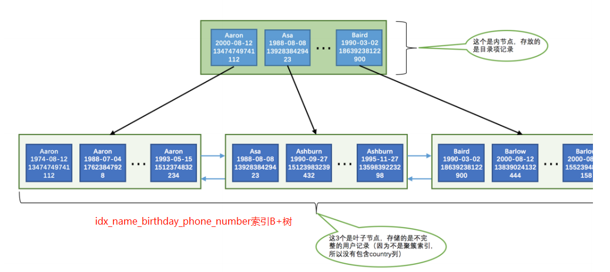

## 提出问题
1. 什么是回表？
2. 索引是不是可以无限建？
3. 什么是索引的最左匹配原则？
4. 什么是覆盖索引？
5. 如何建立高效的索引？
<!--more-->
## 索引的代价
通过上文《Mysql-InnoDB索引之索引结构详解(一)》我们了解到了B+树索引的原理。<font color=#FF0000 >InnoDB</font>存储引擎会自动为主键（如果没有它会自动帮我们添加）建立<font color=#FF0000 >聚簇索引</font>，聚簇索引的叶子节点包含完整的用户记录。而且每次建立一次索引都需要为其建立一颗B+树。

### 空间上的代价

每建立一个索引都要为它建立一棵B+树，每一棵B+树的每一个节点都是一个数据页，一个页默认会占用16KB的存储空间，一棵很大的B+树由许多数据也组成，那可是很大的存储空间。

### 时间上的代价

每次对表中的数据进行增、删、改操作时，都需要去修改各个B+树索引。我们清楚B+树每层节点都是按照索引列的值从小到大顺序排序的，如果做了增删改则会对排序造成破坏，所以存储引擎需要额外的时间进行一些记录移位，页分裂、页回收啥的操作来维护好节点和记录的排序，所以在时间上需要对索引进行维护。

所以，<font color=#FF0000 >一个表上索引建的越多，就会占⽤越多的存储空间，在增删改记录的时候性能就越差。</font>

## 索引的使用

我们先建立一个表

```sql
CREATE TABLE person_info (
	    id INT NOT NULL auto_increment,
	    NAME VARCHAR (100) NOT NULL,
	    birthday DATE NOT NULL,
	    phone_number CHAR (11) NOT NULL,
	    country VARCHAR (100) NOT NULL,
	    PRIMARY KEY (id),
	    KEY idx_name_birthday_phone_number (NAME, birthday, phone_number)
);
```

根据上面的SQL，我们知道表person_info的索引情况

- 主键是id列，InnoDB存储引擎为主键设置了一个<font color=#FF0000 >聚簇索引</font>，因为是聚簇索引索引对应的B+树的叶子节点存储的用户记录<font color=#FF0000 >包含所有列</font>
- 定义了一个联合索引idx_name_birthday_phone_number,由列name，birthday，phone_number组成，这个联合索引的B+树的叶子节点存储的用户记录包含name，birthday，phone_numbe和主键id，<font color=#FF0000 >但不包含country</font>。



这里需要注意的是联合索引B+树的建立是按照先name,再birthday,最后phone_number的顺序，索引B+树的顺序是按照

- 先通过<font color=red>name</font>进行排序。
- 如果<font color=red>name</font>相同，再按照<font color=red>birthday</font>排序。
- 如果<font color=red>birthday</font>也相同，则按照<font color=red>phone_number</font>排序。

### 通过主键ID查找数据

```SQL
SELECT
	*
FROM
	person_info
WHERE
	ID = 10;
```

这种方式下，由于ID是主键，索引通过聚簇索引所在的B+树根据二分法查找到对应的数据。

### 全值匹配

```sql
SELECT
	*
FROM
	person_info
WHERE
	NAME = 'Ashburn'
AND birthday = '1990-09-27'
AND phone_number = '15123983239';
```

上面SQL，由于查询条件包含在了idx_name_birthday_phone_number索引内，所以查询过程如下

1. 因为B+树的数据页和记录先是按照name列的值进行排序的，所以先可以很快定位name列的值是Ashburn的记录位置
2. 在name列相同的记录是按照birthday列的值进行排序的，所以在name列的值是Ashburn的记录可以快速定位birthday列的值是'1990-09-27'的记录
3. 如果很不幸，name和birthday列的值都是相同的，那记录是按照phone_number列的值排序的，所以联合索引中的三个列都可能被用到

这种情况下我们通过三个列的全值匹配查找到的对应的记录，记录上包含了id,name,birthday,phone_number。但是我们查询的是*,在idx_name_birthday_phone_number索引B+树上并没有存储country的数据，那这时候如何查找country？

### 回表

由于country只记录在聚簇索引B+树上，而我们通过联合索引已经查到数据对应的ID，所以这时候通过ID继续去聚簇索引上查找一遍，最终获取到了最后的数据。

这种需要把从上⼀步中获取到的每⼀条记录的id字段都到聚簇索引对应的B+树中找到完整的⽤户记录，也就是我们通常所说的<font color=red>回表</font>

#### 回表的代价

<font color=red>需要回表的记录越多，使用二级索引的性能就越低</font>，甚至让某些查询宁愿使用全表扫描也不使用二级索引。假设有一种情况，name = 'Ashburn' AND birthday = '1990-09-27' AND phone_number = '15123983239' 的数据占了所有数据的90%以上，那此时通过联合索引先查一遍获取到对应的主键ID再去聚簇索引查一遍的方式（二级索引+回表）就比全表扫描效率差。

所以在使用上我们应该尽量避免回表产生的问题

- 建议点1 ：例如可以判断业务上是否需要获取所有列的数据，如果业务上只需要id,name,birthday,phone_number列的值而不需要country的值，这时候可以不使用select * ,这样可以防止回表 
- 建议点2 ：尽量避免回表的次数，这种可以从索引的选取方面考虑，例如对于重复值大的列不建议设置为索引。

### 覆盖索引

为了彻底告别回表操作带来的性能损耗，我们建议：<font color=red>最好在查询列表⾥只包含索引列</font>

```sql
SELECT
	ID,NAME,birthday,phone_number
FROM
	person_info
WHERE
	NAME = 'Ashburn'
AND birthday = '1990-09-27'
AND phone_number = '15123983239';
```

我们把这种只需要用到索引的查询方式称为索引覆盖。排序操作也优先使用<font color=red>覆盖索引</font>

### 最左匹配原则

下面两个SQL语句，查询条件相同，只是顺序不同，是否性能相同？

```sql
-- SQL 1
SELECT
	*
FROM
	person_info
WHERE
	NAME = 'Ashburn'
AND birthday = '1990-09-27'
AND phone_number = '15123983239';
-- SQL 2
SELECT
	*
FROM
	person_info
WHERE
	birthday = '1990-09-27'
AND NAME = 'Ashburn'
AND phone_number = '15123983239';
```

答案是不相同，通过索引的分析，我们知道idx_name_birthday_phone_number的排序方式是name -> birthday - > phone_number。但是SQL2是先birthday->NAME->phone_number。这样则没办法先通过name去查找索引，所以SQL2使用不到索引将会采用全表扫描。

所以，<font color=red>如果我们想使⽤联合索引中尽可能多的列，搜索条件中的各个列必须是联合索引中从最左边连续的列</font>

### 用于排序

我们在写查询语句的时候经常需要对查询出来的记录通过ORDER BY语句按照某种规则进行排序。一般情况下，我们只能把记录都加载到内存中，再用一些排序算法，比如快速排序、归并排序等等在内存中对这些记录进行排序，有的时候可能查询的结果集太大以不能在内存中进行排序的话，还可能暂时借助磁盘的空间来存放中间结果，排序操作完成后再把排好序的结果集返回到客户端。

但如果排序的列是按照索引排列的，例如

```sql
SELECT
	ID,NAME,birthday,phone_number
FROM
	person_info
ORDER BY
	NAME,
	birthday,
	phone_number;
```

则可以直接按照索引的存储顺序进行排序。

#### 不能使用索引排序的情况
1. ASC,DESC混用，对于使用联合索引进行排序的场景，我们要求各个排序列的排序顺序是一致的，也就是要么各个列都是ASC规则排序，要么都是DESC规则排序。
2. WHERE子句中出现非排序使用到的索引列。
3. 排序列包含非同一个索引的列。如果不是同一个索引，排序的方式是不一样的
4. 排序列使用了复杂的表达式

## 如何挑选索引
### 只为用于搜索、排序或分组的列创建索引
只为出现在WHERE子句中的列、连接子句中的连接列，或者出现在ORDER BY或GROUP BY子句中的列创建索引。
### 需要考虑列的基数
列的基数指的是某一列中不重复数据的个数。在记录行数一定的情况下，列的基数越大，该列中的值越分散，列的基数越小，该列中的值越集中。
例如上面说的回表和全表扫描情况，一个列的重复个数越多那么使用这个二级索引查出的记录还可能要做回表操作，这样性能损耗就更大了。
所以，<font color=red>最好为那些列的基数大的列建立索引，为基数太小列的建立索引效果可能不好。</font>

### 索引列的类型尽量小

- 数据类型越小，在查询时进行的比较操作越快
- 数据类型越小，索引占用的存储空间就越少，在一个数据页内就可以放下更多的记录，从而减少磁盘I/O带来的性能损耗，也就意味着可以把更多的数据页缓 存在内存中，从而加快读写效率

### 索引字符串值的前缀

- B+树索引中的记录需要把该列的完整字符串存储起来，而且字符串越长，在索引中占用的存储空间越大
- 如果B+树索引中索引列存储的字符串很长，那在做字符串比较时会占用更多的时间

所以可以只对<font color=red>一个列的前几个字符进行索引</font>。

```sql
CREATE TABLE person_info (
	    NAME VARCHAR (100) NOT NULL,
	    birthday DATE NOT NULL,
	    phone_number CHAR (11) NOT NULL,
	    country VARCHAR (100) NOT NULL,
	    KEY idx_name_birthday_phone_number (NAME (10),birthday,phone_number)
);
```

name(10)就表示在建立的B+树索引中只保留记录的前10个字符的编码，这种只索引字符串值的前缀的策略是我们经常鼓励的，尤其是在字符串类型能存储的字符比较多的时候。

### 让索引列在比较表达式中单独出现

如果索引列在比较表达式中不是以单独列的形式出现，而是以某个表达式，或者函数调用形式出现的话，是用不到索引的。

```sql
WHERE my_col * 2 < 4 -- 不能使用索引
WHERE my_col < 4 / 2 -- 可以使用索引
```

### 避免冗余和重复索引

```sql
CREATE TABLE person_info (
	    id INT UNSIGNED NOT NULL AUTO_INCREMENT,
	    NAME VARCHAR (100) NOT NULL,
	    birthday DATE NOT NULL,
	    phone_number CHAR (11) NOT NULL,
	    country VARCHAR (100) NOT NULL,
	    PRIMARY KEY (id),
	    KEY idx_name_birthday_phone_number (NAME (10),birthday,phone_number),
	    KEY idx_name (NAME(10))
);
```

例如上面NAME已经包含在联合索引中了，又自己新建了一个索引，这种重复的索引是毫无必要的。

## 总结

- B+树索引在空间和时间上都有代价，所以没事⼉别瞎建索引
- B+树索引适⽤于下边这些情况
  - 全值匹配
  - 匹配左边的列
  - 匹配范围值
  - 精确匹配某一列并范围匹配另外一列
  - 用于排序
  - 用于分组
- 在使⽤索引时需要注意下边这些事项
  - 只为⽤于搜索、排序或分组的列创建索引
  - 为列的基数⼤的列创建索引 
  - 索引列的类型尽量⼩
  - 可以只对字符串值的前缀建⽴索引 
  - 只有索引列在⽐较表达式中单独出现才可以适⽤索引
  - 为了尽可能少的让聚簇索引发⽣⻚⾯分裂和记录移位的情况，建议让主键拥有AUTO_INCREMENT属性
  - 定位并删除表中的重复和冗余索引
  - 尽量使⽤覆盖索引进⾏查询，避免回表带来的性能损耗

## 参考

- 本文参考《MYSQL高性能》，《MySQL 是怎样运行的：从根儿上理解 MySQL》