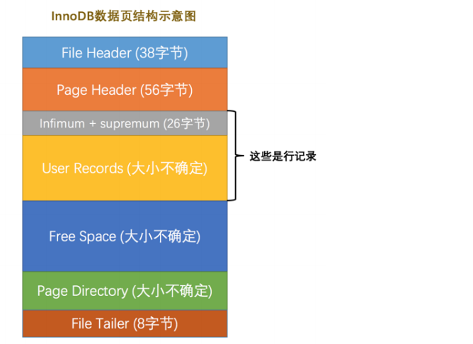
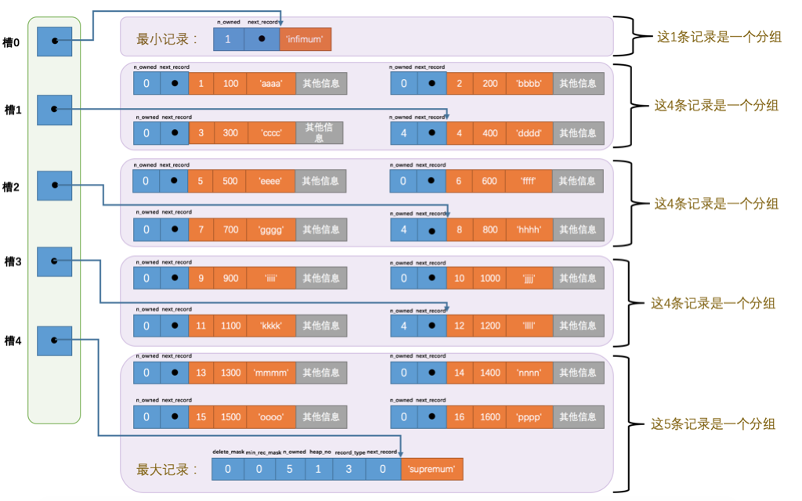
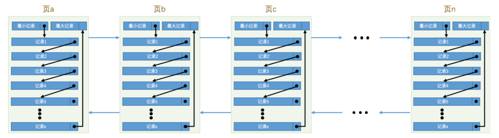
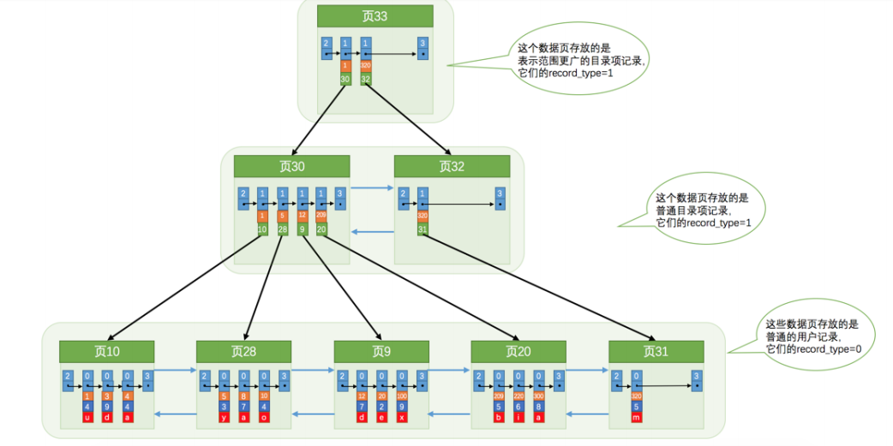
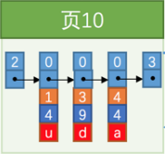
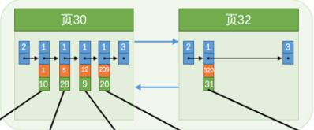
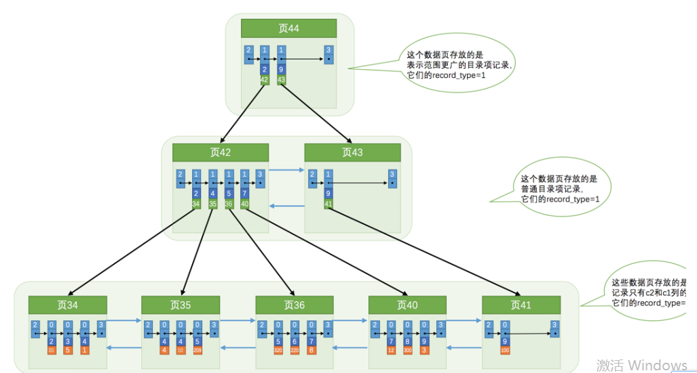

<!--more-->

## InnoDB数据页结构

页是InnoDB管理存储空间的基本单位，一个页一般大小为16KB，我们的记录是存放到页中的。其中Infimum + Supremum记录的是最小最大记录。User Records是真实存储我们插入的记录部分。


| 字段               | 说明                                                         |
| ------------------ | ------------------------------------------------------------ |
| File Header        | 表示页的一些通用信息，占固定的38字节                         |
| Page Header        | 表示数据页专有的一些信息，占固定的56个字节                   |
| Infimum + Supremum | 两个虚拟的伪记录，分别表示页中的最小和最大记录，占固定的26个字节 |
| User Records       | 真实存储我们插入的记录的部分，大小不固定                     |
| Free Space         | 页中尚未使使用的部分，大小不确定                             |
| Page Directory     | 页中的某些记录相对位置，也就是各个槽在页面中的地址偏移量，大小不固定，插入的记录越多，这个部分占用的空间越多 |
| File Trailer       | 用于检验页是否完整的部分，占用固定的8个字节                  |

**InnoDB页中的数据如何查找**



如上图，数据在InnoDB中按照主键顺序连成一个单链表（图上没画），然后使用了一个槽的概念将数据进行分组。<font color=red>所以在一个数据页中查找指定主键值的记录过程</font>如下：

- 通过二分法确定该记录所在槽，并找到该槽中主键值最小的记录。
- 通过记录的next_record（也就是指向下一个数据的指针）遍历该槽所在组的各个记录。



- 页与页之间在存储上是不连续的，而是通过双向链表关联起来
- 每个页只有16KB的大小
- 每个数据页中的记录会按照主键值从到大的顺序组成一个单向链表

## 索引
### 没有索引怎么查找?
索引类似我们书的目录，例如查字典，先通过目录确定要查的字所在页数，然后可以快速找到。如果没有目录则需要一页一页查找。
```
SELECT	[列名列表]	FROM	表名	WHERE	列名	=	xxx;
```
例如上面的语句，在没有索引的情况下，结合图我们可以知道。在没有索引的情况下，不论是根据主键列或者其他列的值进⾏查找，由于我们并不能快速的定位到记录所在的⻚，所以只能从第⼀个⻚沿着双向链表⼀直往下 找，**在每⼀个⻚中根据我们刚刚唠叨过的查找⽅式去查找指定的记录**。

### InnoDB中的索引方案

```sql
CREATE TABLE `index_demo` (
  `c1` int(11) NOT NULL,
  `c2` int(11) DEFAULT NULL,
  `c3` char(11) DEFAULT NULL,
  PRIMARY KEY (`c1`)
) ENGINE=InnoDB DEFAULT CHARSET=utf8;
INSERT INTO index_demo VALUES(1,4,'u'),(3,9,'d'),(5,3,'y');
....
```

InnoDB索引采用B+树做为索引。如下图所示。


下面分别解释下图中的信息。

**B+树叶子节点**



- 第一行的 2 0 3 表示的是record_type(参考前面的头信息中的record_type属性，2-最小记录;3-最大记录;0-普通用户记录;1-目录项记录)
- (1,4,u),(3,9,d),(4,4,a)表示的是用户记录。橙色方格表示主键，所以页中用户记录按照主键排序。
- B+树索引叶子节点存放的是用户的数据页。每个数据页按照主键值排序并组成一个双向链表。

**非叶子节点**

B+树索引的非叶子节点作为目录页。


- 第一行的 1 表示的是record_type(参考前面的头信息中的record_type属性，2-最小记录;3-最大记录;0-普通用户记录;1-目录项记录)
- 橙色方格代表的是每一个数据页中最小的主键值。绿色表示对应的页。例如(1,10)目录项表示指向页10，页10的最小主键索引是1。
- 目录页也遵循数据页的规则，按照主键值的大小排序，且形成一个双向链表

**总结**

从图中可以看出来，B+树的节点其实可以分成好多层。实际用户记录其实都存放在B+树的最底层的节点上。非最底层存放的是目录。假设所有存放用户记录的叶子节点代表的数据页可以存放100条用户记录，所有存放目录项记录的内节点代表的数据页可以存放1000条目录项记录,那么

- 如果B+树只有1层，也就是只有1个用于存放用户记录的节点，最多能存放100条记录
- 如果B+树有2层，最多能存放1000×100=100000条记录
- 如果B+树有3层，最多能存放1000×1000×100=100000000条记录
- 如果B+树有4层，最多能存放1000×1000×1000×100=100000000000条记录

所以一般来说B+数索引不会超过4层。

### 根据索引方案，如何快速查找到一条数据

例如现在我们要查找主键为20的记录(在页9上)。
- 首先先从根节点(页33)查找，由于主键是20，采用二分法查找(1,30)(320,32)判断，1 < 20 < 320。所以往下查找页30
- 如法炮制，12 < 20 < 209，所以往下查找页9
- 页9是最底层节点，存放的是实际用户记录。所以我们直接可以在页中通过二分查找法查到对应的主键为20的记录

## 聚簇索引

我们上边介绍的B+树本身就是一个目录，或者说本身就是一个索引,它有两个特点
1. 使用记录主键值的大小进行记录和页的排序，这包括三个方面的含义：
  - 页内的记录是按照主键的大小顺序排成一个单向链表。
  - 各个存放用户记录的页也是根据页中用户记录的主键大小顺序排成一个双向链表。
  - 存放目录项记录的页分为不同的层次，在同一层次中的页也是根据页中目录项记录的主键大小顺序排成一个双向链表。
2. B+树的叶子节点存储的是完整的用户记录

我们把具有这两种特性的B+树称为**聚簇索引**，所有完整的用户记录都存放在这个聚簇索引的叶子节点处。这种聚簇索引并不需要我们在MySQL语句中显式的使⽤INDEX 语句去创建，**InnoDB存储引擎会⾃动的为我们创建聚簇索引**。另外有趣的一点是，在InnoDB存储引擎中，聚簇索引就是数据的存储方式（所有的用户记录都存储在了叶子节点），也就是所谓的<font color=#FF0000 >索引即数据，数据即索引</font>。

## 二级索引
我们上面介绍的索引其实是**聚簇索引**，只有在有主键值的使用才发挥所用。因为B+树中的数据都是按照主键进⾏排序的。那如果我们想以别的列作为搜索条 件该咋办呢？难道只能从头到尾沿着链表依次遍历记录么？
其实不是，InnoDB在我们创建一张表时会提示我们创建主键，其实就是为了生成聚簇索引，聚簇索引存储了所有的用户数据，就是所谓的数据即索引。但是我们可以为其他非主键创建索引。

例如我们为c2创建索引，按照c2列的大小作为数据页，则创建的索引如下。



**这个B+树与上边介绍的聚簇索引有几处不同：**

1. 使用记录c2列的大小进行记录和页的排序，这包括三个方面的含义：
 - 页内的记录是按照c2列的大小顺序排成一个单向链表。
 - 各个存放用户记录的页也是根据页中记录的c2列大小顺序排成一个双向链表。
 - 存放目录项记录的页分为不同的层次，在同一层次中的页也是根据页中目录项记录的c2列大小顺序排成一个双向链表。
2. B+树的叶子节点存储的并不是完整的用户记录，而只是c2列+主键这两个列的值
3. 目录项记录中不再是主键+页号的搭配，而变成了c2列+页号的搭配

**如何通过二级索引查找数据？**

```
SELECT * FROM index_demo WHERE C2 = 4
```
1. 确定目录项记录页,根据根页面。也就是页44，可以快速定位到目录项记录所在的页为页42（因为2 < 4 < 9）
2. 通过目录项记录页确定用户记录真实所在的也。在页42中可以快速定位到实际存储用户记录的也，但是由于c2列并没有唯一性约束，所以c2列值为4的记录可能分布在多个数据页中，又因为2 < 4 ≤ 4，所 以确定实际存储用户记录的页在页34和页35中
3. 到页34和页35中定位到具体的记录
4. 但是这个B+树的叶子节点中的记录只存储了c2和c1（也就是主键）两个列，所以**我们必须再根据主键值去聚簇索引中再查找一遍完整的用户记录**，这个再去查一次聚簇索引的方式叫做<font color=#FF0000 >回表</font>。

## 联合索引

联合索引的方式与二级索引差不多，例如以c2,c3作为联合索引。再索引的结构上就是按照c2先排序然后再排序c3。

## 问答

**为什么MySQL索引要用B+树而不用B-或者其他**

先来说下B类树的特点，B类树的特点：<font color=red>每层节点数目非常多，层数很少</font>。关系数据库的数据量经常能达到亿级别，所以索引也是非常大，必须存储在磁盘上。我们在查找一个数据时，最好的情况就是很快找到目标索引，然后读取数据。为了能减少磁盘IO的次数，**B树类这种每层节点数目多，层数少的就非常适合，我们只要最多遍历3到4层就能找到结果。**例如使用红黑树，红黑树往往出现由于树的深度过大而造成磁盘IO读写过于频繁，进而导致效率低下的情况。

B+和B-的最大区别在于B-树的每一个节点都有一个data域，试想一下我们是怎么最终查到数据的。首先先从顶层的页上查找，那我们首先先要将这个页从磁盘通过IO加载到内存，**磁盘IO一次读出的数据量大小是固定的，单个数据变大，每次读出的就少，IO次数增多，一次IO多耗时**。所以B-树每个节点多了一个data域无疑就是我们能一次IO加载到内存的节点数就少了，那就要多次IO查询，固然会效率比B+树低。

## 参考

- 本文参考《MYSQL高性能》，《MySQL 是怎样运行的：从根儿上理解 MySQL》