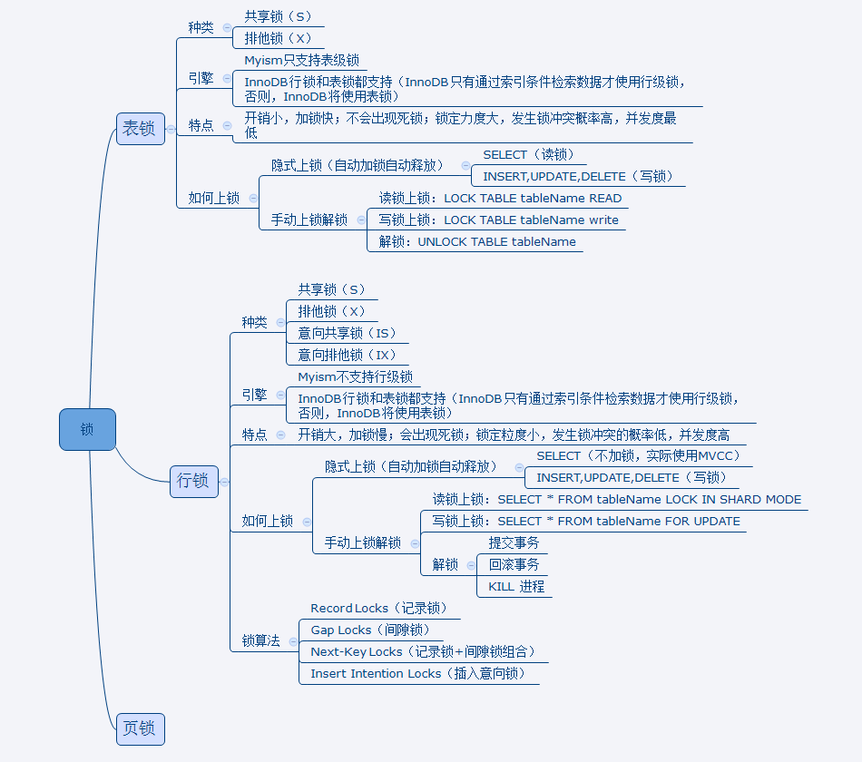

### 为什么有锁

Mysql锁主要是为了解决多事务并发带来的问题。多事务并发分成以下三种情况：

- 读读，两个事务都只有读操作，不加锁。
- 写写，多个未提交事务在对同一个记录做修改操作时，需要让操作排队，这就是用锁实现的。
- 读写，Innodb中读操作利用多版本控制并发（MVCC），写操作使用锁来控制。

InnoDB锁官方文档地址 ：[InnoDB Locking Doc](https://dev.mysql.com/doc/refman/5.7/en/innodb-locking.html#innodb-shared-exclusive-locks)。锁作为MySQL一个很重要的知识点，虽然有隐式加锁解锁的存在开发人员很少涉及到，但了解锁对开发尤为重要，不然遇到死锁问题都不知道哪里出现问题了。
### 锁类型与上锁方式

在MySQL中，锁按照类型划分可以分成 ：表锁，行锁（本文重点），页锁。

在MySQL中，锁按照种类可以划分成：共享锁（S）和排他锁（X）。



<!--more-->

这里说一下上面的意向共享锁和意向排他锁。其实这两个应该算是表级锁。为啥会有这两个东西呢？为了<font color=red>**为了允许行锁和表锁共存，实现多粒度锁机制**</font>。引用MySQL官方文档对意向锁的解释"Intention locks are table-level locks that indicate which type of lock (shared or exclusive) a transaction requires later for a row in a table."。翻译过来大概是：意向锁是表级锁，指示事务稍后需要为表中的行使用哪种类型的锁（共享或独占）。举个列子，假设一张表的某些行已经被人加了X锁，现在另一个事务需要对这张表加X锁，此时需要判断这个表上的记录是否有一些被人加过X锁了，如果加过了就不允许加表X锁了，如果没有意向锁的话需要逐行遍历判断是否加过行X锁。所以，

- 在事务可以获取表中某一行的共享锁之前，它必须首先获取表上的IS锁。
- 在事务可以获得表中一行的排他锁之前，它必须首先获得表上的IX锁。

**意向锁是MySQL自动帮我们加的，我们不需要操心，只需要了解下就行。**

### 行锁

下面介绍行锁的几个种类：Record Locks（记录锁），Gap Locks（间隙锁），Next-Key Locks（记录锁+间隙锁组合），Insert Intention Locks（插入意向锁）。

先创建一个表，用来下面分析

```sql
CREATE TABLE HERO(
id INT, 
name VARCAHR(100),
PRIMARY KEY(id),
KEY `INDEX_NAME` (`name`) USING BIREE
) Engine=InnoDB CHARSET=utf8;
```


#### Record Locks（记录锁）

单条索引记录上加锁，有S锁和X锁之分。**record lock锁住的永远是索引，而非记录本身，即使该表上没有任何索引，那么innodb会在后台创建一个隐藏的聚集主键索引，那么锁住的就是这个隐藏的聚集主键索引。所以说当一条sql没有走任何索引时，那么将会在每一条聚集索引后面加X锁，这个类似于表锁**，但原理上和表锁应该是完全不同的。

- 当⼀个事务获取了⼀条记录的S记录锁后，其他事务也可以继续获取该记录的S记录锁，但不可以继续获取X记录锁。

- 当⼀个事务获取了⼀条记录的X记录锁后，其他事务既不可以继续获取该记录的S记录锁 ，也不可以继续获取X型正经记录锁 。


#### Gap Locks（间隙锁）

这种锁作用在索引记录之间。他是为<font color=red>防止其他事务插入间隙（包括防止insert方式插入新数据到间隙，以及update方式将其他行变更到此间隙）</font>。Gap锁可以有效的防止”幻读“（因为这些间隙都被上了锁，其他事务不可能再插入数据到这些间隙中，于是当前事务在连续进行”当前读“时，每次读到的都是相同的记录）。Gap锁<font color=red>只作用在隔离级别为RR（不可重复读）的数据库</font>上，但是不意味着隔离等级为RC（已提交读）级别的不会使用，<font color=red>在RC级别，在进行外键约束检测和唯一键约束检测的时候，会使用到Gap锁</font>。


**什么情况下会加Gap锁？**

- RR隔离级别下，Gap锁会用在非唯一索引或者不走索引的当前读中，也就是说除了唯一索引的唯一搜索外，都会获取gap锁或next-key锁。[初步理解MySQL的gap锁](https://www.cnblogs.com/crazylqy/p/7821481.html?spm=a2c6h.12873639.0.0.47a21bf4qroWrl)
- RC隔离级别，在进行外键约束检测和唯一键约束检测的时候，会使用到Gap锁。[RC隔离级别下的间隙锁案例](https://cloud.tencent.com/developer/article/1678599)

举例说明，例如还是上面那个图，ID是主键索引，name是普通索引。

```SQL
-- 精确查询主键索引，只加X锁，不加Gap锁
UPDATE `HERO` SET name = 'xxx' WHERE ID = '3';
-- 会在5，7，,9上加X锁。在(3,5),(5,7),(7,9),(9,+∞)上加Gap锁
UPDATE `HERO` SET name = 'xxx' WHERE ID > '3';
-- 没命中，在(1,3)加Gap锁。
UPDATE `HERO` SET name = 'xxx' WHERE ID = '2';
```

#### NextKey Locks

本质上就是Gap锁和Record锁的结合，锁住索引外还要锁住索引的间隙。再具体一些就是，一个record锁，加上，位于此索引记录前的第一个间隙处的间隙锁。举个简单的例子就是，如果现在有一个索引包含三个值1，3，5，则next-key lock锁，可能锁住的范围就有(-∞,1],(1,3],(3,5],(5,+∞]。<font color=red>同样在next-key lock一般作用在RR隔离等级的数据库，但是当出现在insert时候，检测到唯一键冲突的时候，会在冲突所在唯一索引出和之前的间隙处加Next-key lock</font>。

#### Insert Intention Locks

这个锁是在数据插入之前会加此锁。它是一种轻量的Gap锁，同时也是意向排他锁的一种。它的存在使得多个事务在写入不同数据到统一索引间隙的时候，不会发生锁等待（<font color=red>例如一个间隙已经加了Gap锁了，事务B，C同时往这个间隙加Insert Intention Lock是不会互相阻塞的，但是Gap跟Insert Intention Locks会阻塞，必须等到Gap释放后才能加Insert Intention Locks</font>）。另外由于它是一种意向插入锁，所以当排他锁已经处于间隙上的时候，根据锁的兼容矩阵，可以知道，***意向插入锁必须等待此间隙上的排它锁释放，才能获取。***

### 死锁案例分析

#### 背景分析

我们数据库中发生死锁的表是具有”**<font color=red>多列组合构建的主键索引</font>**“，且数据库的隔离级别多RC。由于业务原因，经常会出现对同一行数据进行字段的反复修改的场景。为了简化代码我们使用了insert on duplicate key update语句来解决，这个语句的意思是首先先执行插入，如果检测到唯一键冲突时，仅更新特定（非索引）字段。为了优化入库的效率，我们将原来执行insert on duplicate key update语句进行切分采用多事务的方式，结果发生了”Deadlock found when trying to get lock“死锁问题。

```sql
--- 表结构----
CREATE TABLE `flow_data` (
  `time` varchar(8) NOT NULL DEFAULT '',
  `domain` varchar(256) NOT NULL DEFAULT '',
  `v1` bigint(20) DEFAULT '0',
  `v2` bigint(20) DEFAULT '0',
  `v3` bigint(20) DEFAULT '0',
  `v4` bigint(20) DEFAULT '0',
  PRIMARY KEY (`time`,`domain`),
  KEY `index_domain` (`domain`) USING BTREE
) ENGINE=InnoDB DEFAULT CHARSET=utf8;

--- 对应死锁的语句----
INSERT INTO flow_data (time, domain, v1, v2, v3, v4) VALUES
  ('20201111','a.com',26420278,27235006,26189728,29158467),
  ('20201111','b.com',26420278,27235006,26189728,29158467),
  ('20201111','c.com',26420278,27235006,26189728,29158467) 
ON DUPLICATE KEY UPDATE 
  v1=VALUES(v1),v2 =VALUES(v2),v3=VALUES(v3),v4 =VALUES(v4);
```


#### 问题现象


我们分析下死锁信息，

事务1正在等待别的事务的锁释放，这个锁是”lock_mode X locks gap before rec insert intention waiting“，直接翻译过来就是<font color=red>插入意向锁在等待排他gap锁的释放</font>。

事务2目前持有一个X锁，并且也在等别的事务的锁的释放，”lock_mode X locks gap before rec insert intention waiting"。

#### 问题分析

上面的死锁问题刚开始很疑惑，主要有几点

- 为什么在RC隔离级别下会用了Gap锁？
- insert on duplicate key update语句是否在内部有导致了什么检查才会加锁？

带着疑问，重新好好的复习了一下MySQL的锁知识和官方文档，也全网找了相关的问题。得出一下几个要点。

- insert on duplicate key update 语句在内部会<font color=red>检测是否发生唯一键的冲突</font>，这个不难理解，例如原来有个domian=a.com，如果原来表里面没有a.com，那就INSERT；如果已经有了这个domain（为啥能知道有了这个domain，因为唯一键冲突），就UPDATE。
- 在RC级别，在<font color=red>进行外键约束检测和唯一键约束检测</font>的时候，会使用到Gap锁。
- 同样在next-key lock一般作用在RR隔离等级的数据库，但是当出现在insert时候，<font color=red>检测到唯一键冲突</font>的时候，会在冲突所在唯一索引出和之前的间隙处加Next-key lock。
- <font color=red>意向插入锁必须等待此间隙上的排它锁释放，才能获取</font>。

所以得出死锁结论：<font color=red>本质上就是两个事务同时获取到了不同间隙的X Next-key锁，而这个两个事务又同时想要向对方已经获取了next-key锁的间隙内插入新的数据，于是乎死锁出现了</font>。


#### 解决方法

查找了网上的几种解决方法，包括如下：

- 不用insert on duplicate key update语句，但是业务需要，这个不能换，最终这个没有采纳。
- 笔者用的Mysql5.7,网上说Mysql5.6不会有这个问题，但是降级数据库是大隐患，也不采纳。
- insert on duplicate key update语句每次的批次少点，减少发生死锁的概率。这个确实可以，但是治标不治本。
- 死锁后重试。

最终笔者采用的是对domain先进行排序后再分批次 + 死锁后重试，用了这个方法后就没再出现过死锁。

这里为啥排序后可以解决，因为导致这个问题的原因是每个事务的doamin都是乱序的，那么多事务执行就容易出现上面的问题。InnoDB的索引是按照规则进行排序的，那么将所有domian排序后再分批次，那么就不会出现。且为了保险也做了死锁重试来兜底。