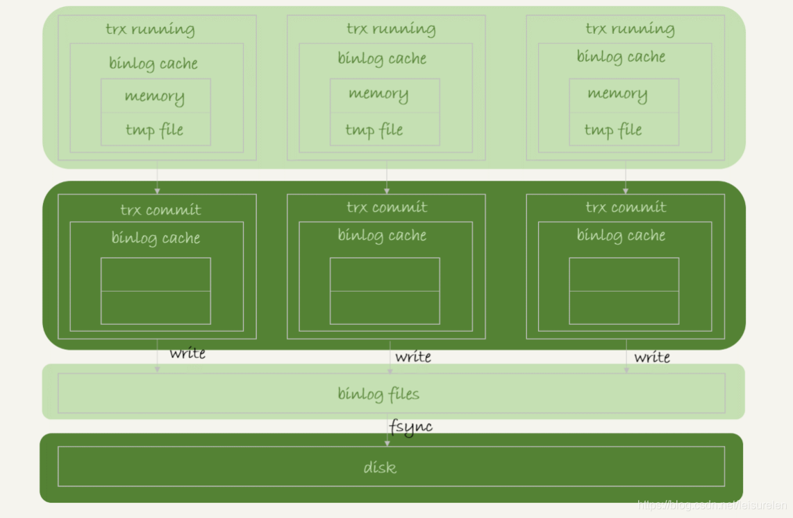
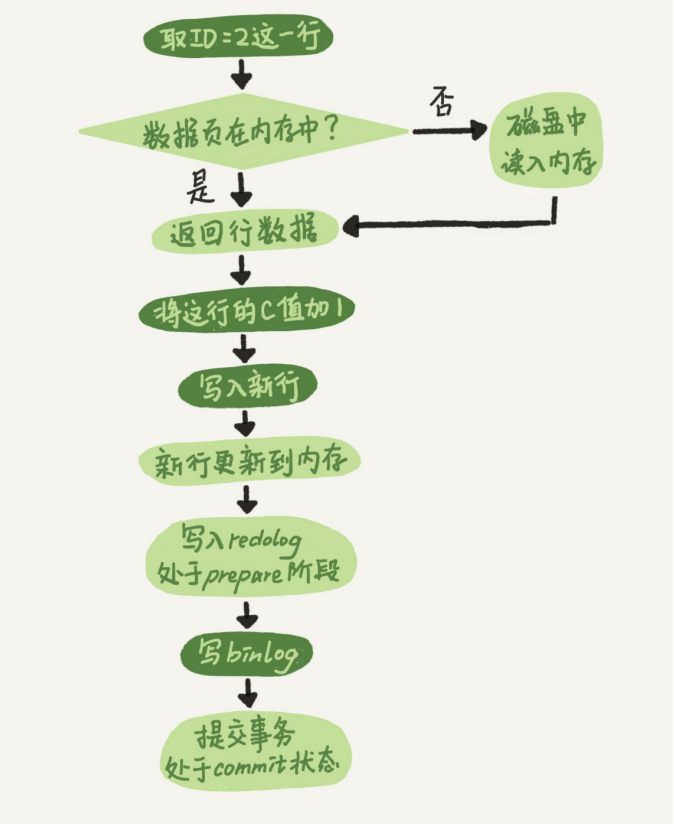

## MySQL三种重要的日志
MySQL有三种重要的日志，分别是 binlog(归档日志)、redolog(重做日志)、redolog(撤销日志)。
- binlog归档日志是数据库层面上的日志，主要用来做备份恢复和主从复制。
- redolog重做日志是<font color=red>Innodb引擎层面上</font>的日志，主要用来保证数据的可靠性。<font color=red>用于故障恢复，实现事务的持久性机制</font>
- undolog主要用于事务的回滚和MVCC 多版本并发控制。

### binlog日志
binlog是MySQL数据库的二进制日志，用于记录用户<font color=red>对数据库操作的SQL语句</font>（(除了数据查询语句）信息。可以使用mysqlbin命令查看二进制日志的内容。

binlog的格式有三种：STATEMENT、ROW、MIXED 。可以通过my.conf来配置。

```properties
###binlog模式：ROW/STATEMENT/MIXED
binlog_format=ROW
```

- STATMENT模式(默认,语句模式)：基于SQL语句的复制，每一条会修改数据的sql语句会记录到binlog中。
  - 优点，不需要记录每一条SQL语句与每行的数据变化，这样子binlog的日志也会比较少，减少了磁盘IO，提高性能。
  - 缺点，在某些情况下会导致master-slave中的数据不一致(如sleep()函数， last_insert_id()，以及user-defined functions(udf)等会出现问题)
- ROW模式(行模式)：基于行的复制，不记录每一条SQL语句的上下文信息，仅需记录哪条数据被修改了，修改成了什么样子了
  - 优点，不会出现某些特定情况下的存储过程、或function、或trigger的调用和触发无法被正确复制的问题
  - 会产生大量的日志
- Mixed模式(混合模式)：以上两种模式的混合使用，一般的复制使用STATEMENT模式保存binlog，对于STATEMENT模式无法复制的操作使用ROW模式保存binlog，MySQL会根据执行的SQL语句选择日志保存方式

**binlog写入机制**



binlog日志在事务没有提交之前会想写入到binlog cache中， 每个线程都有一个binlog cache。在事务提交后才会一次性写入到文件系统的缓存file page中。

然后mysql会根据你的sync_binlog配置决定是否马上刷新到磁盘中。

- sync_binlog=0 的时候，表示每次提交事务都只 write到file page中，不 fsync到磁盘；
- sync_binlog=1 的时候，表示每次提交事务都会执行 fsync；
- sync_binlog=N(N>1) 的时候，表示每次提交事务都 write，但累积 N 个事务后才 fsync。

**可以通过如下命令查看binlog_cache_size大小**

```
show variables like 'binlog_cache_size';
```

**验证binlog_cache_size设置是否合理**

```
mysql> show global status like 'binlog_cache_%';
+-----------------------+-------+
| Variable_name         | Value |
+-----------------------+-------+
| Binlog_cache_disk_use | 1008  | #记录了使用临时文件写二进制日志的次数，越小越好
| Binlog_cache_use      | 5721  | #使用缓冲的次数。越小越好
+-----------------------+-------+
2 rows in set (0.00 sec)
```


### redo日志

上面我们说binlog是归档日志，开启后每次数据库执行了修改数据的语句都会被记录，<font color=red>那既然有了binlog日志，为啥还要有redo日志呢</font>？

这里我们先了解一下一条更新语句是如何执行的？

#### 一条更新语句的执行流程



1. 执行器先找存储引擎(Innodb)取 ID=2 这一行，如果ID=2这一行所在的页不在内存中就从磁盘上读取所在页到内存然后返回给执行器，如果已经在内存则直接返回（<font color=red>MySQL最小存储单位是页，所以即使只是一条数据也是将所在页加载到内存</font>）
2. 执行器拿到存储引擎给的行数据后执行修改操作并返回给存储引擎。
3. 引擎将这行新数据更新到内存中，同时将这个更新操作记录到 redolog 里面，此时 redolog 处于 prepare 状态。然后告知执行器执行完成了，随时可以提交事务。
4. 执行器生成这个操作的 binlog，并把 binlog 写入磁盘。
5. 执行器调用引擎的提交事务接口，引擎把刚刚写入的 redo log 改成提交（commit）状
态，更新完成。

从上面的逻辑可以看出，当事务提交以后，MySQL是先将变化更新到内存然后在合适的时间把变化更新到磁盘，这样的设计主要是为了提高效率，毕竟每时每刻操作磁盘IO和查找成本都很高。假设在事务提交后变化写到了内存中，<font color=red>此时MySQL机器宕机了那就会导致提交后的事务数据丢失。</font> <font color=red>所以 redo日志是为了保证事务的持久性而存在的</font>。

#### 为什么redolog就能保证事务的持久性机制?
WAF（write ahead log）：当事务提交时，先写redo log，再修改页（这里的页，就是缓冲池中的数据页、索引页）。具体来说就是 ，<font color=red>当有一条记录需要更新的时候，InnoDB 引擎就会先把记录写到 redo log里面，并更新内存，这个时候更新就算完成了。同时，InnoDB 引擎会在适当的时候，将这个操作记录更新到磁盘里面，而这个更新往往是在系统比较空闲的时候做</font>。
所以当事务提交后就会记录redo日志，在事务提交后但还没更新到磁盘此时MySQL宕机了，就可以通过redo日志进行恢复，保证了事务的持久性。

#### redo日志特点
InnoDB 的 redo log 是<font color=red>固定大小</font>（可以通过innodb_log_file_size参数指定大小）的。数据会<font color=red>从头开始写,写到末尾就又回到开头循环写</font>。

在事务运行过程中，会不断地产生 redo log，这些 redo log 会先定入 redo log buffer(<font color=red>buffer可以认为是内存</font>)中，然后再将 redo log buffer 中的数据以某些方式顺序地写入到磁盘（各个操作的redo log 汇总到 redo log buffer，再由 redo log buffer 统一写磁盘，就能做到顺序写了）。这些方式有：
- MySQL master 线程周期性任务 每秒一次，将 redo log buffer 刷新到磁盘(即使这个事务尚未提交)
- MySQL master 线程周期性任务 每10秒一次，将 redo log buffer 刷新到磁盘
- 当redo log buffer size 剩余空间小于1/2时(innodb_log_buffer_size参数)，将 redo log buffer 刷新到磁盘
- 当 redo log file 大小已经达到某个域值快要"不可用"时（日志文件组轮流写文件），触发 async/sync flush checkpoint，及时将一些脏页刷新到磁盘，并同时将redo log buffer刷新到磁盘，然后更新redo log file 相应的 log sequence number值

#### redo日志重要参数
redo log buffer 的刷新到磁盘的时机由参数 <font color=red>innodb_flush_log_at_trx_commit</font> 参数控制，可取的值有：0、1、2
- 0 : 表示每次事务提交时都只是把redo log留在 redo log buffer 中。此时可能你提交事务了，结果mysql宕机了，然后此时内存里的数据全部丢失。
- 1 : 表示每次事务提交时都将redo log直接持久化到磁盘，只要事务提交成功，那么 redo log 就必然在磁盘里了
- 2 : 提交事务的时候，把 redo 日志写入磁盘文件对应的 os cache 缓存里去，而不是直接进入磁盘文件，可能 1 秒后才会把 os cache 里的数据写入到磁盘文件里去

可以看到，<font color=red>只有1才能真正地保证事务的持久性</font>，但是由于刷新操作 fsync() 是阻塞的，直到完成后才返回，我们知道写磁盘的速度是很慢的，因此 MySQL 的性能会明显地下降。如果不在乎事务丢失，0和2能获得更高的性能。

### binlog日志和redo日志区别
- redo log 是 InnoDB 引擎特有的；binlog 是 MySQL 的 Server 层实现的，所有引擎都可以使用。
- redo log 是物理日志，记录的是“在某个数据页上做了什么修改”；binlog 是逻辑日志，记录的是这个语句的原始逻辑，比如“给 ID=2 这一行的 c 字段加 1 ”。
- redo log 是循环写的，空间固定会用完；binlog 是可以追加写入的。

### undo日志
简单来说，undo日志有两个作用：提供回滚和多个行版本控制(MVCC)。
undolog是<font color=red>逻辑日志</font>。可以认为当delete一条记录时，undo log中会记录一条对应的insert记录，反之亦然，当update一条记录时，它记录一条对应相反的update记录。

## 参考
- 《MYSQL实战45讲》

