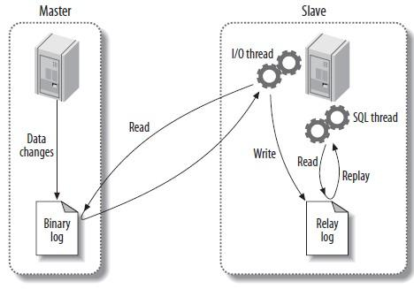

## 问题分析和定位

线上环境这几天在凌晨4点时报主从延迟。虽然我们项目对数据的时效性不是要求很高，但是出现了主从延迟肯定是哪个地方除了问题，为了保证稳定性需要排查一下问题原因。

### 主从同步原理



1. 主库对所有DDL和DML产生的日志写进binlog；
2. 主库生成一个 log dump 线程，用来给从库I/O线程读取binlog；
3. 从库的I/O Thread去请求主库的binlog，并将得到的binlog日志写到relay log文件中；
4. 从库的SQL Thread会读取relay log文件中的日志解析成具体操作，将主库的DDL和DML操作事件重放。

**详细过程**

1. Slave上的IO进程连接到Master，并请求从指定日志文件的指定位置（或者从最开始的日志）之后的日志内容。
2. Master接收到Slave的IO请求后，负责复制的进程会根据请求信息读取日志指定位置之后的日志信息，返回给Slave的IO进程。返回信息包括：**日志信息**，**Master的binlog文件名**，**本次返回的binlog的位置**
3. Slave的IO进程接收到信息后，将接收到的日志内容依次添加到Slave端的relay-log文件的最末端。并且**将读取到的Master端的 bin-log的文件名和位置记录到master-info文件中**。
4. Slave的SQL进程检测到relay-log中新增加了内容后，会马上解析relay-log的内容成为在Master端真实执行时候的那些可执行的内容，并在自身执行。

SQL语言共分为四大类：查询语言DQL，控制语言DCL，操纵语言DML，定义语言DD

- DQL：可以简单理解为SELECT语句；
- DCL：GRANT、ROLLBACK和COMMIT一类语句；
- DML：可以理解为CREATE一类的语句；
- DDL：INSERT、UPDATE和DELETE语句都是；

### 主从延迟可能原因
从上面的原理分析，可以知道导致的原因可能是以下几种。
- 网络原因。从库请求主库binlog延迟
- 主库单位时间内产生DDL数量超过从库所能执行的范围
- 从库执行大型的query语句导致锁表，从而导致执行同步过来的DDL语句延迟
- 从库机器性能原因

线上常见的事例：

- 主机执行了大事务，例如在一个事务中通过delete操作删除了100w的数据，从机大概率会出现同步延迟
- 主机执行了大量操作，比如主机的QPS从100升到1000，从机可能就会同步延迟
- 从机上执行了耗时的操作，比如进行了OLAP【一种数据处理技bai术，专门设计用于支持复杂的分du析操作】查询，占用大量机器资源导致同步延迟
- 从机上执行的操作长时间占用锁资源，导致同步操作等待，进而产生同步延迟
- 从机配置不如主机，或者配置相同但数据库安装在错误的磁盘上，常见于主机数据库运行在SSD硬盘上，从机没有SSD硬盘或者从机数据库不在SSD硬盘上导致同步延迟

个人觉得是<font color=red>主库单位时间内产生DDL数量超过从库所能执行的范围</font>这个原因比较大。所以从这开始排查。

## 问题排查

首先登录从库查看

```
mysql -h 从库IP -u 用户名 -p密码 -P 端口
```

```
#执行查看主从同步情况
show slave status\G;
*************************** 1. row ***************************
			  #当前slave I/O状态
               Slave_IO_State: Waiting for master to send event
                  Master_Host: 主库IP
                  Master_User: repl_user
                  Master_Port: 主库端口
                #重试时间，单位秒 默认60秒
                Connect_Retry: 60
              #当前I/O线程正在读取的主服务器二进制日志文件的名称
              Master_Log_File: mysql-bin.000231
          #同步读取二进制日志的位置，大于等于Exec_Master_Log_Pos
          Read_Master_Log_Pos: 211281725
          	   #当前slave SQL线程正在读取并执行的relay log的文件名
               Relay_Log_File: mysql-relay-bin.000230
                #当前slave SQL线程正在读取并执行的relay log文件中的位置
                Relay_Log_Pos: 10270447
        Relay_Master_Log_File: mysql-bin.000231
             Slave_IO_Running: Yes
            Slave_SQL_Running: Yes
              Replicate_Do_DB: wsportal
          Replicate_Ignore_DB: 
           Replicate_Do_Table: 
       Replicate_Ignore_Table: 
      Replicate_Wild_Do_Table: 
  Replicate_Wild_Ignore_Table: root.domain_info,root.certificate
                   Last_Errno: 0
                   Last_Error: 
                 Skip_Counter: 0
          #slave SQL线程当前执行的事件，对应在master相应的二进制日志中的position
          Exec_Master_Log_Pos: 211281725
              Relay_Log_Space: 10270667
              Until_Condition: None
               Until_Log_File: 
                Until_Log_Pos: 0
           Master_SSL_Allowed: No
           Master_SSL_CA_File: 
           Master_SSL_CA_Path: 
              Master_SSL_Cert: 
            Master_SSL_Cipher: 
               Master_SSL_Key: 
        #slave当前的时间戳和master记录该事件时的时间戳的差值
        Seconds_Behind_Master: 0
Master_SSL_Verify_Server_Cert: No
                Last_IO_Errno: 0
                Last_IO_Error:
                #代表最后一个执行的sql出错的原因
               Last_SQL_Errno: 0
               Last_SQL_Error: 
  Replicate_Ignore_Server_Ids: 
             Master_Server_Id: 12918051
                  Master_UUID: 8ef54a4c-d0e5-11e7-aa5f-047d7bb918b6
             Master_Info_File: mysql.slave_master_info
                    SQL_Delay: 0
          SQL_Remaining_Delay: NULL
      Slave_SQL_Running_State: Slave has read all relay log; waiting for the slave I/O thread to update it
           Master_Retry_Count: 86400
                  Master_Bind: 
      Last_IO_Error_Timestamp: 
     Last_SQL_Error_Timestamp: 
               Master_SSL_Crl: 
           Master_SSL_Crlpath: 
           Retrieved_Gtid_Set: 
            Executed_Gtid_Set: 
                Auto_Position: 0
```

一般主从同步问题可以通过这几个点排查

- Slave_IO_State 从库当前状态，用来判断从库是否断掉
- Read_Master_Log_Pos 和 Exec_Master_Log_Pos  这个值如果相差太大表示主从出现了延迟
- Seconds_Behind_Master 当前salve和master记录事件的时间戳，这个值如果越大证明延迟越严重

通过看show slave status发现一切正常，因为延迟是发生在凌晨4点。所以有可能的原因就是凌晨4点执行了大量的DDL导致的，之后恢复正常了。所以我们只能通过binlog日志查看凌晨4点时执行了什么语句。

通过上面我们知道了从库是从主库的 mysql-bin.000231日志中同步过来的。所以看下这个binlog日志在凌晨4点时执行的所有DDL语句。

导出主库上凌晨4:00~4:02的binlog日志。

```
#--base64-output=decode-rows -v 表示格式化DDL语句，因为binlog是二进制的
mysqlbinlog --base64-output=decode-rows -v --start-datetime='2020-08-17 04:00:00' --stop-datetime='2020-08-17 04:02:00' -d wsportal mysql-bin.000231 > /home/xuzy/log/mysql_bin_231_4.log
```

```
cat mysql_bin_231_4.log | grep 'INSERT' | wc -l
结果 : 99412
cat mysql_bin_231_4.log | grep 'INSERT' | grep 'dir_visit_report' | wc -l
结果 : 43695
```

通过查看binlog日志，发现在2分钟内主库插入数据到表dir_visit_report一共执行了4万多次。感觉原因就是这个，然后继续查了下业务代码，发现是同事一个入库定时器写错了写成每天凌晨4点执行，其实是一个月执行一次，所以导致每天都报延迟。

## 如何避免

- 升级MySQL版本到5.7，使用并行复制
- 升级Slave硬件配置
- 优化网络
- 业务上防止统一时间点大量更新操作
- 修改binlog配置sync_binlog，innodb_flush_log_at_trx_commit (redo日志)
- 使用混合模式复制的方式，通过binlog-format配置。项目上作者使用的是行模式，行模式的有点是能保证主从完全一致，但速度会比较慢。具体可以参考《[MYSQL中BINLOG_FORMAT的三种模式](https://www.cnblogs.com/xingyunfashi/p/8431780.html)》

### sync_binlog

- sync_binlog = 0 ，表示MySQL不控制binlog的刷新，由文件系统自己控制它的缓存的刷新

- sync_binlog > 0 ，指定了两次刷新到磁盘的动作之间间隔多少次二进制日志写操作

- sync_binlog = 1 ，表示每次事务提交，MySQL都会把binlog刷下去，是最安全但是性能损耗最大的设置

### innodb_flush_log_at_trx_commit

0 ： 提交事务的时候，不立即把 redo log buffer 里的数据刷入磁盘文件的，而是依靠 InnoDB 的主线程每秒执行一次刷新到磁盘

1 ： 提交事务的时候，就必须把 redo log 从内存刷入到磁盘文件里去，只要事务提交成功，那么 redo log 就必然在磁盘里了

2 ：提交事务的时候，把 redo 日志写入磁盘文件对应的 os cache 缓存里去，而不是直接进入磁盘文件，可能 1 秒后才会把 os cache 里的数据写入到磁盘文件里去

## Mysql主从同步宕机恢复流程

主从同步宕机是很常见的一种错误。下面分析几种情况的解决方法。

### 从机宕机恢复

丛机宕机后不在主节点获取数据入库，造成数据不一致。如果要让从机重新同步需要分两种情况：

**从节点宕机时间短，主节点的binlog日志没变**

这种情况下，假设从节点没宕机前是从主节点的mysqlmaster-bin.0010的binlog文件上同步数据，在我们发现从节点宕机后准备重新同步时，可以观察下当前时刻主节点是否还是使用mysqlmaster-bin.0010文件记录日志。如果是则可以直接重启从机的同步命令。

这种情况下Mysql的从节点是可以知道从哪个Position开始同步出错的，所以主要重启就可以重新同步。

```shell
start slave;
```

如何确定是否是同一个binlog。可以通过查看主节点和从节点当前使用的binlog信息。

```
mysql> show slave status\G; #登陆从节点查看主从同步信息
mysql> show master status;  #登陆主节点查看binlog信息
```

**从节点宕机时间长，主节点的binlog日志已变化**

这种情况下从节点无法知道是从哪个binlog日志的哪个position上开始不执行同步的。这种情况下最好是**重新做同步**。步骤如下

1. 对主库锁表 flush tables with read lock;
2. 主库把数据备份到mysql.bak.sql文件（备份的时候可以指定重新刷新binlog文件,所以binlog文件就是最新的position很小）
3. 从库导入mysql.bak.sql
4. 从库重新设定同步

```sql
change master to master_host = 'IP', master_user = 'root', master_port=3306, master_password='', master_log_file = 'mysqld-bin.000001', master_log_pos=3260;
```