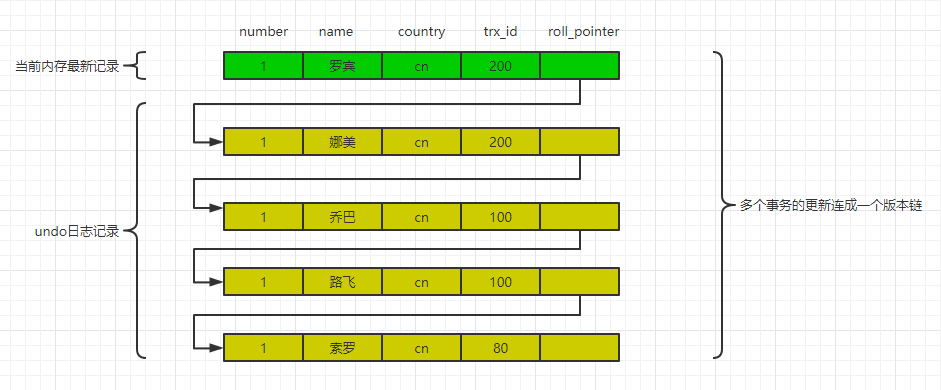
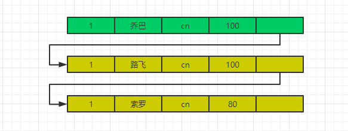

## 事务

### 概述

先定义一个表，方便后面说明。

```sql
CREATE	TABLE hero(
   	number	INT,
   	name	VARCHAR(100),
   	country	varchar(100),
   	PRIMARY	KEY	(number)
)	Engine=InnoDB	CHARSET=utf8;
INSERT INTO	hero VALUES(1,	'索罗','cn');
```

MySQL是一个客户端/服务器架构。对于MySQL这个服务器来说，可以有很多客户端与其连接。每个客户端与服务器连接上之后，就可以称之为⼀个会话（Session）。事务是用来保证一个或多个数据库操作要嘛全部成功，要嘛全部回滚。事务要求我们要保证<font color=red>原子性、一致性、隔离性、持久性</font>。

- 原子性，多个操作是一个不可分割的整体，要么全做，要么全不做的规则称之为原⼦性。
- 一致性，在事务操作之前和之后，数据都是保持一个相同的状态，数据库的完整性没有被破坏。
- 隔离性，保证多个事务之间不互相影响的规则称之为隔离性。隔离性可以防止多个事务并发执行时由于交叉执行而导致数据的不一致。
- 持久性，事务操作完成后，数据会被刷新到磁盘永久保存，即便是系统故障也不会丢失。

<font color=red>由于多个事务之间是并发执行的，要使得的事务之间互相不影响保证隔离性，只能对事务进行排队访问(锁)，但是这样的效果效率底下，如果不使用排队，多个事务之间同时操作则会出现如下问题：</font>
<!--more-->
### 事务并发执行可能出现的问题

#### 脏写

如果⼀个事务修改了另⼀个未提交事务修改过的数据，那就意味着发⽣了脏写。

| 时间编号 | Session A                                      | Session B                                      |
| -------- | ---------------------------------------------- | ---------------------------------------------- |
| 1        | begin;                                         |                                                |
| 2        |                                                | begin;                                         |
| 3        |                                                | UPDAE hero SET name = '路飞' WHERE number = 1; |
| 4        | UPDAE hero SET name = '乔巴' WHERE number = 1; |                                                |
| 5        | commit;                                        |                                                |
| 6        |                                                | rollback;                                      |

在事务B先把值改成路飞后，事务A又把值改成了乔巴。事务A先提交后事务B回滚成原始值。导致了<font color=red>事务A明明把值改了但最后缺没有任何变化</font>。

#### 脏读

如果⼀个事务读到了另⼀个未提交事务修改过的数据，那就意味着发⽣了脏读。

| 时间编号 | Session A                          | Session B                                      |
| -------- | ---------------------------------- | ---------------------------------------------- |
| 1        | begin;                             |                                                |
| 2        |                                    | begin;                                         |
| 3        |                                    | UPDAE hero SET name = '路飞' WHERE number = 1; |
| 4        | SELECT * FROM hero WHERE hero = 1; |                                                |
| 5        | commit;                            |                                                |
| 6        |                                    | rollback;                                      |

在事务A的4时刻如果读取到的name='路飞'，但是最后事务B回滚后事务A就读取到了一个不存在的数据。

#### 不可重复读

如果⼀个事务只能读到另⼀个已经提交的事务修改过的数据，并且其他事务每对该数据进⾏⼀次修改并提交后，该事务都能查询得到最新值，那就意味着发⽣了不可重复读。

| 时间编号 | Session A                                                    | Session B                                                    |
| -------- | ------------------------------------------------------------ | ------------------------------------------------------------ |
| 1        | begin;                                                       |                                                              |
| 2        | SELECT * FROM hero WHERE hero = 1;<br />(此时读取到的值是''索罗'') |                                                              |
| 3        |                                                              | begin;<br />UPDAE hero SET name = '路飞' WHERE number = 1;<br />commit; |
| 4        | SELECT * FROM hero WHERE hero = 1;<br />(如果读到的值是'路飞'，则意味发生了不可重复读) |                                                              |
| 5        |                                                              | begin;<br />UPDAE hero SET name = '乔巴' WHERE number = 1;<br />commit; |
| 6        | SELECT * FROM hero WHERE hero = 1;<br />(如果读到的值是'乔巴'，则意味发生了不可重复读) |                                                              |

#### 幻读

如果⼀个事务先根据某些条件查询出⼀些记录，之后另⼀个事务⼜向表中插⼊了符合这些条件的记录，原先的事务再次按照该条件查询时，能把另⼀个事务插⼊的记录也读出来，那就意味着发⽣了幻读。

| 时间编号 | Session A                                                    | Session B                             |
| -------- | ------------------------------------------------------------ | ------------------------------------- |
| 1        | begin;                                                       |                                       |
| 2        | SELECT * FROM hero WHERE hero > 0;<br />(此时读取到的值是''索罗'') |                                       |
| 3        |                                                              | INSERT INTO hero VALUE(2,'路飞','cn') |
| 4        | SELECT * FROM hero WHERE hero > 0;<br />(此时读取到的值是''索罗''、“路飞”，则意味发生了幻读) |                                       |

### 隔离级别概述与实现原理(重点)

#### 隔离级别基础知识

由此可见，并发事务会引起上面说的4种问题，严重性从大到小 ：脏写，脏读，不可重复读，幻读。

MySQL为了保证事务能在并发下执行（提高性能）又想尽量减少上面的4个问题，所以制定了事务隔离级别用来解决上面说的4种问题，<font color=red>级别越高越能解决问题，相对的性能越低</font>。

- READ UNCOMMITTED（未提交读），<font color=blue>一个事务还没提交时，它做的变更就能被别的事务看到</font>。
- READ COMMITTED（已提交读），<font color=blue>一个事务提交之后，它做的变更才会被其他事务看到</font>。
- REPEATABLE READ（可重复读），<font color=blue>一个事务执行过程中看到的数据，总是跟这个事务在启动时看到的数据是一致的。当然在可重复读隔离级别下，未提交变更对其他事务也是不可见的</font>。
- SERIALIZABLE（可串⾏化），<font color=blue>顾名思义是对于同一行记录，“写”会加“写锁”，“读”会加“读锁”。当出现读写锁冲突的时候，后访问的事务必须等前一个事务执行完成，才能继续执行</font>。

**不同隔离级别下可以和不可以解决问题的对照表**

| 隔离级别                     | 脏读     | 不可重复读 | 幻读     |
| ---------------------------- | -------- | ---------- | -------- |
| READ UNCOMMITTED（未提交读） | 可能发生 | 可能发生   | 可能发生 |
| READ COMMITTED（已提交读）   | 不发生   | 可能发生   | 可能发生 |
| REPEATABLE READ（可重复读）  | 不发生   | 不发生     | 可能发生 |
| SERIALIZABLE（可串⾏化）     | 不发生   | 不发生     | 不发生   |

- READ UNCOMMITTED 隔离级别下，可能发⽣脏读 、 不可重复读和幻读问题。
- READ COMMITTED 隔离级别下，可能发⽣不可重复读和幻读问题，但是不可以发⽣脏读问题。
- REPEATABLE READ 隔离级别下，可能发⽣幻读问题，但是不可以发⽣脏读和不可重复读的问题。
- SERIALIZABLE 隔离级别下，各种问题都不可以发⽣。

**我们举个例子帮助理解下**。例如可重复读，按照意思就是说我一个事务启动的时候就已经将启动这一时刻的数据做了一个"快照"，例如事务启动这一时刻我读取到的number = 1是'路飞‘，那我不管这个事务后面怎么再去读取number = 1的数据也都只会是路飞。那这样的话我们分析下，

- 脏读指得是一个事务读取到没提交事务修改过的数据，那由于我做了"快照"只能读取最开始的值，所以不会发生。
- 不可重复读也是如此，这就不说了。
- <font color=red>可重复读下可能发生幻读，后面原理详解说明</font>

#### 原理

那隔离级别到底是基于什么原理来实现脏读，不可重复读和幻读的呢。答案就是MVCC(多版本并发控制)。用大白话大概解释下实现的原理：<font color=red>我们以前说过Undo日志，他用来记录数据更改前的值，用来实现回滚，其实他也是MVCC的关键。MySQL将数据的更变记录形成一条链条，每个更变记录上记录着对应操作的事务ID，然后通过判断事务ID来决定读取到的内容是哪个。下面具体分析</font>。

##### 版本链

对于使⽤InnoDB存储引擎的表来说，它的聚簇索引记录中都包含两个必要的隐藏列：

- trx_id ： 每次⼀个事务对某条聚簇索引记录进⾏改动时都会将改动这条记录的事务ID记录到这里。
- roll_pointer ：每次对某条聚簇索引记录进⾏改动时，都会把旧的版本写⼊到undo⽇志中，然后这个隐藏列就相当于⼀个指针，可以通过它来找到该记录修改前的信息。

两个事务做的操作如下(**最开始假设原来的索罗这条数据是事务ID=80插入的**)：

| 时间编号 | trx_id = 100                                   | trx_id = 200                                   |
| -------- | ---------------------------------------------- | ---------------------------------------------- |
| 1        | begin                                          |                                                |
| 2        |                                                | begin                                          |
| 3        | update hexo set name = '路飞' where number = 1 |                                                |
| 4        | update hexo set name = '乔巴' where number = 1 |                                                |
| 5        | commit                                         |                                                |
| 6        |                                                | update hexo set name = '娜美' where number = 1 |
| 7        |                                                | update hexo set name = '罗宾' where number = 1 |
| 8        |                                                | commit                                         |

**小贴士 : 为什么图例上没有那种两个事务交叉更新同一条数据的情况? 这种情况不可能发生，更一条记录更新时，InnoDB就会将这条记录锁起来了，其他事务是必须等这个事务更新后才能操作，只能阻塞。但是对于读的话可以读，但是会会读取到什么内容不一定(<font color=red>其实隔离机制就是用来解决这个读取的问题，读到哪个值就是不同隔离机制决定的</font>)。**

所以，上面的版本链用图示表示如下



对该记录每次更新后，都会将旧值放到⼀条undo⽇志中，就算是该记录的⼀个旧版本，随着更新次数的增多，所有的版本都会被roll_pointer属性连接成⼀个链表，我们把这个链表称之为<font color=red>版本链</font>，版本链的头节点就是当前记录最新的值。

**READ UNCOMMITTED（未提交读）、SERIALIZABLE（串行化）如何实现？**

由于未提交读是**一个事务还没提交时，它做的变更就能被别的事务看到**。所以如果设置的是未提交读级别的隔离，那每次只要读取版本链的最新数据，也就是当前内存数据就可以了。对于串行化隔离级别，InnoDB使用的是加锁的方式，所以也是读取内存最新值。

##### ReadView

对于使⽤READ COMMITTED（读提交）和REPEATABLE READ（可重复读）隔离级别的事务来说，都必须保证读到已经提交了的事务修改过的记录，也就是说假如另⼀个事务已经修改了记录但是尚未提交，是不能直接读取最新版本的记录的，核⼼问题就是：<font color=red>需要判断⼀下版本链中的哪个版本是当前事务可⻅的</font>。所以提出了⼀个ReadView的概念。ReadView中包含4个内容：

- m_ids：表示在⽣成ReadView时当前系统中活跃的读写事务的事务id列表。 
- min_trx_id：表示在⽣成ReadView时当前系统中活跃的读写事务中最⼩的事务id，也就是m_ids中的最⼩值。
- max_trx_id：表示⽣成ReadView时系统中应该分配给下⼀个事务的id值。
- creator_trx_id：表示⽣成该ReadView的事务的事务id。

**小贴士：只有在对表中的记录做改动时（执⾏INSERT、DELETE、UPDATE这些语句时）才会为事务分配事务id，否则在⼀个只读事务中的事务id值都默认为0。**

有了这个ReadView，这样在访问某条记录时，只需要按照下边的步骤判断记录的某个版本是否可⻅：

- 如果被访问的版本的trx_id值与ReadView中的creator_trx_id值相同，表示<font color=red>当前事务访问的是自己修改的记录，该版本可以被访问</font>。
- 如果被访问的版本的trx_id值小于min_trx_id，表示<font color=red>被访问版本在当前事务生成前已经提交了，该版本可以访问</font>。
- 如果被访问的版本的trx_id值大于max_trx_id，表示<font color=red>被访问版本在当前事务生成后才生成，该版本不能被访问</font>。
- 如果被访问的版本在min_trx_id、max_trx_id之间，需要判断下被访问版本的trx_id值是不是在m_ids列表中。
  - <font color=green>如果在就表示创建ReadView时被访问版本对应的事务是活跃的，该版本不能被访问</font>。
  - <font color=green>如果不在就表创建ReadView时被访问版本对应的事务已经提交了，该版本可以被访问</font>。

如果某个版本不可访问就顺着版本链继续找下一个直到最后一个版本。

**现在我们来分析下READ COMMITTED（读提交）和REPEATABLE READ（可重复读）的不同**。

- <font color=blue>读提交隔离级别规定只要是事务提交了，那更变马上就可以看到</font>。
- <font color=blue>可重复读隔离级别规定只能看到事务启动时的版本，后面即使其他事务做了更变提交了，我也看不到</font>。

所以，MREAD COMMITTED和REPEATABLE READ隔离级别的的⼀个⾮常⼤的区别就是它们⽣成ReadView的时机不同所以才能使得他们能达到不同的效果。

**READ COMMITTED（读提交） —— 每次读取数据前都⽣成⼀个ReadView**

**假设1：**假设现在事务100做了更新还没提交，事务200做了其他表的更新但是还没更新number=1的数据。新事务执行了如下语句，那他得到的值是什么，我们来分析下。

```sql
SELECT * FROM hero WHERE number = 1;
```



由于是每次读取时生成ReadView。所以此时生成了一个ReadView，此时

- m_ids = [100,200]
- min_trx_id = 100
- max_trx_id = 201
- creator_trx_id = 0 （由于只读事务创建的事务ID都是0）

从乔巴开始判断，由于trx_id=100在m_Ids中，不符合。直到索罗trx_id=80，不在m_ids中，该版本可以被访问

**假设2：**假设现在事务100已经提交，事务200更新成‘罗宾’，假设1中的新事务执行了

```sql
SELECT * FROM hero WHERE number = 1;
```


由于每次读取时都生成ReadView，所以此时生成了一个ReadView，

- m_ids = [200]（此时事务100已经提交了，所以活跃的只有200）
- min_trx_id = 200 (最小的活跃事务ID)
- max_trx_id = 201
- creator_trx_id = 0（由于只读事务创建的事务ID都是0）

从版本的第一个‘罗宾’开始判断，由于该版本trx_id = 200，在m_ids中，不符合。到‘乔巴’trx_id=100不在m_ids中，符合，该版本可以被访问。

**REPEATABLE READ（可重复读） —— 在第⼀次读取数据时⽣成⼀个ReadView**

**假设1：**假设现在事务100，事务200是活跃的，事务100刚更新了‘路飞’，‘乔巴’，事务200更新了其他表的数据但是还没更新number=1的数据。此时来了一个事务300。

```sql
SELECT * FROM hero WHERE number = 1;
```


在第一个读取数据时生成了，所以这条查询语句对应的ReadView。

- m_ids = [100，200]
- min_trx_id = 100 (最小的活跃事务ID)
- max_trx_id = 201
- creator_trx_id = 0（由于只读事务创建的事务ID都是0）

从‘乔巴’开始判断，trx_id = 100 , 在m_ids中，不能被访问，继续下一步到‘索罗’可以了。

**假设2：**假设现在事务100提交了，事务200做了更新到‘罗宾’后还没提交，假设1中的事务300继续执行了查询number = 1。现在的版本链如下。


由于在第一次读取数据时已经生成了，所以ReadView还是下面的样子

- m_ids = [100，200]
- min_trx_id = 100 (最小的活跃事务ID)
- max_trx_id = 201
- creator_trx_id = 0（由于只读事务创建的事务ID都是0）

从‘罗宾’开始判断，由于trx_id在m_ids中，不符合。到‘乔巴’trx_id=100也在m_ids中，不符合。直到‘索罗’符合。

#### 幻读怎么办？

我们再来理解一下幻读的情况，**如果⼀个事务先根据某些条件查询出⼀些记录，之后另⼀个事务⼜向表中插⼊了符合这些条件的记录，原先的事务再次按照该条件查询时，能把另⼀个事务插⼊的记录也读出来，那就意味着发⽣了幻读**。

**为什么可重复读可能发生幻读？**通过分析可重复读的原理，我们列举两个例子。新建一张表

```sql
CREATE TABLE `dept` (
  `id` int(11) NOT NULL AUTO_INCREMENT,
  `name` varchar(20) DEFAULT NULL,
  PRIMARY KEY (`id`)
) ENGINE=InnoDB AUTO_INCREMENT=12 DEFAULT CHARSET=utf8
insert into dept(name) values("后勤部");
```

**例子1：**在可重复读隔离级别下

| 事务1              | 事务2                                    |
| ------------------ | ---------------------------------------- |
| begin              | begin                                    |
| select * from dept |                                          |
|                    | insert into dept(name) values ('研发部') |
|                    | commit                                   |
| select * from dept |                                          |
| commit             |                                          |

这种情况下由于是可重复读，一个事务执行过程中看到的数据，总是跟这个事务在启动时看到的数据是一致的。所以不会发生幻读。

**例子2：**在可重复读隔离级别下

| 事务1                           | 事务2                                    |
| ------------------------------- | ---------------------------------------- |
| begin                           | begin                                    |
| select * from dept              |                                          |
|                                 | insert into dept(name) values ('研发部') |
|                                 | commit                                   |
| update dept set name = '财务部' |                                          |
| commit                          |                                          |

在可重复读隔离级别下，我们觉得预期的结果应该是后勤部被更改成财务部，表中的数据有研发部，财务部。但实际上表中的两条数据都是财务部。发生了幻读。

**为什么?** RR级别中，通过MVCC机制读取到的是快照数据，所以没问题。然而在做Update的情况下都是需要读取当前最新数据的，所以就出现了上面的情况。

**如何解决幻读？**

很明显可重复读的隔离级别没有办法彻底的解决幻读的问题，如果我们的项目中需要解决幻读的话也有两个办法：

- 使用串行化读的隔离级别
- MVCC+next-key locks：next-key locks由record locks(索引加锁) 和 gap locks(间隙锁，每次锁住的不光是需要使用的数据，还会锁住这些数据附近的数据)

所谓的next-key locks是记录锁加间隙(gap)锁的组合。只在REPEATABLE READ或以上的隔离级别下的特定操作才会取得gap lock或nextkey lock。

实际上很多的项目中是不会使用到上面的两种方法的，串行化读的性能太差，而且其实幻读很多时候是我们完全可以接受的。

## 总结

- MVCC（多版本并发控制）指的就是在使⽤ READ COMMITTD （读提交）、 REPEATABLE READ（可重复读）这两种隔离级别的事务在执⾏普通的 SEELCT 操作时访问记录的版本链的过程，这样⼦可以使不同事务的 读-写 、 写-读 操作并发执⾏，从⽽提升系统性能。
- MVCC的关键是使用undo日志组成一条链。
- 对于读未提交、串行化直接读取的内存最新值。
- 脏写是不会发生的，因为一个事务在更新数据时，如果另一个事务也要更新必须等到在更新的事务提交。