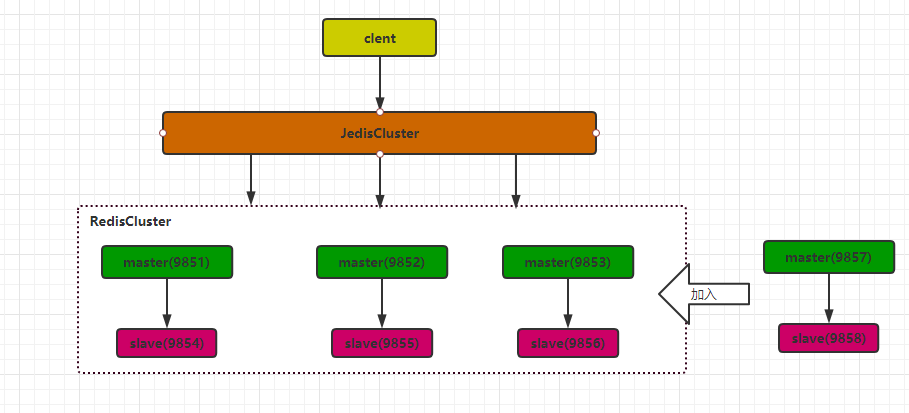
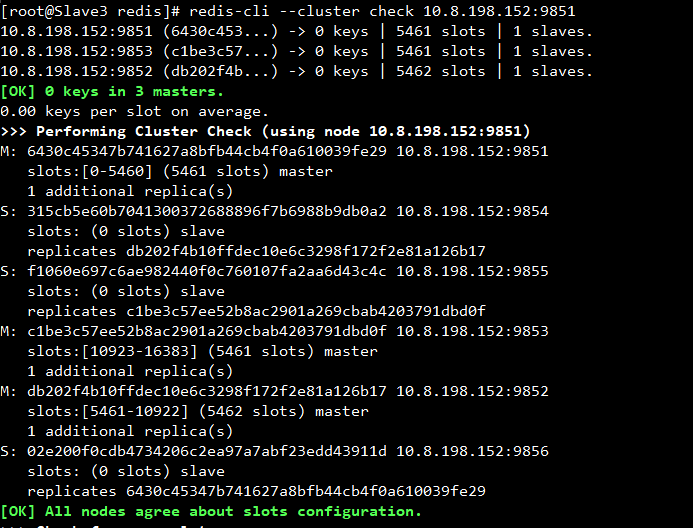
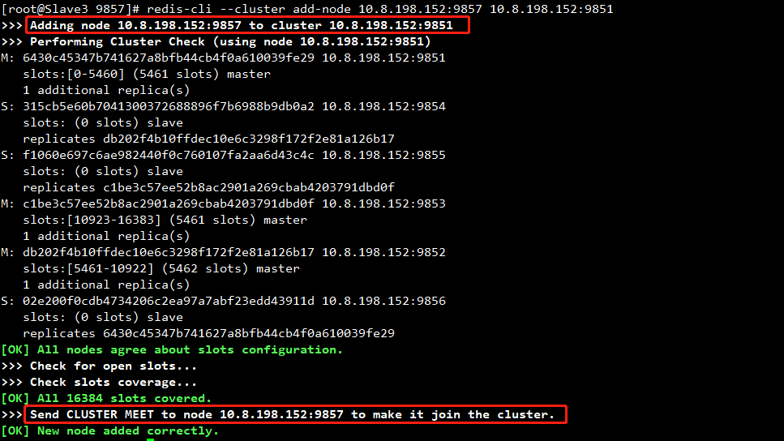
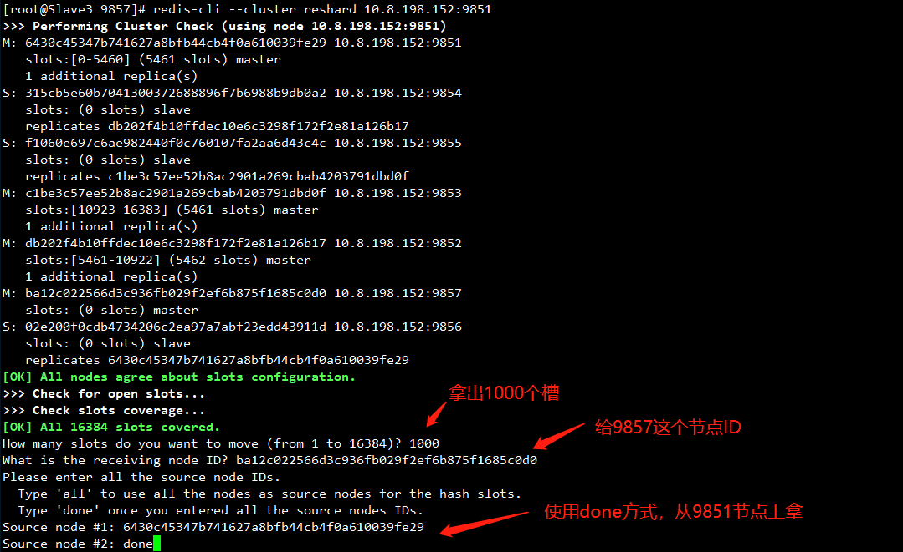
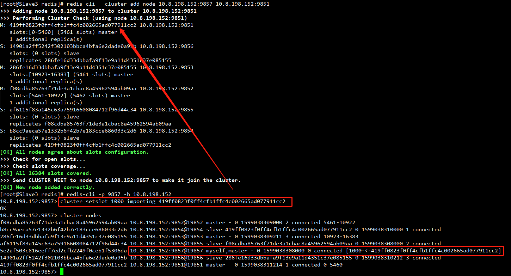
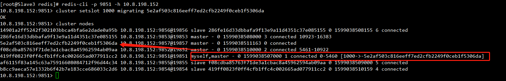
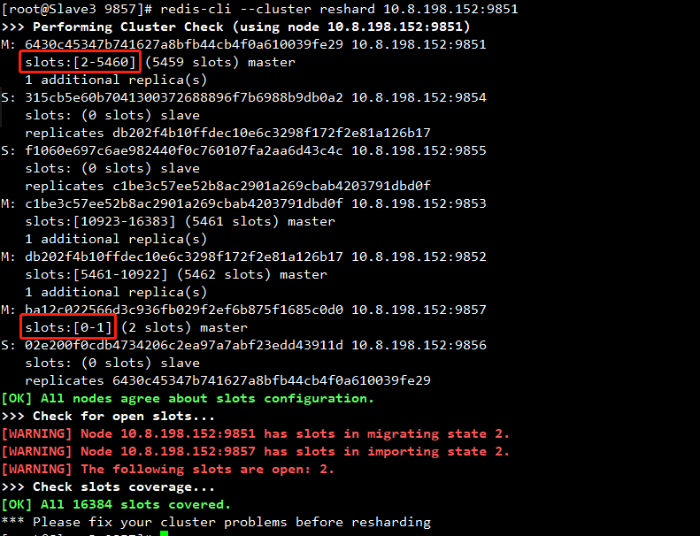
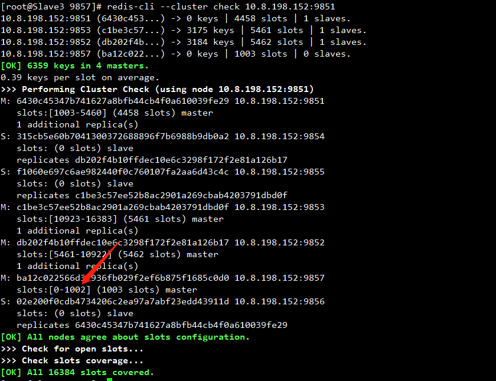
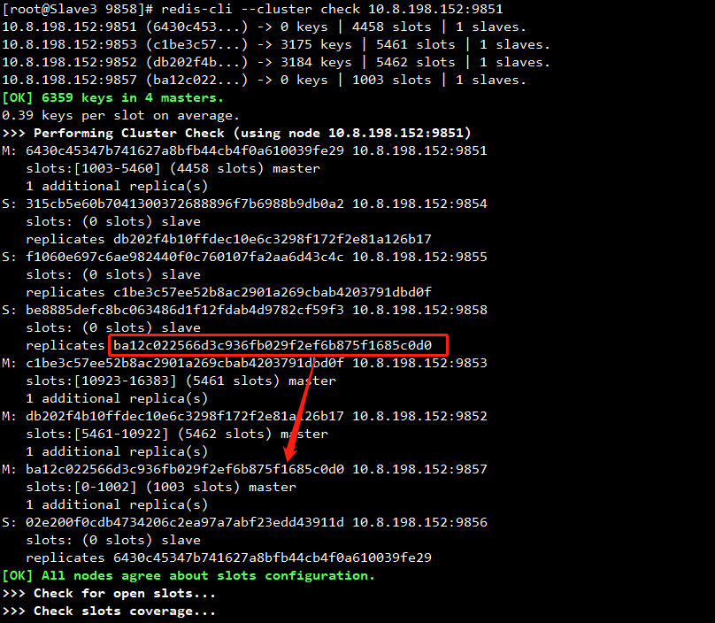

## Redis5.0集群水平扩展

上节介绍了集群的搭建，这节开始详解水平扩展。假设现在由于资源使用情况，我们需要增加一组主从（9857、9858）加入到集群中。


<!--more-->
当前Redis集群情况如下，



- 槽（0 - 5460）           主：10.8.198.152:9851 从：  10.8.198.152.9856
- 槽（5461 - 10922）   主：10.8.198.152:9852 从：  10.8.198.152.9854
- 槽（10923 - 16381） 主：10.8.198.152:9853 从：  10.8.198.152.9855

### **增加9857、9858实例**

新增两个目录并修改其配置文件，如何修改参照上一篇文章。此时启动9857、9858后还没有加入到集群中。

```shell
[root@Slave3 redis]# mkdir 9857
[root@Slave3 redis]# mkdir 9858
[root@Slave3 redis]# cp /etc/redis/9851/redis.conf /etc/redis/9857/
[root@Slave3 redis]# cp /etc/redis/9851/redis.conf /etc/redis/9858/
##修改9857、9858配置文件，并启动
[root@Slave3 redis]# redis-server /etc/redis/9857/redis.conf
[root@Slave3 redis]# redis-server /etc/redis/9858/redis.conf
```

### **配置9857为集群主节点**

```shell
redis-cli --cluster add-node 10.8.198.152:9857 10.8.198.152:9851
```



### **为9857分配槽(空槽道迁移)**

#### **方案1**

上面我们将9857加入到集群后还没分配槽，此时9857还没有作用。接下去需要为其分配槽。原来我们3个master已经将槽分配完了，此时加入一个新maser则需要将其中一台master的槽进行拆分。

**重新分配集群上的槽给9857**

```shell
redis-cli --cluster reshard 10.8.198.152:9851
```



此时会询问**分出多少槽出来？分给哪个节点？** 我们按照提示输入。
接下去会询问我们分配槽的方式，有两种方式

- all，以将所有节点用作散列槽的源节点
- done，选择从哪个节点上拿出来节点

all是随机的，比如说我们要分出1000个，则3个主节点分别拿出333个，333个，334个节点分别9857，这里我们选择done，从9857拿1000个给9857。

#### **方案2**

<font color=red>这种方案相对与上一种方案有缺陷，他只能迁移一个槽</font>

```shell
redis-cli --cluster add-node 10.8.198.152:9857 10.8.198.152:9851
```


（1）先登录9851查看下要迁移的槽上有没有存了KEY，没有才能迁移

```shell
#cluster getkeysinslot 槽道号 查找范围
10.8.198.152:9851>cluster getkeysinslot 1000 2000
(empty list or set)
```

（2）登录需要导入的节点9857，执行命令cluster setslot 槽道号 importing 源节点id，将9857节点上1000槽道的状态变更为importing

```
10.8.198.152:9857>cluster setslot 1000 importing 419ff0823f0ff4cfb1ffc4c002665ad077911cc2
```



（3）登录需要导出的节点9851，执行命令cluster setslot 槽道号 migrating 目标节点id，将9851节点上的460槽道的状态变更为migrating。

```shell
10.8.198.152:9851>cluster setslot 1000 migrating 5e2af503c816eeff7ed2cfb2249f0ceb1f5306da
```



（4）通知进行迁移的两个节点槽道迁移了，使用命令**cluster setslot 槽道号 node 迁入节点id**，需要在两个节点上均进行操作。槽号1000就被迁移了。

```shell
# 迁出节点9851上执行命令，后面跟的id为迁入节点的id
[root@Slave3 redis]# redis-cli -p 9851 -h 10.8.198.152
10.8.198.152:9851> cluster setslot 1000 node 5e2af503c816eeff7ed2cfb2249f0ceb1f5306da
OK
#迁入节点9857上执行命令，后面跟的id为迁入节点的id
[root@Slave3 redis]# redis-cli -p 9857 -h 10.8.198.152
10.8.198.152:9857> cluster setslot 1000 node 5e2af503c816eeff7ed2cfb2249f0ceb1f5306da
OK
10.8.198.152:9857> cluster nodes
f08cdba85763f71de3a1cbac8a45962594ab09aa 10.8.198.152:9852@19852 master - 0 1599038877000 2 connected 5461-10922
b8cc9aeca57e1332b6f42b7e183cce686033c2d6 10.8.198.152:9854@19854 slave 419ff0823f0ff4cfb1ffc4c002665ad077911cc2 0 1599038878000 1 connected
286fe16d33dbbafa9f13e9a11d4351c37e085155 10.8.198.152:9853@19853 master - 0 1599038879000 3 connected 10923-16383
af6115f83a145c63a75916608084712f96d44c34 10.8.198.152:9855@19855 slave f08cdba85763f71de3a1cbac8a45962594ab09aa 0 1599038879489 2 connected
5e2af503c816eeff7ed2cfb2249f0ceb1f5306da 10.8.198.152:9857@19857 myself,master - 0 1599038878000 7 connected 1000
14901a2ff5242f302103bbca4bfa6e2dade0a95b 10.8.198.152:9856@19856 slave 286fe16d33dbbafa9f13e9a11d4351c37e085155 0 1599038880000 3 connected
419ff0823f0ff4cfb1ffc4c002665ad077911cc2 10.8.198.152:9851@19851 master - 0 1599038880492 1 connected 0-999 1001-5460
```


### **为9857分配槽(非空槽道迁移)**

<font color=red>正常情况下，到这一步应该要将9851上的1000个槽分配给9857成功，但是由于我们9851上要转移的槽上有存了key了导致我们转移失败。</font>



#### **解决方案1**

解决方法：

1. 删除节点9851上的所有key，可以使用flushdb
2. 执行 redis-cli \--cluster fix 10.8.198.152:9851 修复节点
3. 重新从 redis-cli \--cluster reshard 10.8.198.152.9851 命令重新分配槽

#### **解决方案2**

假设要迁移9851上的槽654到9857

首先先保证9857加入到集群了

```shell
 redis-cli --cluster add-node 10.8.198.152：9857 10.8.198.152：9851
```

当前cluster nodes信息

```shell
10.8.198.152:9851> cluster nodes
5bc658cd4d8cc35097e0a79e140069262161b827 10.8.198.152:9855@19855 slave bb3900b30983e0b41ed48ffe4be0e2d52b4d89b4 0 1599040212180 5 connected
a26317d89a7b09c0c9d77139cd8be94588c9b127 10.8.198.152:9853@19853 master - 0 1599040210000 3 connected 10923-16383
bb3900b30983e0b41ed48ffe4be0e2d52b4d89b4 10.8.198.152:9852@19852 master - 0 1599040210175 2 connected 5461-10922
1f797b67ba0ae4966610d8596431980f5cce4858 10.8.198.152:9854@19854 slave 5015fbe7c523681a59e13f86f0ddc27b1ac542f8 0 1599040212000 4 connected
5015fbe7c523681a59e13f86f0ddc27b1ac542f8 10.8.198.152:9851@19851 myself,master - 0 1599040211000 1 connected 0-5460
0a286334e831f426de9e30c7990cffb40a1e4102 10.8.198.152:9857@19857 master - 0 1599040211000 0 connected
150ef7fd331f57f3d11e8b2372ba991c41c850d7 10.8.198.152:9856@19856 slave a26317d89a7b09c0c9d77139cd8be94588c9b127 0 1599040213182 6 connected
```

（1）检查654槽是否有数据

```shell
#cluster getkeysinslot 槽道号 查找范围
[root@Slave3 redis]# redis-cli -p 9851 -h 10.8.198.152
10.8.198.152:9851> cluster getkeysinslot 654 2000
1) "\xac\xed\x00\x05t\x00\tkey_45618"
```

（2）登录需要导入的节点9857，执行命令cluster setslot 槽道号 importing 源节点id，将8000节点上654槽道的状态变更为importing。

```shell
[root@Slave3 redis]# redis-cli -p 9857 -h 10.8.198.152
10.8.198.152:9857> cluster setslot 654 importing 5015fbe7c523681a59e13f86f0ddc27b1ac542f8
OK
```

（3）登录需要导出的节点9851，执行命令cluster setslot 槽道号 migrating 目标节点id，将9851节点上的654槽道的状态变更为migrating。

```shell
[root@Slave3 redis]# redis-cli -p 9851 -h 10.8.198.152
10.8.198.152:9851> cluster setslot 654 migrating 0a286334e831f426de9e30c7990cffb40a1e4102
OK
```

（4）**登录源节点9851**，将741槽道对应的数据（一个个的key-value），以及槽道保存key信息的map（{槽道号:[age,...]}），一并迁入到9857节点，使用如下命令完成。

- host：目标Redis的IP地址
- port：目标Redis的端口
- key|""：Redis 3.0.6 后如果需要迁移多个键，此处为空字符串""
- destination-db：目标Redis的数据库索引
- timeout：迁移的超时时间（单位为毫秒）
- copy：如果添加此选项后，迁移后不删除源键。
- replace：如果添加此选项`migrate`不管目标Redis是否存在该键都会正常迁移进行数据覆盖
- keys：如果要删除多个建，填写`keys key1 key2 key3`

```shell
10.8.198.152:9851> migrate 10.8.198.152 9857 "" 0 1000 keys "\xac\xed\x00\x05t\x00\tkey_45618"
OK
```

（5）通知进行迁移的两个节点槽道迁移了，到了这一步这个和上面空槽道的迁移操作一样。

```shell
10.8.198.152:9851> cluster setslot 654 node 0a286334e831f426de9e30c7990cffb40a1e4102
OK
10.8.198.152:9857> cluster setslot 654 node 0a286334e831f426de9e30c7990cffb40a1e4102
OK
10.8.198.152:9857> cluster nodes
bb3900b30983e0b41ed48ffe4be0e2d52b4d89b4 10.8.198.152:9852@19852 master - 0 1599040905000 2 connected 5461-10922
5bc658cd4d8cc35097e0a79e140069262161b827 10.8.198.152:9855@19855 slave bb3900b30983e0b41ed48ffe4be0e2d52b4d89b4 0 1599040909085 2 connected
1f797b67ba0ae4966610d8596431980f5cce4858 10.8.198.152:9854@19854 slave 5015fbe7c523681a59e13f86f0ddc27b1ac542f8 0 1599040906000 1 connected
a26317d89a7b09c0c9d77139cd8be94588c9b127 10.8.198.152:9853@19853 master - 0 1599040908083 3 connected 10923-16383
5015fbe7c523681a59e13f86f0ddc27b1ac542f8 10.8.198.152:9851@19851 master - 0 1599040907082 1 connected 0-653 655-5460
150ef7fd331f57f3d11e8b2372ba991c41c850d7 10.8.198.152:9856@19856 slave a26317d89a7b09c0c9d77139cd8be94588c9b127 0 1599040907000 3 connected
0a286334e831f426de9e30c7990cffb40a1e4102 10.8.198.152:9857@19857 myself,master - 0 1599040907000 7 connected 654
```

<font color=red>这种方案其实是先保证了对应的槽上没有KEY了再进行迁移，如果有数据则需要通过migrate进行迁移。个人感觉太繁琐了。。。</font>

### **为9857分配从节点9858**

此时9857上已经分配了槽，但是还没有为他分配从节点。我们需要将9858配置成9857的从节点



方法如下:

将9858也加入到集群中。

```shell
redis-cli --cluster add-node 10.8.198.152:9858 10.8.198.152:9851
```

登录9858客户端

```shell
redis-cli -p 9858 -h 10.8.198.152
```

指定9858为9857的从节点

```shell
10.8.198.152:9858> cluster replicate 9857的ID
```

至此，扩容完成。



## 小知识

### 查看KEY在哪个槽上

```shell
10.8.198.152:9851> cluster keyslot keyname
```