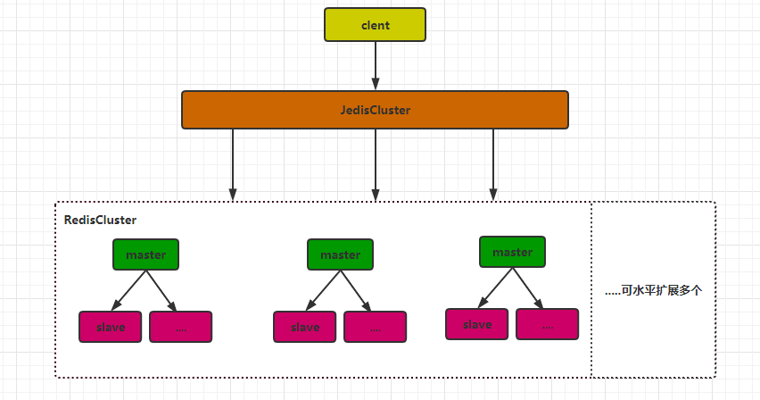
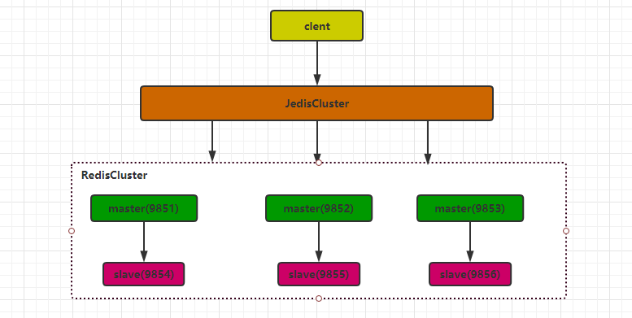
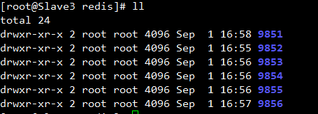
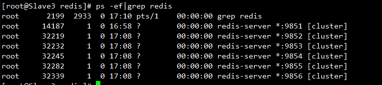
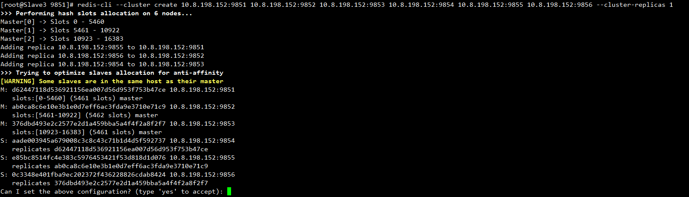
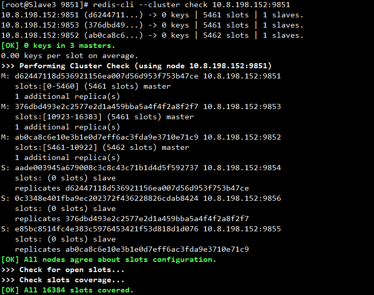
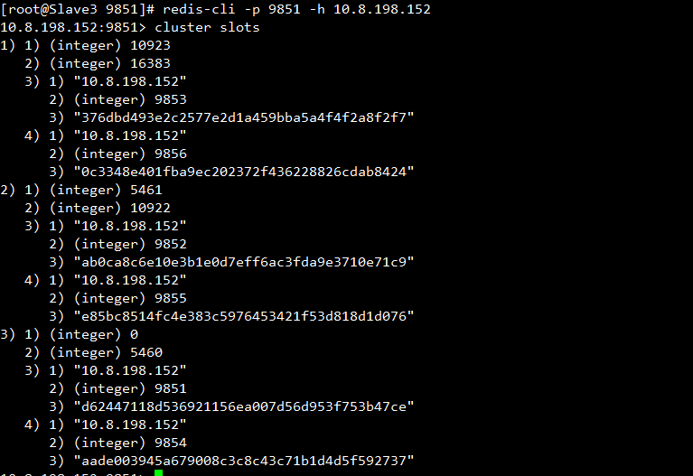
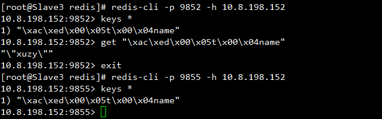
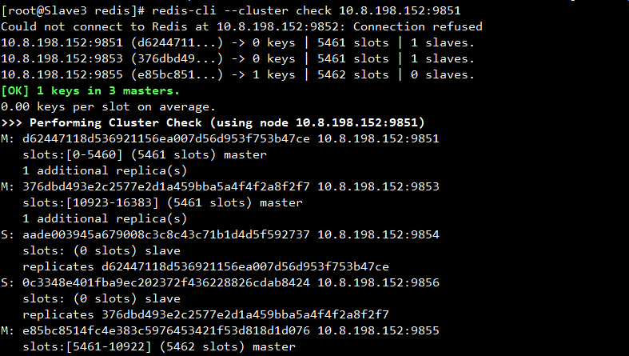
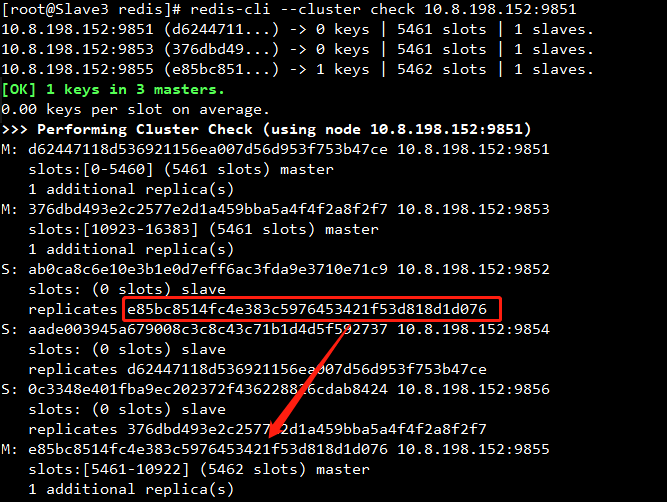

## 概述

redis集群是一个由多个主从节点群组成的分布式服务器群，它具有<font color=red>复制、高可用和分片特性</font>。总结来说他的特点和好处包括：

- Redis的集群方式是无中心化的集群，每个KEY通过 **虚拟槽分区算法** 计算KEY存储在哪台机器上。
- Redis集群不需要sentinel哨兵也能完成**节点转移、故障转移**的功能。
- 可水平扩展据官方文档称可以线性扩展到上万个节点(官方推荐不超过1000个节点)。
- Redis集群槽的范围是0 -16383（2^4 * 2^10）。



redis集群搭建如上图所示，通过多个master节点实现高性能，每个master下设置salve来实现高可用。
- 当集群性能不够时，可通过增加新的master来实现更高的性能。
- 当master宕机时，redis集群能实现自动的故障转移来保证高可用。

## Redis5.0集群搭建

### Redis安装
本次安装采用一主一从 + 3主 的集群模式。三台主机端口分别是9851、9852、9853。



安装Redis没什么好说的，直接看命令。安装以后就可以使用redis命令了。

```shell
#卸载
rpm -qa|grep redis #查看是否有存在旧的redis
rpm -e redis-3.0.7.ws4-1.el6.x86_64 删掉旧的redis
## 安装
cd /usr/local/src/
tar -zxvf redis-5.0.7.tar.gz
cd redis-5.0.7/
make
make install
```
### Redis配置
为了更好的管理，我们先在建立9851~9856的目录存放6个Redis实例的配置文件。



在每个目录下建立一个redis.conf配置文件。配置内容如下（**注意每个目录的配置有些不同，自行修改**）。这里只提供了几个重要的参数，redis还有很多参数需要自己去看。
```shell
#后台方式运行
daemonize yes
#redis实例PID的存放路径
pidfile "/etc/redis/9851/redis.pid"
#端口
port 9851
#日志文件地址
logfile "/etc/redis/9851/redis.log"
#基础路径，存放dump aof文件的地址
dir "/etc/redis/9851"
databases 16
#这里我只采用rdb快照方式，可以根据实际选择配置
save 900 1
repl-backlog-size 64mb
stop-writes-on-bgsave-error yes
rdbcompression yes
rdbchecksum yes
dbfilename "dump.rdb"
#重点配置，这个就是搭建集群的关键
cluster-enabled yes
#集群节点信息文件
cluster-config-file node.conf
#表示当某个节点持续 timeout 的时间失联时，才可以认定该节点出现故障，需要进行主从切换。如果没有这个选项，网络抖动会导致主从频繁切换 (数据的重新复制)
cluster-node-timeout 15000
```
### 启动Redis实例
分别启动6个Redis实例。可以看到6个实例已经启动。

```shell
redis-server /etc/redis/9851/redis.conf
redis-server /etc/redis/9852/redis.conf
redis-server /etc/redis/9853/redis.conf
redis-server /etc/redis/9854/redis.conf
redis-server /etc/redis/9855/redis.conf
redis-server /etc/redis/9856/redis.conf
```



### 配置集群

Redis启动后，我们就可以开始配置集群，Redis高版本提供了--cluster命令可以很快速的的进行搭建和分槽

```
redis-cli --cluster create 10.8.198.152:9851 10.8.198.152:9852 10.8.198.152:9853 10.8.198.152:9854 10.8.198.152:9855 10.8.198.152:9856 --cluster-replicas 1
```



执行后，会打印出Master和Slave的信息并**提示我们是否自动分槽**，我们按照提示输入'YES'。

<font color=red>到这里。Redis集群搭建完成。</font>

我们可以通过如下这些命令查看集群信息。

**redis-cli --cluster check IP:PORT**

这个信息可以看主从节点信息。



**客户端登陆后执行cluster slots查看分槽信息**

从图可以看出

- 0 ~ 5460 槽在端口9851实例上，对应的从节点是9854
- 5461 ~ 10922 槽在端口9852实例上，对应的从节点是9855
- 10923 ~ 16383 槽在端口9853实例上，对应的从节点是9856



**模拟存入一个key，看是否存入且主从节气上都有对应的值**

```java
redisTemplate.opsForValue().set("name","myLive");
```



可以发现，值已经存入了主从机器上。

**模拟9852机器宕机后是否能实现故障转移**

通过命令杀掉9852机器

```
[root@Slave3 redis]# kill -9 PID(9852对应的PID)
```



重新启动9852机器。

