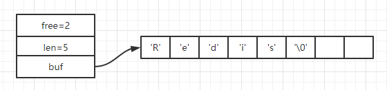
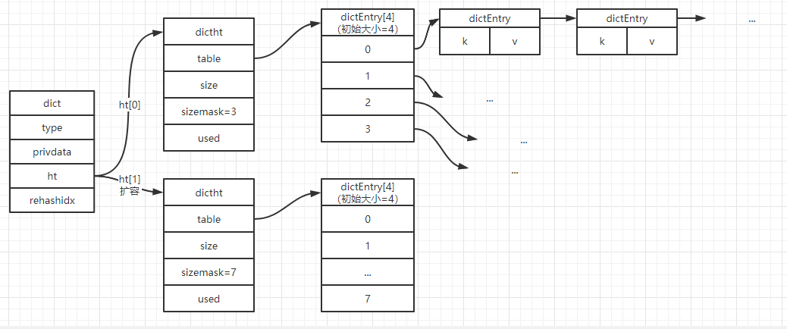
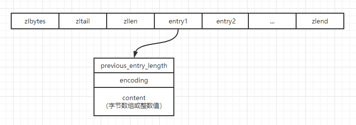
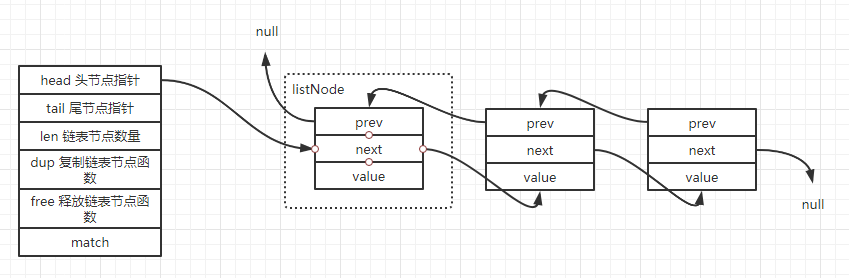
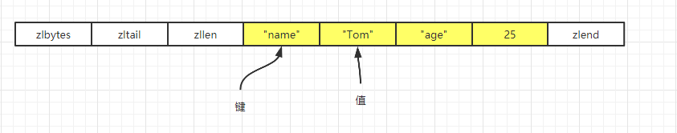

### 概述

本文主要总结Redis几种数据结构的特点，Redis由于单线程和纯内存的特点，所以在数据结构上也做了很多优化，了解Redis的数据结构有利于我们更好的根据实际场景使用正确的数据结构。

### 基础数据结构

#### 概述

Redis在内部定义了6种基础的数据结构，包括：<font color=red>简单动态字符串，链表，字典，跳跃表，整数集合，压缩列表</font>。Redis使用这几种基础的数据结构创建了一个对象系统，这个系统包含了字符串对象，列表对象，哈希对象，集合对象，有序集合对象。

举个例子，对于命令`SET msg "helloWorld"`。msg使用的是字符串对象（对于Redis来说保存的键总是一个字符串对象），而helloWorld使用的是`简单动态字符串`。了解这6种基础数据接口才能进一步了解Redis种的字符串，列表，哈希，集合，有序集合。
<!--more-->
#### 简单动态字符串

```c
struct sdshdr{
    //记录buf数组中已使用字节的数量，SDS所保存字符串的长度
	int len;
    //记录buf数组中未使用字节数量
    int free;
    //字节数组
    char buf[];
}
```



通过上面我们知道Redis简单动态字符串的接口，通过len记录已使用字节数量，free记录未使用字节数量，buf数组记录数据。那为啥要这样设计呢，为啥不直接使用C语言提供的字符串？

**获取字符串长度复杂度超级低**

由于len存储了已使用字节数量，可以直接通过len获取数组长度，而无须去遍历字节数组获取长度，获取字符串长度为常数复杂度。所以我们使用`strlen`命令获取key的长度时速度很快。

这也是为什么Redis不用C语言内置的字符串了。例如C语言中要知道一个字符串的长度可以用函数strlen(str)，而这个函数需要对每个字符计数直到遇到代表字符串结束的空字符才结束，时间负责度O(N)。而 SDS 由于 `len` 记录当前字符串的长度，所以直接读取即可，时间复杂度仅为 **O(1)**。

```reStructuredText
127.0.0.1:6379> strlen msg
(integer) 11
```

**减少修改字符串时带来的内存重分配次数**

由于C字符串在底层时间时一个N+1数组，每次增长或缩小C字符串都要进行内存重分配。由于Redis作为数据库字符串经常被频繁修改，如果每次修改都进行重分配则会对性能有很大影响。

然而SDS的buf数组不是单纯的N+1，而是可以预分配更多空间，未使用的长度用free记录。通过空间预分配策略，Redis可以减少连续执行字符串增长操作所需的内存重分配次数。而当字符串减少时，程序也不会立即使用内存重分配来回收缩短多出来的字节，而是使用free属性记录下来（惰性空间释放）。

总结：SDS通过`空间预分配` 和 `惰性空间释放`减少修改字符串时带来的内存重分配次数，提高了性能。

#### 字典

字典使用哈希表作为底层实现。数据结构如下

```c
typedef struct dict {
    dictType *type;
    void *privdata;
    //哈希表
    dictht ht[2];
    int trehashidx;
}
typedef struct dictht {
    //哈希表数组
	dictEntry **table;
    //哈希表大小
    unsigned long size;
    //哈希表大小掩码，用于计算索引值 总是等于size - 1
    unsigned long sizemask;
    //哈希表已有节点的数量
    unsigned long used;
} dictht;

//哈希节点
typedef struct dictEntry{
    void *key;
    union {
        void *val;
        uint64_tu64;
        int64_ts64;
    } v;
    //指向下一个节点
    struct dictEntry *next;
}

```



- 字典采用哈希表的结构。初始化大小为4的哈希数组。使用<font color=red>链地址</font>法来解决冲突，被分配到同一个索引的多个键值会连接成一个单向链表。
- 每个字典带有两个哈希表（ht[0]、ht[1]）。一个平时使用，一个在进行rehash使用。
- Redis字典的rehash并不是一次性完成的，试想一下一个哈希表中有上百万个键值，如果一次性rehash会拖慢Redis的速度，所以是**渐进式**完成的。

总结 ：字典采用了哈希数组+链表的结构，并且扩容时采用了渐进式的扩容方式提高了性能。

#### 整数集合

整数集合用于保存**整数值**的集合抽象数据结构，并且保证**集合中不会出现重复元素**。底层采用数组，有序且无重复的方式保存集合元素，使用整数集合主要是为了节约内存。例如Redis的集合对象里面保存的全是整数时，底层就是使用的整数集合，这样可以**减少内存使用**。

```c
typedef struct intset{
    uint32_t encoding;
    //集合包含的元素数量
    uint32_t length;
    //保存元素的数组
    int8_t contents[];
}
```

#### 跳跃表

 跳跃表是一种有序的数据结构，它通过在每个节点中维持多个指向其他节点的指针，从而达到快速访问节点的目的。

#### 压缩列表

压缩列表是Redis为了`节约内存`而开发的数据结构，由一系列特殊编码的`连续内存`块组成的顺序型数据结构。压缩列表节点可以保存`字节数组`或`整数值`。**压缩列表有点类似数组，也是通过一篇连续的内存空间来存储数据，不过他跟数组不同的是：允许存储的数据大小不同。**



| 属性                  | 说明                                      |
| --------------------- | ----------------------------------------- |
| zlbytes               | 记录整个压缩列表占用的内存字节数          |
| zltail                | 记录压缩列表表尾距离表头起始地址的字节数  |
| zllen                 | 记录压缩列表包含的节点数量                |
| entryN                | 节点                                      |
| zlend                 | 用来标记压缩列表的末端                    |
| previous_entry_length | 记录前一个节点的长度                      |
| encoding              | 记录节点content属性所保存数据的类型和长度 |
| content               | 保存节点值，可以是字节数组或者整数值      |


#### 链表



链表结构是我们经常用的结构，如图所示。Redis的链表结构是一个`双端链表`。value的值为一指针，可以用来存储不同类型的值。

### Redis基础对象

Redis提供了5种对象，这5种对象是通过上面的6种基础结构来实现的。分别是字符串对象，列表对象，哈希对象，集合对象，有序集合对象。Redis的每一种对象都有一个redisObject结构表示。

```c
typedef struct redisObject{
    //对象的类型，用来表示是字符串对象，列表对象，哈希对象，集合对象，有序集合对象
    //可以通过type key 命令返回数据库键对应的值对象的类型
    unsigned type:4;
    //对象所是由的编码，也就是使用的是哪个基础结构
    //可以通过object encoding key 命令返回数据库值对象的编码
    unsigned encoding:4;
    //指针指向底层数据结构
    void *ptr;
}
```

#### 字符串对象

字符串对象的编码有三种：int，rwa，embstr。

- 如果value存的是整数值，那么会使用int编码，且类型是long类型。
- 如果value是一个字符串值且长度大于39字节，则使用SDS(简单动态字符串)，编码为raw。
- 如果value是一个字符串值且长度小于等于39字节，则使用SDS(简单动态字符串)，编码为embstr（专门用于保存短字符串的一种优化编码方式）。

#### 列表对象

列表对象的编码使用的是`压缩列表`或`链表`。当列表满足以下两点时采用压缩列表。

- 列表对象保存的所有字符串元素长度都小于64字节。
- 列表对象保存的元素数量小于512个。

为啥要转成链表呢，压缩列表本身是为了节约内存设计的，当元素长度太长时会导致压缩列表的连锁更新问题；当元素数量太大时，由于压缩列表结构是连续的内存块组成，对于插入缩小元素没有链表来得性能高。所以当不满足上面两个条件时会使用链表。

#### 哈希对象

哈希对象的编码可以是`压缩列表`或`字典`。当满足如下条件时采用压缩链表结构。

- 哈希对象保存的所有键值对的键和值的字符串长度都小于64字节。
- 哈希对象保存的键值对数量小于512个。



如果哈希存储的键值对字符串长度小且数量少的情况下使用压缩链表会节约内存空间，但当超过一定量以后，由于压缩列表自身结构的问题会导致性能下降，所以转成用字典结构。

#### 集合对象

集合对象的编码可以是`整数集合`或`字典`。当满足如下条件时使用整数集合。

- 集合对象内的所有元素都是整数。
- 集合对象保存的元素个数不超过512个。

#### 有序集合列表

有序集合编码可以是`压缩列表`或`跳跃表`。当满足如下条件时使用压缩列表

- 有序集合保存的元素数量小于128个。
- 有序集合保存的所有元素的长度小于64字节。

### 查看redis数据类型

```
127.0.0.1:6379> lpush list1 1
(integer) 1
127.0.0.1:6379> object encoding list1
"quicklist"
127.0.0.1:6379> sadd set1 one two three
(integer) 3
127.0.0.1:6379> object encoding set1
"hashtable"
127.0.0.1:6379> hset hash1 field1 1
(integer) 1
127.0.0.1:6379> object encoding hash1
"ziplist"
127.0.0.1:6379> set name xuzy
OK
127.0.0.1:6379> object encoding name
"embstr"
```


### 总结

**Redis的数据对象由多种数据结构来实现，主要是出于时间和空间的考虑。由于Redis是单线程和纯内存，当数据量小的时候使用更简单的数据结构，有利于节省内存，提高性能。**

在开发过程我们需要选择合适的数据结构。举个例子。

**例子1**

例如上面分析了字符串的结构，虽然Redis字符串使用SDS提高了性能，但是SDS相比于C语言字符串占用更多空间。SDS结构本身就占用比C语言字符串更多内存，且由于空间预分配，还有可能有没使用的空间浪费。所以我们一定要基于合适场景使用合适的数据结构。所以在使用上，如果我们业务上能用哈希对象的话那会比字符串占用内存更低。

****

### 参考

- 《Redis设计与实现》
- 一篇完善的Redis结构博客：[一文回顾Redis五大对象(数据类型)](https://www.cnblogs.com/hunternet/p/12742390.html)