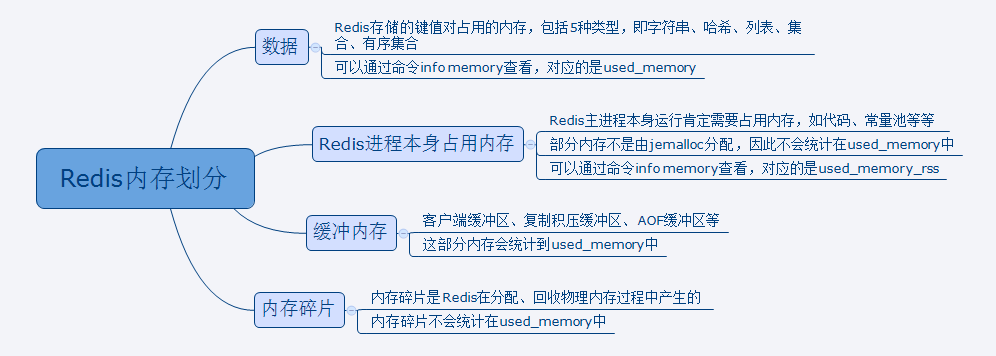
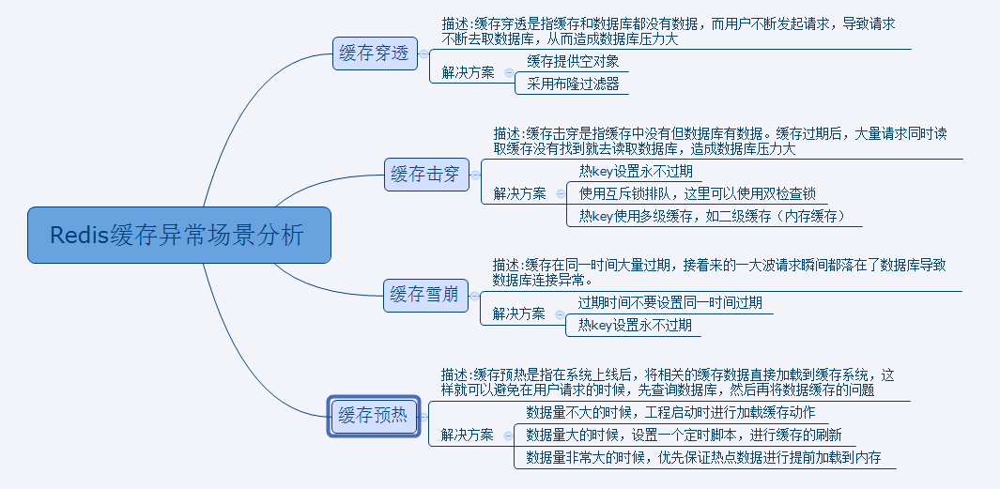

### Redis内存划分

直接上图



### Redis过期策略和内存淘汰

#### 过期策略

你Redis只能存5G数据，可是你写了10G，那会删5G的数据。怎么删的？这个问题思考过么？还有，你的数据已经设置了过期时间，但是时间到了，内存占用率还是比较高，有思考过原因么?

Redis采用的是**定期删除** + **惰性删除策略**。

**定期删除**指的是，Redis默认每个100ms检查是否有过期的Key，有过期Key则删除。需要说明的是，Redis不是每个100ms将所有的Key检查一次，而是随机抽取进行检查（如果每隔100ms，全部Key进行检查，Redis岂不是卡死）。因此，如果只采用定期删除策略，会导致很多Key到时间没有删除。

**惰性删除**指的是你获取某个Key的时候，Redis会检查一下，这个Key如果设置了过期时间，那么是否过期了？如果过期了此时就会删除。

#### 淘汰策略

如果定期删除没删除Key。然后你也没及时去请求Key，也就是说惰性删除也没生效。这样，Redis的内存会越来越高，那么就应该采用内存淘汰机制。

```
maxmemory-policy volatile-lru
```

- Noeviction：当内存不足以容纳新写入数据时，新写入操作会报错。应该没人使用吧；
- Allkeys-lru：当内存不足以容纳新写入数据时，在键空间中，移除<font color=red>最近最少使用</font>的Key。推荐使用，目前项目在用这种；
- Allkeys-random：当内存不足以容纳新写入数据时，在键空间中，随机移除某个key，应该也没人使用吧；
- Volatile-lru：当内存不足以容纳新写入数据时，在设置了过期时间的键空间中，移除最近最少使用的Key。这种情况一般是把Redis既当缓存又做持久化存储的时候才用。不推荐；
- Volatile-random：当内存不足以容纳新写入数据时，在设置了过期时间的键空间中，<font color=red>随机</font>移除某个Key。依然不推荐；
- Volatile-ttl：当内存不足以容纳新写入数据时，在设置了过期时间的键空间中，有更早过期时间的Key优先移除。不推荐。
- volatite-lfu：从所有配置了过期时间的键中驱逐使用频率最少的键 （Redis4.0新加的）
- allkeys-lfu：从所有键中驱逐使用频率最少的键（Redis4.0新加的）

### Redis缓存问题

