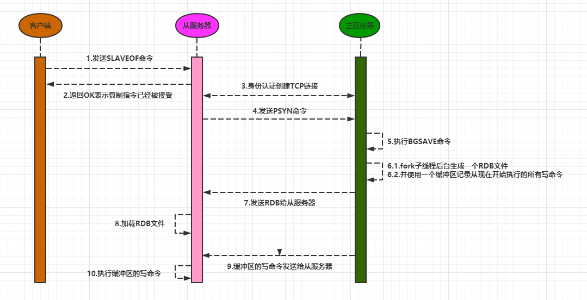
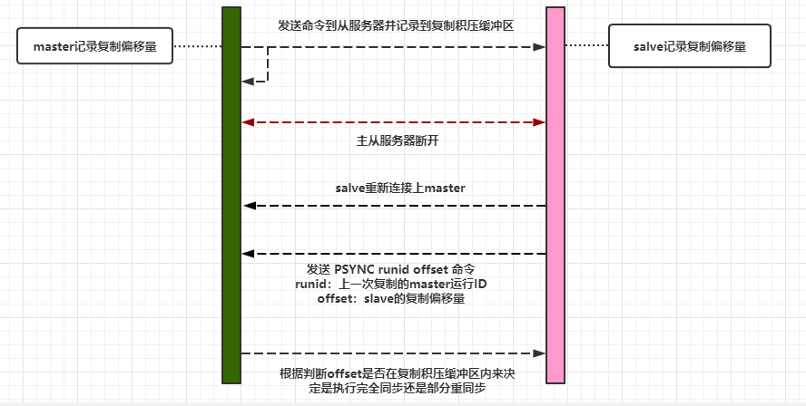

## Redis主从复制配置
```
127.0.0.1:6380> SLAVEOF 127.0.0.1 6379
#主从心跳ping的时间间隔。默认10
repl-ping-replica-period
#从节点超时时间，默认60
#三种情况认为复制超时：
#1）slave角度，如果在repl-timeout时间内没有收到master SYNC传输的rdb snapshot数据，
#2）slave角度，在repl-timeout没有收到master发送的数据包或者ping。
#3）master角度，在repl-timeout时间没有收到REPCONF ACK确认信息。
repl-timeout
#主节点保存操作日志的大小。默认1M 
repl-backlog-size
#主节点保存操作日志的时间。默认3600秒
repl-backlog-ttl
#这个参数分为3部分，第二部分涉及slave。表示主节点输出给从节点的缓存(output-buffer)大小。默认是：256M 64M 60秒。意思是：如果output-buffer>256M则从节点需要重新全同步，如果256>output-buffer>64且持续时间60秒，则从节点需要重新全同步。
client-output-buffer-limit
```

## 原理详解

redis的复制功能分为**完整重同步**和**部分重同步**两个操作。
- 完整重同步操作，将从服务器的数据库状态更新至主服务器当前所处的数据库状态，后续进行命令传播。
- 部分重同步操作，用于处理断线后重复制情况：当从服务器在断线后重新连接主服务器时，**如果条件允许，主服务器可以将主从服务器连接断开期间执行的写命令发送给从服务器，从服务器只要接收并执行这些写命令，就可以将数据库更新至主服务器当前所处的状态。**
<!--more-->
### 完整同步

同步的过程包括如下：

1. 从服务器向主服务器发送PSYNC命令。
2. 收到SYNC后主服务器执行BGSAVE命令生成RDB文件，期间并使用一个缓冲区记录从现在开始执行的所有写命令。
3. BGSAVE命令执行完毕后，主服务器会将BGSAVE命令生成的RDB文件发送给从服务器。
4. 从服务器接收并载入RDB文件，将状态更新与主服务器一致。
5. 之后正常运行就是将缓冲区记录通过命令传播传播给从服务器。



上面提到的缓冲区（**replication buffer**）用来存放三个时间内所有的master数据更新操作，分别是：

- master生成RDB文件期间内产生的更新操作
- master发送RDB文件给slave网络传输时间的更新操作
- slave load rdb文件把数据恢复到内存的时间的更新操作

replication buffer<font color=red>对应于每个slave</font>，大小由`client-output-buffer-limit slave 256mb 64mb 60`确定。意思是如果该缓冲区的大小超过256M，或该缓冲区的大小超过64M，且持续了60s，主节点会马上断开从节点的连接。<font color=red>所以对于这个值不能设置太小，太小会导致主从复制断开</font>。

### 部分重同步

部分同步用于处理断线后的重新复制。功能由以下三个部分构成：

- 主服务器的复制偏移量（replication offset）和从服务器的复制偏移量
- 主服务器的复制积压缓冲区（replication backlog）
- 服务器的运行ID（run ID）



主从服务器各自维护着一个**复制偏移量**，主服务器每次向从服务器传播N个字节时，都会将自己的复制偏移量加N，从服务器每次接收到N个字节数据后，也会自己的复制偏移量加N。同时主服务器维护着一个**复制积压缓冲区**。当从服务器重新连上主服务器时，从服务器会通过PSYNC命令将自己的复制偏移量offset发送给主服务器，主服务器会根据这个复制偏移量来决定对从服务器执行何种同步操作：

- 如果offset偏移量之后的数据（也即是偏移量offset+1开始的数据）仍然存在于复制积压缓冲区里面，那么主服务器将对从服务器执行<font color=red>部分重同步</font>操作。
- 如果offset偏移量之后的数据已经不存在于复制积压缓冲区，那么主服务器将对从服务器执行<font color=red>完整重同步</font>操作，也就是发送SYNC命令，重头到尾生成快照然后发送给从服务器。

### 知识点

#### SYNC命令

SYNC命令是一个非常耗费资源的操作。每次执行SYNC主从服务器需要执行的操作如下：

- 主服务器需要执行BGSAVE命令来生成RDB文件，这个生成操作会耗费主服务器大量的CPU、内存和磁盘I/O资源。
- 主服务器需要将自己生成的RDB文件发送给从服务器，这个发送操作会耗费主从服务器大量的网络资源（带宽和流量）
- 接收到RDB文件的从服务器需要载入主服务器发来的RDB文件，并且在载入期间，从**服务器会因为阻塞而没办法处理命令请求**

<font color=red>SYNC是一个如此消耗资源的命令，所以Redis最好在真需要的时候才需要执行SYNC命令。</font>

#### 复制积压缓冲区

复制积压缓冲区是由主服务器维护的一个<font color=red>固定长度（fixed-size）先进先出（FIFO）队列</font>，默认大小为1MB。当入队元素的数量大于队列长度时，最先入队的元素会被弹出，而新元素会被放入队列。当主服务器进行命令传播时，它不仅会将写命令发送给所有从服务器（其实是写入到每个slave对应的replication buffer），还会将写命令入队到复制积压缓冲区里面。

| 偏移量 | ...  | 13512 | 13513 | 13514 | 13515 | 13516 | ...  |
| ------ | ---- | ----- | ----- | ----- | ----- | ----- | ---- |
| 字节值 | ...  | \r    | \n    | $     | S     | E     | ...  |

复制积压缓冲区大小可以通过**repl-backlog-size**进行配置。

```properties
//支持单位：b、k、kb、m、mb、g、gb，单位不区分大小写，其中k、m、g间的计算倍数是1000，
//而kb、mb和gb的计算倍数是1024
repl-backlog-size 1mb
//环形缓冲复制队列存活时长（所有slaves不可用时，保留repl_backlog多长时间，单位：秒）
repl-backlog-ttl 3600
```

由于复制积压缓冲区存的是字节，所以当你key-value很大值会占用这个队列。所以一般当key-value较大时需要更改这个默认值。

复制积压缓冲区的最小大小可以根据公式second * write_size_per_second来估算。

- second为从服务器断线后重新连接上主服务器所需的平均时间（以秒计算）
- write_size_per_second则是主服务器平均每秒产生的写命令数据量（协议格式的写命令的长度总和）

#### 服务器运行ID

实现部分重同步还需要用到服务器运行ID（run ID）。每个Redis服务器，**不论主服务器还是从服务，都会有自己的运行ID**。

当从服务器对主服务器进行初次复制时，主服务器会将自己的运行ID传送给从服务器，而从服务器则会将这个运行ID保存起来（注意哦，是**从服务器保存了主服务器的ID**）。

当从服务器断线并重新连上一个主服务器时，从服务器将向当前连接的主服务器发送之前保存的运行ID：

- 如果从服务器保存的运行ID和当前连接的主服务器的运行ID相同，那么说明从服务器断线之前复制的就是当前连接的这个主服务器，主服务器可以继续尝试执行部分重同步操作；
- 相反地，如果从服务器保存的运行ID和当前连接的主服务器的运行ID并不相同，那么说明从服务器断线之前复制的主服务器并不是当前连接的这个主服务器，主服务器将对从服务器执行完整重同步操作。

#### 复制运维方法

**如何判断主从同步是否正常**

如果`master_repl_offset`减`offset`差不多，则表示主从复制正常。

```
192.168.1.110:9852> info replication
# Replication
role:master
connected_slaves:1
#offset 表示 salve0的复制偏移量
slave0:ip=192.168.1.120,port=9853,state=online,offset=375168999754,lag=1
# master启动时生成的40位16进制的随机字符串，用来标识master节点
master_replid:0ef80af291afbbb7e2f2d6fdbf150281ab1baa6f 
master_replid2:0000000000000000000000000000000000000000
#当前master复制偏移量
master_repl_offset:375168999754      
second_repl_offset:-1
repl_backlog_active:1
repl_backlog_size:67108864
repl_backlog_first_byte_offset:375101890891
repl_backlog_histlen:67108864
```

#### 两个重要的缓冲区

replication buffer，master<font color=red>为每个slave建立</font>的缓冲区，用来缓存master执行的命令。例如主库生成RDB和从库加载RDB这段时间增量的命令。他的特点是每个slave都有一个。<font color=red>所以，如果我们是一主多从的话，对内存的损耗也越大，所以控制从节点的数量，也可以控制缓存区对内存的开销</font>。

replication backlog，复制积压缓冲区。master<font color=red>唯一一份</font>记录最近执行命令和命令对应的偏移量。结构是一个环形队列，后面的命令覆盖前面的命令。当slave由于网络抖动重新连接上master时，会传递自己的offset与replication backlog进行对比来确定执行全部同步还是部分同步。这个值默认是1M，我们需要根据主库写入的速率和主从同步传输的速率差值来适当调大replication backlog的配置。

## 参考

- 《Redis设计与实现》
- https://www.cnblogs.com/lukexwang/p/4711977.html
- https://www.cnblogs.com/vansky/p/9293980.html
- https://blog.csdn.net/a1076067274/article/details/109294208
- https://www.cnblogs.com/any-way/p/10411567.html

