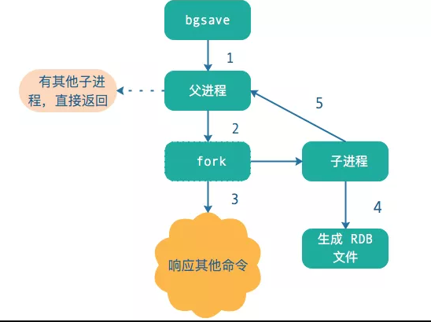

## Redis主从复制配置
```shell
127.0.0.1:6380> SLAVEOF 127.0.0.1 6379
```

## 原理详解

redis的复制功能分为**完整重同步**和**部分重同步**两个操作。
- 完整重同步操作，将从服务器的数据库状态更新至主服务器当前所处的数据库状态。
- 部分重同步操作，用于处理断线后重复制情况：当从服务器在断线后重新连接主服务器时，**如果条件允许，主服务器可以将主从服务器连接断开期间执行的写命令发送给从服务器，从服务器只要接收并执行这些写命令，就可以将数据库更新至主服务器当前所处的状态。**
<!--more-->
### 完整同步

同步的过程包括如下：

1. 从服务器向主服务器发送SYNC命令。
2. 收到SYNC后主服务器执行BGSAVE命令生成RDB文件，期间并使用一个缓冲区记录从现在开始执行的所有写命令。
3. BGSAVE命令执行完毕后，主服务器会将BGSAVE命令生成的RDB文件发送给从服务器。
4. 从服务器接收并载入RDB文件，将状态更新与主服务器一致。
5. 之后正常运行就是将缓冲区记录通过命令传播传播给从服务器。



### 部分重同步

部分重同步中，主从服务器各自维护着一个**复制偏移量**，主服务器每次向从服务器传播N个字节时，都会将自己的复制偏移量加N，从服务器每次接收到N个字节数据后，也会自己的复制偏移量加N。

- 如果主从服务器处于一致状态，那么两者复制偏移量相同
- 如果主从服务器两者的偏移量并不相同，则两者状态不一致

同时主服务器维护着一个**复制积压缓冲区**。当从服务器重新连上主服务器时，从服务器会通过PSYNC命令将自己的复制偏移量offset发送给主服务器，主服务器会根据这个复制偏移量来决定对从服务器执行何种同步操作：

- 如果offset偏移量之后的数据（也即是偏移量offset+1开始的数据）仍然存在于复制积压缓冲区里面，那么主服务器将对从服务器执行<font color=red>部分重同步</font>操作。
- 如果offset偏移量之后的数据已经不存在于复制积压缓冲区，那么主服务器将对从服务器执行<font color=red>完整重同步</font>操作，也就是发送SYNC命令，重头到尾生成快照然后发送给从服务器。

### 知识点

#### SYNC命令

SYNC命令是一个非常耗费资源的操作。每次执行SYNC主从服务器需要执行的操作如下：

- 主服务器需要执行BGSAVE命令来生成RDB文件，这个生成操作会耗费主服务器大量的CPU、内存和磁盘I/O资源。
- 主服务器需要将自己生成的RDB文件发送给从服务器，这个发送操作会耗费主从服务器大量的网络资源（带宽和流量）
- 接收到RDB文件的从服务器需要载入主服务器发来的RDB文件，并且在载入期间，从**服务器会因为阻塞而没办法处理命令请求**

<font color=red>SYNC是一个如此消耗资源的命令，所以Redis最好在真需要的时候才需要执行SYNC命令。</font>

#### 复制积压缓冲区

复制积压缓冲区是由主服务器维护的一个固定长度（fixed-size）先进先出（FIFO）队列，默认大小为1MB。当入队元素的数量大于队列长度时，最先入队的元素会被弹出，而新元素会被放入队列。当主服务器进行命令传播时，它不仅会将写命令发送给所有从服务器，还会将写命令入队到复制积压缓冲区里面。

复制积压缓冲区大小可以通过**repl-backlog-size**进行配置。

```properties
//支持单位：b、k、kb、m、mb、g、gb，单位不区分大小写，其中k、m、g间的计算倍数是1000，
//而kb、mb和gb的计算倍数是1024
repl-backlog-size 1mb
//环形缓冲复制队列存活时长（所有slaves不可用时，保留repl_backlog多长时间，单位：秒）
repl-backlog-ttl 3600
```

由于复制积压缓冲区存的是字节，所以当你key-value很大值会占用这个队列。所以一般当key-value较大时需要更改这个默认值。

复制积压缓冲区的最小大小可以根据公式second * write_size_per_second来估算。

- second为从服务器断线后重新连接上主服务器所需的平均时间（以秒计算）
- write_size_per_second则是主服务器平均每秒产生的写命令数据量（协议格式的写命令的长度总和）

#### 服务器运行ID

实现部分重同步还需要用到服务器运行ID（run ID）。每个Redis服务器，**不论主服务器还是从服务，都会有自己的运行ID**。

当从服务器对主服务器进行初次复制时，主服务器会将自己的运行ID传送给从服务器，而从服务器则会将这个运行ID保存起来（注意哦，是**从服务器保存了主服务器的ID**）。

当从服务器断线并重新连上一个主服务器时，从服务器将向当前连接的主服务器发送之前保存的运行ID：

- 如果从服务器保存的运行ID和当前连接的主服务器的运行ID相同，那么说明从服务器断线之前复制的就是当前连接的这个主服务器，主服务器可以继续尝试执行部分重同步操作；
- 相反地，如果从服务器保存的运行ID和当前连接的主服务器的运行ID并不相同，那么说明从服务器断线之前复制的主服务器并不是当前连接的这个主服务器，主服务器将对从服务器执行完整重同步操作。

## 参考

- 《Redis设计与实现》
- https://www.cnblogs.com/lukexwang/p/4711977.html

