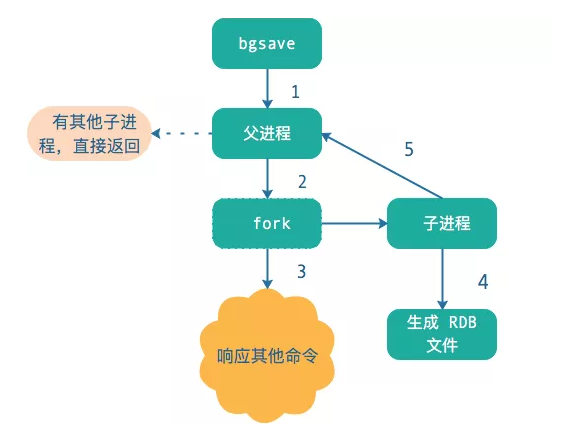

## Redis两种持久化方案

- RDB方式，生成指定时间间隔内的 Redis 内存中数据快照，是一个二进制文件 dumpr.rdb。
- AOF方式，记录 Redis 除了查询以外的所有写命令，即对内存中数据进行修改的指令记录。
<!--more-->
## RDB持久化

### RDB介绍和使用
- RDB是一种<font color=red>快照模式</font>。保存的是 key-value数据内容。
- RDB有两种持久化方式即**同步save模式**和**异步bgsave模式**。
  - 同步模式下阻塞其他命令执行持久化生成rdb文件，不会有一致性问题。
  - 异步模式下fork一个子进程执行持久化生成rdb文件，不会阻塞其他命令，会有一致性问题。
- 默认执行 shutdown 时，如果没有开启 AOF，则自动执行 bgsave。
- 每次的 RDB 文件都是替换的。所以在实际应用上可以通过shell脚本定时备份这个RDB文件。

Redis默认开启RDB持久化方式，通过配置redis.conf

```properties
save 900 1
save 300 10
save 60 10000
#900秒之内，如果超过1个key被修改，则发起快照保存；
#300秒之内，如果超过10个key被修改，则发起快照保存；
#60秒之内，如果1万个key被修改，则发起快照保存；
```

### bgsave方式持久化



1. Redis 调用 fork() ，同时拥有父进程和子进程。
2. 子进程将数据集写入到一个临时RDB文件中。
3. 当子进程完成对新 RDB 文件的写入时，Redis用新RDB文件替换原来的RDB文件，并删除旧的RDB文件。

引出问题 ：<font color=red>在bgsave期间子进程正在持久化一个很大的数据结构K时，这时候父进程收到了删除这个数据结构K的命令，这时候redis该怎么办？</font>

redis使用操作系统的多进程<font color=red>COW机制(Copy On Write)</font>机制来实现快照的持久化。子进程刚刚产生时，和父进程共享内存里面的代码段和数据段，这是Linux操作系统的机制，为了节约内存资源，所以尽可能让父子进程共享内存，这样在进程分离的一瞬间，内存的增长几乎没有明显变化。

当子进程进行持久化时父进程收到了写请求，那么会把需要处理的一部分复制一份到内存，对复制后的数据进行修改，所以即使对某个数据进行了修改，redis持久化到RDB中的数据也是未修改的数据。实际上，内存中的全量数据由一个个的"数据段页面"组成，每个数据段页面的大小为4K，客户端要修改的数据在哪个页面中，就会复制一份这个页面到内存中。在持久化过程中，随着分离出的页面越来越多，内存就会持续增长，但是不会超过原内存的2倍，因为在一次持久化的过程中，几乎不会出现所有的页面都会分离的情况，读写请求针对的只是原数据中的小部分，大部分redis数据还是"冷数据"。<font color=red>所以在执行持久化时就已经快照好了那一瞬间的数据，以后的更改并不会影响持久化</font>。

### 优缺点

**优点**

- 文件紧凑，适合备份，全量复制场景。
- Redis 加载 RDB 恢复数据远远快于 AOF。

**缺点**

- 无法秒级持久化。
- 每次在 fork 子进程来执行 RDB 快照数据文件生成的时候，如果数据文件特别大，可能会导致对客户端提供的服务暂停数毫秒，或者甚至数秒。

### 问题

**一道面试题 ：假设服务器的内存8g，redis父进程占用了6g，子进程fork父进程后，子父进程总共占用内存12g，如何解决内存不足的问题？**

首先正常来说fork的子线程是不会使得内存翻倍的。因为Redis的RDB方式是采用COW(Copy On Write)机制的，子进程刚刚产生时，和父进程共享内存里面的代码段和数据段，所以fork进程出来的时候内存几乎不变。如果此时有操作命令进来更新数据，此时只会将存这个要更新的数据对应的4K页面复制一份出来进行修改，那此时内存确实增加了一点。但正常情况下不会每个4K页面都复制一份出来更改，所以fork进程后内存只会增加一点但不会很多。

## AOF持久化

### AOF介绍和使用

- AOF持久化时记录的是命令，每一个写命令都通过write函数追加到appendonly.aof文件中。
- AOF默认是关闭的，需要通过appendfsync配置开启
- AOF 每次保存的写命令都放在一个缓冲区，根据不同的策略（下面详细说）同步到磁盘
- AOF 由于每次都会记录写命令，文件会很大，因此需要进行优化，称之为“重写机制”
- AOF可以通过命令bgrewriteaof进行重写

AOF配置：

```
# 是否开启AOF持久化
appendonly yes
# 由系统决定什么时候写入AOF
appendfsync no 
#每次有数据修改发生时都会写入AOF文件。原理是每次来操作命令都执行 fsync 函数，直到同步到硬盘返回
appendfsync always 
#每秒钟同步一次，该策略为AOF的缺省策略。先调用 OS write 函数， 写到缓冲区，然后 redis 每秒执行一次 OS fsync 函数
appendfsync everysec 
```

### aof过程

当redis收到客户端操作指令后，先进行参数校验。如果校验通过则将操作指令写到操作系统的内存缓存中并执行该指令。到了一定时间后操作系统内核会异步地把内存缓存中的redis操作指令刷写到AOF文件中。也可以通过glibc函数库提供的fsync()函数将指定文件的内容强制从内存缓存中刷写到磁盘上。

### bgrewriteaof重写


1. 开始bgrewriteaof，判断当前有没有bgsave命令(RDB持久化)/bgrewriteaof在执行，倘若有，则这些命令执行完成以后再执行。
2. 主进程fork出子进程，在这一个短暂的时间内，redis是阻塞的。
3. 主进程fork完子进程继续接受客户端请求，所有写命令依然写入AOF文件缓冲区并根据appendfsync策略同步到磁盘，保证原有AOF文件完整和正确。由于fork的子进程仅仅只共享主进程fork时的内存，因此Redis使用采用重写缓冲区(aof_rewrite_buf)机制保存fork之后的客户端的写请求，防止新AOF文件生成期间丢失这部分数据。此时，客户端的写请求不仅仅写入原来aof_buf缓冲，还写入重写缓冲区(aof_rewrite_buf)。
4. 子进程通过内存快照，按照命令重写策略写入到新的AOF文件。
   - 子进程写完新的AOF文件后，向主进程发信号，父进程更新统计信息。
   - 主进程把aof_rewrite_buf中的数据写入到新的AOF文件。
5. 使用新的AOF文件覆盖旧的AOF文件，标志AOF重写完成。

可以看出整个重写过程是安全的。因为 Redis 重写是创建新AOF文件，重写的过程中会继续将命令追加到现有旧的 AOF 文件里面，即使重写过程中发生停机，现有旧的 AOF 文件也不会丢失。 而一旦新 AOF 文件创建完毕，Redis 就会从旧 AOF 文件切换到新 AOF 文件，并开始对新 AOF 文件进行追加操作。

**AOF重写机制的触发条件**：

- 手动触发：客户端执行bgrewriteaof命令。
- 自动触发：自动触发通过以下两个配置协作生效，auto-aof-rewrite-min-size 和 auto-aof-rewrite-percentage

```properties
#AOF文件最小重写大小，只有当AOF文件大小大于该值时候才可能重写，4.0默认配置64mb
auto-aof-rewrite-min-size 64mb
#当前AOF文件大小和最后一次重写后的大小之间的比率等于或者等于指定的增长百分比，
#如100代表当前AOF文件是上次重写的两倍时候才重写
auto-aof-rewrite-percentage 100
```

### 优缺点

- 速度快，秒级持久化。恢复数据时能实现全部数据恢复。
- AOF 文件的体积通常要大于 RDB 文件的体积。
- 恢复速速慢。

### 启动时优先使用AOF恢复


## 混合持久化

混合持久化是Redis 4.0才有的功能。混合持久化同样也是通过bgrewriteaof完成的。

**混合持久化过程**：

1. fork出的子进程先将共享的内存副本以RDB方式写入AOF文件。
2. 然后在将重写缓冲区的增量命令以AOF方式写入到文件。
3. 写入完成后通知主进程更新统计信息，并将新的AOF文件替换旧的的AOF文件。

使用混合持久化后，Redis<font color=red>依然优先加载AOF文件</font>。可能有两种情况：

- AOF文件开头是RDB的格式，先加载RDB部分的内容，再加载剩余的AOF
- AOF文件开头不是RDB的格式，直接加载整个AOF文件

混合持久化需要配置上确认是否开启

```properties
#yes表示开启混合持久化，默认是开启的
aof-use-rdb-preamble yes
```

## 参考

- https://mp.weixin.qq.com/s?__biz=MzA3MTUzOTcxOQ==&mid=2452965797&idx=1&sn=dc1cc6dad0d589148d5d6147705cfc38&chksm=88ede4cdbf9a6ddb775e3861ce6fc9a50eefe2d00eed69877e5ecf9cef94a6342fecaa3979c2&scene=21#wechat_redirect
- https://mp.weixin.qq.com/s?__biz=MzA3MTUzOTcxOQ==&mid=2452965876&idx=1&sn=8e652ab31b628af89b275cf8f25544ef&chksm=88ede49cbf9a6d8a10231e1dde14976a6cfdfd08778783bfede076c935158895fa99159ec754&scene=21#wechat_redirect