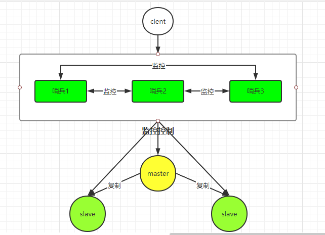

## Redis哨兵概述

Redis Sentinel是一个分布式系统，为Redis提供<font color=red>高可用性</font>解决方案，通过监控各个Redis节点(主从服务器)实现<font color=red>自动障迁移</font>。

Redis Sentinel功能包括 ：

- 监控。Sentinel 会不断地定期检查你的主服务器和从服务器是否运作正常。
- 提醒。当被监控的某个 Redis 服务器出现问题时，Sentinel可以通过API向管理员或者其他应用程序发送通知。
- 自动故障迁移。当主服务器发生故障时，执行自动故障转移，将从服务器升级为新的主服务器，并让其他从服务器复制新的主服务器数据。
  - 从服务器宕机时没什么，但当从服务器重新启动后会自动加入到主从架构中，自动完成同步数据。
  - 主服务器宕机时在从服务器中选出一台从服务器提升为主服务器，其他从服务器复制新的主服务器，原来的主服务器恢复后自动加入到主从架构中成为从服务器。



所以说，本身redis哨兵也是一个<font color=red>分布式集群系统</font>。

## Redis哨兵配置

```properties
# sentinel monitor mymaster 127.0.0.1 6379 1
sentinel monitor <master-name> <ip> <port> <quorum>
sentinel down-after-milliseconds <master-name> <times>
sentinel parallel-syncs <master-name> <nums>
sentinel failover-timeout <master-name>  <times>
sentinel auth-pass <master-name> <password>
```

