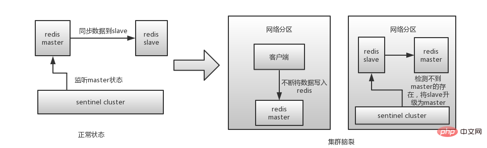

## Redis哨兵概述

Redis Sentinel是一个分布式系统，为Redis提供<font color=red>高可用性</font>解决方案，通过监控各个Redis节点(主从服务器)实现<font color=red>自动障迁移</font>。

Redis Sentinel功能包括 ：

- 监控。Sentinel 会不断地定期检查你的主服务器和从服务器是否运作正常。
- 提醒。当被监控的某个 Redis 服务器出现问题时，Sentinel可以通过API向管理员或者其他应用程序发送通知。
- 自动故障迁移。当主服务器发生故障时，执行自动故障转移，将从服务器升级为新的主服务器，并让其他从服务器复制新的主服务器数据。
  - 从服务器宕机时没什么，但当从服务器重新启动后会自动加入到主从架构中，自动完成同步数据。
  - 主服务器宕机时在从服务器中选出一台从服务器提升为主服务器，其他从服务器复制新的主服务器，原来的主服务器恢复后自动加入到主从架构中成为从服务器。


所以说，本身redis哨兵也是一个<font color=red>分布式集群系统</font>。

## Redis哨兵配置

```properties
# sentinel monitor mymaster 127.0.0.1 6379 2
# 哨兵节点定期监控 名字叫做 <master-name>  并且 IP 为 <ip> 端口号为 <port> 的主节点
#quorum表示哨兵判断节点是否发生故障的票数，设置成2表示要两个哨兵认为主节点故障了才会客户下线
#一般这个值是number(sentinel)/2 + 1
sentinel monitor <master-name> <ip> <port> <quorum>

#sentinel down-after-milliseconds mymaster 2000
#哨兵定期发送ping命令判断Redis节点和哨兵节点是否可达，如果超过了这个值没有回复pong
#主观判断节点是不可达的，单位是毫秒
sentinel down-after-milliseconds <master-name> <times>

#sentinel parallel-syncs mymaster 2
#当哨兵选出新的Redis主节点时，其他的从节点会从这个新主节点复制数据，这个值用来控制
#每次可以向新的主节点复制的节点个数。
#为啥要这样控制?可以看下主从复制的原理，防止过多从节点同一时间复制造成主节点阻塞
sentinel parallel-syncs <master-name> <nums>

#sentinel failover-timeout mymaster 2000
#哨兵进行故障转移时如果超过了配置的<times>时间就表示故障转移超时失败
sentinel failover-timeout <master-name>  <times>

#sentinel auth-pass mymaster 123456
#如果主节点有设置密码，这里也要设置，没啥好说的
sentinel auth-pass <master-name> <password>
```

主观下线和客观下线的区别

- 主观下线就是<font color=red>单个</font>sentinel认为某个服务下线。例如ping节点时没有按时回复pong就会被认为主观下线，但是这时候并不是这个这个主节点下线了，必须多个sentinel认为主观下线了，超过了quorum才会认为下线(客观下线)
- 大部分哨兵节点都同意下线操作，也就说是客观下线

## Redis哨兵工作原理

### 哨兵Leader的选举过程

当主节点被认为客观下线时候，这时候需要有一个哨兵来执行故障转移，那是由集群中的哪个哨兵来执行呢？这时候就需要选出一个Leader来做这个事。哨兵Leader的选举主要采用<font color=red>Raft协议</font>。当完成故障转移后，所有哨兵又恢复平等。

### 自动故障转移机制

sentinel状态数据结构中保存了主服务的所有从服务信息，leander sentinel按照如下的规则从从服务列表中挑选出新的主服务。

1. 过滤掉主观下线的节点 
2. 选择slave-priority最高的节点，如果有则返回没有就继续选择
3. 选择出复制偏移量最大的系节点，因为复制便宜量越大则数据复制的越完整，如果由就返回了，没有就继续
4. 选择run_id最小的节点

更新主从状态。通过slaveof no one命令，让选出来的从节点成为主节点。并通过slaveof命令让其他节点成为其从节点。

### 哨兵的定时监控

- 每个哨兵节点每10秒会向主节点和从节点发送info命令获取最拓扑结构图，哨兵配置时只要配置对主节点的监控即可，通过向主节点发送info，获取从节点的信息，并当有新的从节点加入时可以马上感知到
- 每个哨兵节点每隔2秒会向redis数据节点的指定频道上发送该哨兵节点对于主节点的判断以及当前哨兵节点的信息，同时每个哨兵节点也会订阅该频道，来了解其它哨兵节点的信息及对主节点的判断
- 每隔1秒每个哨兵会向主节点、从节点及其余哨兵节点发送一次ping命令做一次心跳检测

### 工作原理总结

- 每个Sentinel以每秒钟一次的频率向它所知的Master，Slave以及其他 Sentinel 实例发送一个 PING 命令。
- 如果一个实例（instance）距离最后一次有效回复 PING 命令的时间超过 down-after-milliseconds 选项所指定的值， 则这个实例会被 Sentinel 标记为主观下线。
- 如果一个Master被标记为主观下线，则正在监视这个Master的所有 Sentinel 要以每秒一次的频率确认Master的确进入了主观下线状态。 
- 当有足够数量的 Sentinel（大于等于配置文件指定的值）在指定的时间范围内确认Master的确进入了主观下线状态， 则Master会被标记为客观下线 。
- 在一般情况下， 每个 Sentinel 会以每 10 秒一次的频率向它已知的所有Master，Slave发送 INFO 命令 。
- 当Master被 Sentinel 标记为客观下线时，Sentinel 向下线的 Master 的所有 Slave 发送 INFO 命令的频率会从 10 秒一次改为每秒一次 。
- 若没有足够数量的 Sentinel 同意 Master 已经下线， Master 的客观下线状态就会被移除。 

## Redis集群脑裂

redis的集群脑裂是指因为网络问题，导致redis master节点跟redis slave节点和sentinel集群处于不同的网络分区，此时因为sentinel集群无法感知到master的存在，所以将slave节点提升为master节点。集群的脑裂会导致<font color=red>数据丢失</font>。



**解决方案** ： 在redis配置文件中添加如下配置

```properties
#连接到master的最少slave数量,如果少于这个数，master会拒绝写请求
min-replicas-to-write 3
#slave连接到master的最大延迟时间
min-replicas-max-lag 10
```


## Jedis不支持实现哨兵的读写分离

#### Jedis哨兵不支持读写分离分析

通过上面的分析我们知道哨兵解决了Redis主从的高可用性。我们一般在使用中是通过Jedis连接哨兵节点，这样当主服务器挂时我们代码上也不需要做任何改动，因为我们连的是哨兵节点。

我们接下来分析下<font color=red>Jedis连接哨兵源码，了解下为什么Jedis没法实现连接哨兵时的读写分离，还有我们需要如何改造</font>。

**Jedis连接哨兵示例**

```java
@Test
public void test02(){
    JedisPoolConfig jedisPoolConfig = new JedisPoolConfig();
    jedisPoolConfig.setMaxTotal(10);
    jedisPoolConfig.setMaxIdle(5);
    jedisPoolConfig.setMinIdle(5);
    // 哨兵信息
    Set<String> sentinels = 
        new HashSet<>(Arrays.asList("192.168.135.131:26379","192.168.135.131:26380","192.168.135.131:26381"));
    JedisSentinelPool pool = new JedisSentinelPool("mymaster", sentinels,jedisPoolConfig);
    Jedis jedis = pool.getResource();
    jedis.set("mykey", "myvalue");
    String value = jedis.get("mykey");
    System.out.println(value);
}
```

**跟踪JedisSentinelPool初始化源码**

从下面代码我们可以知道，

- 当我们链接哨兵时，哨兵获取到主节点并用主节点做资源池。
- 每个哨兵设置一个MasterListener，订阅+switch-master，当出现主服务器挂时自动故障转移时，会收到新的主节点，然后就客户端就可以重新initPool(master)，这样就实现了自动转移后客户端自动更变主节点的链接。

但是这样有一个缺点，<font color=red>如果通过Jedis链接哨兵，所有命令只会发送到主节点处理，这样其实从节点只是做一个热备份的作用，当我们需要读写分离来分担主节点压力时就没办法了。</font>

```java
public JedisSentinelPool(String masterName, Set<String> sentinels,
    final GenericObjectPoolConfig poolConfig, final int connectionTimeout, final int soTimeout,
    final String password, final int database, final String clientName) {
  this.poolConfig = poolConfig;
  this.connectionTimeout = connectionTimeout;
  this.soTimeout = soTimeout;
  this.password = password;
  this.database = database;
  this.clientName = clientName;
  //获取主节点
  HostAndPort master = initSentinels(sentinels, masterName);
  //通过master初始化资源池，后面我们使用就是链接这个资源池
  initPool(master);
}

//通过哨兵获取到主节点返回，并设置对主节点的监控
private HostAndPort initSentinels(Set<String> sentinels, final String masterName) {
  HostAndPort master = null;
  boolean sentinelAvailable = false;
  log.info("Trying to find master from available Sentinels...");
  //遍历设置的哨兵节点  
  for (String sentinel : sentinels) {
    final HostAndPort hap = toHostAndPort(Arrays.asList(sentinel.split(":")));
    log.fine("Connecting to Sentinel " + hap);
    Jedis jedis = null;
    try {
      //链接哨兵节点
      jedis = new Jedis(hap.getHost(), hap.getPort());
      //通过第一个哨兵节点获取到监控的主节点的Ip和端口，传入的是masterName
      List<String> masterAddr = jedis.sentinelGetMasterAddrByName(masterName);
      //到这一步表示链接哨兵没问题，并获取到了数据  
      sentinelAvailable = true;
      //如果这个哨兵获取不到，就循环继续获取
      if (masterAddr == null || masterAddr.size() != 2) {
        log.warning("Can not get master addr, master name: " + masterName + ". Sentinel: " + hap
            + ".");
        continue;
      }
	 //转成HostAndPort对象
      master = toHostAndPort(masterAddr);
      log.fine("Found Redis master at " + master);
      break;
    } catch (JedisConnectionException e) {
      log.warning("Cannot connect to sentinel running @ " + hap + ". Trying next one.");
    } finally {
      if (jedis != null) {
        jedis.close();
      }
    }
  }

  //没有获取到主节点就报错
  if (master == null) {
    if (sentinelAvailable) {
      throw new JedisException("Can connect to sentinel, but " + masterName
          + " seems to be not monitored...");
    } else {
      throw new JedisConnectionException("All sentinels down, cannot determine where is "
          + masterName + " master is running...");
    }
  }
    
  log.info("Redis master running at " + master + ", starting Sentinel listeners...");
    
  for (String sentinel : sentinels) {
    //获取哨兵节点的Ip和端口
    final HostAndPort hap = toHostAndPort(Arrays.asList(sentinel.split(":")));
    //启动监听自动故障转移并重新初始化主节点
    MasterListener masterListener = new MasterListener(masterName, hap.getHost(), hap.getPort());
    masterListener.setDaemon(true);
    masterListeners.add(masterListener);
    masterListener.start();
  }
  return master;
}
```

```java
protected class MasterListener extends Thread {
   //... 省略非关键代码
    public void run() {
      running.set(true);
      while (running.get()) {
        j = new Jedis(host, port);
        try {
          if (!running.get()) {
            break;
          }
          //通过订阅+switch-master频道来感知新的主节点
          j.subscribe(new JedisPubSub() {
            @Override
            public void onMessage(String channel, String message) {
              log.fine("Sentinel " + host + ":" + port + " published: " + message + ".");
              String[] switchMasterMsg = message.split(" ");

              if (switchMasterMsg.length > 3) {
                if (masterName.equals(switchMasterMsg[0])) {
                  //重新初始化新的主节点
                  initPool(toHostAndPort(Arrays.asList(switchMasterMsg[3], switchMasterMsg[4])));
                } else {
                  log.fine("Ignoring message on +switch-master for master name "
                      + switchMasterMsg[0] + ", our master name is " + masterName);
                }

              } else {
                log.severe("Invalid message received on Sentinel " + host + ":" + port
                    + " on channel +switch-master: " + message);
              }
            }
          }, "+switch-master");

        } catch (JedisConnectionException e) {
			//... 省略非关键代码
        } finally {
             //... 省略非关键代码
        }
      }
    }
  }
```

#### 解决无法读写分离方案

JedisSentinelPool底层使用的是commons.pool2对象池。分析对应的initPool方法，通过传入Master节点到Jedis工厂(JedisFactory)然后链接主节点对象池。

```java
//通过主节点初始化Jedis对象池  
private void initPool(HostAndPort master) {
    if (!master.equals(currentHostMaster)) {
      currentHostMaster = master;
      if (factory == null) {
        //传入Master节点
        factory = new JedisFactory(master.getHost(), master.getPort(), connectionTimeout,
            soTimeout, password, database, clientName);
        initPool(poolConfig, factory);
      } else {
        factory.setHostAndPort(currentHostMaster);
        internalPool.clear();
      }
      log.info("Created JedisPool to master at " + master);
    }
  }
```

```java
//redis/clients/jedis/JedisFactory/class  
@Override
  public PooledObject<Jedis> makeObject() throws Exception {
    final HostAndPort hostAndPort = this.hostAndPort.get();
    //根据主节点来建立资源池
    final Jedis jedis = new Jedis(hostAndPort.getHost(), hostAndPort.getPort(), connectionTimeout,
        soTimeout);

    jedis.connect();
    if (null != this.password) {
      jedis.auth(this.password);
    }
    if (database != 0) {
      jedis.select(database);
    }
    if (clientName != null) {
      jedis.clientSetname(clientName);
    }
    return new DefaultPooledObject<Jedis>(jedis);
  }
```

所以我们的改造方案：

- 新建一个JedisSlaveSentinelPool类，方法全部照抄JedisSentinelPool类的，其中initPool方法使用JedisFactory替换成JedisSlaveFactory(第二步新建的类)。并去掉MasterListener监听器，因为原来JedisSentinelPool类的MasterListener监听器的功能是当主节点挂时重新选一个从节点，我们这里并不适用。
- 新建JedisSlaveFactory类，方法全部照抄JedisFactory类，重写makeObject类，通过获取从节点来建立资源池。
- 新建一个JedisUtils工具类，写操作用主节点对应的资源池，读节点用从节点对应的资源池。


