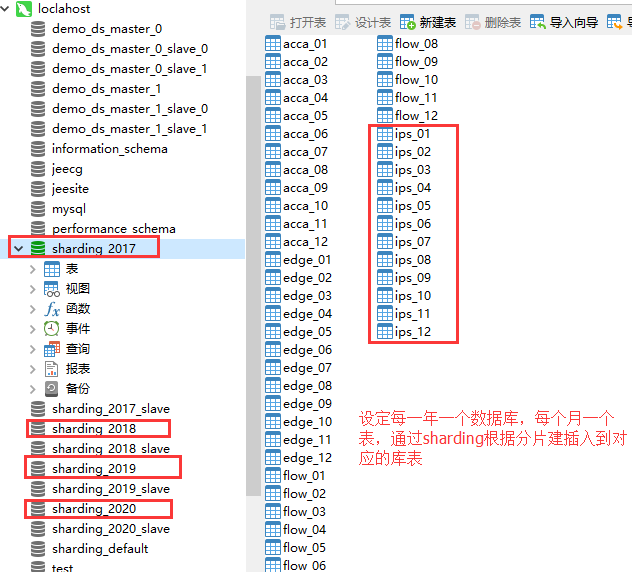
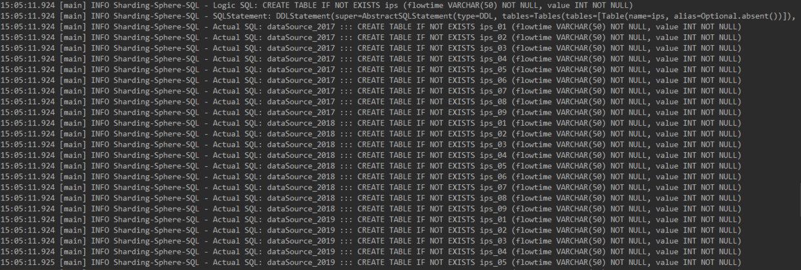
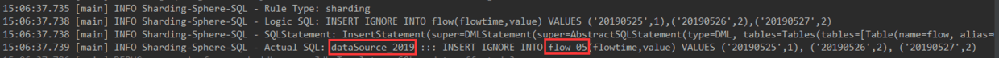
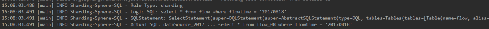

sharding-jdbc官方文档:https://shardingsphere.apache.org/document/current/cn/overview/
**本文采用当当的shardingjdbc实现按年分库，按月分表**

**最终数据库结果如下**


例如有如下sql语句
```
select * from ips where flowtime = '20181202';
```
我们规定flowtime是我们的分片键,通过值20181202确定年份为2018，月份为12，所以需要定位到库sharding_2018中的表ips_12查询，
所以实际发出的查询语句是
```
select * from `sharding_2018`.ips_12 where flowtime = '20181202';
```
<!--more-->
#### 具体实现
##### maven导出具体sharding需要的包
```
<dependency>
            <groupId>io.shardingsphere</groupId>
            <artifactId>sharding-jdbc-spring-namespace</artifactId>
            <version>3.0.0.M3</version>
</dependency>
<dependency>
            <groupId>io.shardingsphere</groupId>
            <artifactId>sharding-jdbc-orchestration-spring-namespace</artifactId>
            <version>3.0.0.M3</version>
</dependency>
```
##### 配置数据库连接
由于我们需要一年一库，所以我们取2017~2020年来建库，这步骤需要手工建立。查了资料好像shardingjdbc不支持自动建库，例如我们如果按照上面一年一库的规则，我们就需要自己手动建立对应的库。一年一库感觉还好，正常来说一个产品最多用10年已经很久了，所以手动预先建立好库没什么太大的工作量。所以我们先在数据库建立好表后，然后配置对应的数据源
######applicationContext-database.xml
```
<?xml version="1.0" encoding="UTF-8"?>
<beans xmlns="http://www.springframework.org/schema/beans"
       xmlns:xsi="http://www.w3.org/2001/XMLSchema-instance"
       xmlns:context="http://www.springframework.org/schema/context"
       xsi:schemaLocation="http://www.springframework.org/schema/beans
       http://www.springframework.org/schema/beans/spring-beans-4.1.xsd http://www.springframework.org/schema/context http://www.springframework.org/schema/context/spring-context.xsd http://www.springframework.org/schema/aop http://www.springframework.org/schema/aop/spring-aop.xsd">
    <bean id="dataSource_default" class="org.apache.commons.dbcp.BasicDataSource" destroy-method="close">
        <property name="driverClassName" value="com.mysql.jdbc.Driver"/>
        <property name="url" value="jdbc:mysql://localhost:3306/sharding_default?useUnicode=true&amp;characterEncoding=utf-8"/>
        <property name="username" value="root"/>
        <property name="password" value="123456"/>
        <!-- 初始化连接大小 -->
        <property name="initialSize" value="0"></property>
        <!-- 连接池最大数量 -->
        <property name="maxActive" value="200"></property>
        <!-- 连接池最大空闲 -->
        <property name="maxIdle" value="20"></property>
        <!-- 连接池最小空闲 -->
        <property name="minIdle" value="1"></property>
        <!-- 获取连接最大等待时间 -->
        <property name="maxWait" value="60000"></property>
    </bean>
    <bean id="dataSource_2017" class="org.apache.commons.dbcp.BasicDataSource" destroy-method="close">
        <property name="driverClassName" value="com.mysql.jdbc.Driver"/>
        <property name="url" value="jdbc:mysql://localhost:3306/sharding_2017?useUnicode=true&amp;characterEncoding=utf-8"/>
        <property name="username" value="root"/>
        <property name="password" value="123456"/>
        <!-- 初始化连接大小 -->
        <property name="initialSize" value="0"></property>
        <!-- 连接池最大数量 -->
        <property name="maxActive" value="200"></property>
        <!-- 连接池最大空闲 -->
        <property name="maxIdle" value="20"></property>
        <!-- 连接池最小空闲 -->
        <property name="minIdle" value="1"></property>
        <!-- 获取连接最大等待时间 -->
        <property name="maxWait" value="60000"></property>
    </bean>
    <bean id="dataSource_2018" class="org.apache.commons.dbcp.BasicDataSource" destroy-method="close">
        <property name="driverClassName" value="com.mysql.jdbc.Driver"/>
        <property name="url" value="jdbc:mysql://localhost:3306/sharding_2018?useUnicode=true&amp;characterEncoding=utf-8"/>
        <property name="username" value="root"/>
        <property name="password" value="123456"/>
        <!-- 初始化连接大小 -->
        <property name="initialSize" value="0"></property>
        <!-- 连接池最大数量 -->
        <property name="maxActive" value="200"></property>
        <!-- 连接池最大空闲 -->
        <property name="maxIdle" value="20"></property>
        <!-- 连接池最小空闲 -->
        <property name="minIdle" value="1"></property>
        <!-- 获取连接最大等待时间 -->
        <property name="maxWait" value="60000"></property>
    </bean>
    <bean id="dataSource_2019" class="org.apache.commons.dbcp.BasicDataSource" destroy-method="close">
        <property name="driverClassName" value="com.mysql.jdbc.Driver"/>
        <property name="url" value="jdbc:mysql://localhost:3306/sharding_2019?useUnicode=true&amp;characterEncoding=utf-8"/>
        <property name="username" value="root"/>
        <property name="password" value="123456"/>
        <!-- 初始化连接大小 -->
        <property name="initialSize" value="0"></property>
        <!-- 连接池最大数量 -->
        <property name="maxActive" value="200"></property>
        <!-- 连接池最大空闲 -->
        <property name="maxIdle" value="20"></property>
        <!-- 连接池最小空闲 -->
        <property name="minIdle" value="1"></property>
        <!-- 获取连接最大等待时间 -->
        <property name="maxWait" value="60000"></property>
    </bean>
    <bean id="dataSource_2020" class="org.apache.commons.dbcp.BasicDataSource" destroy-method="close">
        <property name="driverClassName" value="com.mysql.jdbc.Driver"/>
        <property name="url" value="jdbc:mysql://localhost:3306/sharding_2020?useUnicode=true&amp;characterEncoding=utf-8"/>
        <property name="username" value="root"/>
        <property name="password" value="123456"/>
        <!-- 初始化连接大小 -->
        <property name="initialSize" value="0"></property>
        <!-- 连接池最大数量 -->
        <property name="maxActive" value="200"></property>
        <!-- 连接池最大空闲 -->
        <property name="maxIdle" value="20"></property>
        <!-- 连接池最小空闲 -->
        <property name="minIdle" value="1"></property>
        <!-- 获取连接最大等待时间 -->
        <property name="maxWait" value="60000"></property>
    </bean>
</beans>
```
**这里解释下dataSource_default这个数据库用来干嘛的。由于在正常项目中并不是所有的数据都需要进行分库分表，例如用户表和用户记录表，一般用户记录表一般是千万级的，需要分库分表，但是用户表不需要。我们这里配置一个默认的数据源，对于不分库分表的数据就存放在这个默认的数据库中**
###### applicationContext-sharding.xml
```
<?xml version="1.0" encoding="UTF-8"?>
<beans xmlns="http://www.springframework.org/schema/beans"
       xmlns:xsi="http://www.w3.org/2001/XMLSchema-instance"
       xmlns:context="http://www.springframework.org/schema/context"
       xmlns:tx="http://www.springframework.org/schema/tx"
       xmlns:sharding="http://shardingsphere.io/schema/shardingsphere/sharding"
       xsi:schemaLocation="http://www.springframework.org/schema/beans
                        http://www.springframework.org/schema/beans/spring-beans.xsd
                        http://www.springframework.org/schema/tx
                        http://www.springframework.org/schema/tx/spring-tx.xsd
                        http://www.springframework.org/schema/context
                        http://www.springframework.org/schema/context/spring-context.xsd
                        http://shardingsphere.io/schema/shardingsphere/sharding
                        http://shardingsphere.io/schema/shardingsphere/sharding/sharding.xsd">

    <!--规则定义:一年一库,一月一表-->
    <!--分片算法(根据flowtime一年一库，一月一表)-->
    <bean id="databaseShardingAlgorithm" class="com.shardingAlgorithm.PreciseModuloDatabaseShardingAlgorithm"></bean>
    <bean id="tableShardingAlgorithm" class="com.shardingAlgorithm.PreciseModuloTableShardingAlgorithm"></bean>


    <bean id="complexModuloDatabaseShardingAlgorithm" class="com.shardingAlgorithm.ComplexModuloDatabaseShardingAlgorithm"></bean>
    <bean id="complexModuloTableShardingAlgorithm" class="com.shardingAlgorithm.ComplexModuloTableShardingAlgorithm"></bean>


    <!--数据库分片-标准-按照time字段分片【坑:不能使用mysql关键词作为分片，不然会不能路由,time就是一个 所以换成了flowtime】-->
    <sharding:standard-strategy id="databaseShardingStrategy" sharding-column="flowtime" precise-algorithm-ref="databaseShardingAlgorithm"/>
    <!--表分片-标准-按照time字段分片-->
    <sharding:standard-strategy id="tableShardingStrategy" sharding-column="flowtime" precise-algorithm-ref="tableShardingAlgorithm"/>

    <!--复合分片-->
    <sharding:complex-strategy id="complexdatabaseShardingStrategy" sharding-columns="flowtime,dataType" algorithm-ref="complexModuloDatabaseShardingAlgorithm"/>
    <sharding:complex-strategy id="complextableShardingStrategy" sharding-columns="flowtime,dataType" algorithm-ref="complexModuloTableShardingAlgorithm"/>


    <sharding:none-strategy id="noShardingStrategy"/>

    <sharding:data-source id="shardingDataSource">
        <sharding:sharding-rule data-source-names="dataSource_2017,dataSource_2018,dataSource_2019,dataSource_2020,dataSource_default" default-data-source-name="dataSource_default">
            <sharding:table-rules>
                <!--flow表的分片规则-->
                <sharding:table-rule logic-table="flow" actual-data-nodes="dataSource_${2017..2020}.flow_0${1..9},dataSource_${2017..2020}.flow_1${0..2}" database-strategy-ref="databaseShardingStrategy" table-strategy-ref="tableShardingStrategy" />
                <sharding:table-rule logic-table="ips" actual-data-nodes="dataSource_${2017..2020}.ips_0${1..9},dataSource_${2017..2020}.ips_1${0..2}" database-strategy-ref="databaseShardingStrategy" table-strategy-ref="tableShardingStrategy" />
                <sharding:table-rule logic-table="acca" actual-data-nodes="dataSource_${2017..2020}.acca_0${1..9},dataSource_${2017..2020}.acca_1${0..2}" database-strategy-ref="complexdatabaseShardingStrategy" table-strategy-ref="complextableShardingStrategy" />
                <!--
                    不路由的数据可以不配置，因为上面指定了默认的dataSource_default
                    <sharding:table-rule logic-table="websocket" actual-data-nodes="dataSource_default.websocket"/>
                -->
            </sharding:table-rules>
        </sharding:sharding-rule>
        <sharding:props>
            <prop key="sql.show">true</prop>
        </sharding:props>
    </sharding:data-source>

    <bean id="jdbcTemplate" class="org.springframework.jdbc.core.JdbcTemplate">
        <property name="dataSource" ref="shardingDataSource"></property>
    </bean>

    <!--普通的数据库连接，不走sharding-->
    <bean id="jdbcTemplate_default" class="org.springframework.jdbc.core.JdbcTemplate">
        <property name="dataSource" ref="dataSource_default"></property>
    </bean>
</beans>
```
解释下如上配置的意思:
```
    <bean id="databaseShardingAlgorithm" class="com.shardingAlgorithm.PreciseModuloDatabaseShardingAlgorithm"></bean>
    <bean id="tableShardingAlgorithm" class="com.shardingAlgorithm.PreciseModuloTableShardingAlgorithm"></bean>
```
表示对应的库跟表的分片算法，shardingjdbc支持多种的分片算法，具体可以参考# [sharding-jdbc—分片策略](https://www.cnblogs.com/mr-yang-localhost/p/8313360.html)里的介绍。举个例子，我们需要进行分库分表，肯定需要定义一些规则，例如select * from ips where flowtime = '20181212'查询语句,我是通过flowtime分片，且SQL语句是in或者=的查询，我就需要实现shardingjdbc提供的特定的分片算法接口，在里面通过计算出20181212具体是哪年哪月，shardingjdbc才能帮我们定位到对应的数据库
```
<sharding:sharding-rule data-source-names="dataSource_2017,dataSource_2018,dataSource_2019,dataSource_2020,dataSource_default" default-data-source-name="dataSource_default">
......
</sharding:sharding-rule>
```
data-source-names 主要列举所有的数据源。default-data-source-name为默认的数据源，通过这两项配置告诉sharding我的数据源列表和默认的数据源
```
<sharding:table-rule logic-table="flow" actual-data-nodes="dataSource_${2017..2020}.flow_0${1..9},dataSource_${2017..2020}.flow_1${0..2}" database-strategy-ref="databaseShardingStrategy" table-strategy-ref="tableShardingStrategy" />
<sharding:table-rule logic-table="ips" actual-data-nodes="dataSource_${2017..2020}.ips_0${1..9},dataSource_${2017..2020}.ips_1${0..2}" database-strategy-ref="databaseShardingStrategy" table-strategy-ref="tableShardingStrategy" />
<sharding:table-rule logic-table="acca" actual-data-nodes="dataSource_${2017..2020}.acca_0${1..9},dataSource_${2017..2020}.acca_1${0..2}" database-strategy-ref="complexdatabaseShardingStrategy" table-strategy-ref="complextableShardingStrategy" />
```
这里我对三个表都配置了分片规则，其实是一样的，我们取其中一个来看。
```
actual-data-nodes="dataSource_${2017..2020}.flow_0${1..9},dataSource_${2017..2020}.flow_1${0..2}"
```
主要配置实际的库表，格式为 数据库.表 。支持使用inline表达式。上面的配置shardingjdbc将为解析成dataSource_2017.flow_01 ~ dataSource_2020.flow_12。具体参考[行表达式](https://shardingsphere.apache.org/document/current/cn/features/sharding/other-features/inline-expression/)
logic-table 表示实际表
database-strategy-ref 表示对应的库分片算法
table-strategy-ref 表示对应的表分片算法
#### 分片算法
#####库分片算法 PreciseModuloDatabaseShardingAlgorithm
```
public class PreciseModuloDatabaseShardingAlgorithm implements PreciseShardingAlgorithm<String> {

    @Override
    public String doSharding(Collection<String> collection, PreciseShardingValue<String> preciseShardingValue) {
        //对于库的分片collection存放的是所有的库的列表，这里代表dataSource_2017~dataSource_2020
        //配置的分片的sharding-column对应的值
        String timeValue = preciseShardingValue.getValue();
        //分库时配置的sharding-column
        String time = preciseShardingValue.getColumnName();
        //需要分库的逻辑表
        String table = preciseShardingValue.getLogicTableName();
        if(StringUtils.isBlank(timeValue)){
            throw new UnsupportedOperationException("preciseShardingValue is null");
        }
        //按年路由
        for (String each : collection) {
            String value = StringUtils.substring(timeValue,0,4); //获取到年份
            if(each.endsWith(value)){
               // //这里返回回去的就是最终需要查询的库名
                return each;
            }
        }
        throw new UnsupportedOperationException();
    }
```
#####表分片算法 PreciseModuloTableShardingAlgorithm
```
/**
 * @author xuzhiyong
 * @createDate 2019-01-28-22:30
 * 按表
 */
public class PreciseModuloTableShardingAlgorithm implements PreciseShardingAlgorithm<String> {
    @Override
    public String doSharding(Collection<String> collection, PreciseShardingValue<String> preciseShardingValue) {
        //对于库的分片collection存放的是所有的库的列表，这里代表flow_01~flow_12
        //配置的分片的sharding-column对应的值
        String timeValue = preciseShardingValue.getValue();
        //分库时配置的sharding-column
        String time = preciseShardingValue.getColumnName();
        //需要分库的逻辑表
        String table = preciseShardingValue.getLogicTableName();
        if(StringUtils.isBlank(timeValue)){
            throw new UnsupportedOperationException("preciseShardingValue is null");
        }
        //按月路由
        for (String each : collection) {
            String value = StringUtils.substring(timeValue,4,6); //获取到月份
            if(each.endsWith(value)){
                //这里返回回去的就是最终需要查询的表名
                return each;
            }
        }
        return null;
    }
}
```
#####测试
```
@RunWith(SpringJUnit4ClassRunner.class)
@ContextConfiguration(locations = {"classpath:applicationContext.xml", "classpath:applicationContext-database.xml", "classpath:applicationContext-sharding.xml"})
public class ShardingTest {
    @Resource(name = "jdbcTemplate")
    private JdbcTemplate jdbcTemplate;

    @Test
    public void testCreateTable() {
        jdbcTemplate.update("CREATE TABLE IF NOT EXISTS ips (flowtime VARCHAR(50) NOT NULL, value INT NOT NULL)");
  }
}
```
查看控制台，已经帮我们创建了对应的表

测试插入数据

```
@Test
    public void testInsertOne(){
        //测试一条记录多条插入
        jdbcTemplate.update("INSERT IGNORE INTO flow(flowtime,value) VALUES ('20190525',1),('20190526',2),('20190527',2)");
    }
```
根据对应的规则插入到不同的表


```
 @Test
    public void query(){
        List<Map<String, Object>> list = jdbcTemplate.queryForList("select * from flow where flowtime = '20170818'");
    }
```

#### 进行分库分表的思考
待续