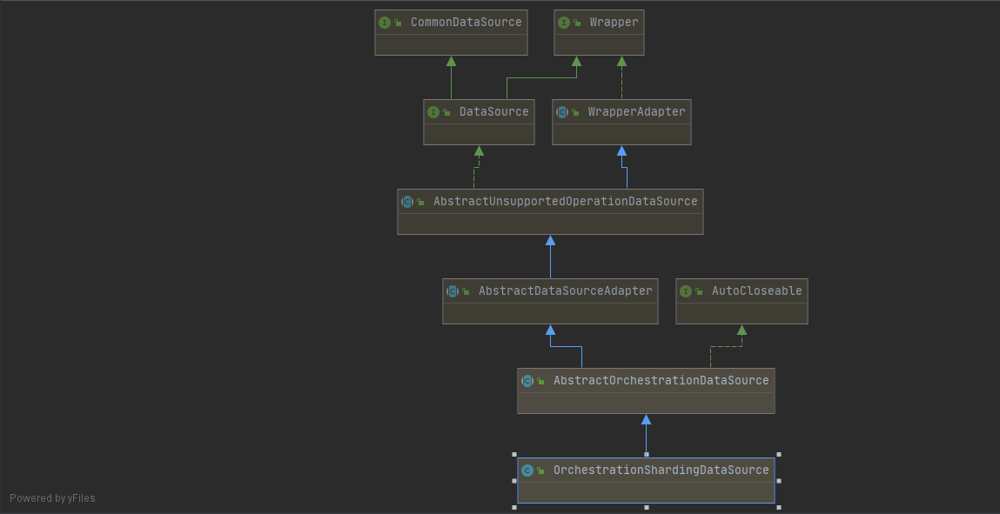
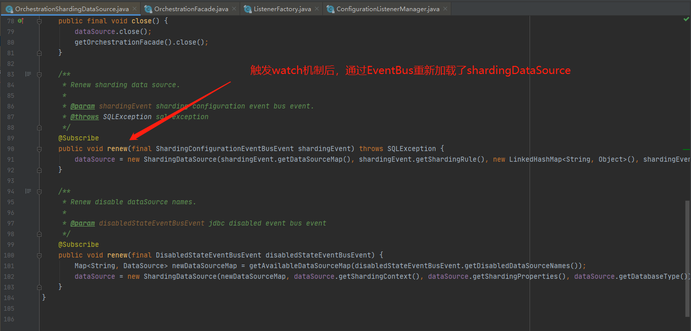

<!--more-->

## 分布式配置中心

在分布式系统或者微服务中，我们经常用到分布式配置中心，他可以将配置定义到一个单独的地方以便所有分布式系统从能从中读取配置，对于修改配置也只需要修改一个地方就行。
## ShardingSphere编排治理

### 为啥需要编排治理？

ShardingSphere的编排治理提供了配置中心和注册中心功能。
在使用ShardingSphere我们经常定义了一堆分库分表规则。传统的ShardingJdcb我们一般将分库分表规则配置在yml文件或者xml文件中。然而在分布式系统中，假设我们有100台机器做负载均衡，由于需求原因分库分表规则需要添加规则，这时候我们的处理如下：

1. 对100台机器上的分库分表配置文件yml文件进行逐一修改
2. 逐一重启100台机器Tomcat

这其中的复杂程度可想而知。有人会说，可以将配置定义在一个分布式配置中心中。 没错 ！！！

所以ShardingSphere提供了编排治理功能，通俗一点就是通过ShardingSphere + Zookeeper 或者 Etcd  实现 分布式配置功能，并且通过Zookeeper的Watch机制保证每次修改后<font color=red>自动加载无需重启</font>。
### 如何使用？

导入编排治理Maven

```xml
<dependency>
            <groupId>io.shardingsphere</groupId>
            <artifactId>sharding-jdbc-orchestration-spring-namespace</artifactId>
            <version>3.0.0.M3</version>
</dependency>
<dependency>
            <groupId>io.shardingsphere</groupId>
            <artifactId>sharding-orchestration-reg-zookeeper-curator</artifactId>
            <version>3.0.0</version>
</dependency>
```

最终测试代码

```java
@Test
public void testOrchestration2() throws Exception {

    //先删除zk上相关的配置
    deleteZkDataSourceAndRule();
    //加载DataSource信息到zk
    initDataSourceZkData();
    //加载分库分表规则到ZK
    initRuleZkData();

    ZookeeperConfiguration regConfig = new ZookeeperConfiguration();
    regConfig.setServerLists("localhost:2181");
    regConfig.setNamespace("sharding-data");
    OrchestrationConfiguration orchConcifg = new OrchestrationConfiguration("xuzy",regConfig,false, OrchestrationType.SHARDING);
    //通过OrchestrationShardingDataSourceFactory创建ShardingDataSource
    DataSource dataSource = OrchestrationShardingDataSourceFactory.createDataSource(orchConcifg);
    //查询
    JdbcTemplate jdbcTemplate = new JdbcTemplate(dataSource);
    //查询， 此时如果查询2021年的话会报错
    List<Map<String, Object>> list = jdbcTemplate.queryForList("select * from flow where flowtime in ('20170818','20190205')");


    //修改DataSource信息（新增了dataSource_2021）到ZK
    updateDataSourceZkData();
    //修改分库分表规则(flow新增了2021年规则)到ZK
    updateRuleZkData();

    TimeUnit.SECONDS.sleep(20);

    //查询， 此时如果查询2021年的话不会报错
    List<Map<String, Object>> listNew = jdbcTemplate.queryForList("select * from flow where flowtime in ('20170818','20190205','20210405')");
    System.out.println(listNew);
}
```

删除zookeeper上的sharding配置

```java
@Test
public void deleteZkDataSourceAndRule() throws Exception {
    //zookeeper节点名称定义在io.shardingsphere.jdbc.orchestration.internal.config.ConfigurationNode上，会面说明
    CuratorFramework cf = getCuratorFramework();
    cf.start();
    Stat stat = cf.checkExists().forPath("/sharding-data/xuzy/config/datasource");
    if(stat != null){
        cf.delete().forPath("/sharding-data/xuzy/config/datasource");
    }
    Stat stat2 = cf.checkExists().forPath("/sharding-data/xuzy/config/sharding/rule");
    if(stat2 != null){
        cf.delete().forPath("/sharding-data/xuzy/config/sharding/rule");
    }
    cf.close();
}
```

加加载DataSource信息到zookeeper

```java
@Test
public void initDataSourceZkData() throws Exception {
    CuratorFramework cf = getCuratorFramework();
    cf.start();
    //创建datasource信息 orchestration-sharding-data-source为命名空间 ，闯将的datasource是ymal模式的
    //Map<String, DataSource> result = DataSourceConverter.dataSourceMapFromYaml(this.regCenter.getDirectly(this.configNode.getFullPath("config/datasource")));
    String dataSource = "" +
            "  dataSource_default: !!org.apache.commons.dbcp.BasicDataSource\n" +
            "    driverClassName: com.mysql.jdbc.Driver\n" +
            "    url: jdbc:mysql://localhost:3306/sharding_default?useUnicode=true&amp;characterEncoding=utf-8\n" +
            "    username: root\n" +
            "    password: 123456\n" +
            "    initialSize : 0\n" +
            "    maxActive : 200\n" +
            "    maxIdle : 20\n" +
            "    minIdle : 1\n" +
            "    maxWait : 60000\n" +
            "  dataSource_2017: !!org.apache.commons.dbcp.BasicDataSource\n" +
            "    driverClassName: com.mysql.jdbc.Driver\n" +
            "    url: jdbc:mysql://localhost:3306/sharding_2017?useUnicode=true&amp;characterEncoding=utf-8\n" +
            "    username: root\n" +
            "    password: 123456\n" +
            "    initialSize : 0\n" +
            "    maxActive : 200\n" +
            "    maxIdle : 20\n" +
            "    minIdle : 1\n" +
            "    maxWait : 60000\n" +
            "  dataSource_2018: !!org.apache.commons.dbcp.BasicDataSource\n" +
            "    driverClassName: com.mysql.jdbc.Driver\n" +
            "    url: jdbc:mysql://localhost:3306/sharding_2018?useUnicode=true&amp;characterEncoding=utf-8\n" +
            "    username: root\n" +
            "    password: 123456\n" +
            "    initialSize : 0\n" +
            "    maxActive : 200\n" +
            "    maxIdle : 20\n" +
            "    minIdle : 1\n" +
            "    maxWait : 60000\n" +
            "  dataSource_2019: !!org.apache.commons.dbcp.BasicDataSource\n" +
            "    driverClassName: com.mysql.jdbc.Driver\n" +
            "    url: jdbc:mysql://localhost:3306/sharding_2019?useUnicode=true&amp;characterEncoding=utf-8\n" +
            "    username: root\n" +
            "    password: 123456\n" +
            "    initialSize : 0\n" +
            "    maxActive : 200\n" +
            "    maxIdle : 20\n" +
            "    minIdle : 1\n" +
            "    maxWait : 60000\n" +
            "  dataSource_2020: !!org.apache.commons.dbcp.BasicDataSource\n" +
            "    driverClassName: com.mysql.jdbc.Driver\n" +
            "    url: jdbc:mysql://localhost:3306/sharding_2020?useUnicode=true&amp;characterEncoding=utf-8\n" +
            "    username: root\n" +
            "    password: 123456\n" +
            "    initialSize : 0\n" +
            "    maxActive : 200\n" +
            "    maxIdle : 20\n" +
            "    minIdle : 1\n" +
            "    maxWait : 60000";
    cf.create()
            .creatingParentsIfNeeded() //自动创建父节点
            .withMode(CreateMode.PERSISTENT) //设置成永久节点
            .forPath("/sharding-data/xuzy/config/datasource", dataSource.getBytes());
    cf.close();
}
```

加载分库分表规则到Zookeeper

```java
@Test
public void initRuleZkData() throws Exception {
    CuratorFramework cf = getCuratorFramework();
    cf.start();
    String rule = "  tables:\n" +
            "    flow:\n" +
            "      actualDataNodes: dataSource_${2017..2020}.flow_0${1..9},dataSource_${2017..2020}.flow_1${0..2}\n" +
            "      tableStrategy:\n" +
            "        standard:\n" +
            "          shardingColumn: flowtime\n" +
            "          preciseAlgorithmClassName: com.shardingAlgorithm.PreciseModuloTableShardingAlgorithm\n" +
            "      databaseStrategy:\n" +
            "        standard:\n" +
            "          shardingColumn: flowtime\n" +
            "          preciseAlgorithmClassName: com.shardingAlgorithm.PreciseModuloDatabaseShardingAlgorithm\n" +
            "    ips:\n" +
            "      actualDataNodes: dataSource_${2017..2020}.ips_0${1..9},dataSource_${2017..2020}.ips_1${0..2}\n" +
            "      tableStrategy:\n" +
            "        standard:\n" +
            "          shardingColumn: flowtime\n" +
            "          preciseAlgorithmClassName: com.shardingAlgorithm.PreciseModuloTableShardingAlgorithm\n" +
            "      databaseStrategy:\n" +
            "        standard:\n" +
            "          shardingColumn: flowtime\n" +
            "          preciseAlgorithmClassName: com.shardingAlgorithm.PreciseModuloDatabaseShardingAlgorithm\n" +
            "    acca:\n" +
            "      actualDataNodes: dataSource_${2017..2020}.acca_0${1..9},dataSource_${2017..2020}.acca_1${0..2}\n" +
            "      tableStrategy:\n" +
            "        complex:\n" +
            "          shardingColumns: flowtime,dataType\n" +
            "          algorithmClassName: com.shardingAlgorithm.ComplexModuloTableShardingAlgorithm\n" +
            "      databaseStrategy:\n" +
            "        complex:\n" +
            "          shardingColumns: flowtime,dataType\n" +
            "          algorithmClassName: com.shardingAlgorithm.ComplexModuloDatabaseShardingAlgorithm\n" +
            "  bindingTables:\n" +
            "    - flow,ips,acca\n" +
            "  defaultDatabaseStrategy:\n" +
            "    none:\n" +
            "  defaultTableStrategy:\n" +
            "    none:";
    cf.create()
            .creatingParentsIfNeeded() //自动创建父节点
            .withMode(CreateMode.PERSISTENT) //设置成永久节点
            .forPath("/sharding-data/xuzy/config/sharding/rule", rule.getBytes());
    cf.close();
}
```

修改DataSource信息（新增了dataSource_2021）到Zookeeper

```java
@Test
public void updateDataSourceZkData() throws Exception {
    CuratorFramework cf = getCuratorFramework();
    cf.start();
    String dataSource = "  dataSource_default: !!org.apache.commons.dbcp.BasicDataSource\n" +
            "    driverClassName: com.mysql.jdbc.Driver\n" +
            "    url: jdbc:mysql://localhost:3306/sharding_default?useUnicode=true&amp;characterEncoding=utf-8\n" +
            "    username: root\n" +
            "    password: 123456\n" +
            "    initialSize : 0\n" +
            "    maxActive : 200\n" +
            "    maxIdle : 20\n" +
            "    minIdle : 1\n" +
            "    maxWait : 60000\n" +
            "  dataSource_2017: !!org.apache.commons.dbcp.BasicDataSource\n" +
            "    driverClassName: com.mysql.jdbc.Driver\n" +
            "    url: jdbc:mysql://localhost:3306/sharding_2017?useUnicode=true&amp;characterEncoding=utf-8\n" +
            "    username: root\n" +
            "    password: 123456\n" +
            "    initialSize : 0\n" +
            "    maxActive : 200\n" +
            "    maxIdle : 20\n" +
            "    minIdle : 1\n" +
            "    maxWait : 60000\n" +
            "  dataSource_2018: !!org.apache.commons.dbcp.BasicDataSource\n" +
            "    driverClassName: com.mysql.jdbc.Driver\n" +
            "    url: jdbc:mysql://localhost:3306/sharding_2018?useUnicode=true&amp;characterEncoding=utf-8\n" +
            "    username: root\n" +
            "    password: 123456\n" +
            "    initialSize : 0\n" +
            "    maxActive : 200\n" +
            "    maxIdle : 20\n" +
            "    minIdle : 1\n" +
            "    maxWait : 60000\n" +
            "  dataSource_2019: !!org.apache.commons.dbcp.BasicDataSource\n" +
            "    driverClassName: com.mysql.jdbc.Driver\n" +
            "    url: jdbc:mysql://localhost:3306/sharding_2019?useUnicode=true&amp;characterEncoding=utf-8\n" +
            "    username: root\n" +
            "    password: 123456\n" +
            "    initialSize : 0\n" +
            "    maxActive : 200\n" +
            "    maxIdle : 20\n" +
            "    minIdle : 1\n" +
            "    maxWait : 60000\n" +
            "  dataSource_2020: !!org.apache.commons.dbcp.BasicDataSource\n" +
            "    driverClassName: com.mysql.jdbc.Driver\n" +
            "    url: jdbc:mysql://localhost:3306/sharding_2020?useUnicode=true&amp;characterEncoding=utf-8\n" +
            "    username: root\n" +
            "    password: 123456\n" +
            "    initialSize : 0\n" +
            "    maxActive : 200\n" +
            "    maxIdle : 20\n" +
            "    minIdle : 1\n" +
            "    maxWait : 60000\n" +
            "  dataSource_2021: !!org.apache.commons.dbcp.BasicDataSource\n" +
            "    driverClassName: com.mysql.jdbc.Driver\n" +
            "    url: jdbc:mysql://localhost:3306/sharding_2021?useUnicode=true&amp;characterEncoding=utf-8\n" +
            "    username: root\n" +
            "    password: 123456\n" +
            "    initialSize : 0\n" +
            "    maxActive : 200\n" +
            "    maxIdle : 20\n" +
            "    minIdle : 1\n" +
            "    maxWait : 60000";
    //更新
    cf.setData().forPath("/sharding-data/xuzy/config/datasource", dataSource.getBytes());
}
```

修改分库分表规则(flow新增了2021年规则)到Zookeeper

```java
@Test
public void updateRuleZkData() throws Exception {
    CuratorFramework cf = getCuratorFramework();
    cf.start();
    String rule = "  tables:\n" +
            "    flow:\n" +
            "      actualDataNodes: dataSource_${2017..2021}.flow_0${1..9},dataSource_${2017..2021}.flow_1${0..2}\n" +
            "      tableStrategy:\n" +
            "        standard:\n" +
            "          shardingColumn: flowtime\n" +
            "          preciseAlgorithmClassName: com.shardingAlgorithm.PreciseModuloTableShardingAlgorithm\n" +
            "      databaseStrategy:\n" +
            "        standard:\n" +
            "          shardingColumn: flowtime\n" +
            "          preciseAlgorithmClassName: com.shardingAlgorithm.PreciseModuloDatabaseShardingAlgorithm\n" +
            "    ips:\n" +
            "      actualDataNodes: dataSource_${2017..2020}.ips_0${1..9},dataSource_${2017..2020}.ips_1${0..2}\n" +
            "      tableStrategy:\n" +
            "        standard:\n" +
            "          shardingColumn: flowtime\n" +
            "          preciseAlgorithmClassName: com.shardingAlgorithm.PreciseModuloTableShardingAlgorithm\n" +
            "      databaseStrategy:\n" +
            "        standard:\n" +
            "          shardingColumn: flowtime\n" +
            "          preciseAlgorithmClassName: com.shardingAlgorithm.PreciseModuloDatabaseShardingAlgorithm\n" +
            "    acca:\n" +
            "      actualDataNodes: dataSource_${2017..2020}.acca_0${1..9},dataSource_${2017..2020}.acca_1${0..2}\n" +
            "      tableStrategy:\n" +
            "        complex:\n" +
            "          shardingColumns: flowtime,dataType\n" +
            "          algorithmClassName: com.shardingAlgorithm.ComplexModuloTableShardingAlgorithm\n" +
            "      databaseStrategy:\n" +
            "        complex:\n" +
            "          shardingColumns: flowtime,dataType\n" +
            "          algorithmClassName: com.shardingAlgorithm.ComplexModuloDatabaseShardingAlgorithm\n" +
            "  bindingTables:\n" +
            "    - flow,ips,acca\n" +
            "  defaultDatabaseStrategy:\n" +
            "    none:\n" +
            "  defaultTableStrategy:\n" +
            "    none:";
    //更新
    cf.setData().forPath("/sharding-data/xuzy/config/sharding/rule", rule.getBytes());
}
```

### 源码分析

```java
ZookeeperConfiguration regConfig = new ZookeeperConfiguration();
regConfig.setServerLists("localhost:2181");
//这里namespace表示命名空间。
regConfig.setNamespace("sharding-data");
OrchestrationConfiguration orchConcifg = new OrchestrationConfiguration("xuzy",regConfig,false, OrchestrationType.SHARDING);
//通过OrchestrationShardingDataSourceFactory创建ShardingDataSource
DataSource dataSource = OrchestrationShardingDataSourceFactory.createDataSource(orchConcifg);
```

#### 治理规则配置类OrchestrationConfiguration

```java
@RequiredArgsConstructor
@Getter
public final class OrchestrationConfiguration {
    //治理规则名称
    //这个主要作用是为了可以区分本地环境和测试环境。例如在zk上我们可以定义两套配置，然后使用name = prod表示加载的是生产环境的配置
    private final String name;
    //注册（配置）中心配置类接口，目前支持zookeeper和Etcd方式
    private final RegistryCenterConfiguration regCenterConfig;
    //本地配置是否覆写服务器配置标志位
    private final boolean overwrite;
    //枚举类，用来区别是普通sharding或者主从sharding
    private final OrchestrationType type;
}
```

```java
//节点配置类，定义了存放到zookeeper的路径
@RequiredArgsConstructor
public final class ConfigurationNode {
    public static final String ROOT = "config";
    public static final String PROXY_NODE_PATH = ROOT + "/proxy";
    //存放数据源信息的路径，配合namespace + 治理规则名称 最终定义存放到zookeeper的路径
    //例如namespace = sharding-data name(治理规则名称) = xuzy 
    //所以最终数据源信息存放到/sharding-data/xuzy/config/datasource
    public static final String DATA_SOURCE_NODE_PATH = ROOT + "/datasource";
    public static final String SHARDING_NODE_PATH = ROOT + "/sharding";
    public static final String MASTER_SLAVE_NODE_PATH = ROOT + "/masterslave";
    public static final String RULE_NODE_PATH = "/rule";
    public static final String CONFIG_MAP_NODE_PATH = "/configmap";
    public static final String SHARDING_RULE_NODE_PATH = SHARDING_NODE_PATH + RULE_NODE_PATH;
    public static final String SHARDING_CONFIG_MAP_NODE_PATH = SHARDING_NODE_PATH + CONFIG_MAP_NODE_PATH;
    public static final String SHARDING_PROPS_NODE_PATH = SHARDING_NODE_PATH + "/props";
    public static final String MASTER_SLAVE_RULE_NODE_PATH = MASTER_SLAVE_NODE_PATH + RULE_NODE_PATH;
    public static final String MASTER_SLAVE_CONFIG_MAP_NODE_PATH = MASTER_SLAVE_NODE_PATH + CONFIG_MAP_NODE_PATH;
    public static final String MASTER_SLAVE_PROPS_NODE_PATH = MASTER_SLAVE_NODE_PATH + "/props";
    public static final String PROXY_RULE_NODE_PATH = PROXY_NODE_PATH + RULE_NODE_PATH;
    private final String name;
    /**
     * Get node full path.
     *
     * @param node node name
     * @return node full path
     */
    public String getFullPath(final String node) {
        return String.format("/%s/%s", name, node);
    }
}
```

#### 创建shardingDataSource工厂

编排治理提供了两种创建shardingDataSource的工厂。

- OrchestrationShardingDataSourceFactory 普通shardingDataSource创建工厂
- OrchestrationMasterSlaveDataSourceFactory 主从shardingDataSource创建工厂

```java
@NoArgsConstructor(access = AccessLevel.PRIVATE)
public final class OrchestrationShardingDataSourceFactory {
    public static DataSource createDataSource(final OrchestrationConfiguration orchestrationConfig) throws SQLException {
        return new OrchestrationShardingDataSource(orchestrationConfig);
    }
}
```

#### 编排治理ShardingDataSource

OrchestrationShardingDataSource继承关系如下，实现了DataSource接口。这个类是最主要的类，通过从zookeeper获取对应的配置最后初始化成ShardingDataSource。



主流程如下：

1. 初始化OrchestrationFacade对象，里面通过配置确定是采用zookeeper还是etcd作为配置中心
2. 从配置中心获取分库分表规则，数据库连接信息
3. 初始化ShardingDataSource
4. 设置watch机制，当配置发生变化时重新加载ShardingDataSource

```java
public OrchestrationShardingDataSource(final OrchestrationConfiguration orchestrationConfig) throws SQLException {
    //初始化OrchestrationFacade对象，里面通过配置确定是采用zookeeper还是etcd作为配置中心
    super(new OrchestrationFacade(orchestrationConfig));
    ConfigurationService configService = getOrchestrationFacade().getConfigService();
    //从配置中心获取分库分表规则，数据库连接信息
    ShardingRuleConfiguration shardingRuleConfig = configService.loadShardingRuleConfiguration();
    Preconditions.checkNotNull(shardingRuleConfig, "Missing the sharding rule configuration on register center");
    //初始化ShardingDataSource
    dataSource = new ShardingDataSource(configService.loadDataSourceMap(),
            new ShardingRule(shardingRuleConfig, configService.loadDataSourceMap().keySet()), configService.loadShardingConfigMap(), configService.loadShardingProperties());
    //设置watch机制，当配置发生变化时重新加载ShardingDataSource
    initOrchestrationFacade(dataSource);
}
```

第一步，初始化OrchestrationFacade对象，里面通过配置确定是采用zookeeper还是etcd作为配置中心

```java
public OrchestrationFacade(final OrchestrationConfiguration orchestrationConfig) {
    //选择配置中心
    regCenter = createRegistryCenter(orchestrationConfig.getRegCenterConfig());
    isOverwrite = orchestrationConfig.isOverwrite();
    //用于获取配置的service类
    configService = new ConfigurationService(orchestrationConfig.getName(), regCenter);
    //用于获取实例状态的service类
    instanceStateService = new InstanceStateService(orchestrationConfig.getName(), regCenter);
    //用于获取数据源的service类
    dataSourceService = new DataSourceService(orchestrationConfig.getName(), regCenter);
    listenerManager = new ListenerFactory(orchestrationConfig.getName(), regCenter);
}

private RegistryCenter createRegistryCenter(final RegistryCenterConfiguration regCenterConfig) {
    Preconditions.checkNotNull(regCenterConfig, "Registry center configuration cannot be null.");
    //如果是ZookeeperConfiguration则采用zookeeper作为配置中心
    if (regCenterConfig instanceof ZookeeperConfiguration) {
        return getZookeeperRegistryCenter((ZookeeperConfiguration) regCenterConfig);
    }
    if (regCenterConfig instanceof EtcdConfiguration) {
        return new EtcdRegistryCenter((EtcdConfiguration) regCenterConfig);
    }
    throw new UnsupportedOperationException(regCenterConfig.getClass().getName());
}

private RegistryCenter getZookeeperRegistryCenter(final ZookeeperConfiguration regCenterConfig) {
    if (regCenterConfig.isUseNative()) {
        //这个没用过
        return new NewZookeeperRegistryCenter(regCenterConfig);
    } else {
        // Curator作为zookeeper的客户端
        return new ZookeeperRegistryCenter(regCenterConfig);
    }
}
```

第二步，从配置中心获取分库分表规则，数据库连接信息

以获取分库分表规则为例

```java
public ShardingRuleConfiguration loadShardingRuleConfiguration() {
    try {
        //从路径 /namespace/name/config/sharding/rule 获取到分库分表规并转换成ShardingRuleConfiguration对象
        ShardingRuleConfiguration result = ShardingConfigurationConverter.shardingRuleConfigFromYaml(regCenter.getDirectly(configNode.getFullPath(ConfigurationNode.SHARDING_RULE_NODE_PATH)));
        Preconditions.checkState(null != result && !result.getTableRuleConfigs().isEmpty(), "No available sharding rule configuration to load.");
        return result;
    } catch (final Exception ex) {
        throw new ShardingConfigurationException("No available sharding rule configuration to load.");
    }
}
```

第三步，初始化shardingDataSource

```java
dataSource = new ShardingDataSource(configService.loadDataSourceMap(),
                new ShardingRule(shardingRuleConfig, configService.loadDataSourceMap().keySet()), configService.loadShardingConfigMap(), configService.loadShardingProperties());
```

第四步，设置watch机制，当配置发生变化时重新加载ShardingDataSource

```java
public void init(final Map<String, DataSource> dataSourceMap, final ShardingRuleConfiguration shardingRuleConfig, 
                 final Map<String, Object> configMap, final Properties props) {
    //判断是否有主从配置的规则，如果有则做处理
    if (shardingRuleConfig.getMasterSlaveRuleConfigs().isEmpty()) {
        reviseShardingRuleConfigurationForMasterSlave(dataSourceMap, shardingRuleConfig);
    }
    //通过isOverwrite判断是否需要本地配置是否覆写服务器配置
    //如果为true，则会使用本地的配置先加载到配置中心里面
    configService.persistShardingConfiguration(getActualDataSourceMapForMasterSlave(dataSourceMap), shardingRuleConfig, configMap, props, isOverwrite);
    //更新在线的实例机器，这里sharingjdbc通过在节点  /namespace/name/state/instances上记录当前连接到配置中心的机器
    //以便以后获取在线机器做铺垫
    instanceStateService.persistShardingInstanceOnline();
    dataSourceService.persistDataSourcesNode();
    //分库分表规则，数据库连接信息，实例等设置Watch
    listenerManager.initShardingListeners();
}
```

```java
public void initShardingListeners() {
    //分库分表规则设置Watch
    configurationListenerManager.watchSharding();
    //在线实例设置Watch
    instanceListenerManager.watchSharding();
    //数据库连接设置Watch
    dataSourceListenerManager.watchSharding();
    //configmap设置Watch
    configMapListenerManager.watchSharding();
}

//以分库分表规则为例
watchSharding(ConfigurationNode.SHARDING_RULE_NODE_PATH);
private void watchSharding(final String node) {
    String cachePath = configNode.getFullPath(node);
    regCenter.watch(cachePath, new EventListener() {
        
        @Override
        public void onChange(final DataChangedEvent event) {
            //当/sharding-data/xuzy/config/sharding/rule的内容发生变化时
            if (DataChangedEvent.Type.UPDATED == event.getEventType()) {
                //获取正常运行的数据源信息
                Map<String, DataSource> dataSourceMap = dataSourceService.getAvailableDataSources();
                //重新获取配置中心中最新的配置
                ShardingConfigurationEventBusEvent shardingEvent = new ShardingConfigurationEventBusEvent(dataSourceMap,
                        new ShardingRule(dataSourceService.getAvailableShardingRuleConfiguration(), dataSourceMap.keySet()), configService.loadShardingProperties());
                //采用guava的EventBus进行通知，重新加载shardingDataSource实例。 这里EventBus后面说
                ShardingEventBusInstance.getInstance().post(shardingEvent);
            }
        }
    });
}
```

#### EventBus

EventBus是guava提供的一种观察者模式。具体原理可以自己百度下。笔者也不是很清楚。使用如下

```java
public class EventBusTest {

    public static void main(String[] args){
        final EventBus eventBus = new EventBus();
        //注册监听者
        eventBus.register(new SimpleListener());
        eventBus.register(new SimpleListener2());
        //执行post时，监听者可以收到通知并执行对应的逻辑
        eventBus.post("Simple Event");
    }

    static class SimpleListener {
        @Subscribe
        public void doAction(final String event) {
            System.out.println(event + "_1");
        }
    }

    static class SimpleListener2{
        @Subscribe
        public void doAction(final String event) {
            System.out.println(event + "_2");
        }
    }
}
```

所以，当配置中心触发Watch机制的时候，我们可以看到在代码上执行了

```java
ShardingEventBusInstance.getInstance().post(shardingEvent);
```



## 总结

通过将复杂繁多的配置使用zookeeper进行管理，并且通过Watch机制自动重新加载配置。笔者工作中负责一个自动化入库任务，通过定时拉取数据再经过shardingjdbc存入数据库。期间如果需要新增分库分表规则需要重启服务，势必会导致定时任务的失败，所以采用了编排治理的方式实现不用重启重新加载配置。安全高效。