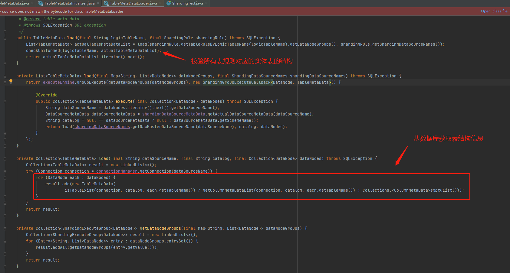
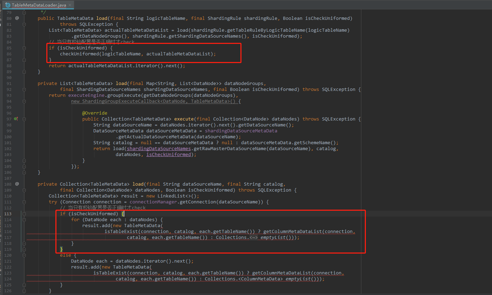

### **问题1：shardingphere启动慢**

项目中使用了shardingphere分库分表，在使用了一段时间后发现项目启动越来越慢，原因定位在加载shardingphere时耗时比较长。但不知道具体是哪一个步骤。

**定位可能原因：一般情况下我们项目会用到数据库连接池，在shardingjdbc启动时会初始化数据库连接池，可能是其中一台机器初始化连接时超时导致整体启动时间慢。**

很遗憾不是这个问题，通过打印连接日志，数据库连接速度很快，不是这个问题导致的。无奈之下，跟了一遍shardingjdbc启动源码，发现问题所在。

**定位原因：在shardingjdbc启动时，会加载分库分表中所有的表结构进行校验，判断是否所有的表结构都是一致的。**

在项目中，使用了分库分表 + 读写分离的方式。假设现在有一个表(user表)采用分库分表读写分离。分库分表规则如下：

- 分库规则：4个库，按照日期%4的方式
- 分表规则：每个月一个表，一共12个表
- 读写分离：一主一从

根据上面的规则，在对表结构校验时一共需要加载 4（4个库） * 12（12张表） * 3（三个机房）= 144张表进行校验。 由于我们项目中一共有接近100张这样的表规则，且每个表的都是很长字段数的表，导致了`从数据库加载表结构`和`表结构校验`这两个步骤变得异常慢。具体代码在类

```java
io.shardingsphere.core.metadata.table.executor.TableMetaDataLoader
```

 

**解决方案**

由于查了下shardingPhere的开发文档都没有一个配置用来关掉校验的，所以在解放方法上我们采用两种方式：

- 下载shardingphere对应版本的源代码，修改后替换仓库中的jar包
- 如果你是用tomcat服务器，利用tomcat类加载机制，在项目中重写TableMetaDataLoader类，然后更改源码。

所以，更改源码后，去掉了这个校验。



### **问题1：普通的查询SQL没有路由**

使用的数据库是MySQL，SQL语句如下。分片键是`time`

```java
SELECT ID,USERNAME .... FROM USER where time = '20200802'
```

**定位原因：time是MySQL的特殊字段，sharding在做词法分析时如果使用了特殊字段会出现问题**

**解决方法**

- 不用使用time命名。
- 更改语句，将time用\`\`字符包装起来。

```
SELECT ID,USERNAME .... FROM USER where `time` = '20200802'
```

