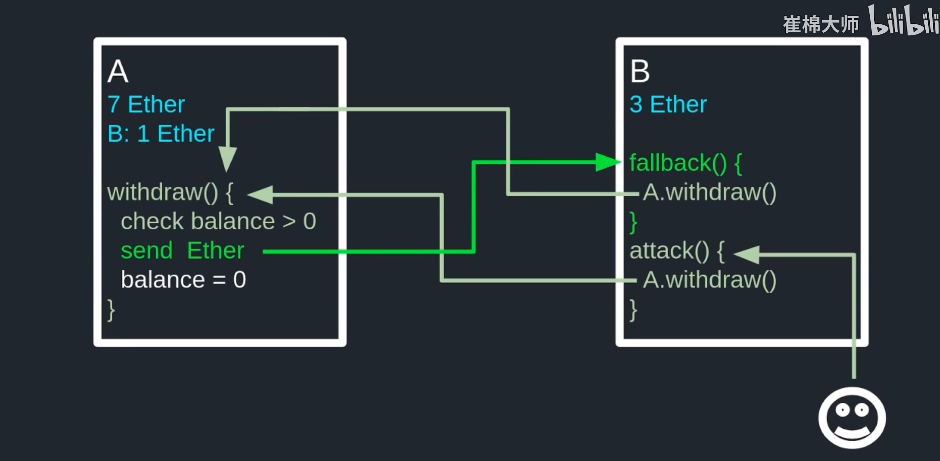
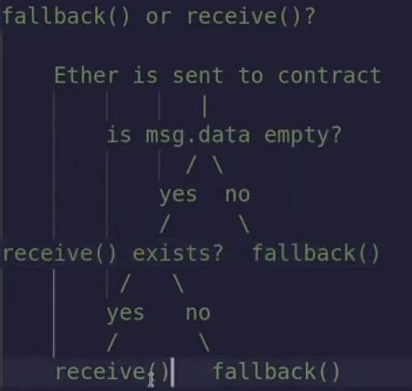
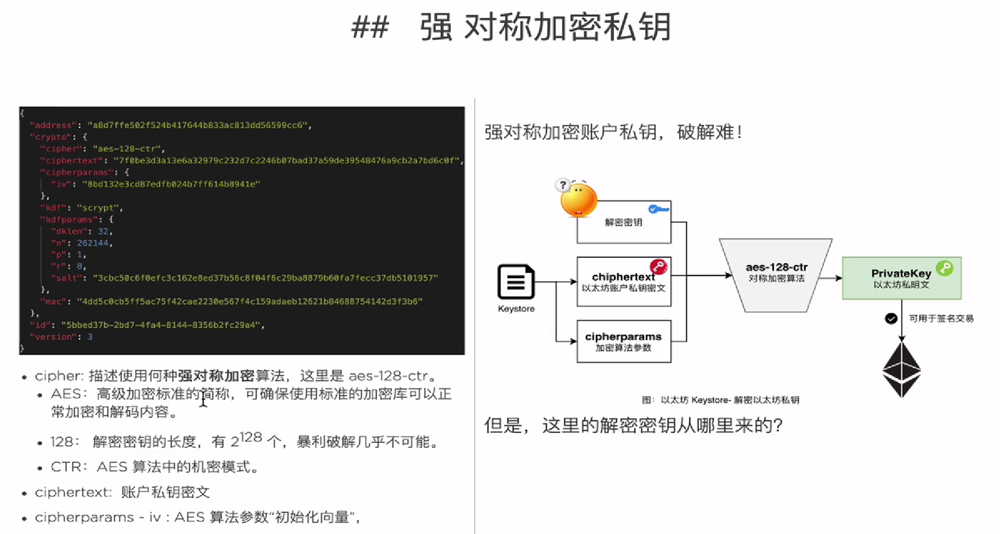
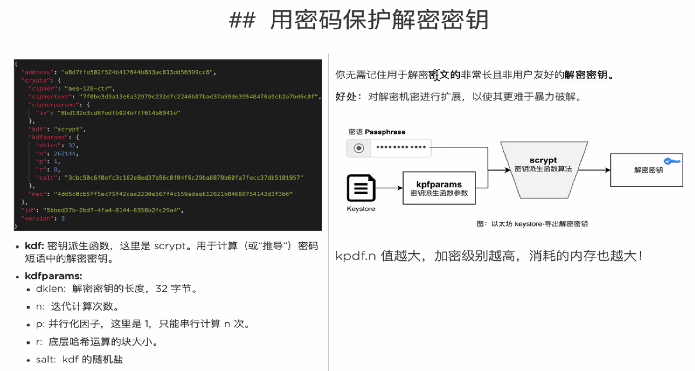
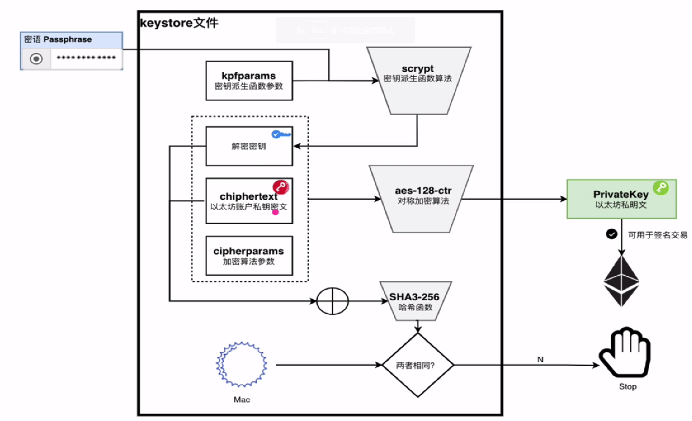

### 常见知识点解释

**Solidity中的`状态变量`与`局部变量`**

`_age`和`_name`就属于状态变量。

`age` `name` `name1`就属于局部变量。

```java
pragma solidity >=0.4.22 <0.6.0;
contract Person {
    int public _age;
    string public _name;
    function Person(int age,string name) {
          _age = age;
          _name = name;
    }
    function f(string name) {
          var name1 = name;
    }
}
```

### Solidity中的引用类型`memory`与`storage`

`storage` : 是在合约部署创建时，根据你的合约中状态变量的声明，就固定下来了，并且不能在将来的合约方法调用中改变这个结构。

`memory` : solidity应当在该函数运行时为变量创建一块空间，使其大小和结构满足函数运行的需要。

注 : 

- 状态变量强制是storage类型
- 任何函数参数当它的类型为引用类型时，这个函数参数都默认为memory类型。
- memory类型的变量会临时拷贝一份值存储到内存中，当我们将这个参数值赋给一个新的变量，并尝试去修改这个新的变量的值时，最原始的变量的值并不会发生变化。
- 当函数参数为`memory`类型时相当于**值传递**。
- 当函数参数为`storage`类型时是**指针传递**。

```java
pragma solidity >=0.4.22 <0.6.0;
contract Person {
    string public  _name;
    function Person() {
        _name = "liyuechun";
    }
    function f() {
        modifyName(_name);
    }
    function modifyName(string memory name)  {
        var name1 = name;
        bytes(name1)[0] = 'L';
    }
}
```

在本案例中，当创建合约时，`_name`的值为liyuechun，当我们调用f()函数时，f()函数中会将`_name`的值赋给临时的memory变量name，换句话说，因为name的类型为memory，所以name和`_name`会分别指向不同的对象，当我们尝试去修改name指针指向的值时，_name所指向的内容不会发生变化。

```java
pragma solidity >=0.4.22 <0.6.0;
contract Person {
    string public  _name;
    function Person() {
        _name = "liyuechun";
    }
    function f() {
        modifyName(_name);
    }
    function modifyName(string storage name) internal {
        var name1 = name;
        bytes(name1)[0] = 'L';
    }
}
```

如果想要在modifyName函数中通过传递过来的指针修改`_name`的值，那么必须将函数参数的类型显示设置为storage类型，storage类型拷贝的不是值，而是`_name`指针，当调用modifyName(`_name`)函数时，相当于同时有`_name`，name,name1三个指针同时指向同一个对象，我们可以通过三个指针中的任何一个指针修改他们共同指向的内容的值。**函数默认是public类型的，当我们函数参数有storage类型时，必须加internal或者private修饰表示只能内部调用**。

### Solidty中的`payable`,`view`,`pure`修饰

- `payable`方法是一种可以接收以太的特殊函数。如果一个函数需要进行货币操作，必须带上payable关键字这样才能正常接收`msg.value`。
- `view`修饰的函数，是constant的别名，只能读取storage变量的值。
- `pure`修饰的函数 ，不能对storage变量进行读写。

**Solidity中internal、private、external、public区别**

对于`public`和`private`，相信学过其他主流语言的人都能明白：

- `public`修饰的变量和函数，任何用户或者合约都能调用和访问。
- `private`修饰的变量和函数，只能在其所在的合约中调用和访问，即使是其子合约也没有权限访问。

除 public 和 private 属性之外，Solidity 还使用了另外两个描述函数可见性的修饰词：internal（内部） 和 external（外部）。

- internal 和 private 类似，不过， 如果某个合约继承自其父合约，这个合约即可以访问父合约中定义的“内部”函数。
- external 与public 类似，只不过这些函数只能在合约之外调用 - 它们不能被合约内的其他函数调用。

`internal、private、external、public`这4种关键字都是可见性修饰符，**互不共存**。

### 如何使用call的方式调用其他合约的方法

```java
//Test2.sol
pragma solidity >=0.7.0 <0.9.0;
contract Test2 {
    constructor() public {}

    uint256 public storageData;
    function set(uint256 x) public {
        storageData = x;
    }
}

// Test.sol
pragma solidity >=0.7.0 <0.9.0;
import {Test2} from "./Test2.sol";

contract Test {
    uint  storageData;

    constructor() public {}

    function set(uint x) public {
        storageData = x;
    }  
    // 使用encodeWithSignature编码方法和变量
    function abiEncode(uint256 x) public view returns (bytes memory) {
        return abi.encodeWithSignature("set(uint256)", x);
    }
    // 使用encodeWithSelector编码方法和变量
    function abiEncode2(address addr,uint256 x) public view returns (bytes memory) {
        return abi.encodeWithSelector(Test2(addr).set.selector, x);
    }

    function testCall(address addr , uint256 x) public returns (bool) {
        (bool success, bytes memory result) = addr.call(abi.encodeWithSignature("set(uint256)",x));
        return success;
    }

    function testCall2(address addr, uint256 x) public returns (bool) {
        (bool success, bytes memory result) = addr.call(abi.encodeWithSelector(Test2(addr).set.selector,x));
        return success;
    }

}
```

### ABI编码合约方法详解

我们通过小狐狸调用合约方法发送给以太坊节点时，需要对合约方法和参数进行ABI编码。例如

```javascript
myContract.methods.baz(69,true).encodeABI();
// 下面数值中间的空格是我自己隔开的，方便确认
> 0xcdcd77c0 0000000000000000000000000000000000000000000000000000000000000045 0000000000000000000000000000000000000000000000000000000000000001
```

例如上面，我们对合约方法 `myMethod`方法进行编码得到了一串字符。合约方法的ABI编码包括两部分 ：`函数名编码` + `参数编码`。通过这两部分结合起来得到最终的ABI编码。

**函数名签名**

在EVM中，每个函数都由4个byte长度的16进制值来唯一标识，这4个bytes叫做函数签名。函数签名是对函数名，函数参数做Keccak(SHA-3) 运算后，获得的hash值的前4个bytes。例如上面我们的合约方法`baz(uint32 x, bool y)`。

```javascript
console.log(web3.utils.sha3('baz(uint32,bool)'))
> 0xcdcd77c0992ec5bbfc459984220f8c45084cc24d9b6efed1fae540db8de801d2
// 取前面4个字节最终得到
> cdcd77c0
```

**参数编码**

如上面例子，传入了`69`,`true`

- 69被编码成 `0x0000000000000000000000000000000000000000000000000000000000000045`

- true被编码成 `0x0000000000000000000000000000000000000000000000000000000000000001`

所以最终得到结果

```
0xcdcd77c0 0000000000000000000000000000000000000000000000000000000000000045 0000000000000000000000000000000000000000000000000000000000000001
```

### Fallback回退函数

Fallback回退函数执行的场景 ：

- 如果在一个对合约调用中，没有其他函数与给定的函数标识符匹配，则fallback会被调用。

- 在没有`receive`函数时，且没有提供附加数据对合约调用时，则fallback会被调用。

场景1 ： `Storage.sol`通过调用`callOwner`方法，方法里面使用call调用和`Owner.sol`的`add`方法，但是Owner.sol里面没有add方法，所以触发了Owner.sol合约的`fallback`函数。

场景2 ：`Storage.sol`通过调用`call2Owner`方法，msg.value表示要转的以太币，往`Owner.sol`合约转账msg.value数量的以太币，由于Owner.sol合约没有`receive`方法，所以Owner.sol合约的fallback方法被触发。如果Owner.sol此时有`receive`函数的话，就不会触发fallback函数。

场景3：例如调用`call3Owner`时，msg.value, msg.data都有值的情况下。但是没有`receive`函数，fallback也会触发。

```javascript
// 2_Storage.sol
pragma solidity >=0.7.0 <0.9.0;
import {Owner} from "./2_Owner.sol";

contract Storage {

    Owner h;
    constructor(address payable addr) public{
        h = Owner(addr);
    }
    function callOwner() public {
        payable(address(h)).call(abi.encodeWithSignature("add(uint256,uint256)"));
    }
    function call2Owner() public payable{
        payable(h).call{value : msg.value}("");
    }
    function call3Owner() public payable {
        payable(h).call{value : msg.value}(abi.encodeWithSignature("setX()"));
    }
}

// 2_Owner.sol
pragma solidity >=0.7.0 <0.9.0;
contract Owner {
    uint256 public temp = 0;
    uint256 public temp2 = 0;
    uint256 public balanceOf;
    function SetX() public {

    }

    function initBalance() public {
        balanceOf = address(this).balance;
    }

    fallback() external payable {
        temp = 12345;
    }

    receive() external payable {
        temp2 = 54321;
    }
}
```

### Solidity重入攻击详解

向以太坊合约账户进行转账，发送Ether的时候，会执行合约账户对应合约代码的回调函数（fallback）。在以太坊[智能合约](https://so.csdn.net/so/search?q=%E6%99%BA%E8%83%BD%E5%90%88%E7%BA%A6&spm=1001.2101.3001.7020)中，进行转账操作，一旦向被攻击者劫持的合约地址发起转账操作，迫使执行攻击合约的回调函数，回调函数中包含回调自身代码，将会导致代码执行“重新进入”合约。这种合约漏洞，被称为“重入漏洞”。

Fallback回退函数执行的场景 ：

- 如果在一个对合约调用中，没有其他函数与给定的函数标识符匹配，则fallback会被调用。

- 在没有`receive`函数时，且没有提供附加数据对合约调用时，则fallback会被调用。

例如下面两个合约:

在银行这里例子里，`Hacker.sol`是攻击者合约。Hacker.sol合约通过`hack`方法调用了`Bank.sol`合约的`withdraw`方法。在withdraw方法中，如果msg.sender是一个智能合约的话，`msg.sender.call.value(amount)`调用call，会执行这个智能合约中的Fallback函数。所以又重新执行了Hacker.sol合约的fallback方法。fallback里面又重新执行了Bank.sol合约的`withdraw`方法。所以就造成了**重入攻击**。

```javascript
//Bank.sol
contract Bank {
    mapping(address => uint256) public balanceOf;
    function withdraw(uint256 amount) public {
        require(balanceOf[msg.sender] >= amount);
        msg.sender.call{value:amount}("");
        balanceOf[msg.sender] -= amount;
    }
 }

//Hacker.sol
import {Bank} from "./Bank.sol";
contract Hacker {
    bool status = false;
    Bank b;
    constructor(address addr) public {
        b = Bank(addr);
    }

    function hack() public {
        b.withdraw(1 ether);
    }

    if (!status) {
            status = true;
            b.withdraw(1 ether);
    }
}
```



### solidity合约状态值在底层存储

- 认为一个合约对应了一条无限长的磁带，磁带上以32字节为单位，拥有无数个存储槽；每个存储槽的位置就是它的key，也是用32字节表示。

- 对于简单的，大小在32字节内的变量，以定义变量的顺序作为它的key来存储变量值。即第一个变量的key为0，第二个变量的key为1，……。

- 结构体和定长数组也是顺序存储（只要每个值都是32字节以内的），比如结构体变量定义在位置1，结构体内部要两个成员，则这两个成员的key依序为 1和2。数组类似，只是在处理数组时编译器会多加一些边界检查的代码。

- 连续的若干个小的值，可能被优化为存储的同一个位置，比如：合约中前四个状态变量都是uint64类型的，则四个状态变量的值会被打包成一个32字节的值存储在0位置。

- map中内容的存储，如果map中的value在32字节以内，则会按以下公式得到数据库中的key：keccak256(bytes32(map中的key）+bytes32(map变量的位置))； 例如，一个map变量在合约中最先定义，map中一个key为"abc"，则其在数据库中的存储位置为：keccak256(bytes32("abc"）+bytes32(0))。

- 如果map中的value是一个复杂类型，存储需求超过32字节，则会按上述公式得到第一个存储位置，然后依序加1得到后续数据的存储位置。

- 可变长度数组，与map类似，但更复杂点：以数组变量所在位置为key，存储数组的长度。然后从keccak256(bytes32(position))开始存储数组中的元素。

- 可变长度字节数组和字符串一样：如果长度小于等于31字节，则直接在变量位置处存储字符串值，并用值的最后一个字节存储字符串的编码长度。编码长度 = 字符数 * 2 。比如，"abc"的存储值为"0x6162630000000000000000000000000000000000000000000000000000000006"。

- 当可变长度字节数组或字符串长度大于31字节时，变量位置存储的是 编码长度，而此时编码长度公式变为 编码长度 = 字符数 * 2 + 1 。 然后，从 keccak256(bytes32(position))位置，使用连续的若干个存储槽存储字符串值。 从而，对于字符串，如果编码长度是奇数，则代表的是长字符串，如果是偶数则代表不超过31字节的字符串。

### Solidity通过合约如何转ETH

```javascript
pragma solidity >=0.7.0 <0.9.0;

contract TrantCall{
    constructor() public {   
    }
    // 转账
    function depositEther() public payable{
      // payable(address(this)).call{value:msg.value}("");
    }
    // 取款
    function exitTokens(uint amount) public payable {
        payable(msg.sender).call{value:amount}("");
    }
}
```

- depositEther转账方法，调用者必须执行传msg.value。这样以太币就会将币从msg.sender传给这个合约。合约里面不用做任何东西，做多做个验证。
- exitTokens提取方法，通过指定amount(单位是wei),之后会合约上扣除对应的以太币，然后msg.sender会加入相应的以太币，假如以太币不够将会报错。

### Solidity知识点

#### Error错误

solidity错误处理分成以下几种:

- require : 用于在执行之前验证输入和条件。
- revert : 类似于 require，但是能自定义错误结构，且当require后面的错误信息很多时用revert代替更省GAS。
- assert : 是用来检查不应该是错误的代码。失败的断言可能意味着有一个错误，这个基本用于内部测试。

```javascript
pragma solidity ^0.8.10;

contract Error {

    error InsufficientBalance(uint256 balance , string errorStr);

    function testRequire(uint256 _i) public pure {
        require(_i > 10, "Input must be greater than 10");
    }

    function testRevert(uint256 _i) public pure {
        if (_i <= 10) {
            //revert("Input must be greater than 10");
            revert InsufficientBalance({balance : _i, errorStr : "error is wrong"});
        }
    }

    function testAssert(uint256 _i) public pure {
        assert(_i == 0);
    }
}
```

#### pure和view

两个都用来修饰solidity方法。

- pure : 修饰的方法里面不涉及到任何对状态变量的修改和读取。
- view : 修饰的方法里面可以涉及到状态的读取但是不能涉及到状态的修改。

```javascript
// SPDX-License-Identifier: MIT
pragma solidity ^0.8.10;

contract ViewAndPure {
    uint public x = 1;
    function addToX(uint y) public view returns (uint) {
        return x + y;
    }
    function add(uint i, uint j) public pure returns (uint) {
        return i + j;
    }
}
```

#### fallback回退函数

fallback是一个函数，它不接受任何参数，也不返回任何值。

它可以在以下情况下执行 ：

- 一个不存在的函数被调用时触发
- 当对一个合约发送ETH时
- - 如果`msg.data`  不为空，则触发fallback
  - 如果`msg.data`为空，判断合约是否有`receive`函数，如果有则触发`receive`而不触发`fallbck`，如果没有则触发`fallback`



注 : 我做了一个测试，当向合约发送ETH且msg.data不为空时，如果此时msg.data是一个不存在的函数时才会触发fallback。如果msg.data是一个存在的函数，不会触发fallback。

```javascript
pragma solidity ^0.8.10;
contract Fallback {
    event Log(uint gas);
    fallback() external payable {
        emit Log(gasleft());
    }
    function getBalance() public view returns (uint) {
        return address(this).balance;
    }
}

contract SendToFallback {

    function transferToFallback(address payable _to) public payable {
        _to.transfer(msg.value);
    }

    function callFallback(address payable _to) public payable {
        (bool sent, ) = _to.call{value: msg.value}("");
        require(sent, "Failed to send Ether");
    }

    function despoist() public payable {}
}
```

这里说一下上面的这种写法`_to.call{value: msg.value}("")` : 这种方法是当我们使用call进行转账时的写法，表示我需要向_to的地址转msg.value的ETH，并且传入("")的值。

#### call方法调用合约

call函数是通过地址调用其他合约的方法，如果调用的方法不存在且对方的fallback方法存在的话，就会触发对方的fallback。
$$
(bool success, bytes memory data)  = _addr.call{value: msg.value, gas: 5000}(abi.encodeWithSignature("foo(string,uint256)",参数1, 参数2))
$$

```javascript
pragma solidity ^0.8.10;

contract Receiver {
    event Received(address caller, uint amount, string message);

    fallback() external payable {
        emit Received(msg.sender, msg.value, "Fallback was called");
    }

    function foo(string memory _message, uint _x) public payable returns (uint) {
        emit Received(msg.sender, msg.value, _message);
        return _x + 1;
    }
}

contract Caller {
    event Response(bool success, bytes data);
    function testCallFoo(address payable _addr) public payable {
       (bool success, bytes memory data)  = _addr.call{value: msg.value, gas: 5000}(
           abi.encodeWithSignature("foo(string,uint256)","call foo", 123)
           );
        emit Response(success, data);
    }

    function testCallDoesNotExist(address _addr) public {
        (bool success, bytes memory data) = _addr.call(
            abi.encodeWithSignature("doesNotExist()")
        );
        emit Response(success, data);
    }
}
```

#### Try Cache

Try/Cache只能捕获来自外部函数调用和契约创建的错误。他的好处是我们知道错误但是可以自己处理可以不被回滚。

```javascript
pragma solidity ^0.8.10;
contract Foo {
	address public owner;
	constructor(address _owner) {
        require(_owner != address(0), "invalid address");
        assert(_owner != 0x0000000000000000000000000000000000000001);
        owner = _owner;
    }
    function myFunc(uint x) public pure returns (string memory) {
    	require(x != 0, "require failed");
        return "my func was called";
    }
}
contract Bar {
    event Log(string message);
    event LogBytes(bytes data);
    Foo foo;
    constructor(){
        foo = Foo(msg.sender); // 创建foo合约
    }
    
    // tryCatchExternalCall(0) => Log("external call failed")
    // tryCatchExternalCall(1) => Log("my func was called")
    function tryCatchExternalCall(uint _i) public {
        try foo.myFunc(_i) returns (string memory result){
            emit Log(result);
        }cache {
            emit Log("external call failed");
        }
    }
    
    // tryCatchNewContract(0x0000000000000000000000000000000000000000) => Log("invalid address")
    // tryCatchNewContract(0x0000000000000000000000000000000000000001) => LogBytes("")
    // tryCatchNewContract(0x0000000000000000000000000000000000000002) => Log("Foo created")
    function tryCatchNewContract(address _owner) public {
        try new Foo(_owner) returns (Foo foo) {
            emit Log("Foo created");
        } cache Error(string memory reason) {
            emit Log(reason);
        } catch (bytes memory reason) {
            emit LogBytes(reason);
        }
    }
}
```

#### Hash函数

Solidity的哈希函数主要使用内置的`keccak256`方法，他固定返回一个`byte32`类型。在做哈希函数之前需要通过`abi.encodePacked()`或者`abi.encode`进行打包。

```javascript
pragma solidity ^0.8.10;

contract HashFunction {
    function hash(
        string memory _text,
        uint _num,
        address _addr
    ) public pure returns (bytes32) {
        return keccak256(abi.encodePacked(_text, _num, _addr));
    }

    function collision(string memory _text, string memory _anotherText)
        public
        pure
        returns (bytes32)
    {
        // encodePacked(AAA, BBB) -> AAABBB
        // encodePacked(AA, ABBB) -> AAABBB
        // 使用abi.encodePacked进行打包有可能出现哈希碰撞，，可以使用abi.encode。或者两个参数之间加一个固定参数，例如
        // encodePacked(AA,1,BBB)
        return keccak256(abi.encodePacked(_text, _anotherText));
    }
}
contract GuessTheMagicWord {
    bytes32 public answer =
        0x60298f78cc0b47170ba79c10aa3851d7648bd96f2f8e46a19dbc777c36fb0c00;
    function guess(string memory _word) public view returns (bool) {
        return keccak256(abi.encodePacked(_word)) == answer;
    }
}
```

#### 签名验证

通过智能合约来验证签名主要有下面几个流程 :

1. 在链下对Msg进行签名，签名需要签名者的私钥。web3js有提供对应的函数。
2. 在线上进行验证签名

web3js链下签名

```javascript
const signature = await web3.eth.accounts.sign(
        'Hello world',      // 信息串
        "e5861347faf0f99409666f0f27dee18832624d2f3d16f1f9f5becda9c025669d"  //私钥
    	// 私钥对应的地址 : 0xb4551baB04854a09b93492bb61b1B011a82cC27A
    );
    console.log(signature);
    /*{
        message: 'Hello world',
        messageHash: '0x8144a6fa26be252b86456491fbcd43c1de7e022241845ffea1c3df066f7cfede',
        v: '0x1c',
        r: '0x46cf25d4dee9fc569f76a9328d7e915e27e33d543fb8eeb4cba7d733d7fb9dc8',
        s: '0x49c7d90ede2cab188d1a3a40c8edf71317d0ca730078cb8de0f7ddf84b9c07af',
        signature: '0x46cf25d4dee9fc569f76a9328d7e915e27e33d543fb8eeb4cba7d733d7fb9dc849c7d90ede2cab188d1a3a40c8edf71317d0ca730078cb8de0f7ddf84b9c07af1c'
    }*/
```

solidity线上验证签名

```javascript
// SPDX-License-Identifier: MIT
pragma solidity ^0.8.10;
contract VerifySignature {
    
    function recoverSigner(bytes32 _ethSignedMessageHash, bytes memory _signature) public pure returns (address) {
        (bytes32 r, bytes32 s, uint8 v) = splitSignature(_signature);
        return ecrecover(_ethSignedMessageHash, v, r, s);
    }

    // 解析签名
    function splitSignature(bytes memory sig) public pure returns (bytes32 r,bytes32 s,uint8 v){
        require(sig.length == 65, "invalid signature length");
        assembly {
            r := mload(add(sig, 32))
            s := mload(add(sig, 64))
            v := byte(0, mload(add(sig, 96)))
        }
    }
}
```

测试方法 ：取`messageHash` 和`signature` 执行recoverSigner合约方法判断返回的地址。

```javascript
recoverSigner('0x8144a6fa26be252b86456491fbcd43c1de7e022241845ffea1c3df066f7cfede','0x46cf25d4dee9fc569f76a9328d7e915e27e33d543fb8eeb4cba7d733d7fb9dc849c7d90ede2cab188d1a3a40c8edf71317d0ca730078cb8de0f7ddf84b9c07af1c')
```

#### 继承

继承的写法就是用`is`。  `contract B is A ` 就是表示B继承了A的方法。这样依赖B就可以使用A定义的方法了。

继承后如果B想要重写A的方法，则A合约方法上必须加`virtual`修饰表示方法支持重写，并且B合约重写时需要加`override`。

如果还有一个C继承了B并且要重写A和B都有的方法，那么B合约的方法上就同时加`virtual`和`override`进行修饰。

#### 通过工厂合约创建合约并给予ETH

```javascript
pragma solidity ^0.8.10;

contract Account {
    address public bank;
    address public owner;
    constructor(address _owner) payable {
        bank = msg.sender;
        owner = _owner;
    }
}

contract AccountFactory {
    Account[] public accounts;
    function createAccount(address _owner) external payable {
        Account account = new Account{value: msg.value}(_owner);
        accounts.push(account);
    }
}
```

#### 两种对方法签名的方式

我们使用`call`调用合约函数的时候通常需要通过abi.encodeWithSignature进行编码。除了这个方法还有一个等价的方法，那就是abi.encodeWithSelector。

```javascript
// 假设要对TestDelegateCall.sol合约的setVars(uint256 x)进行编码
abi.encodeWithSignature("setVars(uint256)", 100) == abi.encodeWithSelector(TestDelegateCall.setVars.selector,100)
```

#### create2内联汇编

xxx

#### 委托调用DelegateCall

##### 传统调用call

A账户 call B , send  100 wei .  B call C , send  50 wei

此时在C的视角中， msg.sender = B , msg.value = 50 wei . 此时如果有更改状态的话更改的就是C的状态。50wei被存在C上。

#### 委托调用delegatecall

A账户 call B , send  100 wei .  B delegatecall C , send  50 wei

此时在C的视角中，msg.sender = A , msg.value = 100 wei . 此时如果有更改状态的话更改的是B的状态。100wei被存到B上。

```javascript
// SPDX-License-Identifier: MIT
pragma solidity ^0.8.10;

contract TestDelegateCall {
    uint public num;
    address public sender;
    uint public value;

    function setVars(uint _num) external payable {
        num = _num;
        sender = msg.sender;
        value = msg.value;
    }
}

contract DelegateCall {
    uint public num;
    address public sender;
    uint public value;
    function setVars(address _test, uint _num) external payable {
        (bool success , bytes memory data ) =_test.delegatecall(abi.encodeWithSignature("setVars(uint256)", _num));
        require(success, "delegateCall failed");
    }
}
```

#### abi解编码

直接看函数

```javascript
// SPDX-License-Identifier: MIT
pragma solidity ^0.8.10;
contract AbiDecode {
    struct MyStruct {
        string name;
        uint[2] nums;
    }
    function encode(uint x, address addr, uint[] calldata arr, MyStruct calldata   )
    external pure returns (bytes memory) 
    {
        return abi.encode(x, addr, arr, myStruct);
    }

    function decode(bytes calldata data) external pure returns (
            uint x,
            address addr,
            uint[] memory arr,
            MyStruct memory myStruct
        )
    {
        // (uint x, address addr, uint[] memory arr, MyStruct myStruct) = ...
        (x, addr, arr, myStruct) = abi.decode(data, (uint, address, uint[], MyStruct));
    }
}
```

#### 小狐狸签名

```
// 浏览器 F12
ethereum.enable()
account = "0xb4551baB04854a09b93492bb61b1B011a82cC27A"
hash = "xuzhiyong"
ethereum.request({method:"personal_sign",params:[account,hash]})
```

#### Solidity-Delete

- delete操作符可以用于任何变量，将其设置成默认值0。
- 如果对`动态数组`使用delete,则删除所有元素，其长度变成0.
- 如果对`静态数组`使用delete,则将数组内所有元素设置成默认值。
- 如果对数组的其中一个元素使用delete,例如`delete array[2]`,则把对应的位置设置为默认值，并不会减少长度。
- 对于一个mapping,例如`mapping(address => uint256) public testMap` ,如果执行`delete testMap`没有任何效果，如果执行`delete testMap[xxx]`则xxx对应的value会被设置成默认值。
- 删除结构体，会将所有成员变量置为初值。

#### 初始化可转账合约

如何在部署合约的时候就给合约ETH呢，可以通过在构造函数上加`payable`实现。

```javascript
contract X {
	constructor() payable{
    }
}
```


### keystore详解

keystore : 它是账户私钥的**加密**版本。

使用keystore的原因 : 直接把账户私钥存储在加密工具中比较危险，你的私钥容易被攻击。但是如果存储用密码加密后的以太坊私钥，则可以保证安全性和可用性。

- 安全性：攻击者需要密钥库文件和密码来才能窃取。

- 可用性：仅需要密码库文件和密码来使用资金。

```
{
  "version": 3,
  // keystore的随机编号
  "id": "2e5fba44-38e9-4733-a52f-6981ca128437",
  // 地址
  "address": "b4551bab04854a09b93492bb61b1b011a82cc27a",
  // 加密描述 - 核心
  "crypto": {
    "ciphertext": "395bf3540ec48a1f31403c635102ab98d61d52989e1aa13a2f031efc7b6ec503",
    "cipherparams": {
      "iv": "30b95477207a06b4613d232a5afc4466"
    },
    "cipher": "aes-128-ctr",
    "kdf": "scrypt",
    "kdfparams": {
      "dklen": 32,
      "salt": "eb660c57dc95991b49b46c78e0f9a7e3d146fd18f495083acb3cad1343136152",
      "n": 8192,
      "r": 8,
      "p": 1
    },
    // 用来校验最终得到的账户私钥明文正不正确
    "mac": "f7182a8e054eb7e7aebe3b96eeb2aa8cd4f6d1db7429183415b8c71b88964e73"
  }
}
```



上图的解密密钥从哪里来？ -- 看下面图，主要也是通过密码



最终过程


