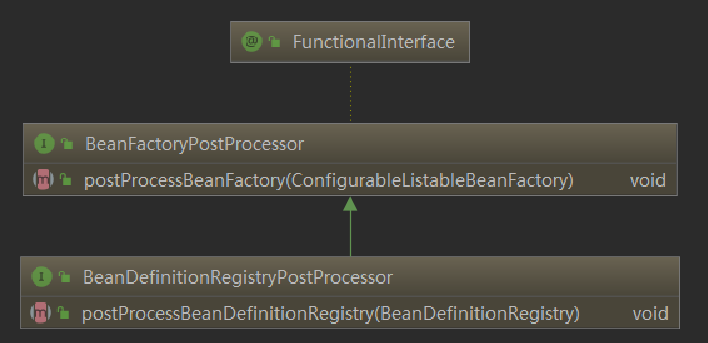

## 正文

### BeanDefinitionRegistryPostProcessor



这个扩展点主要发生在获取BeanDefinition后，可以在这里动态注册自己的beanDefinition，或者对已注册的BeanDefinition做一些改变，提供了两个方法

- postProcessBeanDefinitionRegistry(BeanDefinitionRegistry beanDefinitionRegistry)，该方法用来注册更多的bean到spring容器中。
- postProcessBeanFactory(ConfigurableListableBeanFactory beanFactory)，主要用来对已注册BeanDefinition做一些改变。

具体源码

```java
//refresh -> #invokeBeanFactoryPostProcessors() -> PostProcessorRegistrationDelegate.invokeBeanFactoryPostProcessors(beanFactory, //getBeanFactoryPostProcessors())
boolean reiterate = true;
while (reiterate) {
	reiterate = false;
	postProcessorNames = beanFactory.getBeanNamesForType(BeanDefinitionRegistryPostProcessor.class, true, false);
	for (String ppName : postProcessorNames) {
		if (!processedBeans.contains(ppName)) {
			currentRegistryProcessors.add(beanFactory.getBean(ppName, BeanDefinitionRegistryPostProcessor.class));
			processedBeans.add(ppName);
			reiterate = true;
		}
	}
	sortPostProcessors(currentRegistryProcessors, beanFactory);
	registryProcessors.addAll(currentRegistryProcessors);
    //执行postProcessBeanDefinitionRegistry方法
	invokeBeanDefinitionRegistryPostProcessors(currentRegistryProcessors, registry);
	currentRegistryProcessors.clear();
}
//执行postProcessBeanFactory方法
invokeBeanFactoryPostProcessors(registryProcessors, beanFactory);
invokeBeanFactoryPostProcessors(regularPostProcessors, beanFactory);
```

### BeanFactoryPostProcessor

这个接口是beanFactory的扩展接口，调用时机在spring在读取beanDefinition信息之后，实例化bean之前。是上面说的BeanDefinitionRegistryPostProcessor的父类，提供了postProcessBeanFactory方法。用户可以通过实现这个扩展接口来自行处理一些东西，比如修改已经注册的beanDefinition的元信息。