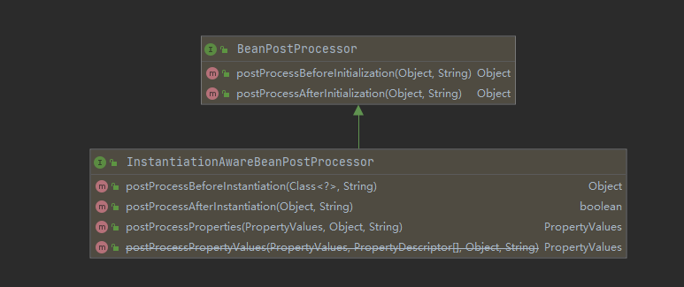
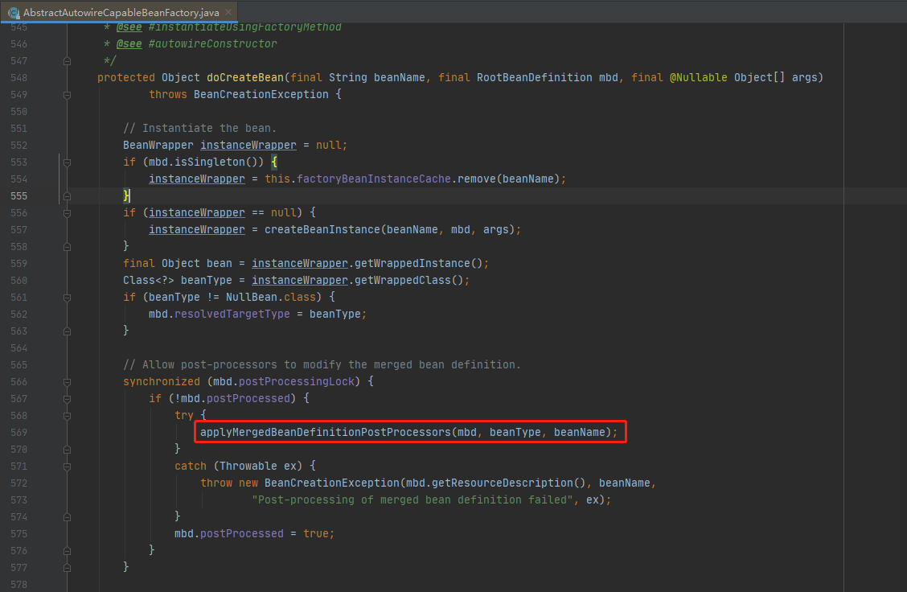
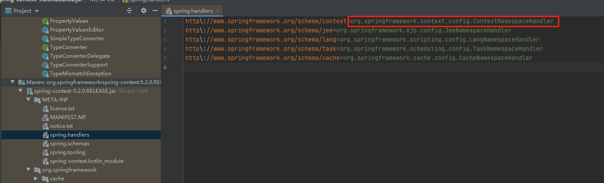

## 正文

### BeanDefinitionRegistryPostProcessor


这个扩展点主要发生在获取BeanDefinition后，可以在这里动态注册自己的beanDefinition，或者对已注册的BeanDefinition做一些改变，提供了两个方法

- postProcessBeanDefinitionRegistry(BeanDefinitionRegistry beanDefinitionRegistry)，该方法用来注册更多的bean到spring容器中。
- postProcessBeanFactory(ConfigurableListableBeanFactory beanFactory)，主要用来对已注册BeanDefinition做一些改变。

具体源码

```java
//refresh -> #invokeBeanFactoryPostProcessors() -> PostProcessorRegistrationDelegate.invokeBeanFactoryPostProcessors(beanFactory, //getBeanFactoryPostProcessors())
boolean reiterate = true;
while (reiterate) {
	reiterate = false;
	postProcessorNames = beanFactory.getBeanNamesForType(BeanDefinitionRegistryPostProcessor.class, true, false);
	for (String ppName : postProcessorNames) {
		if (!processedBeans.contains(ppName)) {
			currentRegistryProcessors.add(beanFactory.getBean(ppName, BeanDefinitionRegistryPostProcessor.class));
			processedBeans.add(ppName);
			reiterate = true;
		}
	}
	sortPostProcessors(currentRegistryProcessors, beanFactory);
	registryProcessors.addAll(currentRegistryProcessors);
    //执行postProcessBeanDefinitionRegistry方法
	invokeBeanDefinitionRegistryPostProcessors(currentRegistryProcessors, registry);
	currentRegistryProcessors.clear();
}
//执行postProcessBeanFactory方法
invokeBeanFactoryPostProcessors(registryProcessors, beanFactory);
invokeBeanFactoryPostProcessors(regularPostProcessors, beanFactory);
```

### BeanFactoryPostProcessor

这个接口是beanFactory的扩展接口，调用时机在spring在读取beanDefinition信息之后，实例化bean之前。是上面说的BeanDefinitionRegistryPostProcessor的父类，提供了postProcessBeanFactory方法。用户可以通过实现这个扩展接口来自行处理一些东西，比如修改已经注册的beanDefinition的元信息。

### InstantiationAwareBeanPostProcessor

InstantiationAwareBeanPostProcessor继承了BeanPostProcess接口。原本BeanPostProcess只有提供了`初始化之前`和`初始化之后`的扩展，它再次基础上增加了`实例化bean之前`，`实例化bean之后`，`属性注入时阶段`这几个过程。



- postProcessBeforeInitialization 初始化之前
- postProcessAfterInitialization 初始化之后
- postProcessBeforeInstantiation 实例化之前
- postProcessAfterInstantiation 实例化之后
- postProcessProperties 属性赋值时，用来属性赋值时做一些操作，**@Autowired,@Resource等注解原理基于此方法实现**

**感觉这个接口是对Spring生命周期扩展最全的一个接口了。例如依赖注入@Autowired对应的后处理器AutowiredAnnotationBeanPostProcessor就是基于这个实现。**

### SmartInstantiationAwareBeanPostProcessor

SmartInstantiationAwareBeanPostProcessor继承了上面说的`InstantiationAwareBeanPostProcessor`类，并在此基础上新增了三个扩展点。

- predictBeanType，该触发点发生在`postProcessBeforeInstantiation`之前，用于预测Bean的类型。你调用BeanFactory.getType(name)时当通过bean的名字无法得到bean类型信息时就调用该回调方法来决定类型信息。
- determineCandidateConstructors，该触发点发生在`postProcessBeforeInstantiation`之后。用户可以扩展这个点，来自定义选择相应的构造器来实例化这个bean。
- getEarlyBeanReference，该触发点发生在`postProcessAfterInstantiation`之后。主要用于**循环依赖**。

### MergedBeanDefinitionPostProcessor

触发时机在实例化之后，属性赋值之前。AutowiredAnnotationBeanPostProcessor使用到了这个接口。

AutowiredAnnotationBeanPostProcessor类把正在被spring实例化的bean进行@Autowired和@Value扫描，扫描到类里面属性和方法上面如果有注解，就会把对应的方法或者属性封装起来，最终封装成InjectionMetadata对象。



### BeanFactoryAware

**发生在bean的实例化之后，注入属性之前，也就是Setter之前。**

使用场景为，你可以在bean实例化之后，但还未初始化之前，拿到 BeanFactory，在这个时候，可以对每个bean作特殊化的定制。

**作用于单个Bean，例如某个Bean实现了这个接口，就只有这个接口会触发这个接口的方法。其他接口不会触发**

### BeanNameAware

触发点在bean的初始化之前，也就是`postProcessBeforeInitialization`之前。

用户可以扩展这个点，在初始化bean之前拿到spring容器中注册的的beanName，来自行修改这个beanName的值。

### InitializingBean

触发时机在`postProcessAfterInitialization`之前，也就是初始化完成之后。

### DisposableBean

其触发时机为当此对象销毁时。比如说运行applicationContext.registerShutdownHook时，就会触发这个方法。

### NamespaceHandler

翻译过来叫命名空间处理器。他的主要作用是**配合BeanDefinitionParser，通过解析自定义标签来自动注入一些Bean，这些Bean包括了一些关键的后处理器。例如component-scan标签**。

接下去我们来看\<context:component-scan\>是如何实现自动注入一些关键后处理器的。

**spring.handlers设置\<context:这种开头的配置使用的NamespaceHandler**



当解析application.xml文件时，如果遇到component-scan就会进来ContextNamespaceHandler执行init方法。

```java
public class ContextNamespaceHandler extends NamespaceHandlerSupport {
	@Override
	public void init() {
		registerBeanDefinitionParser("property-placeholder", new PropertyPlaceholderBeanDefinitionParser());
		registerBeanDefinitionParser("property-override", new PropertyOverrideBeanDefinitionParser());
		registerBeanDefinitionParser("annotation-config", new AnnotationConfigBeanDefinitionParser());
         //注册component-scan包含的后处理器
		registerBeanDefinitionParser("component-scan", new ComponentScanBeanDefinitionParser());
		registerBeanDefinitionParser("load-time-weaver", new LoadTimeWeaverBeanDefinitionParser());
		registerBeanDefinitionParser("spring-configured", new SpringConfiguredBeanDefinitionParser());
		registerBeanDefinitionParser("mbean-export", new MBeanExportBeanDefinitionParser());
		registerBeanDefinitionParser("mbean-server", new MBeanServerBeanDefinitionParser());
	}
}
```

**利用ComponentScanBeanDefinitionParser完成指定包下所有类的扫描，BeanDefinition创建的过程。**

继续跟代码，在registerComponents方法中。通过下面代码，自动为我们注入了一些关键的后处理器。如下

```java
Set<BeanDefinitionHolder> processorDefinitions =
					AnnotationConfigUtils.registerAnnotationConfigProcessors(readerContext.getRegistry(), source)；
```

- ConfigurationClassPostProcessor，帮我们处理了@Configuration，@ComponentScan，@Bean等注解的处理，帮我们将注解类注册到spring容器中。
- AutowiredAnnotationBeanPostProcessor，@Autowried自动装配所需的后处理器
- CommonAnnotationBeanPostProcessor，解析@Resource、@WebServiceRef、@EJB三个注解
- EventListenerMethodProcessor
- DefaultEventListenerFactory