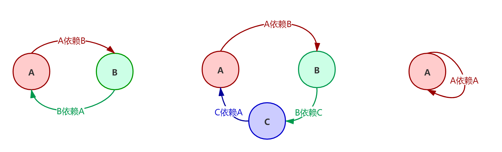
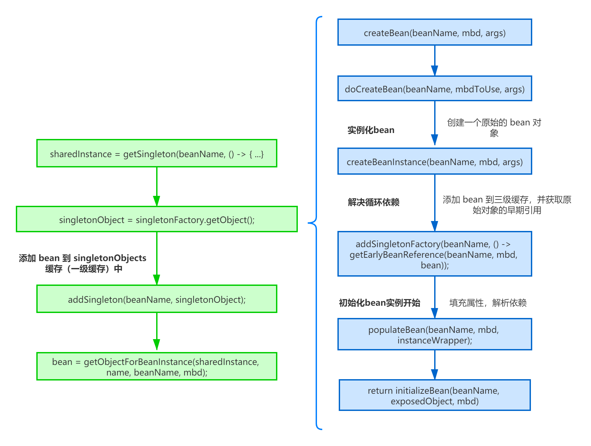
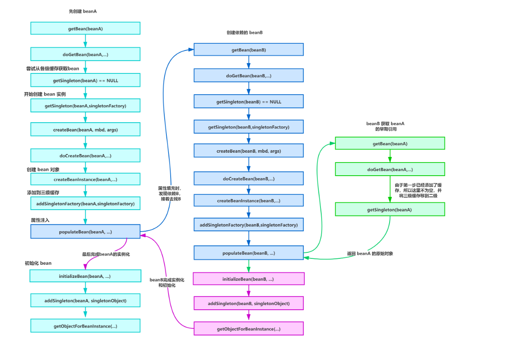
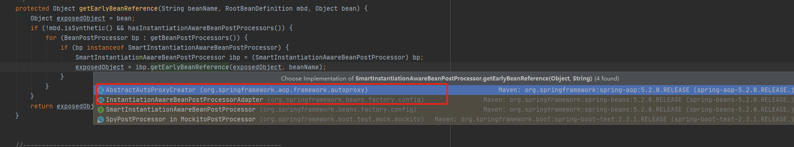

### 什么是循环依赖

所谓的循环依赖是指，A 依赖 B，B 又依赖 A，它们之间形成了循环依赖。或者是 A 依赖 B，B 依赖 C，C 又依赖 A，形成了循环依赖。更或者是自己依赖自己。



**Spring循环依赖配置和测试类**

```xml
<!--src\main\resources\applicationContext.xml-->
<bean id="beanB" class="com.xzy.bean.BeanB">
    <property name="param1" value="param1"/>
    <property name="param2" value="param2"/>
    <property name="beanC" ref="beanC"/>
</bean>
<bean id="beanC" class="com.xzy.bean.BeanC">
    <property name="param1" value="param1"/>
    <property name="param2" value="param2"/>
    <property name="beanB" ref="beanB"/>
</bean>
```

```java
@Test
public void testFor(){
    ClassPathResource resource = new ClassPathResource("applicationContext.xml");
    DefaultListableBeanFactory factory = new DefaultListableBeanFactory();
    XmlBeanDefinitionReader reader = new XmlBeanDefinitionReader(factory);
    //解析资源
    reader.loadBeanDefinitions(resource);
    BeanB bean = factory.getBean(BeanB.class);
    System.out.println(bean);
}
```

### 为什么会有循环依赖问题

循环依赖问题主要是由于Spring复杂的生命周期。当我们getBean()获取一个bean时，bean要经历

1. 从Beandefinition对象通过反射实例化bean对象
2. 对实例化后的bean进行属性赋值
3. bean初始化
4. 使用bean
5. bean销毁

如果存在循环依赖，假设A对象实例化进行属性赋值时候发现B，由于B还没实例化，接着去实例化B，B实例化属性赋值时发现A。如果不做处理的话就会导致无限循环，也就是循环依赖的问题。

### Spring解决循环依赖的思想

Spring 实例化对象分两步，第一步会先创建一个原始对象，只是没有设置属性，可以理解为"半成品"，官方叫 A 对象的早期引用（EarlyBeanReference），所以当实例化 B 的时候发现依赖了 A， B就会把这个“半成品”设置进去先完成实例化，既然 B 完成了实例化，所以 A 就可以获得 B 的引用，也完成实例化了。

### 原理解读

#### **获取Bean 流程**

Spring IOC容器中获取bean实例的简化版流程如下


1. 流程从 `getBean` 方法开始，`getBean` 是个空壳方法，所有逻辑直接到 `doGetBean` 方法中。
2. `transformedBeanName` 将name转换为真正的 beanName（name可能是 FactoryBean 以 & 字符开头或者有别名的情况，所以需要转化下）。
3. 然后通过 `getSingleton(beanName)` 方法尝试从缓存中查找是不是有该实例（单例在 Spring 的同一容器只会被创建一次，后续再获取 bean，就直接从缓存获取即可）。
4. 如果有的话，sharedInstance 可能是完全实例化好的 bean，也可能是一个原始的 bean，所以再经 `getObjectForBeanInstance` 处理即可返回。
5. 当然sharedInstance也可能是null，这时候就会执行创建 bean 的逻辑，将结果返回。

#### **三级缓存**

从getBean的流程来看，解决循环依赖的关键是**将实例化后的对象放到缓存中去，当需要用到时在从缓存中拿。**spring定义了三级缓存来解决循环依赖。

```java
//org.springframework.beans.factory.support.DefaultSingletonBeanRegistry
private final Map<String, Object> singletonObjects = new ConcurrentHashMap<>(256);
private final Map<String, ObjectFactory<?>> singletonFactories = new HashMap<>(16);
private final Map<String, Object> earlySingletonObjects = new HashMap<>(16);
```

三级缓存的作用：

- singletonObjects：完成初始化的单例对象的cache，这里的bean经历过**实例化->属性填充->初始化**以及各种后置处理（一级缓存）
- earlySingletonObjects：存放原始的bean对象（**完成实例化但是尚未填充属性和初始化**），仅仅能作为指针提前曝光，被其他bean所引用，用于解决循环依赖的（二级缓存）
- singletonFactories：在bean实例化完之后，属性填充以及初始化之前，如果允许提前曝光，Spring会将实例化后的bean提前曝光，也就是把该bean转换成`beanFactory`并加入到`singletonFactories`（三级缓存）。

#### **创建Bean的流程**



**主要代码**

```java

//org.springframework.beans.factory.support.AbstractBeanFactory#doGetBean
sharedInstance = getSingleton(beanName, () -> {
	try {
		return createBean(beanName, mbd, args);
	}
	catch (BeansException ex) {
		//异常销毁Bean
		destroySingleton(beanName);
		throw ex;
	}
});

public Object getSingleton(String beanName, ObjectFactory<?> singletonFactory) {
	Assert.notNull(beanName, "Bean name must not be null");
	synchronized (this.singletonObjects) {
		Object singletonObject = this.singletonObjects.get(beanName);
		if (singletonObject == null) {
			//创建bean 下面的代码执行的是 createBean(beanName, mbd, args)
			singletonObject = singletonFactory.getObject();
			newSingleton = true;
			if (newSingleton) {
				//将bean加入到一级缓存中
				addSingleton(beanName, singletonObject);

			}
		}
		return singletonObject;
	}
}
//将Bean加入到一级缓存，上面说过一级缓存里面的Bean是完整的Bean
protected void addSingleton(String beanName, Object singletonObject) {
	synchronized (this.singletonObjects) {
		this.singletonObjects.put(beanName, singletonObject);
		this.singletonFactories.remove(beanName);
		this.earlySingletonObjects.remove(beanName);
		this.registeredSingletons.add(beanName);
	}
}

@Override
protected Object createBean(String beanName, RootBeanDefinition mbd, @Nullable Object[] args)
		throws BeanCreationException {
	Object beanInstance = doCreateBean(beanName, mbdToUse, args);
	return beanInstance;
}

protected Object doCreateBean(final String beanName, final RootBeanDefinition mbd, final @Nullable Object[] args)
		throws BeanCreationException {
	BeanWrapper instanceWrapper = null;
	if (instanceWrapper == null) {
		//实例化Bean
		instanceWrapper = createBeanInstance(beanName, mbd, args);
	}
	boolean earlySingletonExposure = (mbd.isSingleton() && this.allowCircularReferences &&
			isSingletonCurrentlyInCreation(beanName));
	if (earlySingletonExposure) {
		//将实例化后的值加入到三级缓存中
		addSingletonFactory(beanName, () -> getEarlyBeanReference(beanName, mbd, bean));
	}
	Object exposedObject = bean;
	//属性赋值
	populateBean(beanName, mbd, instanceWrapper);
	//初始化
	exposedObject = initializeBean(beanName, exposedObject, mbd);
  	// 循环依赖校验
	if (earlySingletonExposure) {
	    // 注意此处第二个参数传的false，表示不去三级缓存里再去调用一次getObject()方法了，此时代理对象还在二级缓存，所以这里拿出来的就是个 代理对象
	    // 最后赋值给exposedObject  然后return出去，进而最终被addSingleton()添加进一级缓存里面去  
	    // 这样就保证了我们容器里 最终实际上是代理对象，而非原始对象
	    Object earlySingletonReference = getSingleton(beanName, false);
	    if (earlySingletonReference != null) {
	        if (exposedObject == bean) { 
	            exposedObject = earlySingletonReference;
	        }
	    }
	}
	return exposedObject;
}

protected Object getEarlyBeanReference(String beanName, RootBeanDefinition mbd, Object bean) {
	Object exposedObject = bean;
	if (!mbd.isSynthetic() && hasInstantiationAwareBeanPostProcessors()) {
		for (BeanPostProcessor bp : getBeanPostProcessors()) {
			if (bp instanceof SmartInstantiationAwareBeanPostProcessor) {
				SmartInstantiationAwareBeanPostProcessor ibp = (SmartInstantiationAwareBeanPostProcessor) bp;
				exposedObject = ibp.getEarlyBeanReference(exposedObject, beanName);
			}
		}
	}
	return exposedObject;
}
```

整个创建Bean流程逻辑如下：

1. `getSingleton`方法获取Bean，发现Bean还没创建，则调用`createBean`创建Bean。
2. `createBeanInstance`实例化Bean，实例化后将`getEarlyBeanReference`创建工厂加入到三级缓存中。
3. 通过 `populateBean` 方法向原始 bean 对象中填充属性，并解析依赖。**假设这时候创建A之后填充属性时发现依赖B，然后创建依赖对象B的时候又发现依赖A，还是同样的流程，又去getBean(A)，这个时候三级缓存已经有了beanA的“半成品”，这时就可以把A对象的原始引用注入B对象（并将其移动到二级缓存）来解决循环依赖问题。这时候getObject()方法就算执行结束了，返回完全实例化的bean。**
4. 最后调用 `addSingleton` 把完全实例化好的bean对象放入 singletonObjects 缓存（一级缓存）中。

#### **循环依赖解决**



当我们创建beanA的原始对象后，并把它放到三级缓存中，接下来就该填充对象属性了，这时候发现依赖了beanB，接着就又去创建beanB，同样的流程，创建完beanB填充属性时又发现它依赖了beanA，又是同样的流程，不同的是，这时候可以在三级缓存中查到刚放进去的原始对象beanA，所以不需要继续创建，用它注入beanB，完成beanB的创建。

#### **为什么需要用到三级缓存？**

如果按照上面的逻辑，完全可以将缓存放到二级缓存就好，为啥还要三级缓存呢。我们注意到三级缓存放的是bean工厂。具体方法如下。

```java
//将bean创建存入三级缓存
addSingletonFactory(beanName, () -> getEarlyBeanReference(beanName, mbd, bean));

protected Object getEarlyBeanReference(String beanName, RootBeanDefinition mbd, Object bean) {
	Object exposedObject = bean;
	if (!mbd.isSynthetic() && hasInstantiationAwareBeanPostProcessors()) {
		for (BeanPostProcessor bp : getBeanPostProcessors()) {
			if (bp instanceof SmartInstantiationAwareBeanPostProcessor) {
                 // 这么一大段就这句话是核心，也就是当bean要进行提前曝光时，
                 // 给一个机会，通过重写后置处理器的getEarlyBeanReference方法，来自定义操作bean
                 // 值得注意的是，如果提前曝光了，但是没有被提前引用，则该后置处理器并不生效!!!
                 // 这也正式三级缓存存在的意义，否则二级缓存就可以解决循环依赖的问题
				SmartInstantiationAwareBeanPostProcessor ibp = (SmartInstantiationAwareBeanPostProcessor) bp;
				exposedObject = ibp.getEarlyBeanReference(exposedObject, beanName);
			}
		}
	}
	return exposedObject;
}
```

这个方法就是 Spring 为什么使用三级缓存，而不是二级缓存的原因，它的目的是为了后置处理，如果没有 AOP 后置处理，就不会走进 if 语句，直接返回了 exposedObject。

然后我们看下**SmartInstantiationAwareBeanPostProcessor**这个后处理器，其实是用来做SpringAOP，事务使用代理对象的。我们都知道 **Spring AOP、事务**等都是通过代理对象来实现的，而**事务**的代理对象是由自动代理创建器来自动完成的。



所以为啥要用到三级缓存，假设beanA是用AOP代理的，当beanB属性赋值时要获取A时应该获取的是A的代理对象，此时就通过`singletonFactory.getObject()`获取到代理对象然后在存到二级缓存中。

**为什么这么设计呢，即使有代理，在二级缓存代理也可以吧 | 为什么要使用三级缓存呢？**

假设我们现在是二级缓存架构，创建A的时候，我们不知道有没有循环依赖，所以放入二级缓存提前暴露，接着创建B，也是放入二级缓存，这时候发现又循环依赖了A，就去二级缓存找，是有，但是如果此时还有AOP代理呢，我们要的是代理对象可不是原始对象，这怎么办，只能改逻辑，在第一步的时候，不管3721，所有Bean统统去完成AOP代理，如果是这样的话，就不需要三级缓存了，但是这样不仅没有必要，而且违背了Spring在结合AOP跟Bean的生命周期的设计。

所以Spring“多此一举”的将实例先封装到ObjectFactory中（三级缓存），主要关键点在getObject()方法并非直接返回实例，而是对实例又使用SmartInstantiationAwareBeanPostProcessor的getEarlyBeanReference方法对bean进行处理，也就是说，当Spring中存在该后置处理器，所有的单例bean在实例化后都会被进行提前曝光到三级缓存中，但是并不是所有的bean都存在循环依赖，也就是三级缓存到二级缓存的步骤不一定都会被执行，有可能曝光后直接创建完成，没被提前引用过，就直接被加入到一级缓存中。因此可以确保只有提前曝光且被引用的bean才会进行该后置处理。

### 参考

- https://developer.aliyun.com/article/771925?spm=a2c6h.12873581.0.0.322f2fb1GfswWI&groupCode=microservice


