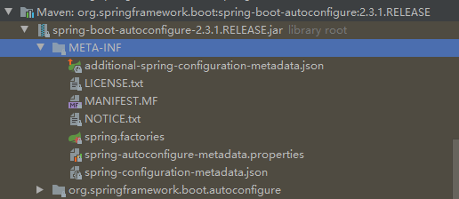
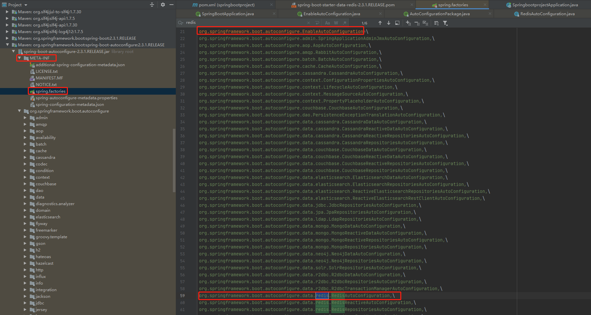
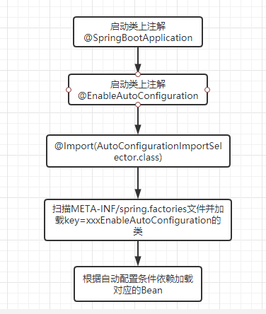
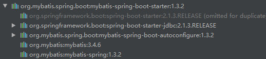
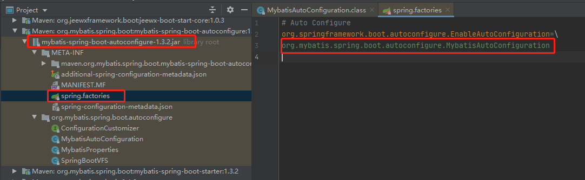
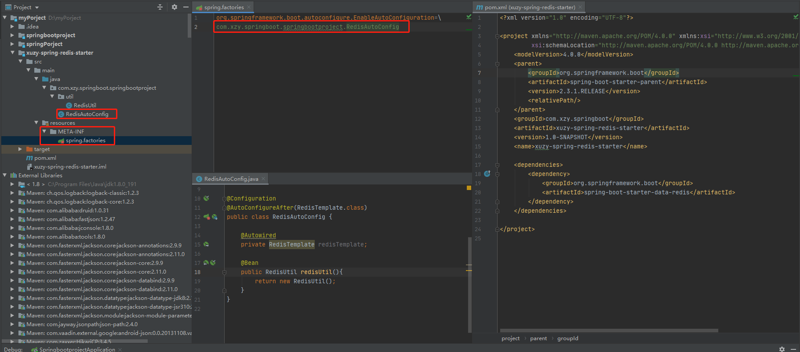

## 概述

SpringBoot采用了“习惯优于配置”的理念，没有了繁琐的配置，让我们开发起来变得更加快捷。例如我们需要在项目中使用Redis模块进行开发。只需要引入spring-boot-starter-data-redis包，就会自动加载了Redis所需要的模块。我们只需要在配置文件application.properties上配置redis的相关连接信息，并在代码上使用RedisTemplate.java类就可以操作Redis。

```xml
<dependency>
    <groupId>org.springframework.boot</groupId>
    <artifactId>spring-boot-starter-data-redis</artifactId>
</dependency>
```
<!--more-->
类似的这种起步依赖大大降低了我们的配置成本。在SpringBoot中大概分成两类起步依赖：**SpringBoot自带起步依赖** 和 **开发者自带起步依赖**。

- spring-boot-starter-xxx是官方提供的starter。

- xxx-spring-boot-starter是第三方提供的starter。

## 自动配置原理

SpringBoot的自动配置原理依赖于spring-boot-autoconfigure-xxx包。对应的**@EnableAutoConfiguration**注解。



在我们SpringBoot启动代码上使用了@SpringBootApplication注解，里面包含了@EnableAutoConfiguration。从字面看上不难猜出这个开启自动配置的意思。

```java
@SpringBootApplication
public class SpringbootprojectApplication {
    public static void main(String[] args) {
        SpringApplication.run(SpringbootprojectApplication.class, args);
    }
}
```

```java
@Target(ElementType.TYPE)
@Retention(RetentionPolicy.RUNTIME)
@Documented
@Inherited
@SpringBootConfiguration
@EnableAutoConfiguration //开启自动注解
@ComponentScan(excludeFilters = { @Filter(type = FilterType.CUSTOM, classes = TypeExcludeFilter.class),
		@Filter(type = FilterType.CUSTOM, classes = AutoConfigurationExcludeFilter.class) })
public @interface SpringBootApplication {
	//...忽略
}
```

```java
@Target(ElementType.TYPE)
@Retention(RetentionPolicy.RUNTIME)
@Documented
@Inherited
@AutoConfigurationPackage
@Import(AutoConfigurationImportSelector.class)
public @interface EnableAutoConfiguration {
	//..忽略
}
```

@EnableAutoConfiguration注解通过@Import导入了AutoConfigurationImportSelector.class。

其导入的**AutoConfigurationImportSelector**的selectImports()方法通过**SpringFactoriesLoader.loadFactoryNames()**扫描所有具有**META-INF/spring.factories**的jar包。spring-boot-autoconfigure-x.x.x.x.jar里就有一个这样的spring.factories文件。



到这一步我们知道了自动配置的其中原理：<font color=red>SpringBoot在启动时通过注解@EnableAutoConfiguration。扫描class路径下的spring.factories文件。将key = org.springframework.boot.autoconfigure.EnableAutoConfiguration 下的配置加载到Bean容器中，这样就自动配置上了相关的类。</font>

到这一步我们知道了SpingBoot是如何通过导入Maven包就能将RedisAutoConfiguration交给spring容器管理。而不用我们自己创建一个Redis配置类去写一大堆的配置。**但我们知道，往往要完成自动配置并能使用是有依赖条件。例如你需要定义Redis的配置信息(IP,端口等)，需要依赖Redis的操作类。**所以SpringBoot提供了一系列的条件依赖注解。

- @ConditionalOnBean，仅在当前上下文中存在某个bean时，才会实例化这个Bean。
- @ConditionalOnClass，某个class位于类路径上，才会实例化这个Bean。
- @ConditionalOnExpression，当表达式为true的时候，才会实例化这个Bean。
- @ConditionalOnMissingBean，仅在当前上下文中不存在某个bean时，才会实例化这个Bean。
- @ConditionalOnMissingClass，某个class在类路径上不存在的时候，才会实例化这个Bean。
- @ConditionalOnNotWebApplication，不是web应用时才会实例化这个Bean。
- @AutoConfigureAfter，在某个bean完成自动配置后实例化这个bean。
- @AutoConfigureBefore，在某个bean完成自动配置前实例化这个bean。
- @ConditionalOnProperty，当存在某个配置的时候才加载
- @EnableConfigurationProperties(xxxProperties.class)，使@ConfigurationProperties注解生效，将yml或properties配置文件转换成bean。

**具体分析下Redis配置类**

```java
//标明这个类是一个配置类
@Configuration(proxyBeanMethods = false)
//当路径下存在RedisOperations.class类时才加载这个配置类
@ConditionalOnClass(RedisOperations.class)
//将yml或properties文件的配置映射到RedisProperties.class类上
@EnableConfigurationProperties(RedisProperties.class)
//@Import作用就跟<import />标签作用一样，这里是表示在加载RedisAutoConfiguration这个配置类的时候
//导入LettuceConnectionConfiguration这个配置类，最新的springboot使用lettuce作为redis的客户端
@Import({ LettuceConnectionConfiguration.class, JedisConnectionConfiguration.class })
public class RedisAutoConfiguration {
    //这里就是帮我们自动配置了RedisTemplate类，代码上就可以直接通过RedisTemplate进行代码编写
	@Bean
    //@ConditionalOnMissingBean这个的意思是表示spring容器中没有redisTemplate类的时候才配置，不然不配置。
	@ConditionalOnMissingBean(name = "redisTemplate")
	public RedisTemplate<Object, Object> redisTemplate(RedisConnectionFactory redisConnectionFactory)
			throws UnknownHostException {
		RedisTemplate<Object, Object> template = new RedisTemplate<>();
		template.setConnectionFactory(redisConnectionFactory);
		return template;
	}

	@Bean
	@ConditionalOnMissingBean
	public StringRedisTemplate stringRedisTemplate(RedisConnectionFactory redisConnectionFactory)
			throws UnknownHostException {
		StringRedisTemplate template = new StringRedisTemplate();
		template.setConnectionFactory(redisConnectionFactory);
		return template;
	}
}

@ConfigurationProperties(prefix = "spring.redis")
public class RedisProperties {
	private String url;
    private String host = "localhost";
}
```

到这里我们知道了**SpringBoot自动配置的原理。**通过一张图做个总结。



## Mybatis起步依赖

spring-boot-starter-xxx是官方提供的starter，xxx-spring-boot-starter是第三方提供的starter。上面说的Redis是SpringBoot官方提供的起步依赖。对于Mybatis来说，是第三方提供的起步依赖。我们具体来看他是怎么实现的。

```java
<dependency>
	<groupId>org.mybatis.spring.boot</groupId>
	<artifactId>mybatis-spring-boot-starter</artifactId>
	<version>1.3.2</version>
</dependency>
```



Mybatis的starter通过注入mybatis-spring-boot-starter包实现。包含了

- mybatis-spring-boot-autoconfigure ， 自动注入相关包
- mybatis， mybatis核心包
- mybatis-spring， mybatis-spring包
- spring-boot-starter-jdbc ，spring的jbdc包，mybatis需要依赖jdbc。

查看mybatis-spring-boot-autoconfigure，同样的也有**spring.factories**。里面也是形如org.springframework.boot.autoconfigure.EnableAutoConfiguration = XXXConfiguration的配置项。



```java
package org.mybatis.spring.boot.autoconfigure;
//...省略很多
@Configuration //这个类是个配置类
//当class路径下有SqlSessionFactory和SqlSessionFactoryBean这个两个class时才加载这个配置类（所以前提是引入mybatis类）
@ConditionalOnClass({SqlSessionFactory.class, SqlSessionFactoryBean.class})
//当spring上下文存在数据源时才配置。区别与上面的@ConditionalOnClass。mybatis是需要数据源的，如果没有数据源就没意义
@ConditionalOnBean({DataSource.class})
//yml或properties映射到MybatisProperties类
@EnableConfigurationProperties({MybatisProperties.class})
//当前这个类的配置必须等到DataSourceAutoConfiguration.class先配置完后再配置
@AutoConfigureAfter({DataSourceAutoConfiguration.class})
public class MybatisAutoConfiguration {
    //...省略很多

    @PostConstruct
    public void checkConfigFileExists() {
        if (this.properties.isCheckConfigLocation() && StringUtils.hasText(this.properties.getConfigLocation())) {
            Resource resource = this.resourceLoader.getResource(this.properties.getConfigLocation());
            Assert.state(resource.exists(), "Cannot find config location: " + resource + " (please add config file or check your Mybatis configuration)");
        }
    }

    //自动注入SqlSessionFactory
    @Bean
    @ConditionalOnMissingBean
    public SqlSessionFactory sqlSessionFactory(DataSource dataSource) throws Exception {
        //...省略很多
    }

    @Bean
    @ConditionalOnMissingBean
    public SqlSessionTemplate sqlSessionTemplate(SqlSessionFactory sqlSessionFactory) {
        ExecutorType executorType = this.properties.getExecutorType();
        return executorType != null ? new SqlSessionTemplate(sqlSessionFactory, executorType) : new SqlSessionTemplate(sqlSessionFactory);
    }

    //这里MybatisAutoConfiguration.AutoConfiguredMapperScannerRegistrar应该是自动扫描实现了Mapper的类加入到spring容器
    @Configuration
    @Import({MybatisAutoConfiguration.AutoConfiguredMapperScannerRegistrar.class})
    @ConditionalOnMissingBean({MapperFactoryBean.class})
    public static class MapperScannerRegistrarNotFoundConfiguration {
        public MapperScannerRegistrarNotFoundConfiguration() {
        }

        @PostConstruct
        public void afterPropertiesSet() {
            MybatisAutoConfiguration.logger.debug("No {} found.", MapperFactoryBean.class.getName());
        }
    }

    public static class AutoConfiguredMapperScannerRegistrar implements BeanFactoryAware, ImportBeanDefinitionRegistrar, ResourceLoaderAware {
        private BeanFactory beanFactory;
        private ResourceLoader resourceLoader;

        public AutoConfiguredMapperScannerRegistrar() {
        }

        public void registerBeanDefinitions(AnnotationMetadata importingClassMetadata, BeanDefinitionRegistry registry) {
            //....省略很多
        }

        public void setBeanFactory(BeanFactory beanFactory) throws BeansException {
            this.beanFactory = beanFactory;
        }

        public void setResourceLoader(ResourceLoader resourceLoader) {
            this.resourceLoader = resourceLoader;
        }
    }
}
```

## 自定义一个起步依赖

在项目上Redis使用频繁，要求将Redis操作的工具类做成一个starter，让其他项目能够复用。

1. 创建一个新项目 **xuzy-spring-redis-starter**
2. 导入**spring-boot-starter-data-redis**依赖
3. 创建**META-INF/spring.factories**文件并设置启动配置类。
4. 创建启动配置类**RedisAutoConfig**



如果所示，我们参考Mybatis自动配置的方式。我们在配置类上使用了@AutoConfigureAfter(RedisTemplate.class)来保证当RedisTemplate被实例化后才加载工具类。最后我们通过@Bean注入了RedisUtil工具类。

在实际项目上，我们可以根据自动配置条件依赖来更好的定义starter。上面的例子只是大概写一个过程。我们可以根据实际需要做配置。


