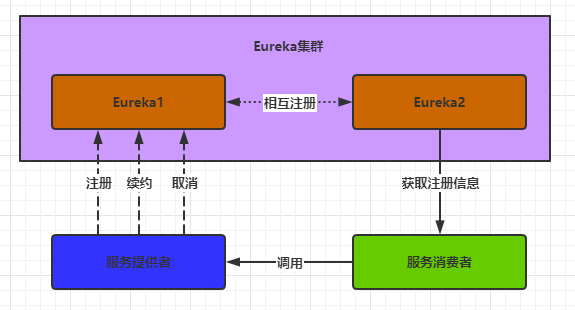

## 核心概念



- 服务注册。Eureka客户端（服务提供者或消费者）通过向Eureka服务器提供IP地址，端口等各项与服务相关的基本信息来完成注册操作。
- 服务续约。Eureka客户端每隔一段时间向Eureka服务端发送服务续约信息来保证服务存活。
- 服务取消。Eureka客户端主动告知Eureka服务器自己不想再注册到Eureka中。
- 服务剔除。服务剔除是Eureka服务端（注册中心）做的事情，当一段时间没收到续约信息，就会认为该服务实例已经不再运行，从而将其从服务列表中进行剔除。
- 服务发现。客户端通过定时任务定时从Eureka服务端获取服务信息并缓存。

## 代码走读

接口LeaseManager定义了服务注册，服务取消，服务续约，服务下线功能。研究代码入口可以从LeaseManager实现类入手。

```java
public interface LeaseManager<T> {
    //服务注册
    void register(T r, int leaseDuration, boolean isReplication);
    //服务取消
    boolean cancel(String appName, String id, boolean isReplication);
    //服务续约
    boolean renew(String appName, String id, boolean isReplication);
    //服务取消
    void evict();
}
```

### 服务注册

1. 当服务启动时，会通过`DiscoveryClient#register()`方法发起一个REST风格的HTTP远程请求，请求包含了服务的信息（具体信息用`InstanceInfo`类表示）
2. 注册中心接收到REST远程请求后，对服务进行注册`AbstractInstanceRegistry#register()`方法，用一个双层ConcurrentHashMap存储服务信息。外层Map的key表示服务名称（spring.application.name），内层key表示服务Id（eureka.instance.instanceId），内层Value是一个Lease类，包含了服务的信息、注册时间、最新的续约时间等。

```java
# DiscoveryClient#register()
boolean register() throws Throwable {
    logger.info(PREFIX + "{}: registering service...", appPathIdentifier);
    EurekaHttpResponse<Void> httpResponse;
    try {
        //instanceInfo包含了服务的信息
        //向服务端注册服务,通过这一行发送一个REST的远程请求
        httpResponse = eurekaTransport.registrationClient.register(instanceInfo);
    } catch (Exception e) {
        //....
    }
    // ...
    return httpResponse.getStatusCode() == 204;
}

// --------------------------------分隔符--------------------------------

//用来存储服务信息
ConcurrentHashMap<String, Map<String, Lease<InstanceInfo>>> registry
            = new ConcurrentHashMap<String, Map<String, Lease<InstanceInfo>>>();


public void register(InstanceInfo registrant, int leaseDuration, boolean isReplication) {
    try { 
        //从已存储的 registry 获取一个服务定义
        Map<String, Lease<InstanceInfo>> gMap = registry.get(registrant.getAppName());
        REGISTER.increment(isReplication);
        if (gMap == null) {
            //初始化一个 Map<String, Lease<InstanceInfo>> ，并放入 registry 中
        }
        //根据当前注册的 ID 找到对应的 Lease
        Lease<InstanceInfo> existingLease = gMap.get(registrant.getId());
 
        if (existingLease != null && (existingLease.getHolder() != null)) {
            //如果 Lease 能找到，根据当前节点的最新更新时间和注册节点的最新更新时间比较
            //如果前者的时间晚于后者的时间，那么注册实例就以已存在的实例为准
        } else {
              //如果找不到，代表是一个新注册，则更新其每分钟期望的续约数量及其阈值
        }
        //创建一个新 Lease 并放入 Map 中
        Lease<InstanceInfo> lease = new Lease<InstanceInfo>(registrant, leaseDuration);
        gMap.put(registrant.getId(), lease);

        //处理服务的 InstanceStatus
        registrant.setActionType(ActionType.ADDED);
 
        //更新服务最新更新时间
        registrant.setLastUpdatedTimestamp();
 
        //刷选缓存，实现类ResponseCacheImpl Eureka二级缓存  readOnlyCacheMap(只读缓存) readWriteCacheMap(读写缓存)
        invalidateCache(registrant.getAppName(), registrant.getVIPAddress(), registrant.getSecureVipAddress());
    } 
}
```

### 服务续约

注册成功后，每隔一段时间，客户端会向注册中间发送心跳赖续约服务，也就是汇报健康状态。

1. 客户端启动时会启动一个心跳(续约)定时任务。定时向注册中心发送续约信息。具体方法`DiscoveryClient#initScheduledTasks()`
2. 注册中心接收信息，完成续约操作。`AbstractInstanceRegistry#renew()`

```java
scheduler.schedule(
                    new TimedSupervisorTask(
                            "heartbeat",
                            scheduler,
                            heartbeatExecutor,
                            renewalIntervalInSecs,
                            TimeUnit.SECONDS,
                            expBackOffBound,
                        	//心跳续约线程
                            new HeartbeatThread()
                    ),
renewalIntervalInSecs, TimeUnit.SECONDS);
```

### 获取服务注册信息

客户端通过定时器的方式从注册中心获取服务注册信息并更新缓存，默认每隔30秒刷选本地缓存。

关键配置是eureka.client.registry-fetch-interval-seconds=30，表示定时30秒从注册中心获取服务注册信息。

Eureka 客户端不停地获取服务器端的更新数据，就能保证自己的数据和 Eureka 服务器端的保持一致。

代码入口：`DiscoveryClient#initScheduledTasks()`

```
if (clientConfig.shouldFetchRegistry()) {
    int registryFetchIntervalSeconds = clientConfig.getRegistryFetchIntervalSeconds();
    int expBackOffBound = clientConfig.getCacheRefreshExecutorExponentialBackOffBound();
    scheduler.schedule(
            new TimedSupervisorTask(
                    "cacheRefresh",
                    scheduler,
                    cacheRefreshExecutor,
                    registryFetchIntervalSeconds,
                    TimeUnit.SECONDS,
                    expBackOffBound,
                    new CacheRefreshThread()
            ),
            registryFetchIntervalSeconds, TimeUnit.SECONDS);
}

```

客户端在获取服务注册信息时，首次拉取全量信息，之后拉取增量信息，然后增量拉取的数据跟本地缓存进行合并。拉取的数据通过一个一致性HashCode与本地缓存进行比对，如果HashCode不一致则说明本地缓存和注册中心的服务信息不一致，此时就拉取一次全量数据进行更新。

### 自我保护机制

自我保护机制是为了避免因网络分区故障而导致服务不可用的问题。假设服务提供者A跟注册中心由于网络的问题没法进行续约，此时注册中心就会将A的实例移除，导致消费者没法从注册中心获取到A的实例造成调用失败，但此时A与消费者网络是正常的。所以有了自动保护机制。

**触发自动保护机制的前提**：如果在15分钟内超过85%的服务提供者节点都没有正常的心跳，那么Eureka就认为客户端与注册中心出现了网络故障，Eureka Server自动进入自我保护机制。

**自动保护机制** ：

- 注册中心不再从注册列表中移除因为长时间没收到心跳而应该过期的服务。
- 注册中心仍然能够接受新服务的注册和查询请求，但是不会被同步到其它节点上，保证当前节点依然可用。
- 当网络稳定时，当前注册中心新的注册信息会被同步到其它节点中。

